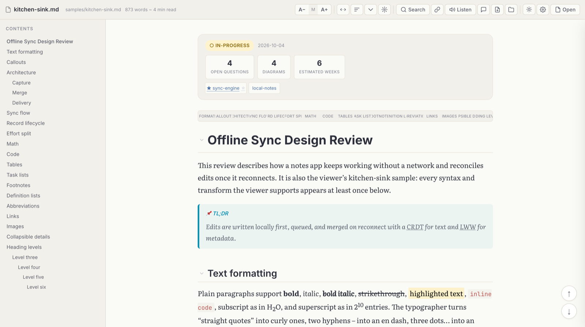

# kites-markdown

A local-first markdown viewer built for **reading and understanding** markdown. Open a `.md` file
and get clean typography, rendered diagrams and math, an outline you can navigate, read-aloud, and
threaded comments that live inside the file itself.

It is one HTML file plus vendored libraries. There is no build step, no account, no server to run,
and your documents never leave your machine.



## What it renders

- **Markdown** via [markdown-it](https://github.com/markdown-it/markdown-it): tables, task lists,
  footnotes, definition lists, abbreviations, `==mark==`, `~sub~`, `^sup^`, and typographic quotes
  and dashes.
- **Diagrams**: fenced ` ```mermaid ` blocks render with [Mermaid](https://mermaid.js.org/), and
  you can expand, zoom and fit them.
- **Math**: inline and display math with [KaTeX](https://katex.org/). Known issue: two dollar
  signs on one line are currently treated as math even in prices and code. See
  [docs/roadmap.md](docs/roadmap.md#known-issues).
- **Code**: syntax highlighting with [highlight.js](https://highlightjs.org/) and a copy button on
  every block. Known issue: the button currently also copies the language label.
- **Callouts**: GitHub-style `> [!NOTE]`, `> [!WARNING]` and related types.
- **Frontmatter dashboard**: YAML frontmatter (`status`, `date`, `metrics`, `repos`) becomes a
  summary header instead of raw text. Other keys, such as `title`, are hidden but not displayed.

See [docs/rendering.md](docs/rendering.md) for the exact dialect.

## Reading aids

Table of contents with scroll spy, section minimap, collapsible sections, focus mode, adjustable
width and font size, light, sepia and dark themes, in-document search, a panel listing every link,
abbreviation tooltips, an image lightbox, and **read-aloud** (text-to-speech with per-section
navigation). See [docs/features.md](docs/features.md).

## Comments inside the file

Comments are threads attached to blocks of the document and stored **inside the markdown file
itself** as HTML comments, which other renderers (GitHub, VS Code, Obsidian) hide. Right-click a
paragraph, list item, table cell or heading (or select some text) to start a thread; reply, resolve,
reopen and delete threads in the sidebar.

Saving is built never to lose text:

- every change is saved into the file at once, through a single writer, and only into the version
  of the file it was made from;
- a file that another program changed after the viewer read it is **never overwritten**: the viewer
  stops, says so, and keeps your comment until you reload, download your version, or overwrite;
- a file you dropped or opened without a save location is linked only to that same file, picked in
  an Open dialog and checked before the first save;
- a document that merely mentions the comment format, text typed below the comments in another
  editor, and a comment block that cannot be read are left exactly as they are;
- a file that is not UTF-8 text is never rewritten (its comments are read-only), and a UTF-8 byte
  order mark is kept.

Each of these has a browser test. Details, including the on-disk format, are in
[docs/commenting.md](docs/commenting.md).

## Quick start

1. Clone or download this repository.
2. Open `markdown-viewer.html` in a browser.
3. Click **Open**, or drag a `.md` file onto the page.

To open documents by link (`?file=`), serve a folder that contains both the viewer and your
documents, bound to localhost:

```bash
python3 -m http.server 8080 --bind 127.0.0.1
# then open http://localhost:8080/markdown-viewer.html?file=samples/kitchen-sink.md
```

`samples/kitchen-sink.md` exercises every supported feature; `samples/commented.md` shows the
comment format.

## Browser support

Developed and tested in Chrome. Reading uses standard web APIs and should work in any current
browser, but Firefox and Safari have not been tested yet. **Saving comments back into the file**
uses the File System Access API, so it needs a Chromium-based browser (Chrome, Edge, Brave, Arc,
Opera). Other browsers save comments by downloading a copy when you press Cmd/Ctrl+S. Details:
[docs/features.md](docs/features.md#browser-support).

## Privacy and security

Everything runs locally. The only network request the viewer makes itself is for the web fonts
(Google Fonts). All libraries are vendored in `vendor/`. See [docs/dependencies.md](docs/dependencies.md).

> [!NOTE]
> **A document is treated as untrusted.** Everything rendered from it is sanitized with DOMPurify
> (scripts, event handlers, `javascript:` links, frames and forms are removed), Mermaid diagrams run
> at `securityLevel: 'strict'`, and a Content Security Policy refuses inline script as a second line
> of defence. Nothing in a document can press the viewer's buttons, such as the ones that ask for
> file access. A document can still load remote images, which tells their server the file was
> opened. The details, and how each point is tested, are in
> [docs/rendering.md](docs/rendering.md#security-posture).

## Also in this repository

- [`extensions/github-html-viewer/`](extensions/github-html-viewer/): a small Chrome extension that
  renders `.html` files in place on GitHub, including private repositories you can read.
- [`legacy/`](legacy/): the first, simpler viewer, kept for reference.

## Documentation

| Doc | What it covers |
|---|---|
| [features.md](docs/features.md) | Everything a reader can do, control by control |
| [rendering.md](docs/rendering.md) | The markdown dialect, render pipeline and security posture |
| [commenting.md](docs/commenting.md) | Using comments, and the on-disk format and anchoring internals |
| [read-aloud.md](docs/read-aloud.md) | Text-to-speech, end to end |
| [authoring-guide.md](docs/authoring-guide.md) | Writing markdown that gets the most out of the viewer |
| [architecture.md](docs/architecture.md) | Code map of `markdown-viewer.html` for contributors |
| [dependencies.md](docs/dependencies.md) | Vendored libraries, versions, licenses, upgrades |
| [markdown-knowledge.md](docs/markdown-knowledge.md) | Markdown specs, extensions, pitfalls and portability |
| [visualization-catalog.md](docs/visualization-catalog.md) | Visualization renderers worth adding, researched |
| [lessons-learned.md](docs/lessons-learned.md) | Engineering lessons from building the viewer |
| [legacy-viewer.md](docs/legacy-viewer.md) | The first viewer compared, and ideas to port |
| [roadmap.md](docs/roadmap.md) | Known issues, open decisions and next steps |

## License

[MIT](LICENSE). Vendored third-party libraries keep their own licenses; see
[THIRD_PARTY_NOTICES.md](THIRD_PARTY_NOTICES.md).
