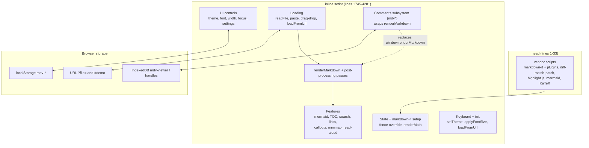
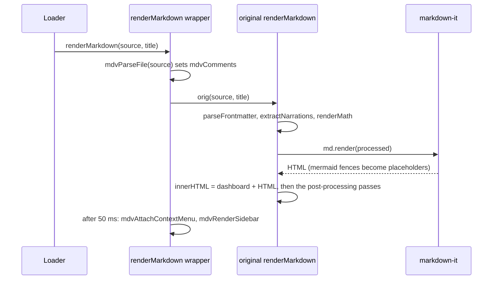

# Architecture: a code map of `markdown-viewer.html`

This is the map to read before you change the viewer. It describes where things live in the one
file, what runs when, which globals exist and who owns them, every persistence key, every keyboard
shortcut, how theming works, and how to add a new fenced-block renderer.

Related documents:

- [rendering.md](rendering.md): what each render pass does in detail.
- [commenting.md](commenting.md): the comment feature from the user's side, and the storage format.
- [read-aloud.md](read-aloud.md): the text-to-speech engine.
- [features.md](features.md): the feature list.
- [dependencies.md](dependencies.md): the vendored libraries and their versions.
- [lessons-learned.md](lessons-learned.md) and [roadmap.md](roadmap.md): known problems and planned work.
- [../README.md](../README.md) and [../CLAUDE.md](../CLAUDE.md): project entry points.

**Conventions in this document**

- Line numbers are **as of the initial import**. They will drift with every edit, so treat them as
  directions and search for the function name.
- Each behaviour statement names the function that implements it. Anything marked **(inferred)**
  was reasoned from the code without running it in a browser. Anything marked **(unverified)** has
  not been checked at all.

---


> [!NOTE]
> Since the split into files, the styles live in `css/viewer.css` and the script in the twelve `js/*.js` files, concatenated in load order. Line numbers in this document refer to the pre-split single file and are kept for orientation: find a function by name. The script order is listed in `../CLAUDE.md`.

## 1. The shape of the program

The viewer is a single HTML file of about 4,290 lines. There is no build step, no module system and
no framework. It has four parts.

| Region | Lines (initial import) | What it holds |
|---|---|---|
| `<head>`: fonts and vendor tags | 1–33 | Google Fonts stylesheet (lines 8–11, the only network dependency, used for fonts only) and the `<script>`/`<link>` tags for everything in `vendor/` (lines 13–32) |
| `<style>` | 34–1482 | All CSS: design tokens, three themes, component styles, print and responsive rules, comment UI |
| `<body>` markup | 1484–1744 | Toolbar, panels, overlays, the layout (TOC sidebar and content), floating buttons, comment sidebar, read-aloud player |
| Inline `<script>` | 1745–4292 | All behaviour, as one classic (non-module) script of about 2,550 lines |

Because it is a classic script, every top-level `function` and `let`/`const` is visible to every
other part of the file. Inline `onclick="..."` attributes in the markup call these globals by name.



---

## 2. File layout in detail

### 2.1 `<head>` (lines 1–33)

| Lines | Content |
|---|---|
| 2 | `<html lang="en" data-theme="light">`: the theme attribute starts as `light`, and `setTheme` overwrites it at boot |
| 8–11 | Google Fonts: Inter (UI), Literata (reading), JetBrains Mono (code) |
| 14–22 | `markdown-it.min.js`, then the plugins anchor, task-lists, footnote, mark, sub, sup, deflist, abbr |
| 23 | `diff-match-patch.js` (fuzzy matching for comment anchors) |
| 25–26 | `github.min.css` (`id="hljs-light"`) and `github-dark.min.css` (`id="hljs-dark"`, starts `disabled`) |
| 27 | `highlight.min.js` |
| 29 | `mermaid.min.js` |
| 31–32 | `katex.min.css`, `katex.min.js` (fonts resolve to `vendor/fonts/`) |

All vendor tags are ordinary blocking tags, so every library has loaded before the inline script at
the end of `<body>` runs. [dependencies.md](dependencies.md) lists the versions.

### 2.2 `<style>` (lines 34–1482)

| Lines | Region |
|---|---|
| 35–93 | `:root` design tokens: backgrounds, text, borders, accents, shadows, layout sizes (`--toc-width`, `--content-max-width`, `--toolbar-height`, `--tts-height`), font stacks, `--reading-size`/`--reading-lh`, radii, transitions |
| 95–130 | `[data-theme="dark"]` token overrides |
| 132–162 | `[data-theme="sepia"]` token overrides |
| 164–180 | Reset and `html`/`body` base |
| 181–284 | Toolbar, font-size control (243), theme dropdown (261) |
| 285–291 | Reading progress bar |
| 292–299 | `.layout` (reserves `--tts-height` at the bottom) |
| 300–344 | TOC sidebar |
| 345–357 | Content wrapper and `.content` width (`.expanded`, `.full-width`) |
| 358–400 | Welcome screen and drop zone |
| 401–424 | Settings panel (`.settings-toast`) |
| 425–480 | `.md-body` typography, headings, section-toggle chevrons (451), heading anchors (470) |
| 481–692 | Paragraphs, read-aloud highlight (484), links and link-type icons (491–552), link chips (553), link tooltip (597), links panel (640) |
| 693–820 | Lists, task lists, blockquotes, inline code, code blocks and `.code-header` (723), tables, `hr`, images, lightbox (784), `details`, definition lists, footnotes, `mark` |
| 821–909 | Mermaid wrapper, expand button (842), diagram fullscreen overlay (860), overlay zoom (904) |
| 910–966 | Frontmatter dashboard |
| 967–999 | Callout blocks |
| 1000–1006 | Abbreviation tooltips |
| 1007–1029 | Section minimap |
| 1030–1045 | Floating scroll buttons (FABs) |
| 1046–1084 | Search overlay |
| 1085–1103 | Keyboard-shortcuts overlay |
| 1104–1169 | Read-aloud player |
| 1170–1187 | Focus mode (`body.focus-mode` dims non-active blocks) |
| 1188–1196 | `@media print` |
| 1197–1211 | Responsive breakpoints at 900px and 600px |
| 1212–1481 | Comment UI: inline chip (1216), anchor highlight, right sidebar (1241), thread card (1283), context menu (1364), selection popover (1385), add-comment popup (1401), toast (1438), save-status pill (1458), toolbar button and badge (1469), `body.mdv-sidebar-open` layout (1475–1481) |

### 2.3 `<body>` markup (lines 1484–1744)

| Lines | Element (id) | Purpose |
|---|---|---|
| 1486–1589 | `.toolbar` | Title (`titleText`), `breadcrumb`, `readingMeta`, `mdvSaveStatus`; buttons for font size, width (`widthBtn`), TOC (`tocBtn`), fold all (`foldBtn`, hidden until a document renders), focus (`focusBtn`), search, links panel (`linksPanelBtn`, hidden), read aloud (`ttsToggleBtn`, hidden), comments (`mdvToggleBtn` + `mdvBadge`, hidden), open writable file (`mdvOpenBtn`), workspace folder (`mdvWorkspaceBtn`), theme dropdown (`themeDD`), settings, open file; hidden `<input type="file" id="fileInput">` |
| 1592 | `progressBar` | Reading progress |
| 1595–1603 | `settingsPanel` | Workspace root path input (`basePathInput`) |
| 1606–1619 | `searchOverlay` | `searchInput`, `searchResults` |
| 1622–1635 | `shortcutsOverlay` | Static list of shortcuts (incomplete, see section 7) |
| 1638–1640 | `lightbox` | `lightboxImg` |
| 1643–1657 | `diagramOverlay` | Zoom controls, `diagramTitle`, `diagramBody`, `diagramZoomContainer` |
| 1660–1665 | `linkTooltip` | Icon, text, badge, copy button |
| 1668–1674 | `linksPanel` | `linksPanelContent` |
| 1677–1701 | `.layout` | `tocSidebar` > `tocList`; `contentWrapper` > `content` > `welcomeScreen` (with `dropZone`) and `<article id="mdBody">` (the render target, hidden until a document renders) |
| 1704–1707 | `fabContainer` | Scroll-to-top (`fabUp`) and scroll-to-bottom (`fabDown`) |
| 1710–1717 | `mdvSidebar` | Comment sidebar: `mdvSidebarStatus`, `mdvThreadList` |
| 1720–1743 | `ttsPlayer` | Previous/play/next, `ttsSectionLabel`, `ttsProgressBar`/`ttsProgressFill`, `ttsSpeedBtn`, close |

### 2.4 Inline script (lines 1745–4292)

| Lines | Section |
|---|---|
| 1746–1767 | Core state and the `fontSizes` table |
| 1769–1806 | markdown-it instance, plugin registration, fence override for `mermaid` |
| 1808–1818 | `renderMath` (KaTeX pre-pass) |
| 1820–1840 | `extractNarrations` |
| 1842–1915 | Theme, dropdown, font size, width, focus mode, settings |
| 1917–2074 | File input, drag and drop, paste, `updateUrl`, `loadFromUrl` |
| 2076–2228 | `parseFrontmatter`, `renderFrontmatterDashboard`, `renderMarkdown`, `escapeHtml` |
| 2230–2265 | `renderMermaidDiagrams` |
| 2267–2316 | Collapsible sections |
| 2318–2387 | TOC and scroll spy |
| 2389–2463 | Search |
| 2465–2476 | Image lightbox |
| 2478–2568 | Diagram overlay, its Escape handler and its wheel-zoom handler |
| 2570–2799 | Link typing, link chips, link tooltip, links panel |
| 2801–2810 | `copyCode` |
| 2812–2850 | Callout blocks |
| 2852–2894 | Section minimap |
| 2896–2943 | Abbreviation tooltips from frontmatter |
| 2945–2974 | Mermaid click-to-section |
| 2976–3275 | Read-aloud engine |
| 3277–3289 | Scroll listener (progress bar, FAB visibility) |
| 3291–3318 | Main keyboard handler |
| 3320–3325 | **Init**: `setTheme`, `applyFontSize`, `loadFromUrl` |
| 3327–3490 | `loadDemo` and its embedded demo document |
| 3492–4291 | Comment subsystem (`mdv*`): constants and state (3500–3511), parse and serialize (3513–3536), anchors (3538–3623), IndexedDB (3625–3655), file picking and saving (3657–3801), sidebar UI (3803–3951), add, reply, resolve, delete (3953–4077), right-click and selection (4079–4166), comment shortcuts (4168–4182), the `renderMarkdown` wrapper (4184–4199), restore on `load` (4201–4217), workspace folder (4219–4284), `window` exports (4286–4291) |

---

## 3. Boot sequence

Everything below runs in this order on page load.

1. **Head.** The Google Fonts stylesheet is requested. The vendor scripts execute in tag order and
   define the globals `markdownit`, `markdownItAnchor`, `markdownitTaskLists`, `markdownitFootnote`,
   `markdownitMark`, `markdownitSub`, `markdownitSup`, `markdownitDeflist`, `markdownitAbbr`,
   `diff_match_patch`, `hljs`, `mermaid` and `katex`.
2. **State (1749–1767).** `currentTheme` is read from `localStorage['mdv-theme']` (default
   `light`). `fontStep` is read from `localStorage['mdv-fontsize']` (default `0`).
3. **markdown-it (1772–1795).** `window.markdownit({ html: true, linkify: true, typographer: true, highlight })`
   is called with **no presence check**. If `vendor/markdown-it.min.js` fails to load, this line
   throws and nothing after it runs (inferred). Each plugin is registered only if its global exists
   (`if (window.markdownItAnchor) md.use(...)`, and so on).
4. **Fence override (1798–1806).** The default `fence` rule is saved as `defaultFence` and wrapped
   so that fences whose info string is exactly `mermaid` become a placeholder (see section 5).
5. **Library presence checks happen at call time, not at boot:**
   - `hljs`: `typeof hljs !== 'undefined'` inside the `highlight` callback (1777).
   - `katex`: `renderMath` returns its input unchanged if `katex` is undefined (1810).
   - `mermaid`: `renderMermaidDiagrams` returns early if `mermaid` is undefined (2234).
   - `diff_match_patch`: `_mdvDmp` is `null` when it is missing (3511), and only `mdvResolveAnchor`
     uses it.
6. **Top-level listeners** are attached as the script reaches them. Section 6 has the full list.
7. **Init (3323–3325):**
   1. `setTheme(currentTheme)` sets `data-theme`, swaps the highlight.js stylesheet and marks the
      active dropdown item. Mermaid is not re-rendered because `rawMarkdown` is still empty.
   2. `applyFontSize()` sets `--reading-size`/`--reading-lh` and the `fontLbl` label.
   3. `loadFromUrl()` (async):
      - **No `?file=`**: if `location.hash === '#demo'`, it calls `loadDemo()` synchronously.
        Otherwise it returns and the static welcome screen (markup lines 1685–1697) stays visible.
      - **`?file=` over http(s)**: it `fetch`es `file` relative to the page, then
        `localStorage['mdv-basepath'] + file`. The first response with `ok` is rendered. The fetch
        resolves after the script has finished, so this render goes through the comment wrapper.
      - **`?file=` over `file://`, or not found**: it sets the title and breadcrumb, replaces the
        welcome screen's HTML with an "Open: <name>" prompt (on `file://` this includes a
        `python3 -m http.server` hint), and binds drag-over styling to the new `dropZone2`.
8. **Comment subsystem (3500–4291)** is evaluated *after* init. It reads
   `localStorage['mdv-author-name']` (default `You`), creates `_mdvDmp`, attaches the document
   `mouseup` and comment `keydown` listeners, **replaces `window.renderMarkdown` with a wrapper**
   (4185–4199), registers a `window` `load` listener, and exports five functions on `window`.
9. **`window` `load` event (4202–4217).** The handler reads the IndexedDB key `workspace`. If its
   `read` permission is already `granted`, it becomes `mdvWorkspaceDir`. It then reads the key
   `current`, and if that handle's `read` permission is `granted` it calls `mdvOpenWithHandle`,
   which renders the file. `mdvOpenWithHandle` first checks `readwrite` permission and calls
   `requestPermission` if it is not granted. That call happens outside a user gesture, so if only
   `read` is granted the browser is expected to reject it, the handler's `catch` swallows the error
   and nothing renders (inferred; not run in a browser).

> [!WARNING]
> Two ordering consequences follow from step 8 coming after step 7 (both inferred):
> - `#demo` renders through the **unwrapped** `renderMarkdown`. The comment parser, sidebar and
>   right-click menu are not set up for the demo until something renders again.
> - A `?file=` fetch and the IndexedDB restore in step 9 can both render. Whichever finishes last
>   wins.

---

## 4. Global state and owners

### 4.1 Core (lines 1749–1767)

| Variable | Written by | Read by |
|---|---|---|
| `rawMarkdown` | `readFile`, paste listener, `loadFromUrl`, `loadDemo`, `mdvOpenWithHandle`, `mdvSaveFile`, `mdvDownloadFallback`, `mdvAddComment`, `mdvDeleteThread` | `setTheme` (as a "document loaded" flag), `mdvSaveFile`, `mdvDownloadFallback`, `mdvAddComment`, `mdvDeleteThread`, `mdvOpenOrSetSaveLocation`, Ctrl/Cmd+S handler |
| `currentTheme` | `setTheme` | `renderMermaidDiagrams`, the init call `setTheme(currentTheme)` |
| `fontStep` | `changeFontSize` (clamped to −2..2) | `applyFontSize` |
| `fontSizes` (const) | — | `applyFontSize` (index `2 + fontStep`) |
| `tocVisible` | `toggleToc` (desktop widths only) | `toggleToc` |
| `allCollapsed` | `toggleAllSections`, reset in `renderMarkdown` | `toggleAllSections` |
| `isExpanded` | `toggleWidth` | `toggleWidth` |
| `isFocusMode` | `toggleFocus` | `toggleFocus` |
| `searchIndex` | `buildSearchIndex` | `handleSearch` |
| `searchFocusIdx` | `openSearch`, `handleSearch`, `handleSearchKeys` | `handleSearchKeys` |
| `narrationMap` | reset to `{}` by `extractNarrations` | nobody (dead) |
| `currentFileName` | `readFile`, `loadFromUrl`, `mdvOpenWithHandle` (the paste path does **not** update it) | `mdvEnsureWritableHandle`, `mdvDownloadFallback`, `mdvAddComment`, `mdvDeleteThread`, `mdvPickWorkspace` |

### 4.2 Rendering and feature modules

| Variable | Lines | Owner |
|---|---|---|
| `md` | 1772 | The markdown-it instance, used by `renderMarkdown` (`md.render`), the `highlight` callback and the fence override (`md.utils.escapeHtml`) |
| `defaultFence` | 1798 | The fence override |
| `chevronSvg` | 2270 | `addSectionToggles` |
| `diagramZoomLevel`, `diagramFitMode` | 2481–2482 | `openDiagramOverlay`, `diagramZoom`, `diagramFitToggle` |
| `LINK_TYPES` | 2573 | `enhanceLinks`, `showLinkTooltip`, `buildLinksPanel` |
| `tooltipHideTimer` | 2675 | `showLinkTooltip`, `hideLinkTooltip`, tooltip `mouseenter` |
| `CALLOUT_TYPES` | 2817 | `transformCalloutBlocks` (NOTE, TIP, IMPORTANT, WARNING, CAUTION, TLDR, DECISION, COST) |
| `MDV_NOT_TEXT_TAGS`, `MDV_NOT_TEXT_CLASSES` | `navigation.js` | `mdvExcludedFromText`: what is not the author's words (the viewer's controls, `aria-hidden` copies, MathML annotations) |
| `mdvSpy` | `navigation.js` | The scroll spy: the render's headings, visible headings, TOC links and minimap segments by id, the active heading, the breadcrumb's home text, the pending animation frame. Set by `setupScrollSpy`, read by `mdvScrollSpyUpdate` |
| `mdvModal` | `navigation.js` | The open dialog `{ el, returnTo, inerted }`, or `null`. `mdvOpenModal`, `mdvCloseModal`, the Tab trap, the shortcut handler |
| `mdvSearchStale` | `navigation.js` | The search index is out of date; `mdvSearchIndex` rebuilds it on the next search |
| `MDV_SHORTCUTS`, `MDV_IS_MAC` | `app.js` | The shortcut table that drives the key handler and the `?` sheet |
| `ttsSections`, `ttsStale` | `read-aloud.js` | Built by `ttsBuildSections` (at render time only while the player is in use, otherwise when it opens), read by all `tts*` functions |
| `ttsCurrentIdx`, `ttsIsPlaying`, `ttsUtterance`, `ttsFinished` | `read-aloud.js` | `speakSection`, `speakNextChunk`, `ttsPlay`, `ttsPause`, `ttsStop`, `ttsGoTo`, `ttsSeekClick`, `ttsReconcile` |
| `ttsRate`, `ttsRates`, `ttsRateIdx` | `read-aloud.js` | `ttsCycleSpeed`. The rate is saved in `localStorage` (`mdv-tts-rate`). |
| `ttsGen`, `ttsPausedGen`, `ttsErrors` | `read-aloud.js` | The generation number every cancel bumps (stale utterance events are ignored), the generation a desktop pause may resume, consecutive errors |
| `ttsKeepAliveTimer`, `isAndroid`, `ttsSupported` | `read-aloud.js` | `ttsStartKeepAlive`, `ttsStopKeepAlive`, `ttsPause`; `ttsSupported` disables the player where speech is missing |
| `ttsChunks`, `ttsChunkIdx`, `ttsChunksFor` | `read-aloud.js` | `speakSection`, `speakNextChunk`, `ttsPlay` |
| `ttsReturnFocus` | `read-aloud.js` | `ttsToggle` records it, `ttsStop` gives the focus back to it |

### 4.3 Comment subsystem (lines 3500–3500, 3626–3616, 4080)

| Variable | Owner |
|---|---|
| `MDV_VERSION` (=1), `MDV_RE_BLOCK`, `MDV_RE_ANCHOR` | `mdvParseFile`, `mdvSerialize`, `mdvDeleteThread` |
| `mdvComments` | Set by the `renderMarkdown` wrapper from `mdvParseFile`. Mutated by `mdvAddComment`, `mdvPostReply`, `mdvResolveThread`, `mdvDeleteThread`. Read by `mdvThreadTree`, `mdvSaveFile`, `mdvDownloadFallback`. Because the wrapper overwrites it on **every** render, the re-render inside `mdvAddComment` and `mdvDeleteThread` replaces the in-memory change with whatever the source text holds (see section 12). |
| `mdvFileHandle` | Set by `readFile` (workspace match or `null`), `mdvOpenWithHandle`, `mdvEnsureWritableHandle`, `mdvPickWorkspace`. Read by `mdvSaveFile`, `mdvScheduleSave`, `mdvShowAddPopup`, `mdvOpenOrSetSaveLocation`. |
| `mdvWorkspaceDir` | Set by the `load` restore and `mdvPickWorkspace`. Read by `mdvTryWorkspaceMatch`. |
| `mdvDirty` | Written by `mdvSaveFile` and `mdvScheduleSave`, never read (dead) |
| `mdvSaveTimer` | `mdvScheduleSave` (1500 ms debounce), cleared by `mdvSaveFile` |
| `mdvLastSavedAt` | `mdvSaveFile` (clears the "Saved" status after about 3 s) |
| `mdvAuthorName` | Read once from `localStorage['mdv-author-name']`, used by `mdvAddComment` and `mdvPostReply` |
| `_mdvDmp` | `mdvResolveAnchor` only |
| `MDV_DB`, `MDV_STORE` | `mdvOpenDb`, `mdvPutHandle`, `mdvGetHandle` |
| `MDV_BLOCK_TAGS` | `mdvFindBlock` |

### 4.4 State hung on objects

| Location | Written by | Read by |
|---|---|---|
| `window._frontmatter` | `renderMarkdown` | nobody |
| `window._narrations` | `renderMarkdown` (from `extractNarrations`) | nobody (read-aloud reads narration from the DOM) |
| `window.__mdvMouseupWired` | top-level guard (4105) | same guard |
| `mdBody.__mdvWired` | `mdvAttachContextMenu` | same function. `#mdBody` survives re-renders because only its `innerHTML` is replaced, so the context menu is wired once. |
| `searchResults._matches` | `handleSearch` | `goSearch` |
| `linkTooltip.dataset.href` | `showLinkTooltip` | `copyLinkUrl` |
| CSS custom properties on `<html>`: `--reading-size`, `--reading-lh`, `--tts-height` | `applyFontSize`, `ttsToggle`, `ttsStop` | CSS |

---

## 5. The render pipeline (overview)

Every render goes through one entry point, `renderMarkdown(source, title)`. Every loader calls it:
`readFile`, the paste listener, `loadFromUrl`, `loadDemo`, `mdvOpenWithHandle`, `mdvAddComment`
and `mdvDeleteThread`. After the comment subsystem loads, the name resolves to the **wrapper**
(4187). Top-level function declarations in a classic script are properties of `window`, so
`window.renderMarkdown = ...` also changes what a bare `renderMarkdown(...)` call reaches.



Inside the original `renderMarkdown` (2169–2226), in this exact order:

1. `parseFrontmatter(source)` strips a leading `---` YAML block with a small hand-written parser
   and stores the result in `window._frontmatter`.
2. `extractNarrations(source)` collects `<!-- narrate: ... -->` comments into `window._narrations`.
   The source itself is not changed.
3. `renderMath(source)` replaces double-dollar (display) and single-dollar (inline) math **in the
   raw markdown string** with KaTeX HTML. This runs before markdown-it.
4. `renderFrontmatterDashboard(meta) + md.render(processed)` is assigned to `#mdBody.innerHTML`.
5. Chrome updates: `#mdBody` is shown, the welcome screen hidden, and the FABs, fold button and
   read-aloud button revealed. The title and breadcrumb are set, and so are reading stats (words
   divided by 230, at least 1 minute).
6. Post-processing passes, each in its own `try/catch` so one failure does not stop the rest:
   1. `transformCalloutBlocks`
   2. `addSectionToggles`
   3. `buildToc`
   4. `buildSectionMinimap`
   5. `buildSearchIndex`
   6. `buildTtsSections`
   7. `renderMermaidDiagrams`. This is **async and not awaited**: the passes after it run before
      the SVGs exist, and its rejections are not caught by the `try`.
   8. `setupScrollSpy`
   9. `setupImageLightbox`
   10. `enhanceLinks` (calls `buildLinksPanel`)
   11. `applyAbbreviationTooltips(meta)`
   12. `setupMermaidClickToSection`
7. Shows `linksPanelBtn`, resets `allCollapsed = false`, scrolls to the top.

The wrapper then calls `mdvAttachContextMenu()` and `mdvRenderSidebar()` in a 50 ms `setTimeout`.
`mdvRenderSidebar` also calls `mdvRenderChips`, updates the badge and shows the comments button.

[rendering.md](rendering.md) covers what each pass does to the DOM, the order constraints between
passes, and the code-block markup.

---

## 6. Event wiring

### 6.1 Listeners attached at the top level

| Target and event | Lines | Handler behaviour |
|---|---|---|
| `document` `click` | 1865 | Closes dropdowns unless the click is inside `.dropdown-wrap` |
| `document.body` `dragenter`/`dragover` | 1966 | `preventDefault` so the drop is allowed |
| `#dropZone` `dragenter`/`dragover`/`dragleave`/`drop` | 1967–1970 | Toggles `.drag-over` |
| `document.body` `drop` | 1972 | Reads the first file if its name matches `.md`, `.markdown`, `.mdx`, `.txt` or `.text`, via `readFile` |
| `document` `paste` | 1979 | Ignored while the search overlay is open or when the paste target is an `input`, `textarea`, `select` or content-editable element. Otherwise pasted text longer than 10 characters becomes the document: `mdvFileHandle = null`, then `renderMarkdown(text, 'Pasted Content')` and `updateUrl('pasted')` |
| `#tocList` `click` | `navigation.js` | One delegated listener for every outline link: unfold, scroll to and focus the heading, close the mobile outline |
| `window` `scroll` (passive), `window` `resize` (passive) | `navigation.js` | The scroll spy: schedules `mdvScrollSpyUpdate` for the next animation frame |
| `#mdBody` `toggle` (capture) | `navigation.js` | A `<details>` opened or closed: the scroll spy recomputes which headings can be seen |
| `document` `keydown` (capture) | `navigation.js` | While a dialog is open, Tab and Shift+Tab cycle inside it |
| `#searchResults` `click` | `navigation.js` | One delegated listener: `goSearch` for the clicked result |
| `#mdBody` `click`, `keydown` | `navigation.js` | Delegated: a click on, or Enter/Space on a focused, `img[role=button]` opens the lightbox |
| `#ttsProgressBar` `keydown` | `read-aloud.js` | `ttsSliderKeys`: arrows, Page Up/Down, Home, End move between sections |
| `document` `keydown` | 2556 | Escape closes the diagram overlay |
| `#diagramBody` `wheel` (not passive) | 2564 | Zooms the overlay by ±25% per wheel event |
| `#linkTooltip` `mouseenter`/`mouseleave` | 2717–2718 | Keeps the tooltip open while it is hovered |
| `window` `beforeunload` | 3227 | Stops the keep-alive timer and cancels speech |
| `window` `scroll` (passive) | 3280 | Progress bar width, FAB visibility |
| `document` `keydown` | `app.js` | Main shortcut handler, driven by `MDV_SHORTCUTS` (section 7) |
| `document` `mouseup` | 4107 | `mdvHandleSelection` (shows the "Comment" popover), unless the click is inside comment UI |
| `document` `keydown` | 4169 | Comment shortcuts (Ctrl/Cmd+Shift+C, Ctrl/Cmd+S) |
| `window` `load` | 4202 | Restores the workspace and the last file handle from IndexedDB |

### 6.2 Listeners attached per render or per interaction

| Attached in | Element and event | Behaviour |
|---|---|---|
| `renderMermaidDiagrams` | expand button `onclick`, wrapper `click` | `openDiagramOverlay(wrapper)` |
| `addSectionToggles` | chevron `onclick` | `toggleSection` |
| `buildToc` | nothing (the `#tocList` listener is delegated) | |
| `setupScrollSpy` | nothing: it hands the page-lifetime scroll listener this render's headings, outline links and minimap segments | Active outline link, breadcrumb text, active minimap segment |
| `buildSectionMinimap` | segment `onclick`, `IntersectionObserver` on `h2` | Scroll to section, active segment |
| `setupImageLightbox` | nothing: it gives each image outside a link `tabindex="0"`, `role="button"` and a name; `#mdBody` listeners are delegated | Opens the lightbox |
| `enhanceLinks` | each link `mouseenter`/`mouseleave` | `showLinkTooltip` / `hideLinkTooltip` |
| `buildLinksPanel` | anchor-type items `click` | Scrolls to the target and closes the panel |
| `setupMermaidClickToSection` | matching SVG nodes `click` | Scrolls to and flashes the matching heading |
| `loadFromUrl` | `#dropZone2` drag events | `.drag-over` styling only (the body `drop` listener does the read) |
| `mdvAttachContextMenu` | `#mdBody` `contextmenu` (once) | Custom "Add comment" menu. Shift+right-click keeps the native menu. |
| `mdvShowContextMenu` | menu button `onclick`, a one-shot `document` `mousedown` named `close` | Opens the add popup, or dismisses the menu |
| `mdvHandleSelection` | popover `mousedown` (prevents deselect), `click` | Opens the add popup for the selection |
| `mdvShowAddPopup` | cancel/save `onclick`, textarea `keydown` | Saves or cancels the comment |
| `mdvRenderSidebar` | reply/resolve/delete `onclick`, reply textarea `keydown` | Thread actions |
| `mdvRenderChips` | chip `onclick` | `mdvFocusThread` |

`setupScrollSpy` used to create an `IntersectionObserver` on every heading on every render and never
disconnect it. It creates nothing now: one scroll listener, attached when the script loads, finds the
current heading by binary search, and also marks the minimap's active segment. The `IntersectionObserver`
that `buildSectionMinimap` creates is still never disconnected (one more per render, measured with
`scripts/measure-large-document.mjs`); the scroll spy makes it redundant, so it can be deleted.

### 6.3 Inline handlers in markup and generated HTML

The markup calls these globals through `onclick` and similar attributes: `changeFontSize`,
`toggleWidth`, `toggleToc`, `toggleAllSections`, `toggleFocus`, `openSearch`, `toggleLinksPanel`,
`ttsToggle`, `mdvToggleSidebar`, `mdvOpenOrSetSaveLocation`, `mdvPickWorkspace`, `toggleDropdown`,
`setTheme`, `toggleSettings`, `saveBasePath`, `handleFileInput` (`onchange`), `closeSearch`,
`closeShortcuts`, `handleSearch` (`oninput`), `handleSearchKeys` (`onkeydown`), `closeLightbox`,
`diagramZoom`, `diagramFitToggle`, `closeDiagramOverlay`, `copyLinkUrl`, `ttsPrev`,
`ttsPlayPause`, `ttsNext`, `ttsSeekClick`, `ttsCycleSpeed`, `ttsStop`, two inline
`window.scrollTo` calls on the FABs, and inline `document.getElementById('fileInput').click()` on the
toolbar Open button and the welcome screen's Browse button. The search and shortcuts overlays close
on a backdrop click (`if(event.target===this)`). Generated HTML adds `copyCode(this)` (from the `highlight`
callback). Search results are built with DOM calls and clicked through one delegated listener, so they
carry no inline handler.

Renaming any of these functions means updating the markup too. A search for the name across the
whole file finds both sides.

---

## 7. Keyboard shortcuts (complete)

The table comes from every `keydown` site: the handlers in `diagram-overlay.js`, `app.js` and
`comments.js`, the Tab trap in `navigation.js`, the `onkeydown` on `#searchInput`, the slider keys on
`#ttsProgressBar`, the lightbox keys on `#mdBody`, and the per-element textarea listeners in
`mdvRenderSidebar` and `mdvShowAddPopup`. "Mod" means Ctrl or Cmd (`e.ctrlKey || e.metaKey`).

The `app.js` shortcuts come from the table `MDV_SHORTCUTS`. `mdvShortcutMatches` compares the key
case-insensitively (`mdvTypedKey`), so Caps Lock and Shift do not change it; requires Shift exactly for
letter shortcuts and ignores it for punctuation; never matches with Alt (AltGr) held; falls back to the
physical key (`e.code`) on non-Latin layouts and for `\` and `.`. `mdvIsTextEntry` decides what counts as
typing (a text `input`, `textarea`, `select` or editable content, not a checkbox or a button), and key
events of an input method that is composing are ignored. While a dialog is open only `Escape` and that
dialog's own toggle are handled.

| Keys | Where it works | Action | Implemented in |
|---|---|---|---|
| Mod+K | Not while typing; inside search it closes it | Toggle search | `app.js`: `openSearch` / `closeSearch` |
| Mod+B | Not while typing | Toggle TOC (slide-in panel at widths of 900px or less) | `app.js`: `toggleToc` |
| Mod+`\` | Same | Toggle full page width | `app.js`: `toggleWidth` |
| Mod+`.` | Same | Toggle focus mode | `app.js`: `toggleFocus` |
| Mod+Shift+F | Same | Fold or unfold all sections | `app.js`: `toggleAllSections` |
| Mod+Shift+R | Same | Show or close the read-aloud player | `app.js`: `ttsToggle` |
| Mod+O | Same | Open the file picker (`#fileInput`) | `app.js` |
| `?` (no Mod) | Same; inside the shortcuts sheet it closes it | Toggle the shortcuts sheet | `app.js`: `toggleShortcuts` |
| Escape | Anywhere | Close the open dialog and give the focus back; with none open, close the slide-in TOC | `app.js`: `mdvCloseModal` |
| Tab / Shift+Tab | Inside an open dialog | Cycle inside it | `navigation.js` Tab trap |
| Enter / Space | A focused document image | Open the lightbox | `navigation.js`: `openLightbox` |
| Arrows, Page Up/Down, Home, End | The read-aloud progress slider | Move between sections | `read-aloud.js`: `ttsSliderKeys` |
| Escape | Anywhere, while the diagram overlay is open | Close the diagram overlay | 2556: `closeDiagramOverlay` |
| Mod+Shift+C | **Anywhere, including inputs** | Toggle the comment sidebar | 4169: `mdvToggleSidebar` |
| Mod+S (also Mod+Shift+S) | Anywhere, once a document is loaded | Save now, prompting for a location if needed | 4169: `mdvSaveFile({ allowPrompt: true })` |
| ArrowDown / ArrowUp | Search input | Move the selected result (wraps around) | `handleSearchKeys` |
| Enter | Search input | Jump to the selected result, or the first one | `handleSearchKeys` → `goSearch` |
| Escape | Search input | Close search | `handleSearchKeys` |
| Mod+Enter | Reply textarea in a thread card | Post the reply | `mdvRenderSidebar` → `mdvPostReply` |
| Mod+Enter | Add-comment popup textarea | Save the comment | `mdvShowAddPopup` (clicks `.mdv-add-save`) |
| Escape | Add-comment popup textarea | Cancel the popup | `mdvShowAddPopup` |

Mouse gestures: the wheel over the diagram overlay zooms (`diagramZoom`). Right-click on a block in
`#mdBody` opens the comment menu (`mdvAttachContextMenu`), and Shift+right-click keeps the browser
menu. Selecting 3 or more characters inside `#mdBody` shows the "Comment" popover
(`mdvHandleSelection`).

Notes:

- The help sheet is drawn from `MDV_SHORTCUTS` (`mdvRenderShortcutSheet`), so it lists every `app.js`
  shortcut plus Mod+Shift+C, Mod+S and Escape, in the platform's key names. The static rows in the
  markup are replaced the first time it opens.
- Some browsers reserve Ctrl+Shift+R (hard reload) and Ctrl+Shift+C (inspect element). Whether the
  page receives those key events is **(unverified)**.

---

## 8. Persistence: every key

### 8.1 `localStorage`

| Key | Value | Read by | Written by |
|---|---|---|---|
| `mdv-theme` | `light` / `sepia` / `dark` | top-level state init (1750) | `setTheme` |
| `mdv-fontsize` | integer −2..2 | top-level state init (1751) | `changeFontSize` |
| `mdv-basepath` | string, a trailing `/` is added | `toggleSettings` (fills the input), `loadFromUrl` (second fetch candidate) | `saveBasePath` |
| `mdv-author-name` | string, default `You` | comment state init (3510) | **nothing**: no UI or code path writes it |
| `mdv-tts-rate` | `0.75` … `2`; anything else means 1x | read-aloud state init (`mdvStoredRate`) | `ttsCycleSpeed` |

Apart from `mdv-tts-rate`, none of these accesses is wrapped in `try/catch`. If storage throws, for
example when site data is blocked, the reads at lines 1750–1751 stop the whole script (inferred).

### 8.2 IndexedDB

| Database | Version | Object store | Keys | Value |
|---|---|---|---|---|
| `mdv-viewer` (`MDV_DB`) | 1 | `handles` (`MDV_STORE`, out-of-line keys) | `current` | `FileSystemFileHandle` of the last writable file |
| | | | `workspace` | `FileSystemDirectoryHandle` of the workspace folder |

- Opened by `mdvOpenDb`, which creates the store in `onupgradeneeded`.
- `mdvPutHandle(key, handle)` writes. Callers: `readFile` (`current`, on a workspace match),
  `mdvOpenWithHandle` (`current`), `mdvEnsureWritableHandle` (`current`), `mdvPickWorkspace`
  (`workspace`, and `current` if the loaded file is found in the folder).
- `mdvGetHandle(key)` reads, and returns `null` if the database cannot be opened (a failed `get`
  request rejects instead). Its only caller is the `window` `load`
  handler, for `workspace` then `current`.
- Nothing ever deletes a key.

### 8.3 URL

| Part | Read by | Written by |
|---|---|---|
| `?file=<path>` | `loadFromUrl`: fetch over http(s), else the "Open: <name>" prompt | `updateUrl(name)` via `history.replaceState`, called from `readFile` (the bare file name) and the paste listener (the literal `pasted`). It also sets `document.title` to `<name> - Markdown Viewer`. |
| `#demo` | `loadFromUrl`, only when `?file=` is absent | nobody. `updateUrl` clears the hash. |
| `#<heading-id>` | The browser's native fragment navigation (anchor links in rendered content) | — |

There is no `sessionStorage` use. The "workspace root path" setting is unrelated to the IndexedDB
`workspace` handle. The first is a string prefix for `fetch`. The second is a File System Access
directory handle used for saving.

---

## 9. Theming

- **Attribute.** `setTheme(theme)` sets `document.documentElement` `data-theme` to `light`, `sepia`
  or `dark`, and persists it as `mdv-theme`. The markup default is `data-theme="light"` (line 2).
- **Tokens.** All colours, shadows, fonts and sizes are CSS custom properties on `:root` (35–93).
  `[data-theme="dark"]` (95–130) and `[data-theme="sepia"]` (132–162) override the colour and
  shadow tokens only (dark overrides colours and shadows; sepia overrides colours only, so it keeps
  the light shadows; neither overrides `--bg-tooltip`). A few components add their own `[data-theme="dark"] .x` rules: `mark` (819),
  frontmatter status badges (932–934), callouts (998), comment chip (1234), anchor highlight
  (1239), agent comments (1314). Sepia has no component-level overrides.
- **No system preference.** The file contains no `prefers-color-scheme` query. The theme is always
  the stored value or `light`.
- **Runtime tokens.** `applyFontSize` sets `--reading-size` and `--reading-lh`. `ttsToggle` and
  `ttsStop` set `--tts-height` (`64px` or `0px`), which `.layout` reserves as bottom padding.
- **highlight.js stylesheets.** `setTheme` sets `#hljs-light.disabled = (theme === 'dark')` and
  `#hljs-dark.disabled = (theme !== 'dark')`. Sepia therefore uses the light GitHub style.
- **Mermaid.** `renderMermaidDiagrams` calls
  `mermaid.initialize({ startOnLoad: false, theme: currentTheme === 'dark' ? 'dark' : 'default', securityLevel: 'loose' })`
  on every call. `setTheme` schedules `renderMermaidDiagrams` 100 ms later when a document is
  loaded. That function only selects `.mermaid:not(.rendered)`, and a rendered diagram's source
  text has already been replaced by its SVG. **Already-rendered diagrams therefore keep their old
  theme until the document is rendered again** (inferred). Sepia uses Mermaid's `default` theme.
- **KaTeX** output takes its colour from the surrounding text and has no theme-specific code.

To add a theme: add a `[data-theme="name"]` token block, a swatch button in `#themeDD` that calls
`setTheme('name')`, decide which highlight.js stylesheet it uses (the `disabled` logic in
`setTheme` is binary), and decide which Mermaid theme it maps to in `renderMermaidDiagrams`.

---

## 10. How to add a new fenced-block renderer

This section uses the example of a new diagram language with the fence tag `newlang`. It follows
how Mermaid is wired today. Math is wired differently (section 10.2), and that difference matters.

### 10.1 How Mermaid is wired (the model to copy)

1. **Vendor tag.** `vendor/mermaid.min.js` is loaded by a blocking `<script>` in `<head>` (line 29).
2. **Fence override.** `md.renderer.rules.fence` (1799) checks `token.info.trim() === 'mermaid'` and
   returns `<div class="mermaid-wrapper"><pre class="mermaid" id="mermaid-<tokenIndex>">ESCAPED SOURCE</pre></div>`.
   Every other fence falls through to `defaultFence`, which calls the `highlight` callback and
   wraps its output in `<pre><code class="language-x">`.
3. **Post-render pass.** `renderMermaidDiagrams` (2233) runs from `renderMarkdown`. It returns if the
   library global is missing, selects `.mermaid:not(.rendered)`, calls `mermaid.render(id + '-svg', code)`,
   swaps in the SVG, adds `.rendered`, and adds an expand button plus a wrapper click handler that
   both call `openDiagramOverlay(wrapper)`. On error it writes an inline `Mermaid error: ...` block
   built with `escapeHtml`.
4. **Overlay.** `openDiagramOverlay` clones `wrapper.querySelector('.mermaid svg') || wrapper.querySelector('pre svg')`
   into the zoomable overlay. It also guesses a title (Flowchart, Sequence Diagram, and so on) by
   running regular expressions over the `.mermaid` element's `textContent`. By then that element
   holds the rendered SVG, not the source, so the regexes see label and embedded style text and the
   title is unreliable (inferred).
5. **Integrations:** `buildTtsSections` treats `.mermaid-wrapper` as a diagram (it speaks a
   `<!-- narrate: -->` comment if one precedes it, otherwise skips it), `setupMermaidClickToSection`
   links node labels to headings, and `setTheme` re-calls the render pass.
6. **CSS:** `.mermaid-wrapper` and the overlay styles (821–909).

### 10.2 How math is wired (and why it is not a fence renderer)

Math is **not** a markdown-it rule. `renderMath(src)` runs a regular-expression pass over the raw
markdown before `md.render`. It replaces double-dollar spans (display, which may span lines) and then
single-dollar spans (inline, within one line) with
`katex.renderToString(..., { throwOnError: false })` HTML. markdown-it is configured with
`html: true`, so it passes that HTML through. Consequences for any new renderer:

- Any two dollar signs on one line form an inline-math span, wherever they are: inside **your**
  fence, inside a code span or code block, or in prose about prices or shell variables. A line with
  a price followed by a shell variable in a code span had the text between the two dollar signs
  captured as math. This was checked by running the same regular expression in Node. A language
  whose syntax uses the dollar sign will be corrupted unless math handling moves into a proper
  markdown-it inline/block rule, or skips fenced regions. (For the same reason, this document
  avoids writing two dollar signs on one line.)
  [roadmap.md](roadmap.md) is the place to track that.
- No `math` fence exists. A ```` ```math ```` block is highlighted as code (inferred: the fence
  override only special-cases `mermaid`).

### 10.3 Steps

1. **Vendor the library.** Put the minified file in `vendor/` and add a `<script src="vendor/...">`
   (and any CSS `<link>`) in `<head>` next to Mermaid. Record the version and licence in
   [dependencies.md](dependencies.md) and [../THIRD_PARTY_NOTICES.md](../THIRD_PARTY_NOTICES.md). Do
   not load it from a CDN: the viewer must work offline.
2. **Emit a placeholder from the fence override.** Add a branch next to the `mermaid` check in
   `md.renderer.rules.fence`:
   ```js
   if (token.info.trim() === 'newlang') {
     return '<div class="newlang-wrapper"><pre class="newlang" id="newlang-' + idx + '">' +
       md.utils.escapeHtml(token.content) + '</pre></div>';
   }
   ```
   Always escape the source. The matching is exact, so an info string such as `newlang title="x"`
   would not match. Use `token.info.trim().split(/\s+/)[0]` if you want to accept attributes.
3. **Write the render pass.** Copy the shape of `renderMermaidDiagrams`: guard on
   `typeof lib === 'undefined'`, select `.newlang:not(.rendered)`, render each element, add
   `.rendered`, and show errors inline with `escapeHtml`. **Keep the source** (for example in
   `el.dataset.source`) before replacing the element's content. Without it you cannot re-render on a
   theme change, which is the gap Mermaid has today.
4. **Call it from `renderMarkdown`** in its own `try { ... } catch (e) { console.warn(...) }` in the
   post-processing list. If it is async, remember the passes after it run before it finishes. Any
   pass that needs the rendered SVG must be called from inside your function after the `await`.
   `setupMermaidClickToSection` is the cautionary example: it runs synchronously right after
   `renderMermaidDiagrams` starts, before any SVG exists, so it probably never finds a node to wire
   (inferred; the vendored Mermaid 11.4.1 `render` is async).
5. **Theme.** If the library has themes, read `currentTheme` in your pass and call the pass from
   `setTheme`, re-rendering from the saved source rather than only `:not(.rendered)` elements.
6. **Expand overlay (optional).** `openDiagramOverlay(wrapper)` works with any wrapper whose SVG sits
   inside a `pre` (it falls back to `pre svg`). Add a click handler and an expand button as
   `renderMermaidDiagrams` does. The overlay title falls back to "Diagram" for non-Mermaid content.
7. **Read-aloud.** `buildTtsSections` → `extractText` handles `.mermaid-wrapper`, `PRE` and `TABLE`
   specially. A new wrapper class falls into the generic branch and its `textContent` (labels, or
   the raw source if rendering failed) gets read out. Add a branch that uses `findNarrationFor`
   like Mermaid does. See [read-aloud.md](read-aloud.md).
8. **Comments.** `MDV_BLOCK_TAGS` includes `PRE`, so right-clicking a rendered diagram offers "Add
   comment". `mdvAddComment` then searches `rawMarkdown` for the block's `innerText`, which for an
   SVG will not match the source, so the comment becomes an orphan (inferred). Decide whether
   diagrams should be commentable and, if so, anchor on the wrapper. See
   [commenting.md](commenting.md).
9. **CSS.** Style the wrapper with tokens only (`var(--bg-card)`, `var(--border-secondary)`,
   `var(--radius-lg)`) so all three themes work, and check `@media print` and focus mode
   (`body.focus-mode` dims every top-level block that is not a heading, `.section-content` or
   `.tts-active`, and every child of `.section-content`, to 0.3 opacity).
10. **Document and sample it.** Add a section to [visualization-catalog.md](visualization-catalog.md)
    and [authoring-guide.md](authoring-guide.md), and add an example to
    [../samples/kitchen-sink.md](../samples/kitchen-sink.md).

---

## 11. Function index

There are 112 named functions: 111 at the top level plus `extractText`, which is nested in
`buildTtsSections`. The demo document at 3358 contains `function fibonacci`, but that is inside a
template string and is not code. Anonymous handlers follow the table.

### 11.1 Rendering core

| Function | Line | One line |
|---|---|---|
| `renderMath(src)` | 1809 | Regex pre-pass: double-dollar then single-dollar spans → KaTeX HTML in the raw markdown |
| `extractNarrations(src)` | 1825 | Collects `<!-- narrate: -->` comments with positions, and resets `narrationMap` |
| `parseFrontmatter(src)` | 2079 | Strips the leading `---` YAML and parses scalars, lists and lists of `key: value` maps |
| `renderFrontmatterDashboard(meta)` | 2126 | HTML for status badge, date, metrics and repo badges. Empty if there is no status, metrics or repos. |
| `renderMarkdown(source, title)` | 2169 | The render entry point. Replaced on `window` by the comment wrapper. |
| `escapeHtml(s)` | 2228 | Escapes `&`, `<`, `>` (not quotes) |
| `md.options.highlight(str, lang)` | 1774 | highlight.js call plus a `.code-header` with a language label and copy button |
| `md.renderer.rules.fence` | 1799 | Mermaid placeholder, otherwise `defaultFence` |

### 11.2 Display controls and settings

| Function | Line | One line |
|---|---|---|
| `setTheme(theme)` | 1845 | Sets `data-theme`, persists it, swaps highlight.js CSS, re-runs Mermaid |
| `toggleDropdown(id)` | 1858 | Opens one dropdown and closes the others |
| `closeDropdowns()` | 1864 | Removes `.show` from all dropdowns |
| `changeFontSize(dir)` | 1870 | Clamps `fontStep`, applies it and persists it |
| `applyFontSize()` | 1875 | Writes `--reading-size`/`--reading-lh` and the label |
| `toggleWidth()` | 1885 | Toggles `.expanded` on the content wrapper |
| `toggleFocus()` | 1894 | Toggles `body.focus-mode` |
| `toggleSettings()` | 1903 | Shows the settings panel and fills it from `mdv-basepath` |
| `saveBasePath()` | 1910 | Normalises the trailing `/` and persists `mdv-basepath` |

### 11.3 Loading

| Function | Line | One line |
|---|---|---|
| `handleFileInput(e)` | 1920 | `#fileInput` change → `readFile`, then resets the input |
| `readFile(file)` | 1929 | FileReader → workspace auto-link → `renderMarkdown` → `updateUrl` |
| `updateUrl(name)` | 1994 | `?file=name`, clears the hash, sets `document.title` |
| `loadFromUrl()` | 2002 | `#demo`, or `?file=` fetch with a base-path fallback, or the "Open: <name>" prompt |
| `loadDemo()` | 3330 | Renders the built-in demo document |

### 11.4 Diagrams

| Function | Line | One line |
|---|---|---|
| `renderMermaidDiagrams()` | 2233 | Async: renders unrendered `.mermaid` blocks and adds expand affordances |
| `openDiagramOverlay(wrapper)` | 2484 | Clones the SVG into the overlay, resets zoom, guesses a title |
| `closeDiagramOverlay()` | 2526 | Hides the overlay |
| `diagramZoom(dir)` | 2530 | ±25% zoom, clamped to 25–400%, leaves fit mode |
| `diagramFitToggle()` | 2538 | Switches between fit-to-screen and 100% |
| `setupMermaidClickToSection()` | 2948 | Maps SVG node text to heading slugs or words and adds scroll-on-click |

### 11.5 Structure and navigation

Functions marked with a file name instead of a line were added or rewritten after the split.

| Function | Line | One line |
|---|---|---|
| `mdvExcludedFromText(el)` | `navigation.js` | True for what is not the author's words: the viewer's controls (chevron, permalink, comment chips, code header, expand button, minimap, buttons), `aria-hidden` copies and MathML annotations |
| `mdvHeadingText(h)` | `navigation.js` | A heading's own words; keeps a `#` the author wrote |
| `addSectionToggles()` | `navigation.js` | Adds a chevron (`aria-expanded`, `aria-controls`) to `h1`–`h4` and moves every following node, comments included, into `.section-content`; comments after the last block stay outside |
| `mdvSectionOf(btn)` | `navigation.js` | The section a chevron controls (through `aria-controls`, not `nextElementSibling`) |
| `mdvSetCollapsed(btn, content, collapsed)` | `navigation.js` | Folds or unfolds one section and tells the scroll spy |
| `toggleSection(heading, btn)` | `navigation.js` | Collapses or expands one section |
| `toggleAllSections()` | `navigation.js` | Collapses or expands all sections |
| `mdvReveal(el)` | `navigation.js` | Unfolds every folded section and closed `<details>` around an element |
| `mdvFocusInDocument(el)` | `navigation.js` | Focuses a document element without scrolling (temporary `tabindex="-1"`) |
| `mdvGoTo(el, { flash })` | `navigation.js` | Reveal, smooth-scroll, focus, and optionally flash |
| `buildToc()` | `navigation.js` | Fills `#tocList` from `h1`–`h6`; hides the TOC when there are no headings and shows it again (per `tocVisible`) when there are |
| `toggleToc()` | 2353 | Mobile slide-in at 900px or less, otherwise hide/show plus full width |
| `setupScrollSpy()` | `navigation.js` | Hands the scroll spy this render's headings, outline links and minimap segments; creates nothing |
| `mdvScrollSpySchedule()`, `mdvScrollSpyInvalidate()` | `navigation.js` | Run the update on the next frame; also forget which headings are visible |
| `mdvScrollSpyUpdate()` | `navigation.js` | Binary search for the last visible heading above the reading line (the last one on screen at the very bottom) |
| `mdvSetActiveHeading(h, index)` | `navigation.js` | Active outline link and minimap segment (`aria-current`), breadcrumb text |
| `mdvMark(el, on)`, `mdvKeepInView(el, scroller)` | `navigation.js` | Toggle `.active` and `aria-current`; scroll only the outline or minimap so the entry is visible |
| `buildSectionMinimap()` | 2855 | A pill bar of `h2`s (only when there are 3 or more), inserted after the dashboard or first `h1` |

### 11.6 Search and dialogs

| Function | Line | One line |
|---|---|---|
| `mdvOpenModal(el, { label, labelledBy, focus })` | `navigation.js` | `role="dialog"`, `aria-modal`, a name; the rest of the page `inert`; focus moves in |
| `mdvCloseModal(el, { restoreFocus })` | `navigation.js` | Hides it, lifts `inert`, gives the focus back |
| `mdvFocusables(root)` | `navigation.js` | The visible focusable elements inside a dialog (for the Tab trap) |
| `buildSearchIndex()` | `navigation.js` | Called on every render: empties the index and marks it stale |
| `mdvSearchIndex()`, `mdvIndexDocument()` | `navigation.js` | Build the index on the first search after a render: headings, then each block's own text (`mdvOwnText`) with its nearest heading |
| `openSearch()` | `navigation.js` | Clears and opens the search dialog, focus in the input |
| `closeSearch(opts)` | `navigation.js` | Closes it |
| `handleSearch(q)` | `navigation.js` | Substring match (2 or more characters), first 20 results as `option`s, the count in `#mdvSearchStatus` |
| `mdvSnippet(text, ql)`, `mdvHighlight(text, q)` | `navigation.js` | About 160 characters around the match; the text as nodes with each match in `span.search-match` (no HTML parsing) |
| `goSearch(idx)` | `navigation.js` | Closes search and goes to the heading, or to the block with a flash; focus follows |
| `mdvSetSearchFocus(idx)` | `navigation.js` | Selects a result: `.focused`, `aria-selected`, `aria-activedescendant` |
| `handleSearchKeys(e)` | `navigation.js` | Arrow keys (wrapping), Enter (selected or first), Escape |

### 11.7 Images, links, blocks

| Function | Line | One line |
|---|---|---|
| `setupImageLightbox()` | `navigation.js` | Images outside links become focusable buttons named "Enlarge image: alt" |
| `openLightbox(img)` | `navigation.js` | Shows the image, with its alt text, in the lightbox dialog |
| `closeLightbox()` | `navigation.js` | Closes it; the focus returns to the image |
| `detectLinkType(href)` | 2583 | anchor / email / file / github / npm / docs / external |
| `enhanceLinks()` | 2594 | Adds `data-link-type`, `target=_blank` for http, tooltips, link chips for lone links |
| `showLinkTooltip(e, anchor, href, type)` | 2677 | Positions and fills the link tooltip |
| `hideLinkTooltip()` | 2710 | Hides the tooltip after a 150 ms delay |
| `copyLinkUrl(e)` | 2720 | Copies the tooltip's href to the clipboard |
| `toggleLinksPanel()` | 2731 | Shows or hides the links panel |
| `buildLinksPanel(links)` | 2735 | Groups links by type, de-duplicates by href |
| `copyCode(btn)` | 2804 | Copies `pre`'s first `code` element's text. That is the outer `code` markdown-it adds around the `highlight` output, so the copied text also includes the language label and the word "Copy" (see [rendering.md](rendering.md)). |
| `transformCalloutBlocks()` | 2828 | `> [!TYPE]` blockquote → `.callout.callout-type` with a title |
| `applyAbbreviationTooltips(meta)` | 2899 | Wraps frontmatter `abbreviations` keys in `<abbr title>`. This is effectively inert. `parseFrontmatter` turns an indented `abbreviations:` map into `[]` (checked by running it in Node), and this function returns early for arrays and strings. See [rendering.md](rendering.md). |

### 11.8 Read-aloud

| Function | Line | One line |
|---|---|---|
| `buildTtsSections()` | `read-aloud.js` | Called on every render: rebuilds now while the player is in use, otherwise marks the sections stale |
| `ttsEnsureSections()`, `ttsBuildSections()` | `read-aloud.js` | Build the heading-delimited sections of speakable text and their elements |
| `extractText(container)` (nested) | `read-aloud.js` | Recursive walk: viewer additions dropped, dashboard, headings, section-content, Mermaid, `pre`, tables, text |
| `mdvSpeakableText(el)`, `ttsTableText(table)`, `ttsDashboardText(el)` | `read-aloud.js` | A block's words with phrase breaks, images by alt text, formulas once; tables by row; dashboard badges as phrases |
| `ttsReconcile(before)` | `read-aloud.js` | After a re-render: keep the place, or stop when the section is gone |
| `findNarrationFor(element)` | `read-aloud.js` | The `narrate:` comment node right before the block |
| `ttsToggle()` | `read-aloud.js` | Shows the player (focus to Play), or stops it |
| `ttsPlayPause()` | `read-aloud.js` | Play or pause |
| `ttsPlay()` | `read-aloud.js` | Resumes the paused utterance, or starts afresh (clearing a stuck paused flag) |
| `speakSection(idx)` | `read-aloud.js` | Unfolds, highlights, scrolls, chunks the section and speaks it |
| `chunkText(text, maxLen)` | 3144 | Sentence-boundary chunks of at most about 180 characters |
| `ttsStartKeepAlive()` | 3161 | 12 s pause/resume timer (not on Android) |
| `ttsStopKeepAlive()` | 3171 | Clears the timer |
| `ttsCancel()`, `ttsHalt()` | `read-aloud.js` | Cancel speech and make its late events stale; also stop reading |
| `speakNextChunk()` | `read-aloud.js` | Speaks one chunk and moves to the next on `onend` (current generation only) |
| `ttsPause()` | `read-aloud.js` | Pause (cancel on Android) |
| `ttsStop()` | `read-aloud.js` | Cancels, resets, hides the player, gives the focus back |
| `ttsGoTo(idx)` | `read-aloud.js` | Go to a section: read it when playing, otherwise move the cursor |
| `ttsNext()`, `ttsPrev()` | `read-aloud.js` | Next (nothing on the last section), previous |
| `ttsCycleSpeed()` | `read-aloud.js` | Cycles 0.75–2× and saves it. Speaking restarts at the current chunk. |
| `ttsSeekClick(e)` | `read-aloud.js` | Click on the progress bar → read that section |
| `ttsSliderKeys(e)` | `read-aloud.js` | Arrow keys, Page Up/Down, Home, End on the progress slider |
| `updateTtsUI()`, `ttsSetStatus(text)` | `read-aloud.js` | Section label, progress, slider values, Next's `aria-disabled` |
| `updateTtsPlayIcon()`, `updateTtsSpeedLabel()`, `ttsSetToggleExpanded(open)` | `read-aloud.js` | Play/pause icon and name, speed text and name, the Listen button's `aria-expanded` |
| `clearTtsHighlights()` | 3273 | Removes `.tts-active` |
| `wireTtsPlayer()` (runs once) | `read-aloud.js` | Region, names, the slider role and keys; disables the controls without speech support |

### 11.9 Keyboard shortcuts

| Function | Line | One line |
|---|---|---|
| `mdvTypedKey(e)` | `app.js` | The key as a lower-case character (Caps Lock and Shift ignored), or the physical key on a non-Latin layout |
| `mdvShortcutMatches(e, s)` | `app.js` | Whether a key event is the shortcut `s` |
| `mdvIsTextEntry(t)` | `app.js` | Whether the focus is in a text field |
| `openShortcuts()`, `closeShortcuts()`, `toggleShortcuts()` | `app.js` | The shortcuts sheet as a dialog |
| `mdvShortcutKeys(s)`, `mdvRenderShortcutSheet()` | `app.js` | The sheet, drawn from `MDV_SHORTCUTS` in the platform's key names |

### 11.10 Comments: format and anchors

| Function | Line | One line |
|---|---|---|
| `mdvParseFile(src)` | 3514 | Extracts the JSON payload from `MDV-COMMENTS:v1` and reverses the escaping that `mdvSerialize` applies to `--` and `<` (JSON unicode escapes for the hyphen and less-than sign) |
| `mdvSerialize(src, comments)` | 3529 | Removes the old block and appends a new one, escaping `--` and `<` |
| `mdvShortId()` | 3539 | `c_` plus up to 10 base-36 characters (anchor ids) |
| `mdvNormalize(t)` | 3542 | Lowercase, collapse whitespace |
| `mdvHash(text)` | 3544 | First 8 bytes of SHA-256, as hex |
| `mdvComputeAnchor(elem, selectionText)` | 3550 | `{ id, blockKind, blockHash, sibIdx, quote }` |
| `mdvBuildAnchorMap(container)` | 3573 | Anchor id → next element after each `MDV-ANCHOR` DOM comment |
| `mdvResolveAnchor(anchor, container)` | 3591 | Exact, then sibling-index, then fuzzy fallback. **Never called (dead).** |

### 11.11 Comments: storage and file access

| Function | Line | One line |
|---|---|---|
| `mdvOpenDb()` | 3628 | Opens `mdv-viewer` v1 and creates `handles` |
| `mdvPutHandle(key, h)` | 3636 | Writes a handle |
| `mdvGetHandle(key)` | 3645 | Reads a handle; `null` if the database cannot be opened (a failed `get` rejects instead) |
| `mdvPickFile()` | 3658 | `showOpenFilePicker` → `mdvOpenWithHandle` |
| `mdvOpenWithHandle(handle)` | 3677 | Requests read-write, stores it as `current`, reads and renders |
| `mdvEnsureWritableHandle()` | 3696 | Re-permissions the existing handle or prompts `showSaveFilePicker` |
| `mdvSaveFile(opts)` | 3724 | Serialises comments into `rawMarkdown` and writes it, or downloads it on non-Chromium browsers |
| `mdvDownloadFallback()` | 3775 | Blob download of the serialised file |
| `mdvScheduleSave()` | 3788 | 1500 ms debounced `mdvSaveFile({ allowPrompt: false })` |
| `mdvSetStatus(text, kind)` | 3795 | Toolbar save-status pill |
| `mdvPickWorkspace()` | 4220 | `showDirectoryPicker`, stores it as `workspace`, links the current file if found |
| `mdvTryWorkspaceMatch(filename)` | 4260 | Silent lookup of a file by name in the workspace folder |
| `mdvOpenOrSetSaveLocation()` | 4271 | Toolbar button: pin a save location, or open a new file |

### 11.12 Comments: UI and editing

| Function | Line | One line |
|---|---|---|
| `mdvShowToast(msg, kind)` | 3804 | Toast for 3.5 s |
| `mdvEscape(s)` | 3813 | HTML-escape (null-safe) |
| `mdvThreadTree()` | 3815 | Builds a root → replies tree sorted by `created_at` |
| `mdvToggleSidebar(force)` | 3829 | Opens or closes the sidebar (`force === true` opens) |
| `mdvRenderSidebar()` | 3838 | Thread cards, wiring, chips, badge, reveals the toggle button |
| `mdvRenderThreadCard(thread, isOrphan)` | 3885 | Card HTML: quote, comments, reply/resolve/delete or reopen |
| `mdvRenderCommentBody(c)` | 3910 | One comment's HTML (author, time, escaped body) |
| `mdvRenderChips()` | 3920 | `💬 n` chip appended to each anchored block |
| `mdvFocusThread(id)` | 3941 | Opens the sidebar, scrolls to and outlines the card |
| `mdvShowAddPopup(elem, selectionText)` | 3954 | Add-comment popup. Gets a writable handle within the click gesture. |
| `mdvAddComment(elem, selectionText, body)` | 3997 | Injects an `MDV-ANCHOR` line into `rawMarkdown`, adds the comment, re-renders, saves. The re-render's re-parse discards the new comment (section 12). |
| `mdvPostReply(threadId, textareaEl)` | 4037 | Adds a reply, re-renders the sidebar, saves |
| `mdvResolveThread(threadId)` | 4054 | Toggles resolved/open |
| `mdvDeleteThread(threadId)` | 4063 | Removes the root and direct replies, strips unreferenced anchors, re-renders. The re-render's re-parse restores the thread if the source's comment block still contains it (section 12). |
| `mdvFindBlock(node)` | 4082 | Nearest ancestor in `MDV_BLOCK_TAGS` |
| `mdvAttachContextMenu()` | 4088 | Wires `contextmenu` on `#mdBody` once |
| `mdvShowContextMenu(x, y, elem, selectionText)` | 4118 | Single-item "Add comment" menu |
| `mdvHandleSelection()` | 4137 | Floating "Comment" popover above a selection |

### 11.13 Anonymous and wrapper functions

| Where | What |
|---|---|
| 4185–4199 IIFE | Captures the original `renderMarkdown` and installs the wrapper (`mdvParseFile` → original → deferred sidebar) |
| 4202 `load` handler | IndexedDB restore of `workspace` and `current` |
| 4287–4291 | `window.mdvPickFile`, `mdvPickWorkspace`, `mdvOpenOrSetSaveLocation`, `mdvToggleSidebar`, `mdvSaveFile` (redundant for top-level declarations, but harmless) |
| 4131 `function close(e)` | One-shot `mousedown` dismisser for the context menu |
| Section 6 tables | All other arrow-function listeners |

---

## 12. Things to know before editing

- **Keep `renderMarkdown` as the only render entry point.** The comment wrapper relies on every
  render passing through `window.renderMarkdown`. A new loader that calls an internal helper
  directly would skip comment parsing.
- **`rawMarkdown` is the document of record.** Comment saves serialise *it*, not the file on disk.
  Anything that replaces it must also set `mdvFileHandle` to the matching handle or `null`, or the
  next auto-save writes the new text over the previously opened file. `readFile` (drop and the
  file picker), the paste listener and the `?file=` fetch in `loadFromUrl` all do this. Any new
  loader must do the same (see [roadmap.md](roadmap.md#known-issues)).
- **The `renderMarkdown` wrapper re-parses comments from the source on every render.** It sets
  `mdvComments = mdvParseFile(source).comments`. Any code that changes `mdvComments` and then
  re-renders loses that change unless it first writes the comments into `rawMarkdown` (for example
  with `mdvSerialize`). Today this means a new thread from `mdvAddComment` is dropped and a thread
  deleted by `mdvDeleteThread` comes back if the source's block still holds it. A reduced Node
  reproduction of the same wrapper pattern confirmed the overwrite; the full flow was not run in a
  browser. [commenting.md](commenting.md) lists these as known bugs.
- **The DOM is rebuilt on every render.** `#mdBody.innerHTML` is replaced, so per-element listeners
  are re-attached by the passes, while document-level listeners are attached once.
- **Nothing a render creates may outlive it.** Prefer one delegated listener attached at load (the
  outline, search results and lightbox do this) and per-render state in a plain object the next render
  overwrites (`mdvSpy`). An observer or timer created per render must be released by the next one.
- **Folding must keep HTML comments with their blocks.** Narration and comment anchors are comment
  nodes; a pass that moves elements must move the comments and whitespace between them too. Moving
  elements alone lost both, and left thousands of adjacent whitespace nodes that made replacing a
  large document about five times slower (see [roadmap.md](roadmap.md)).
- **Raw HTML in documents is live.** markdown-it runs with `html: true`, Mermaid runs with
  `securityLevel: 'loose'`, and nothing sanitises the output before `innerHTML`. Treat the viewer
  as a tool for documents you trust.
- **Line numbers in this document are as of the initial import.** Search for function names.
