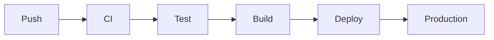
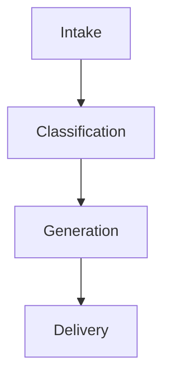
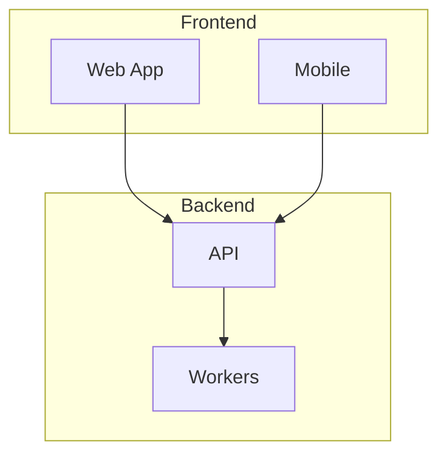

# Markdown Authoring Guide

> **For AI assistants and contributors**: Follow this guide when generating markdown documents that will be viewed in `markdown-viewer.html`. Almost everything here is standard markdown or standard HTML, and the viewer adds extra features on top of patterns that are invisible or harmless elsewhere. A few extensions behave differently in other tools; those cases are marked below and listed in the [compatibility matrix](#compatibility-matrix). The exact rules the viewer applies are in [rendering.md](rendering.md).

---

## CRITICAL: Narration Rules

> **DO NOT add `<!-- narrate: -->` comments unless the user explicitly asks for it.**

The `<!-- narrate: -->` feature exists for TTS (text-to-speech) support. While technically harmless (it's an HTML comment, invisible everywhere), **it adds tokens to the markdown source and bloats context windows**. Every narration comment is extra text that gets loaded into LLM context when reading/editing files.

**The rule is simple:**
- User says "make this listenable" / "add narration" / "TTS-friendly" → Add narration comments
- User says nothing about TTS/narration/listening → **Do NOT add them. Ever.**
- When in doubt → **Do NOT add them.**

**Future direction:** A separate post-processing layer is planned that takes any standard markdown and generates a TTS-optimized version on the fly (adding narration for diagrams, simplifying tables for speech, and so on), so the source markdown stays clean and lean and the enrichment happens at read time, not write time. It does not exist yet (see [roadmap.md](roadmap.md)). Until it does, narration comments are opt-in only.

---

## Quick Reference

| Feature | Syntax | Standard? | Notes |
|---------|--------|-----------|-------|
| Headings | `# H1` through `###### H6` | Yes | Used for TOC, section folding, TTS sections |
| Bold/Italic | `**bold** *italic*` | Yes | |
| Strikethrough | `~~text~~` | GFM | GitHub Flavored Markdown extension |
| Highlight | `==text==` | No* | markdown-it extension; renders as `<mark>` |
| Subscript | `~text~` | No* | markdown-it extension. **GitHub shows single tildes as strikethrough**; use `<sub>` if the file is also read there |
| Superscript | `^text^` | No* | markdown-it extension |
| Task lists | `- [x] done` | GFM | Clickable in the viewer, but clicks are not saved |
| Footnotes | `text[^1]` / `[^1]: note`, inline `^[note]` | Extended | Widely supported (inline form less so) |
| Definition lists | `Term\n: Definition` | Extended | |
| Abbreviations | `*[abbr]: Full` | Extended | The working way to get hover tooltips |
| Math inline | <code>&#36;E=mc^2&#36;</code> | KaTeX | Read [Math](#math) first: dollar signs are matched everywhere, including in code |
| Math block | <code>&#36;&#36;..&#36;&#36;</code> | KaTeX | Rendered by KaTeX in display mode |
| Mermaid diagrams | ` ```mermaid ` | Extended | Supported by GitHub too |
| TTS narration | `<!-- narrate: text -->` | Yes (HTML comment) | **OPT-IN ONLY — see rules above** |
| Collapsible | `<details><summary>` | Yes (HTML) | Standard HTML5 |
| Raw HTML | any tag | Yes | Passed through unsanitized by the viewer |

*\* Non-standard extensions. Most show as plain text in viewers that don't support them; the subscript exception is noted above.*

---

## Heading Hierarchy

Use proper heading hierarchy. Our viewer uses headings for:
- **Table of Contents** sidebar (all H1–H6)
- **Section folding** (H1–H4 get collapse toggles)
- **Section minimap** (one segment per H2, shown when there are 3 or more H2s)
- **TTS sections** (each heading starts a new spoken section)
- **Scroll spy** (breadcrumb shows current heading)

```markdown
# Document Title (H1 — only one per document)

## Major Section (H2 — primary structure)

### Subsection (H3)

#### Detail (H4 — last level with fold toggle)

##### Minor (H5)

###### Smallest (H6)
```

**Rules:**
- One H1 per document (the title)
- Don't skip levels (no H1 → H3)
- Keep headings concise — they appear in the TOC sidebar
- For headings you link to, use ASCII letters, digits, spaces and hyphens. The viewer's heading ids drop every other character (`Café` becomes `caf`, and a heading such as `3.1 Setup` becomes `3-1-setup` here but `31-setup` on GitHub), so links like `#setup` only resolve the same way everywhere when the heading is plain
- Avoid `#` inside heading text; the TOC strips it (`C# tips` is listed as `C tips`)

---

## Links

Our viewer auto-detects link types and decorates them. Write standard markdown links:

```markdown
[Link text](https://example.com)            <!-- External — small ↗ after the link, opens in a new tab -->
[repo](https://github.com/org/repo)         <!-- GitHub or GitLab — small ☆ after the link -->
[package](https://npmjs.com/package/name)   <!-- npm — small ○ after the link -->
[docs](https://docs.example.dev)            <!-- Docs — small ↗ after the link -->
[Section name](#heading-slug)               <!-- Internal — accent colour, dotted underline, no icon -->
[file.md](./path/to/file.md)                <!-- File — small → after the link -->
[email](mailto:user@example.com)            <!-- Email — warning colour, small ✉ after the link -->
```

How the type is chosen, first match wins: starts with `#` (internal), starts with `mailto:` (email), ends in `.md`, `.txt`, `.pdf`, `.doc`, `.csv`, `.json`, `.yaml` or `.yml` (file), contains `github.com` or `gitlab.com`, contains `npmjs.com` or `npm.im`, contains `docs.`, `documentation`, `readme`, `wiki`, `.dev` or `.io/docs` (docs), otherwise external. A file link with a `#fragment` after the extension is not treated as a file link.

Every link also gets a hover tooltip (type, shortened URL, Copy button) and appears in the links panel, grouped by type.

### Standalone link cards

When a link is the **sole content of a paragraph**, our viewer renders it as a card with icon, title, URL preview, and type badge (internal `#` links are never turned into cards):

```markdown
Check out the source:

[https://github.com/markedjs/marked](https://github.com/markedjs/marked)

See the documentation:

[https://developer.mozilla.org/en-US/docs/Web/API/SpeechSynthesis](https://developer.mozilla.org/en-US/docs/Web/API/SpeechSynthesis)
```

This is standard link syntax — in other viewers it renders as a normal clickable link. Don't put a linked image alone in a paragraph: it would also become a card, and the card shows only text.

---

## Frontmatter Dashboard

YAML frontmatter with structured fields renders as a visual status dashboard at the top of the document. It is standard YAML; GitHub shows it as a table, VS Code hides it, Obsidian shows it as properties.

```yaml
---
title: Search Index Rebuild
status: shipped
date: 2026-03-15
metrics:
  - label: PRs Merged
    value: "6"
  - label: Services Updated
    value: "3"
repos:
  - name: example-api
    github: https://github.com/example-org/example-api
    branch: main
---
```

**Rendered in our viewer:** a status badge, the date next to it, a row of metric cards, and repo badges (a star-prefixed link when `github` is set, a plain badge otherwise). The dashboard only appears when at least one of `status`, `metrics` or `repos` is present.

**Format rules** (the viewer uses a small built-in parser, not a full YAML library):
- The opening `---` must be the very first line of the file, with nothing before it.
- The closing `---` must be followed by a newline.
- Only one level of nesting: top-level `key: value`, or a top-level `key:` followed by indented `- key: value` items with further indented `key: value` lines.

### Supported frontmatter fields

| Field | Type | Effect |
|-------|------|--------|
| `title` | string | Parsed but not displayed; the viewer's title bar shows the file name |
| `status` | string | Badge. Contains `ship` → green "shipped" style; contains `progress` → yellow; contains `block` → red; anything else → grey. The original text is shown |
| `date` | string | Shown next to the status badge |
| `metrics` | list of `{label, value}` | Rendered as stat cards |
| `repos` | list of `{name, github, branch}` | Badges; `github` makes the badge a link. `branch` is accepted but not shown |
| `abbreviations` | map of `ABBR: Full Name` | **Not applied at present**: the parser cannot read a map, so no tooltips appear. Use `*[ABBR]: Full Name` lines in the body instead (see [Quick Reference](#quick-reference)) |

---

## Callout Blocks

GitHub-flavored callout syntax using blockquotes. These render as colored callout boxes in our viewer and as indented quotes in other viewers:

```markdown
> [!NOTE]
> Regular notes and information.

> [!TIP]
> Helpful suggestions.

> [!WARNING]
> Something to be careful about.

> [!IMPORTANT]
> Critical information.

> [!CAUTION]
> Dangerous actions or consequences.
```

### Custom callout types (our viewer only, degrades to blockquotes elsewhere)

```markdown
> [!TLDR]
> One-line summary of the section.

> [!DECISION]
> We chose X over Y because of Z.

> [!COST]
> This adds roughly 40 US dollars a month to infrastructure costs.
```

GitHub renders `[!NOTE]`, `[!TIP]`, `[!WARNING]`, `[!IMPORTANT]`, `[!CAUTION]` natively. The custom types (`TLDR`, `DECISION`, `COST`) degrade to regular blockquotes on GitHub, with the marker visible.

Details of the viewer's handling:
- The marker is case-insensitive (`[!note]` works).
- Keep the marker alone on the first line. Text after it on the same line is accepted by the viewer, but it becomes the first line of the body, not a title, and GitHub does not accept that form.
- There are no custom titles, no fold markers and no other types. A fold marker such as `[!NOTE]-` still produces the callout, but the `-` is left at the start of the body, so don't use it. An unknown type stays an ordinary blockquote with the marker visible.

---

## Collapsible Sections

Use standard HTML `<details>` / `<summary>` for content that should be collapsed by default:

```markdown
<details>
<summary>Click to expand: Implementation details</summary>

Any markdown content works inside:

- Lists
- **Bold text**
- `code`

</details>
```

This is standard HTML5 — works in GitHub, VS Code, and all modern browsers. Keep the blank line after `<summary>` and before `</details>` so the content inside is parsed as markdown.

**Our viewer also adds:** heading-level folding. Every H1–H4 gets a chevron toggle that collapses all content until the next heading of same or higher level. No special syntax needed.

---

## Code Blocks

Always specify the language for syntax highlighting:

````markdown
```python
def hello():
    print("world")
```

```javascript
const hello = () => console.log("world");
```

```bash
echo "hello world"
```
````

Languages bundled with the viewer's highlighter: `bash`, `c`, `cpp`, `csharp`, `css`, `diff`, `go`, `graphql`, `ini`, `java`, `javascript`, `json`, `kotlin`, `less`, `lua`, `makefile`, `markdown`, `objectivec`, `perl`, `php`, `php-template`, `plaintext`, `python`, `python-repl`, `r`, `ruby`, `rust`, `scss`, `shell`, `sql`, `swift`, `typescript`, `vbnet`, `wasm`, `xml` (also used for `html`), `yaml`. Common aliases such as `js`, `ts`, `py`, `sh` and `html` work. `toml` is highlighted as `ini`. Any other language (for example `dockerfile` or `powershell`) is shown as plain, uncoloured text with the language name in the header. There is no automatic language detection.

Our viewer adds:
- Language label in the header (`text` when no language is given)
- Copy button

> [!WARNING]
> Two dollar signs on the same line of a code block are treated as math by the viewer and the block shows garbled markup. See [Math](#math) before writing shell, PHP, Perl or template code that uses dollar signs.

---

## Math

Use KaTeX syntax (subset of LaTeX). Source examples (written here with HTML entities so this guide itself renders correctly):

<pre><code>Inline: &#36;E = mc^2&#36;

Block:
&#36;&#36;
\int_{0}^{\infty} e^{-x^2} dx = \frac{\sqrt{\pi}}{2}
&#36;&#36;</code></pre>

Renders in our viewer via KaTeX. GitHub, VS Code and Obsidian also render dollar-sign math. In plain viewers it shows as-is.

**Rules that come from how the viewer finds math.** The viewer scans the raw text for dollar signs before it parses markdown, so it does not know about code:

- Any two dollar signs on the same line become inline math — in prose, in inline code and in code blocks.
- Any two double-dollar signs in the file with no other dollar sign between them enclose one display block, even far apart.
- A backslash before a dollar sign does not stop this, and makes the output worse.
- Math cannot contain a dollar sign, and inline math cannot span lines.
- Only dollar delimiters are supported: not `\(...\)`, `\[...\]`, or ` ```math ` fences.

So:
- Write money and other literal dollar signs in prose as `&#36;` (renders as a dollar sign everywhere), or spell the currency out.
- Keep dollar-heavy code (shell variables, PHP, templates) out of documents meant for this viewer, or put it in a raw HTML `<pre><code>` block with `&#36;` entities, as the example above does.

---

## Mermaid Diagrams

Standard mermaid code fences:

````markdown

````

GitHub also renders mermaid natively. No special syntax needed. The fence info must be exactly `mermaid` in lower case; ` ```Mermaid ` or ` ```mermaid title ` are shown as ordinary code.

### Viewer-enhanced features for diagrams

Our viewer adds several enhancements to mermaid diagrams. These are all automatic — no special syntax needed:

**Click-to-expand:** Every diagram has an expand button (top-right corner on hover). Click the diagram or the button to open a fullscreen overlay with zoom controls (+/-, mouse wheel, fit-to-screen).

**Click-to-section:** The viewer is meant to make a mermaid node clickable when its text matches a document heading (the whole heading, or a single word longer than three letters from it), scrolling to that section. At present this does not reliably attach, because it runs before the diagrams have finished drawing (see [rendering.md](rendering.md#mermaid-diagrams)). Naming nodes after headings is still harmless and makes diagrams easier to follow.

Example: if your document has `## Intake` and your diagram has a node called `Intake`, that node is the one intended to scroll to the heading.



**Auto-type detection:** The expand overlay shows the diagram type in the title bar: Sequence Diagram, Flowchart, Class Diagram, Gantt Chart, Pie Chart, ER Diagram or State Diagram, otherwise "Diagram". Only the `graph` keyword is recognised as a flowchart; `flowchart TD` is titled "Diagram".

**Theme:** diagrams are drawn with mermaid's dark theme when the viewer is in dark mode and its default theme otherwise. Diagrams already on screen are not redrawn when you switch theme; reopen the file to redraw them.

### Making diagrams more readable

Tips for mermaid diagrams that look good in the viewer:

1. **Use subgraphs** for grouping related nodes:


2. **Use LR (left-to-right) for pipelines**, TD (top-down) for hierarchies:
```markdown
graph LR  ← for pipelines, flows
graph TD  ← for hierarchies, trees
```

3. **Keep node labels short** — long labels make diagrams cramped
4. **Use styled nodes** for visual hierarchy: `[regular]`, `(rounded)`, `{diamond}`, `[[subroutine]]`, `[(database)]`
5. **Prefer the `graph` keyword** over `flowchart` so the overlay title says "Flowchart"

**If and only if the user has requested TTS/narration**, add a narrate comment before the block:

````markdown
<!-- narrate: This shows the deployment pipeline from code push through CI to production. -->


````

---

## Tables

Standard GFM tables:

```markdown
| Column A | Column B | Column C |
|----------|----------|----------|
| data 1   | data 2   | data 3   |
| data 4   | data 5   | data 6   |
```

Column alignment with `:---`, `:---:` and `---:` is supported. Read-aloud reads a table row by row, up to about 300 characters, unless the table has a narration comment.

---

## Images

```markdown

```

Our viewer adds click-to-zoom (lightbox).

Notes:
- Relative paths are resolved against the viewer page's address, not the markdown file's folder, so relative images only appear when the viewer and the files are served from a common folder.
- Inline `data:` images work for PNG, JPEG, GIF and WebP. `data:image/svg+xml` is refused by the markdown parser and shown as text; use an inline `<svg>` element instead.

---

## TTS Narration (Opt-In Only)

**Repeat: Only add these when the user explicitly requests TTS/narration/listening support.**

### How it works

`<!-- narrate: ... -->` is a standard HTML comment. Every markdown renderer either strips it or passes it through invisibly. During read-aloud, our viewer speaks the text after the `narrate:` prefix in place of a mermaid diagram or a table that it directly precedes, anywhere in the document: under headings, and inside list items, quotes, callouts and `<details>`. Diagrams without a narration are skipped; tables without one are read row by row, cells separated by commas, up to about 300 characters.

### Syntax

Place immediately before the block it describes, with a blank line after the comment:

```markdown
<!-- narrate: This flowchart shows how user requests flow through the API gateway to microservices. -->

```

### Multi-line

```markdown
<!-- narrate: This architecture diagram has three layers.
The frontend talks to the API through a load balancer.
The API layer consists of three services: auth, content, and billing.
Each service has its own database for data isolation. -->

```

### When to narrate (only if user opted in)

| Block Type | Narrate? |
|---|---|
| Mermaid diagrams | Yes — diagrams are unreadable to TTS and are skipped without a narration |
| Complex tables | Yes — when data needs interpretation |
| Images | No — the viewer reads an image's alt text ("Image: …"), so put the description in the alt text |
| Code blocks | No — viewer says "Code block in python." and moves on |

### Writing good narrations

- Describe the structure and flow, not every visual detail
- Start with the big picture: "This diagram shows X"
- Keep it conversational — it will be spoken aloud
- Keep it short — 1-3 sentences max
- Don't put math in a narration; it is spoken as markup

### Future: Automatic narration layer

A post-processing layer is planned that will:
1. Take any standard markdown as input
2. Auto-generate narration for diagrams/tables/images at read-time
3. Feed the enriched version to the TTS engine
4. **Keep the source markdown completely clean — zero extra tokens**

This means narration will become automatic and source files will never need `<!-- narrate: -->` comments. Until this layer ships, narration is manual and opt-in.

---

## Document Structure Template

For consistent documents across the project:

```markdown
# Document Title

Brief 1-2 sentence overview of what this document covers.

## Context

Why this document exists, what problem it addresses.

## Content Sections

Main body organized with H2/H3 hierarchy.

## References

- [Related doc](./other-doc.md)
- [External resource](https://example.com)
```

---

## Compatibility Matrix

The viewer column is read from the code. The other columns reflect commonly documented behaviour and were not tested for this guide; [rendering.md](rendering.md#portability) has the longer version.

| Feature | Our Viewer | GitHub | VS Code | Obsidian |
|---------|-----------|--------|---------|----------|
| Basic markdown | Full | Full | Full | Full |
| GFM (tables, tasks) | Full | Full | Full | Full |
| `<details>` collapse | Full | Full | Full | Full |
| Mermaid | Full + expand/zoom | Full | Extension | Full |
| Dollar-sign math | Full, but also matches inside code | Full | Built-in | Full |
| Callout `[!NOTE]` etc. | Styled blocks | Styled | Varies by version | Styled |
| Custom `[!TLDR]` etc. | Styled blocks | Blockquote | Blockquote | Styled callout |
| Frontmatter dashboard | Status/metrics/repos | Table | Hidden | Properties |
| `*[ABBR]:` tooltips | Hover tooltips | No | No | No |
| Frontmatter `abbreviations` | Not applied | No | No | No |
| Section minimap | Auto (3+ H2s) | No | No | No |
| `<!-- narrate: -->` | **TTS audio** (diagrams, tables) | Hidden | Hidden | Hidden |
| Heading fold | Auto (H1–H4) | No | Outline only | Built-in |
| Link type detection | Auto | No | No | No |
| Link cards | Auto | No | No | No |
| Diagram click-to-section | Intended; not reliable yet | No | No | No |
| Footnotes | Full | Full (no inline `^[...]`) | Extension | Full |
| `==highlight==` | Full | No | No | Full |
| `~sub~` | Full | **Strikethrough** | No | No |
| `^sup^` | Full | No | No | No |
| Definition lists | Full | No | No | No |

**Bottom line:** Stick to standard markdown + HTML. Nearly everything degrades gracefully; the exceptions are single-tilde subscript on GitHub and dollar signs in this viewer. The `<!-- narrate: -->` pattern is opt-in only and invisible by design.
