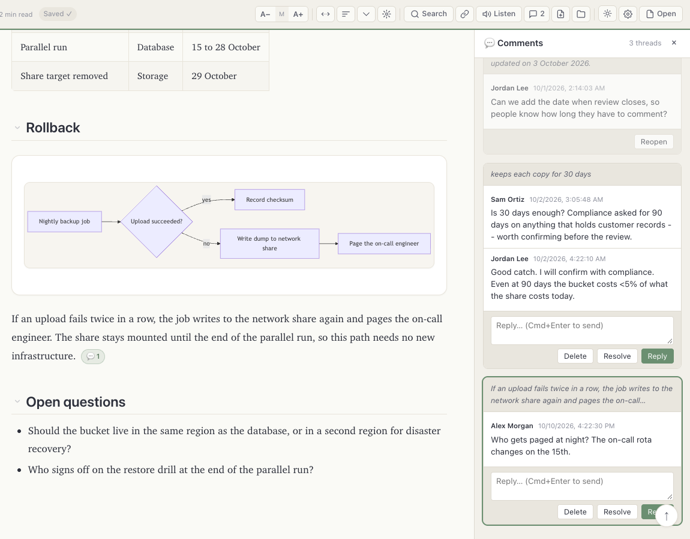
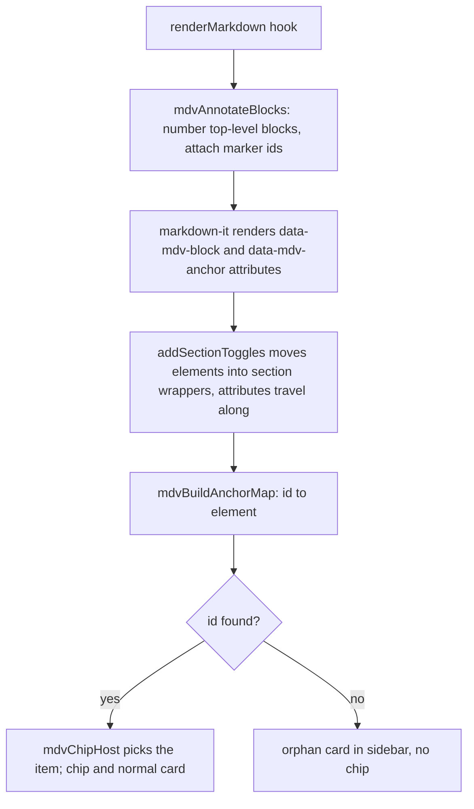
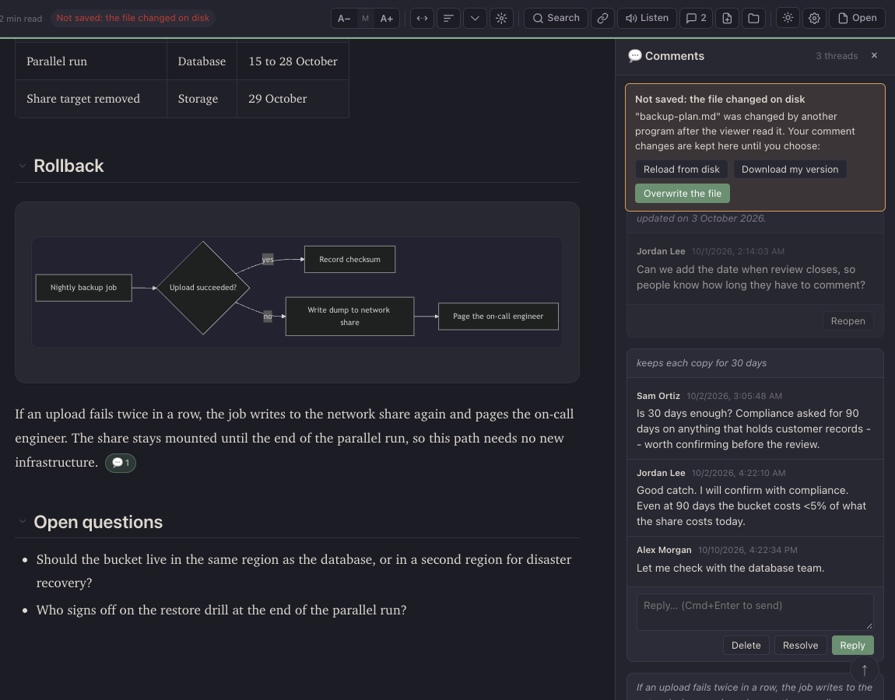

# Commenting

The viewer can attach threaded comments to blocks of a markdown document and store them **inside the markdown file itself**, as HTML comments. Other CommonMark renderers hide HTML comments, so a commented file still renders cleanly everywhere else.

All of the comment code is in `js/comments.js`. Every function in it is prefixed `mdv`. This page documents what that code does, function by function. Anything not read directly from the code or exercised by a test is marked *(inferred)* or *(unverified)*.

> [!NOTE]
> **Data safety.** Since 2026-10-10 the comment code keeps these rules, each covered by a browser test in
> `tests/e2e/comments.spec.mjs` (see [Data-safety tests](#data-safety-tests)):
> - a new thread is saved, on the block it was started on, and a deleted thread stays deleted;
> - only a comment block that **ends** the file is read, so a document that mentions the comment tokens, even in
>   code, never loses text;
> - an unreadable comment block, or one from a newer format version, is never rewritten or dropped: comments become
>   read-only for that file;
> - a file changed by another program after the viewer read it is **never overwritten**: the save stops, the reader
>   is told, and the comment stays in the window until the reader chooses to reload, download or overwrite;
> - every write goes through one function, `mdvWriteDocument`, in the browser and in the desktop app.

Contents:

- [How to use](#how-to-use)
- [Controls and shortcuts](#controls-and-shortcuts)
- [Data model](#data-model)
- [On-disk format](#on-disk-format)
- [Parsing and serializing](#parsing-and-serializing)
- [Anchors: creation and resolution](#anchors-creation-and-resolution)
- [Orphans](#orphans)
- [File access model](#file-access-model)
- [Save flow](#save-flow)
- [The desktop app](#the-desktop-app)
- [Author identity](#author-identity)
- [How threads are displayed](#how-threads-are-displayed)
- [Data-safety tests](#data-safety-tests)
- [Known limitations](#known-limitations)
- [Related documents](#related-documents)

---

## How to use

1. Open `markdown-viewer.html` in a Chromium-based browser to save comments into the file itself. In-place saving needs the File System Access API (`showOpenFilePicker`, `showSaveFilePicker`, `showDirectoryPicker`). Other browsers can read and add comments and save them by downloading a copy (Cmd/Ctrl+S). In the desktop app every file saves in place.
2. Click the toolbar button titled **"Open .md / set save location (Chromium)"** and pick a `.md`, `.markdown` or `.txt` file. The browser asks for read-write permission.
   - Optional: click **"Set workspace folder (one-time, no more save popups)"** and pick the folder that holds your documents. A file later dropped or opened with **Open** is linked for saving without a prompt when the folder's top level holds a file with the same name **and the same contents**.
3. The comments toggle (title **"Comments (Ctrl+Shift+C)"**) appears after the first document renders. Its badge counts unresolved threads.
4. To start a thread, either:
   - right-click a paragraph, list item, heading, quote, code block, table cell or definition, then choose **Add comment** (or **Add comment on selection** if text is selected), or
   - select at least 3 characters inside the document and click the floating **Comment** button that appears above the selection.
5. Type in the popup and click **Save** or press Cmd/Ctrl+Enter. If the document has no save location yet (Chromium), a Save dialog opens first. The thread appears in the sidebar and a chip appears on the block; the page does not move.
6. In the sidebar, each open thread has a reply box and **Reply**, **Resolve** and **Delete** buttons. Resolved threads show only **Reopen**. Every change is saved at once. Click a thread's quote to scroll to its block.
7. Cmd/Ctrl+S saves immediately, and opens a Save dialog if no save location is known (or downloads a copy in browsers without the File System Access API).



A ready-made file with two threads is in [../samples/commented.md](../samples/commented.md). Opening it shows one open thread with a reply and one resolved thread, both attached to the first two paragraphs.

---

## Controls and shortcuts

These are all the comment-related inputs the code handles. None of them is listed in the viewer's own shortcuts overlay (the `?` dialog).

| Input | Where | Effect | Implemented in |
|---|---|---|---|
| Cmd/Ctrl+Shift+C | anywhere, including text fields | Toggle the comments sidebar | document `keydown` listener in `comments.js`, `mdvToggleSidebar` |
| Cmd/Ctrl+S | anywhere, only when a document is loaded | Save now; may open a Save dialog or a permission prompt; downloads a copy where the File System Access API is missing | same listener, `mdvSaveFile({ allowPrompt: true })` |
| Right-click on a block | inside the document (`#mdBody`) | Custom menu with **Add comment** | `mdvAttachContextMenu` (wired once, when the script loads), `mdvShowContextMenu` |
| Shift+right-click | inside the document | Native browser menu | `mdvAttachContextMenu` returns early on `e.shiftKey` |
| Right-click outside a recognised block | inside the document | Native browser menu | `mdvFindBlock` returns null |
| Mouse-up after selecting at least 3 characters | inside the document | Floating **Comment** button above the selection | `mdvHandleSelection` (document `mouseup` listener) |
| Cmd/Ctrl+Enter | add-comment popup | Save the comment | `mdvShowAddPopup` |
| Escape | add-comment popup | Close the popup without saving | `mdvShowAddPopup` |
| Cmd/Ctrl+Enter | reply box | Post the reply | `mdvRenderSidebar` wires `mdvPostReply` |
| Mouse-down outside the context menu | anywhere | Close the menu | `mdvShowContextMenu` |
| Click a chip | on a commented block | Open the sidebar, scroll the thread card into view and outline it for 1.2 s | `mdvRenderChips`, `mdvFocusThread` |
| Click a thread's quote | sidebar | Scroll the document to the thread's block | `mdvRenderSidebar` |

"Recognised block" means the nearest ancestor whose tag is one of `MDV_BLOCK_TAGS`: `P`, `LI`, `H1`–`H6`, `BLOCKQUOTE`, `PRE`, `TD`, `TH`, `DT`, `DD` (`mdvFindBlock`). Because the walk goes upward from the click target, a paragraph inside a blockquote or list item is chosen before the enclosing `BLOCKQUOTE` or `LI`.

The context menu and the selection button are not closed by Escape. The selection button is removed on the next mouse-up anywhere outside the comment UI.

---

## Data model

The viewer keeps every comment, root or reply, in one flat array, `mdvComments`. Threads are rebuilt from `parent_id` when the sidebar renders (`mdvThreadTree`). Entries the viewer does not understand (not an object, no `id`) are skipped when drawing but kept in the file.

### Comment object

| Field | Type | Set by | Meaning |
|---|---|---|---|
| `id` | string | `mdvAddComment`, `mdvPostReply` | `"cm_"` plus up to 10 base-36 characters from `Math.random()` (`mdvNewCommentId`). |
| `parent_id` | string or `null` | same | `null` for a thread root; for a reply, the `id` of the thread root. The UI only ever replies to the root. |
| `anchor` | object | `mdvAddComment` | Present on thread roots only. See [Anchor object](#anchor-object). Replies have no `anchor` key at all. |
| `author` | object | same | `{ "name": <string>, "kind": "human" }`. See [Author identity](#author-identity). |
| `body_md` | string | same | The trimmed text typed by the user. Despite the name it is shown as plain text, not rendered as markdown. |
| `created_at` | string | same | `new Date().toISOString()`, for example `2026-10-02T10:05:48.230Z`. |
| `updated_at` | string | same, and `mdvResolveThread` | Same format. Changed when a thread is resolved or reopened; edits do not exist. |
| `status` | string | same | `"open"` on creation. `mdvResolveThread` toggles a root between `"open"` and `"resolved"`. Replies keep `"open"`. |

### Anchor object

Built by `mdvComputeAnchor(elem, selectionText)` when a thread is created. `elem` is the block that was right-clicked or selected in.

| Field | Type | Meaning |
|---|---|---|
| `id` | string | `"c_"` plus up to 10 base-36 characters (`mdvShortId`). This is the id written into the anchor marker. |
| `blockKind` | string | Lower-case tag name of the block, for example `"p"`, `"li"`, `"td"`, `"h2"`. |
| `blockHash` | string | First 8 bytes of the SHA-256 of the normalized block text, as 16 lower-case hex characters (`mdvHash`). Normalization (`mdvNormalize`) lower-cases, collapses whitespace runs to one space and trims. The block text is its `textContent` without comment chips (`mdvBlockText`). The SHA-256 is computed in JavaScript (`mdvSha256Hex`), so it also works where `crypto.subtle` is missing; it reproduces the sample's stored hashes. |
| `sibIdx` | number | Index of the block among its parent element's element children at the time of commenting. Stored, not used. |
| `quote` | object or `null` | `null` when no text was selected. Otherwise see below. |

For a block inside a list, table, quote or definition list, the anchor marker is written before that whole top-level block (see [Creating an anchor](#creating-an-anchor)), and `blockKind` with `blockHash` (or the quote) identify the item inside it that the thread belongs to.

### Quote object

| Field | Meaning |
|---|---|
| `exact` | The selected text, trimmed. |
| `prefix` | Up to 32 characters of the block's text immediately before the first occurrence of `exact`. |
| `suffix` | Up to 32 characters immediately after it. |

If `exact` is not found in the block's text (for example, the selection crossed into another block), `prefix` and `suffix` are empty strings.

### Fields the code reads but never writes

- `author.kind`: any value is accepted when rendering. Its letters, digits, `_` and `-` become a CSS class `mdv-kind-<kind>`; the stylesheet styles `mdv-kind-agent` with a blue tint and an "(AI)" suffix after the name. The UI itself only writes `"human"`.
- Unknown extra fields on a comment object are kept through load and save, because the parsed objects are written back unchanged.

---

## On-disk format

A commented file has two kinds of HTML comment, both in the reserved `MDV-` namespace.

> [!NOTE]
> Only a comment block that ends the file is read, so a literal example inside this page would no longer be mistaken for real comment data. The examples below still use placeholders such as `c_…` and `v<N>`, for readers using older versions. For a byte-exact example, open [../samples/commented.md](../samples/commented.md) in a text editor.

### Anchor markers

```text
<!-- MDV-ANCHOR id="c_…" -->
Paragraph text that the thread is attached to.
```

- One marker per thread root, on a line of its own, **immediately before the first source line of the top-level block** that holds the commented element. For a paragraph or heading that is the block itself; for a list item, table cell, quoted paragraph or definition, it is the whole list, table, quote or definition list. A marker there never splits a list or a table (the old placement before an item's line did, *verified by a test*).
- The id must match `[a-zA-Z0-9_-]+`.
- Because the viewer configures markdown-it with `html: true`, the marker becomes a DOM comment node before the block's element, and the viewer's renderer also writes the id onto the element itself (see [Resolving an anchor](#resolving-an-anchor)).
- Markers stay in the file after the thread is resolved. Deleting a thread removes its marker, and nothing else (`mdvRemoveMarkers`).

### The comments block

```text
<!-- MDV-COMMENTS:v<N>
{"version":1,"generator":"mdv-viewer","comments":[ …comment objects… ]}
MDV-COMMENTS:end -->
```

Exactly as `mdvSerialize` writes it:

| Part | Content |
|---|---|
| Position | **The end of the file.** Only whitespace may follow the closing line. A block anywhere else is ordinary document text. |
| Separator | All trailing line breaks of the document body are removed, then exactly one blank line precedes the block. |
| Opening line | `<!-- MDV-COMMENTS:v` followed by `MDV_VERSION`, which is `1`, at the start of a line. |
| Payload | One line of compact JSON: `{"version":1,"generator":"mdv-viewer","comments":[...]}`, keys in that order, followed by any other top-level keys the file already had. |
| Closing line | `MDV-COMMENTS:end -->` followed by one final line break. |
| Line endings | Those of the document: a file that uses CRLF gets CRLF in the block and the markers. |
| Escaping | Every `--` in the JSON becomes `-\u002d` and every `<` becomes `\u003c`, so the payload can never close the HTML comment early. Both are ordinary JSON string escapes, which `JSON.parse` decodes. `>` is not escaped (not needed once `--` cannot occur). Non-ASCII characters are written as UTF-8, not escaped. |

When the last comment is removed from `mdvComments`, `mdvSerialize` writes no block at all: the body is written with exactly one trailing line break. A document that never had a block and has no comments is returned unchanged.

### Key order of a serialized comment

Key order follows object creation order, so a root written by the viewer looks like `id, parent_id, anchor, author, body_md, created_at, updated_at, status`, and its anchor `id, blockKind, blockHash, sibIdx, quote`. Readers must not depend on this order; `JSON.parse` does not.

---

## Parsing and serializing

### Finding the block: `mdvLocateBlock(src)`

1. The closing token must end the file: `/MDV-COMMENTS:end\s*-->\s*$/`. No match: there is no comment block.
2. The block starts at the **last** opening token that begins a line (up to three spaces of indentation) before that closing token: `/(^|\n)( {0,3})<!--\s*MDV-COMMENTS:v(\d+)/g`. Searching from the last token, not the first, is what keeps a document that mentions the tokens intact: a mention inside a code span or a code block never starts a block that the next save would remove.
3. It returns the block's start offset, its version number and its payload text.

### `mdvParseFile(src)`

1. Locate the block. None: no comments, no error.
2. `mdvReadPayload` checks the version (the opening token's and the payload's `version`, when present, must both be `1`) and runs `JSON.parse` on the payload. `JSON.parse` alone decodes the escapes; there is no textual replacement.
3. The payload must be a JSON object whose `comments` is a list. Anything else is an error.
4. On an error the comments are an empty list and `parseError` explains why. The renderMarkdown hook then makes the comments **read-only** for that document (`mdvLockReason`): no change can be made, nothing is saved, and the sidebar explains why.
5. The returned `stripped` value is the unchanged source. The block and the markers stay in the text that is rendered; markdown-it emits them as HTML comments, which are invisible.

### `mdvSerialize(src, comments)`

1. Locate the existing block. If it cannot be read (see above), **throw** and change nothing. An unreadable block is never dropped.
2. Keep the text before the block byte for byte, remove its trailing line breaks.
3. If `comments` is empty, return the body plus one line break (or the source unchanged when it had no block).
4. Otherwise append the block described in [The comments block](#the-comments-block), keeping the payload's other top-level keys.

### Round-trip rules

| Aspect | What happens on the next save |
|---|---|
| Document text and markers | Preserved byte for byte, except the trailing-line-break normalization before the block. Verified: `samples/commented.md` round-trips byte for byte. |
| Comment objects, including unknown fields | Preserved; written back as parsed. |
| Unknown top-level payload keys | Preserved, after `version`, `generator` and `comments`. |
| Version | A `v1` block is rewritten as `v1`. A block with any other version is read-only and never rewritten. |
| Block position and whitespace | Normalized: one blank line before it, single-line JSON, fixed opening and closing lines. |
| Line endings | A CRLF file stays CRLF. |
| A block that is not at the end of the file | Ordinary text; left in place. |
| A block that failed to parse | Kept exactly as it is; comments are read-only until it is fixed. |
| Blank lines elsewhere | Untouched. Deleting a thread removes only its marker line. |

---

## Anchors: creation and resolution

### Creating an anchor

When a thread is saved, `mdvAddComment(elem, selectionText, body)`:

1. Refuses when comments are read-only, or when `elem` is no longer on the page (the document was reloaded or replaced while the popup was open; the typed text stays in the popup).
2. Builds the anchor (`mdvComputeAnchor`).
3. Finds where the marker goes (`mdvLocateInsertion`):
   - Every top-level block of the rendered page carries its number in a `data-mdv-block` attribute (see below). The element's top-level block is found with `closest('[data-mdv-block]')` (a fenced code block carries it on the `<code>` inside its `<pre>`).
   - The source is parsed again with the viewer's markdown-it instance (after the front matter, exactly as `renderMarkdown` splits it), and the block with the same number gives its first source line. Inline markup, links, typographic quotes, soft line breaks, headings, code blocks and diagrams all work, because no rendered text is compared with the source.
   - The numbering skips HTML blocks that contain only comments (markers, narration, the comment block), so inserting or removing a marker never renumbers anything.
   - When math pre-processing changes the block structure (display math spanning blank lines), or the element has no number, a fallback looks for the first line of the block's text in the source, outside code.
4. Inserts the marker line at the start of that source line, appends the comment, and writes the result into `rawMarkdown` together with the new list (`mdvCommit`), so nothing that reads the source again can lose the thread.
5. Adds the id to the element's `data-mdv-anchor` on the page directly. There is no re-render, so the reader stays where they were.
6. If no position can be found, the thread is still saved, listed as unattached, and a toast says so.

### Resolving an anchor

A markdown-it core rule, `mdvAnnotateBlocks` (registered by `comments.js` on the shared `md` instance), runs on every render. It numbers each top-level block (`data-mdv-block`) and gives the block that follows one or more anchor markers their ids (`data-mdv-anchor="c_… c_…"`). A custom fence renderer that drops token attributes (Mermaid) gets them on its first element instead.

`mdvBuildAnchorMap(container)` maps every id in a `data-mdv-anchor` attribute to its element. An attribute travels with its element, so the section wrappers that `addSectionToggles` builds after rendering no longer separate a thread from its block. Markers the render could not attach (inside a list or quote, or before a raw HTML block) fall back to the old rule: the marker comment's next element sibling.

`mdvChipHost(element, anchor)` decides where a thread's chip goes. For a list, table, quote or definition list, it finds the item inside it whose text hashes to the anchor's `blockHash` (or contains its quote), and falls back to the first item.



The old three-level resolver (`mdvResolveAnchor`, with diff-match-patch) was never called and has been removed.

---

## Orphans

A thread root is shown as an orphan when it has an `anchor` but `anchor.id` is not found on the page (its marker was removed or the text was edited elsewhere). In `mdvRenderSidebar`:

- the card gets the class `mdv-orphan` (amber border and background);
- the quote line gets `mdv-quote-orphan`, whose CSS prefixes it with "⚠ orphan: ";
- no chip is drawn in the document.

Orphans are never removed from the data; they are saved back like any other thread and can be replied to, resolved or deleted from the sidebar.

Two related cases are not flagged:

- A root without an `anchor` key (only possible in hand-written files) is shown normally with "(block)" as its quote and no chip.
- A reply whose `parent_id` points to a comment that does not exist is not shown anywhere, but it stays in `mdvComments` and is saved. Replies to replies are attached in `mdvThreadTree` but only one level of replies is rendered, so they are also invisible.

---

## File access model

### Ways a document gets loaded

| Entry point | Function | Save target afterwards |
|---|---|---|
| Toolbar "Open .md / set save location" with no document loaded, or with a document that already has a handle | `mdvOpenOrSetSaveLocation` then `mdvPickFile`, which calls `showOpenFilePicker` (types `.md`, `.markdown`, `.txt`; single file) and `mdvOpenWithHandle`. Without the File System Access API it opens the file input (`#fileInput`) instead | The file's handle, if read-write permission is granted |
| Same button with a document loaded but no handle | `mdvOpenOrSetSaveLocation` then `mdvEnsureWritableHandle`, which calls `showSaveFilePicker` (suggested name: the document's name), then saves immediately. Without the API: downloads a copy | The chosen file |
| Drag-and-drop, the drop-zone browse button, or Cmd/Ctrl+O | `readFile` (in `files.js`), which calls `mdvTryWorkspaceMatch(file.name)` | The workspace file of the same name **only when its contents are identical**; otherwise none |
| Paste of more than 10 characters outside a text field | document `paste` listener | None (`mdvFileHandle = null`) |
| `?file=` URL over http(s) | `loadFromUrl` | None |
| Page load with a remembered file | `load` listener, then `mdvOpenWithHandle(handle, { prompt: false })` | The remembered handle (read-only until permission is granted) |
| Desktop app | the bridge (`js/host.js`) renders the window's file | The window's file, through `mdvHost.saveDocument` |

**A document is only linked to the file it was read from.** Every render passes through `mdvBeginDocument`. If a file handle is still linked but the version the viewer read from it is not the text being rendered, the link is dropped and the status says so, so a loader that forgot to unlink the previous file cannot make a comment save write this document over it. A handle linked without a recorded version is checked against the file's contents before its first write.

### Permissions

- `mdvOpenWithHandle` checks `queryPermission({ mode: 'readwrite' })` and, from a user gesture, calls `requestPermission`. If that is refused it shows "Opened read-only: comments will not save into this file." and still opens the file. Without a gesture (the startup restore) it never prompts; the status says that Cmd/Ctrl+S allows saving.
- `mdvSaveFile` re-checks permission before every write. Without a user gesture (`allowPrompt: false`, as after a comment change) it does not ask; it sets the status "Not saved: click 📄 or press Cmd/Ctrl+S to allow saving". With `allowPrompt: true` (Cmd/Ctrl+S) it requests permission.
- `mdvEnsureWritableHandle` requests permission on an existing handle, or opens a Save dialog when there is none. The add-comment popup calls it inside the click handler so the dialog is allowed to open.

### Handle persistence in IndexedDB

| Item | Value |
|---|---|
| Database | `mdv-viewer` (`MDV_DB`), version 1 |
| Object store | `handles` (`MDV_STORE`), created in `onupgradeneeded`, out-of-line keys |
| Key `current` | The `FileSystemFileHandle` of the document being edited. Written by `mdvOpenWithHandle`, `mdvEnsureWritableHandle`, `mdvPickWorkspace` and the workspace match in `readFile`. |
| Key `workspace` | The `FileSystemDirectoryHandle` chosen with the workspace button. Written by `mdvPickWorkspace`. |
| Helpers | `mdvOpenDb`, `mdvPutHandle(key, handle)`, `mdvGetHandle(key)` (returns `null` on any error). Each call closes its connection. A failure to remember a handle never stops a file from opening. |

On the window `load` event the viewer restores both keys, with these rules:

1. **Never in the desktop app** (`mdvHost.kind === 'desktop'`): the window's own document is authoritative.
2. `workspace`: kept in memory if `queryPermission({ mode: 'read' })` is `granted`.
3. `current`: opened if read permission is `granted`, **unless**
   - the URL has a `?file=` link (an explicit link always wins; on `file://`, where a link cannot load, the remembered file of that very name stands in), or `#demo`, or
   - a document is already shown, or another document is opened while the restore runs.

Verified by tests: with no link, the remembered file is restored (the control); with a `?file=` link whose page finishes loading last, the link's document stays; in the desktop app nothing is restored.

### Workspace folder

`mdvPickWorkspace` calls `showDirectoryPicker({ mode: 'readwrite' })`, confirms read-write permission, stores the handle under `workspace` and shows a toast naming the folder. If a document is already loaded without a handle, it links the folder's file of the same name **when its contents equal the document as it was opened**, and saves.

`mdvTryWorkspaceMatch(filename, text)` is the matching rule used when a file arrives by drag-and-drop or the file input (`text` defaults to the document being loaded):

- it requires a remembered workspace with `readwrite` permission already `granted` (it never prompts);
- it looks up the file name in the top level of the workspace folder;
- it links the file **only when its contents are identical** to the dropped file. A different file with the same name (another folder's `README.md`) is not linked, and a toast says so.

---

## Save flow

```mermaid
sequenceDiagram
  participant U as Comment change
  participant C as mdvCommit
  participant Q as mdvEnqueueWrite
  participant W as mdvWriteDocument
  participant D as File
  U->>C: new list + serialized source, together
  C->>Q: job: text, target file, document version
  Q->>Q: one write at a time; skip a job a newer one for the same file replaces
  Q->>W: write the job's text to the job's file
  W->>D: desktop: mdvHost.saveDocument(path, text, mtime)
  W->>D: browser: still the version read? then createWritable, write, close
  W-->>U: Saved ✓, or a notice: conflict, error
```

| Step | Detail |
|---|---|
| Commit | Every change (add, reply, resolve, reopen, delete) writes the new list into the source at once (`mdvCommit`). `rawMarkdown` always holds the comments, so a re-render can never lose them. |
| When | At once, after every change. There is no debounce. |
| Queue | `mdvEnqueueWrite`: writes run one after another, each bound to the file it was made for. Switching documents while a write runs cannot send one document's text to another's file. A queued write that a newer version of the same file supersedes is skipped. |
| The writer | `mdvWriteDocument(text)` is **the only function that writes a document**. See [Conflict detection](#conflict-detection). |
| No save location | Chromium: the status says "Not saved: click 📄 or press Cmd/Ctrl+S to choose where to save". Other browsers: "Not saved: press Cmd/Ctrl+S to download a copy with your comments". The change stays in memory. |
| Dirty state | `mdvDirty` is true from a change until its version is written. |
| Leaving the page | With unsaved changes, a queued write or an open notice, the browser asks before the page closes (`beforeunload`). |
| Opening another document | If the current one has comment changes that never reached a file, a notice keeps them, with a **Download** button. |
| Status line | `#mdvSaveStatus` via `mdvSetStatus`: `Saving…`, `Saved ✓` (cleared after 3 s), or a `Not saved: …` message. |
| Notices | At the top of the sidebar (`mdvRenderNotices`): a conflict, a failed save, unsaved changes of a closed document, or read-only comments. |

### Conflict detection

Before a browser write, `mdvWriteDocument` compares the file with the version the viewer read or last wrote (`mdvBases`, one record per handle):

1. If the file's `lastModified` and `size` are unchanged, it writes.
2. Otherwise it reads the file. If the contents are still the same (another program saved without changing anything), it writes. If they differ, it **does not write**.

On a conflict the status says "Not saved: the file changed on disk", the sidebar opens with a notice, and the comment stays in the window. The notice offers:

- **Reload from disk**: show the other program's version (after a confirmation; the unsaved comment changes are discarded);
- **Download my version**: a copy of the file with the comments, nothing overwritten;
- **Overwrite the file**: the reader's explicit choice, after a confirmation.



A file picked in the Save dialog is written without a check the first time: the reader chose it (and confirmed replacing it) in that dialog.

### Download fallback

`mdvDownloadText` creates a `text/markdown;charset=utf-8` blob and triggers a download. It is used by Cmd/Ctrl+S in browsers without the File System Access API (`mdvDownloadFallback`, which names the file after the document), and by the **Download** buttons in notices. A comment change never downloads by itself.

---

## The desktop app

The desktop app hosts the same viewer and provides a bridge, `window.mdvHost`, defined in `js/host.js` (see `docs/desktop.md`). The comment code uses it only through `mdvWriteDocument`:

- **Save:** `mdvHost.saveDocument(mdvHost.currentPath, text, mdvHost.currentMtimeMs)`. The app writes only when the file's modification time still equals the one given. On success the viewer stores the returned `mtimeMs` in `mdvHost.currentMtimeMs`.
- **Conflict:** the app answers `{ ok: false, reason: 'conflict', currentMtimeMs }`; the viewer shows the same notice as in the browser. **Overwrite** passes that `currentMtimeMs`; **Reload from disk** calls `mdvHost.readDocument(currentPath)`.
- The browser's Save dialog, workspace folder and startup restore are never used in the desktop app. The file-plus button calls `mdvHost.openDialog()`.

---

## Author identity

- `mdvAuthorName` is read **once, when the page loads**, from `localStorage['mdv-author-name']`, defaulting to `You`.
- There is no UI to change it. To set it, run `localStorage.setItem('mdv-author-name', 'Your Name')` in the browser's developer console and reload the page.
- Every comment and reply records `author: { name: mdvAuthorName, kind: 'human' }`.
- The name is not verified and is stored in the file, so anyone editing the file can change any author name.

---

## How threads are displayed

| Element | Behaviour | Function |
|---|---|---|
| Sidebar order | Thread roots and replies sorted by `created_at` as strings (oldest first). | `mdvThreadTree` |
| Sidebar header | "N thread(s)"; "No comments yet." message when empty. | `mdvRenderSidebar` |
| Thread card | Quote: the selected text, or the start of the block the thread is on (diagrams show "Diagram: …"), up to 140 characters; then the root and its replies. Resolved cards are dimmed. A reply being typed survives a redraw. | `mdvRenderThreadCard`, `mdvBlockLabel` |
| Comment | Author name, `created_at` formatted with `toLocaleString()`, and `body_md` shown as text with `white-space: pre-wrap`. Every value from the file is HTML-escaped, quotes included. Missing author shows "Anon". | `mdvRenderCommentBody`, `mdvEscape` |
| Chip | "💬 N" where N is 1 plus the number of replies, appended inside the anchored block (or the item inside it). Dimmed when resolved. | `mdvRenderChips`, `mdvChipHost` |
| Toolbar badge | Number of unresolved thread roots; hidden at zero. | `mdvRenderSidebar` |
| Layout | Opening the sidebar adds `mdv-sidebar-open` to `body`, which pads the content 380 px on the right on wide screens. | `mdvToggleSidebar` |

Every call to `renderMarkdown` goes through a hook installed at the end of `comments.js`. The hook starts a new document (`mdvBeginDocument`), parses its comments from the source, renders, and 50 ms later redraws the sidebar and chips. A document rendered before the hook existed (the `#demo` page) is rendered once more through it.

---

## Data-safety tests

`tests/e2e/comments.spec.mjs` runs in Chrome with `pnpm test`. Saves go to a fake `FileSystemFileHandle`, to the browser's private file system (OPFS) or to a fake desktop bridge; no real file is touched. Of its 27 tests, 23 fail when run against the code before 2026-10-10 (commit 568069f), each on the bug it names, and 4 are controls that pass on both (the sample's byte-for-byte round trip, a file only touched by another program, writes that never overlap, and the startup restore with no link). The main ones, and what they caught:

| Test | Was |
|---|---|
| a document that mentions the comment tokens, even in code, keeps every character | a save removed the text between the first mention of the two tokens |
| comment text containing the escape sequences themselves round-trips | the next load failed to parse and the next save deleted every comment |
| an unreadable comment block is never rewritten, and comments become read-only | the next save deleted the block |
| a new thread is saved into the file, on the block it was started on | the thread was discarded and only its marker written |
| a deleted thread stays deleted | the thread came back and was saved again |
| a list item or table cell keeps the list and table intact | the marker split the table, or the thread was orphaned |
| a file changed by another program is never overwritten | the other program's edit was lost |
| a dropped file links to the workspace file only when the contents match | a same-named file was overwritten |
| the startup restore never overrides an explicit `?file=` link | the remembered file replaced the linked one |
| the desktop app never restores the last browser file | it did |
| the file-plus button opens the file chooser without the File System Access API | it threw a `TypeError` |
| a comment change never downloads by itself | every change downloaded a copy |

Further tests cover the desktop bridge (every save through `mdvHost.saveDocument` with the mtime that was read; a desktop conflict), a file only touched by another program (no false conflict), writes that never overlap, a save still running when another document opens, unsaved changes kept when another document opens, the `beforeunload` question, CRLF files, a typed comment kept in its box when adding fails, reply drafts, and escaping of every value the sidebar shows.

---

## Known limitations

1. **The version check and the write are not atomic in the browser.** The File System Access API has no compare-and-swap, so another program writing in the few milliseconds between the check and the write is not detected. The desktop app checks and writes in one step.
2. **A well-formed comment block at the very end of the file is always read as the comment block,** even inside an unclosed code fence. A block anywhere else, including in a closed code block, is text.
3. **Anchors fall back to a text search** when the element has no block number (content added by a later pass, such as a standalone link turned into a card) or when display math spans blank lines. The fallback finds blocks whose first line of text appears in the source; otherwise the thread is saved unattached.
4. **Overwriting after a desktop conflict needs the bridge to report `currentMtimeMs`.** Without it the overwrite conflicts again; the reader can still download their version.
5. **Comment shortcuts are missing from the `?` overlay,** and Cmd/Ctrl+Shift+C also fires while typing in text fields.
6. **Comments cannot be edited,** and there is no per-reply delete; delete works on whole threads.
7. **Bodies are plain text** even though the field is called `body_md`.
8. **The author name has no settings control** (see [Author identity](#author-identity)).
9. **A remembered file is usually restored read-only.** Browsers keep file permissions for a session unless the reader allows them on every visit, so after a reload the file opens read-only until Cmd/Ctrl+S asks for permission *(inferred from the File System Access permission model)*.

Fixed on 2026-10-10, with a test for each (see [Data-safety tests](#data-safety-tests)): new threads were lost; deleted threads came back; threads inside sections attached to the next heading; anchors failed on any block with inline markup, line breaks or a chip; markers split lists and tables; the comment block regex matched mentions anywhere, including code; literal escape text and unparsable blocks deleted every comment; there was no conflict detection; workspace matching was by name; the file-plus button threw outside Chromium; the startup restore could replace a `?file=` document; pending saves were dropped or misdirected when switching files; non-Chromium browsers downloaded on every change; there was no unsaved-changes warning; opening a file failed without IndexedDB; the three-level resolver was dead code; the add-comment popup opened near the top of a long, scrolled page and scrolled the reader away; and values from the file could inject attributes into the sidebar.

---

## Related documents

- [features.md](features.md): the full feature list.
- [architecture.md](architecture.md): how the scripts are organised, including the `renderMarkdown` pipeline the comment hook wraps.
- [authoring-guide.md](authoring-guide.md): writing markdown for this viewer.
- [roadmap.md](roadmap.md): planned work.
- [lessons-learned.md](lessons-learned.md) and [legacy-viewer.md](legacy-viewer.md): the older viewer used an incompatible comment format.
- [../samples/commented.md](../samples/commented.md): a file with two threads in the exact on-disk format.
