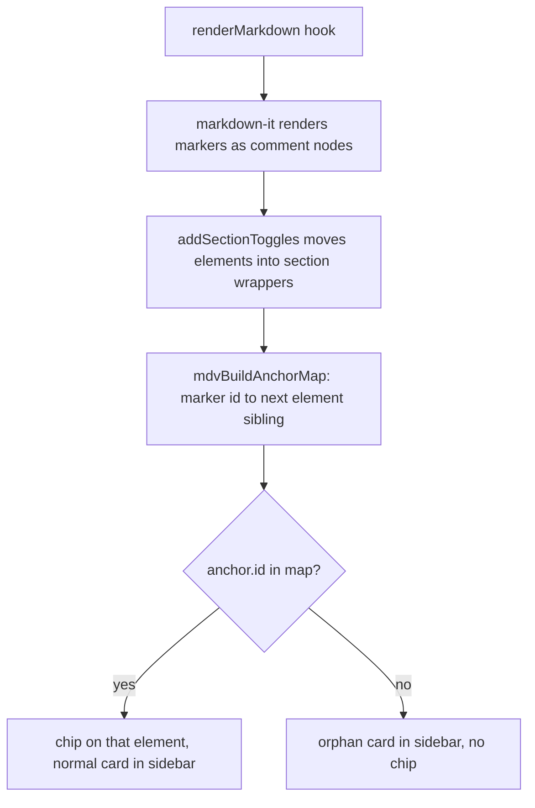
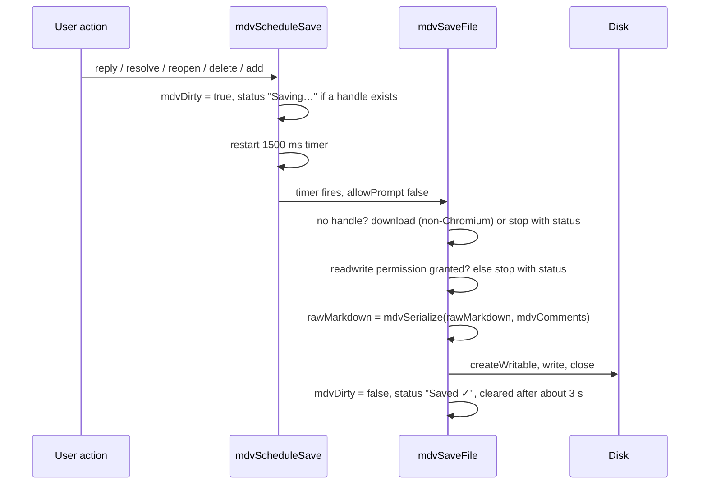

# Commenting

The viewer can attach threaded comments to blocks of a markdown document and store them **inside the markdown file itself**, as HTML comments. Other CommonMark renderers hide HTML comments, so a commented file still renders cleanly everywhere else.

All of the comment code lives in one section of the inline script in `markdown-viewer.html`, under the banner "MDV Comments — embedded threaded annotations". Every function in it is prefixed `mdv`. This page documents what that code does, function by function, as of the initial import. Anything not read directly from the code is marked *(inferred)* or *(unverified)*.

> [!WARNING]
> Several parts of this feature do not work as designed. In particular, creating a new thread and deleting a thread do **not** persist in the initial import, there is **no** external-edit conflict detection, and only one of the three anchor-resolution levels is ever used. See [Known bugs and limitations](#known-bugs-and-limitations) before relying on the feature.

Contents:

- [How to use](#how-to-use)
- [Controls and shortcuts](#controls-and-shortcuts)
- [Data model](#data-model)
- [On-disk format](#on-disk-format)
- [Parsing and serializing](#parsing-and-serializing)
- [Anchors: creation and resolution](#anchors-creation-and-resolution)
- [Orphans](#orphans)
- [File access model](#file-access-model)
- [Save flow](#save-flow)
- [Author identity](#author-identity)
- [How threads are displayed](#how-threads-are-displayed)
- [Known bugs and limitations](#known-bugs-and-limitations)
- [Related documents](#related-documents)

---

## How to use

This is the intended workflow, derived from the code. It has not been exercised in a browser for this page; steps that the code shows to be broken are flagged.

1. Open `markdown-viewer.html` in a Chromium-based browser. In-place saving needs the File System Access API (`showOpenFilePicker`, `showSaveFilePicker`, `showDirectoryPicker`); other browsers can read comments but can only save by downloading a copy.
2. Click the toolbar button titled **"Open .md / set save location (Chromium)"** and pick a `.md`, `.markdown` or `.txt` file. The browser asks for read-write permission.
   - Optional: click **"Set workspace folder (one-time, no more save popups)"** and pick the folder that holds your documents. Files later opened by drag-and-drop or the file input from the top level of that folder are linked for saving without another prompt.
3. The comments toggle (title **"Comments (Ctrl+Shift+C)"**) appears after the first document renders. Its badge counts unresolved threads.
4. To start a thread, either:
   - right-click a paragraph, list item, heading, blockquote, code block, table cell or definition, then choose **Add comment** (or **Add comment on selection** if text is selected), or
   - select at least 3 characters inside the document and click the floating **Comment** button that appears above the selection.
5. Type in the popup and click **Save** or press Cmd/Ctrl+Enter. If no save location is known yet, a Save dialog opens first.
   - **Bug in the initial import:** the new thread is discarded right after it is created, although its anchor marker is written to the file. See [bug 1](#known-bugs-and-limitations).
6. In the sidebar, each open thread has a reply box and **Reply**, **Resolve** and **Delete** buttons. Resolved threads show only **Reopen**.
   - Replies, resolve and reopen work and are auto-saved 1.5 s after the change.
   - **Delete does not persist** in the initial import; the thread comes back as an orphan. See [bug 2](#known-bugs-and-limitations).
7. Cmd/Ctrl+S saves immediately, and opens a Save dialog if no save location is known.

A ready-made file with two threads is in [../samples/commented.md](../samples/commented.md). Opening it shows one open thread with a reply and one resolved thread, both attached to the first two paragraphs.

---

## Controls and shortcuts

These are all the comment-related inputs the code handles. None of them is listed in the viewer's own shortcuts overlay (the `?` dialog).

| Input | Where | Effect | Implemented in |
|---|---|---|---|
| Cmd/Ctrl+Shift+C | anywhere, including text fields | Toggle the comments sidebar | document `keydown` listener in the comment section, `mdvToggleSidebar` |
| Cmd/Ctrl+S | anywhere, only when a document is loaded | Save now; may open a Save dialog | same listener, `mdvSaveFile({ allowPrompt: true })` |
| Right-click on a block | inside the document (`#mdBody`) | Custom menu with **Add comment** | `mdvAttachContextMenu`, `mdvShowContextMenu` |
| Shift+right-click | inside the document | Native browser menu | `mdvAttachContextMenu` returns early on `e.shiftKey` |
| Right-click outside a recognised block | inside the document | Native browser menu | `mdvFindBlock` returns null |
| Mouse-up after selecting at least 3 characters | inside the document | Floating **Comment** button above the selection | `mdvHandleSelection` (document `mouseup` listener) |
| Cmd/Ctrl+Enter | add-comment popup | Save the comment | `mdvShowAddPopup` |
| Escape | add-comment popup | Close the popup without saving | `mdvShowAddPopup` |
| Cmd/Ctrl+Enter | reply box | Post the reply | `mdvRenderSidebar` wires `mdvPostReply` |
| Mouse-down outside the context menu | anywhere | Close the menu | `mdvShowContextMenu` |
| Click a chip | on a commented block | Open the sidebar, scroll the thread card into view and outline it for 1.2 s | `mdvRenderChips`, `mdvFocusThread` |

"Recognised block" means the nearest ancestor whose tag is one of `MDV_BLOCK_TAGS`: `P`, `LI`, `H1`–`H6`, `BLOCKQUOTE`, `PRE`, `TD`, `DT`, `DD` (`mdvFindBlock`). Because the walk goes upward from the click target, a paragraph inside a blockquote or list item is chosen before the enclosing `BLOCKQUOTE` or `LI`.

The context menu and the selection button are not closed by Escape. The selection button is removed on the next mouse-up anywhere outside the comment UI.

---

## Data model

The viewer keeps every comment, root or reply, in one flat array, `mdvComments`. Threads are rebuilt from `parent_id` when the sidebar renders (`mdvThreadTree`).

### Comment object

| Field | Type | Set by | Meaning |
|---|---|---|---|
| `id` | string | `mdvAddComment`, `mdvPostReply` | `"cm_"` plus up to 10 base-36 characters from `Math.random()`. |
| `parent_id` | string or `null` | same | `null` for a thread root; for a reply, the `id` of the thread root. The UI only ever replies to the root. |
| `anchor` | object | `mdvAddComment` | Present on thread roots only. See [Anchor object](#anchor-object). Replies have no `anchor` key at all. |
| `author` | object | same | `{ "name": <string>, "kind": "human" }`. See [Author identity](#author-identity). |
| `body_md` | string | same | The trimmed text typed by the user. Despite the name it is shown as plain text, not rendered as markdown. |
| `created_at` | string | same | `new Date().toISOString()`, for example `2026-10-02T10:05:48.230Z`. |
| `updated_at` | string | same, and `mdvResolveThread` | Same format. Changed when a thread is resolved or reopened; edits do not exist. |
| `status` | string | same | `"open"` on creation. `mdvResolveThread` toggles a root between `"open"` and `"resolved"`. Replies keep `"open"`. |

### Anchor object

Built by `mdvComputeAnchor(elem, selectionText)` when a thread is created.

| Field | Type | Meaning |
|---|---|---|
| `id` | string | `"c_"` plus up to 10 base-36 characters (`mdvShortId`). This is the id written into the anchor marker. |
| `blockKind` | string | Lower-case tag name of the block element, for example `"p"`, `"li"`, `"h2"`. |
| `blockHash` | string | First 8 bytes of the SHA-256 of the normalized block text, as 16 lower-case hex characters (`mdvHash`). Normalization (`mdvNormalize`) lower-cases, collapses whitespace runs to one space and trims. Block text is `innerText` (or `textContent`), trimmed. |
| `sibIdx` | number | Index of the block among its parent element's element children at the time of commenting. |
| `quote` | object or `null` | `null` when no text was selected. Otherwise see below. |

### Quote object

| Field | Meaning |
|---|---|
| `exact` | The selected text, trimmed. |
| `prefix` | Up to 32 characters of the block's `innerText` immediately before the first occurrence of `exact`. |
| `suffix` | Up to 32 characters immediately after it. |

If `exact` is not found in the block's `innerText` (for example, the selection crossed into another block), `prefix` and `suffix` are empty strings.

### Fields the code reads but never writes

- `author.kind`: any value is accepted when rendering. The value becomes a CSS class `mdv-kind-<kind>`; the stylesheet styles `mdv-kind-agent` with a blue tint and an "(AI)" suffix after the name. The UI itself only writes `"human"`.
- Unknown extra fields on a comment object are kept as-is through load and save, because the parsed objects are written back unchanged (`mdvSerialize` stringifies `mdvComments`).

---

## On-disk format

A commented file has two kinds of HTML comment, both in the reserved `MDV-` namespace.

> [!NOTE]
> This page deliberately never writes a complete, literal marker or block. The parser scans the whole file, including code blocks, so a literal example here would be picked up as real comment data if this page were opened in the viewer (see [bug 6](#known-bugs-and-limitations)). The examples below use placeholders such as `c_…` and `v<N>`. For a byte-exact example, open [../samples/commented.md](../samples/commented.md) in a text editor.

### Anchor markers

```text
<!-- MDV-ANCHOR id="c_…" -->
Paragraph text that the thread is attached to.
```

- One marker per thread root, on a line of its own, **immediately before the first source line of the anchored block**, with no blank line between them (`mdvAddComment` inserts `marker + "\n"` at the start of that line).
- The id must match `[a-zA-Z0-9_-]+`.
- Because the viewer configures markdown-it with `html: true`, the marker becomes a DOM comment node directly before the block's element. That adjacency is how the thread finds its block again (see [Anchors](#anchors-creation-and-resolution)).
- Markers stay in the file after the thread is resolved. A marker that no comment refers to is harmless; it is only removed by a thread deletion (`mdvDeleteThread` strips every unreferenced marker).

### The comments block

```text
<!-- MDV-COMMENTS:v<N>
{"version":1,"generator":"mdv-viewer","comments":[ …comment objects… ]}
MDV-COMMENTS:end -->
```

Exactly as `mdvSerialize` writes it:

| Part | Content |
|---|---|
| Position | End of the file. Any existing block is removed first and the new one appended. |
| Separator | All trailing newlines of the document body are removed, then exactly one blank line (`"\n\n"`) precedes the block. |
| Opening line | `<!-- MDV-COMMENTS:v` followed by `MDV_VERSION`, which is `1`. |
| Payload | One line of compact JSON: `{"version":1,"generator":"mdv-viewer","comments":[...]}`, keys in that order. |
| Closing line | `MDV-COMMENTS:end -->` followed by one final newline. |
| Escaping | Every `--` in the JSON becomes `-\u002d` and every `<` becomes `\u003c`, so the payload can never close the HTML comment early. `>` is not escaped (not needed once `--` cannot occur). Non-ASCII characters are written as UTF-8, not escaped. |

When the last comment is removed from `mdvComments`, `mdvSerialize` writes no block at all: the body is written with exactly one trailing newline.

### Key order of a serialized comment

Key order follows object creation order, so a root written by the viewer looks like `id, parent_id, anchor, author, body_md, created_at, updated_at, status`, and its anchor `id, blockKind, blockHash, sibIdx, quote`. Readers must not depend on this order; `JSON.parse` does not.

---

## Parsing and serializing

### The two regular expressions

| Constant | Pattern | Flags | Used by |
|---|---|---|---|
| `MDV_RE_BLOCK` | `/<!--\s*MDV-COMMENTS:v(\d+)\s*([\s\S]*?)\s*MDV-COMMENTS:end\s*-->/` | none, so only the **first** match is used | `mdvParseFile`, `mdvSerialize` |
| `MDV_RE_ANCHOR` | `/<!--\s*MDV-ANCHOR\s+id="([a-zA-Z0-9_-]+)"\s*-->/g` | global | `mdvDeleteThread` (stripping unreferenced markers) |

`mdvBuildAnchorMap` uses a third, unnamed pattern on the text of DOM comment nodes: `/^\s*MDV-ANCHOR\s+id="([a-zA-Z0-9_-]+)"\s*$/`.

### `mdvParseFile(src)`

1. Find the first `MDV_RE_BLOCK` match anywhere in `src`. No match: return no comments.
2. Take capture group 2 (the payload). Replace the literal six-character sequences `\u002d` with `-` and `\u003c` with `<`. (Case-sensitive. `JSON.parse` would decode these escapes anyway, so this step is redundant and causes [bug 7](#known-bugs-and-limitations).)
3. `JSON.parse` the result. Use `obj.comments` if it is an array, otherwise an empty list.
4. On a JSON error, return an empty list plus the error message. The caller shows a toast "Comments parse error: …".
5. The returned `stripped` value is the unchanged source. The block and the markers stay in the text that is rendered; markdown-it emits them as HTML comments, which are invisible.

The captured version number (group 1), the payload's `version` and `generator` fields are all ignored. A `v2` block is read like a `v1` block.

### `mdvSerialize(src, comments)`

1. Remove the first `MDV_RE_BLOCK` match from `src`.
2. Remove all trailing `\n` characters.
3. If `comments` is empty, return the body plus `"\n"`.
4. Otherwise append the block described in [The comments block](#the-comments-block).

### Round-trip rules

| Aspect | What happens on the next save |
|---|---|
| Document text and markers | Preserved byte for byte, except the trailing-newline normalization below. |
| Comment objects, including unknown fields | Preserved; written back as parsed. |
| Unknown top-level payload keys | **Dropped.** Only `version`, `generator` and `comments` are written. |
| Version | Always rewritten as `1`, whatever the file had. |
| Block position and whitespace | Normalized: moved to the end, one blank line before it, single-line JSON, fixed opening and closing lines. |
| Trailing newlines of the body | Collapsed to exactly one blank line before the block, or to a single `\n` when there are no comments. Only `\n` is trimmed; a CRLF file keeps its `\r` characters and gets `\n`-only lines in the block *(inferred)*. |
| A second block further down the file | Left in place as ordinary text; only the first is parsed or replaced. |
| A block that failed to parse | **Deleted** by the next save, because the viewer holds an empty list for it. |
| Blank lines elsewhere | Untouched, except after a thread deletion: `mdvDeleteThread` collapses every run of 3 or more newlines in the whole file to 2. |

The sample [../samples/commented.md](../samples/commented.md) matches what this code produces: its `blockHash` values equal the first 16 hex characters of SHA-256 over the normalized paragraph text, its quote `prefix` and `suffix` are the 32-character windows `mdvComputeAnchor` takes, and its `sibIdx` values (1 and 2) account for the section minimap that `buildSectionMinimap` inserts as the first child of `#mdBody` when a document has three or more `h2` headings. Parsing the sample with the real `mdvParseFile` (run in Node.js) returns three comment objects with no parse error, and passing them to the real `mdvSerialize` reproduces the file byte for byte.

---

## Anchors: creation and resolution

### Creating an anchor

When a thread is saved, `mdvAddComment(elem, selectionText, body)`:

1. Calls `mdvComputeAnchor` to build the anchor object (new id, block kind, hash, sibling index, quote).
2. Takes the block's trimmed `innerText` and searches the **raw markdown source** for its first occurrence with `indexOf`.
3. If found, inserts the marker line at the start of the source line that contains that occurrence.
4. If not found, inserts nothing and logs `MDV: could not inject anchor marker for <id> — comment will be orphan-tracked.` to the console. The thread is then an orphan from the start.

Step 2 compares rendered text with markdown source, so it only succeeds when the block's rendered text appears verbatim in the source. It fails *(inferred from the matching logic)* for:

- blocks containing inline markup (`**bold**`, `` `code` ``, links), because the source has the markup characters and the rendered text does not;
- paragraphs that span several source lines, because the rendered text has spaces where the source has line breaks;
- text changed by markdown-it's `typographer` option (straight quotes become curly, `--` becomes a dash, `...` becomes an ellipsis);
- headings, whose rendered text includes the `#` of the permalink anchor added by markdown-it-anchor;
- code blocks, whose rendered text includes the language label and the "Copy" button text;
- any block that already carries a comment chip, because the chip (`💬 N`) is inside the block and becomes part of its `innerText`; a second thread on the same block is therefore always orphaned.

When the text does appear in the source, the first occurrence wins, which may be an earlier duplicate, YAML front matter, or text inside the comments block itself.

For list items and table cells the marker is inserted at the start of the item or row line. An unindented HTML comment there ends the list or table under CommonMark and GFM rules, so the document structure changes *(inferred; not rendered)*.

### Resolving an anchor (what actually runs)

Only exact resolution is used. `mdvBuildAnchorMap(container)` walks every comment node inside `#mdBody` with a `TreeWalker`, and for each anchor marker maps its id to the **next element sibling** of the comment node. The sidebar (`mdvRenderSidebar`) and the chips (`mdvRenderChips`) both look up `anchor.id` in that map and nothing else.



**Interaction with collapsible sections.** After rendering, `addSectionToggles` wraps the elements that follow each `h1`–`h4` in a `div.section-content`. It moves elements only (`nextElementSibling`), so the marker comment nodes stay behind at the top level, after the new wrapper. A marker for a block inside a section therefore ends up directly before the **next heading of the same or higher level**, and the thread attaches to that heading. A marker in the last section has no following element and the thread becomes an orphan. Markers that sit before the first heading, or directly before a heading that no earlier `h1`–`h4` wraps (no earlier heading of a higher level), are unaffected. A marker directly before an `h3` inside an `h2` section, for example, is affected because the `h3` is moved into the `h2` wrapper. This was confirmed by simulating `addSectionToggles` and `mdvBuildAnchorMap` on the markdown-it output of the sample file (Python `xml.dom.minidom`, not a browser). It is why the two threads in the sample are attached to paragraphs above the first heading. See [bug 3](#known-bugs-and-limitations).

### The unused three-level resolver

`mdvResolveAnchor(anchor, container)` implements a three-level fallback, but **nothing calls it**. For reference, what it would do:

| Level | Method | Result label |
|---|---|---|
| 1. Exact | Marker id found by `mdvBuildAnchorMap` | `'exact'` |
| 2. Structural | `container.querySelectorAll(anchor.blockKind)[anchor.sibIdx]` | `'weak'` |
| 3. Fuzzy | diff-match-patch `match_main(container.innerText, anchor.quote.exact, 0)` with `Match_Threshold = 0.5` and `Match_Distance = 1000`, then walk text nodes to the matching offset and climb to the nearest block tag | `'fuzzy'` |
| None | | `'orphan'` |

Problems that would surface if it were wired in:

- Level 2 indexes all elements of that tag in the whole document, but `sibIdx` was recorded as the index among the parent's children. The two numbers only agree by coincidence.
- Level 3 only uses `quote.exact`; `prefix`, `suffix` and `blockHash` are never compared anywhere.
- diff-match-patch's bitap search throws `Pattern too long for this browser.` for patterns longer than 32 characters (`Match_MaxBits`), unless the quote happens to appear exactly at offset 0. A longer quote would raise an exception.
- With an expected location of 0 and `Match_Distance = 1000`, the score of a match grows by 0.001 per character of distance, so even an exact match more than about 500 characters into the document exceeds the 0.5 threshold *(inferred from the diff-match-patch scoring formula)*.
- The offset from `innerText` is mapped onto concatenated text-node lengths, which count text differently (hidden text, collapsed whitespace), so the mapped block can be off *(inferred)*.

The stylesheet also defines `.mdv-anchor-highlight`, which no code applies.

---

## Orphans

A thread root is shown as an orphan when it has an `anchor` but `anchor.id` is not in the map from `mdvBuildAnchorMap`. In `mdvRenderSidebar`:

- the card gets the class `mdv-orphan` (amber border and background);
- the quote line gets `mdv-quote-orphan`, whose CSS prefixes it with "⚠ orphan: ";
- no chip is drawn in the document.

Orphans are never removed from the data; they are saved back like any other thread and can be replied to, resolved or deleted from the sidebar.

Two related cases are not flagged:

- A root without an `anchor` key (only possible in hand-written files) is shown normally with "(block)" as its quote and no chip.
- A reply whose `parent_id` points to a comment that does not exist is not shown anywhere, but it stays in `mdvComments` and is saved. Replies to replies are attached in `mdvThreadTree` but only one level of replies is rendered, so they are also invisible.

---

## File access model

### Ways a document gets loaded

| Entry point | Function | Writable handle afterwards |
|---|---|---|
| Toolbar "Open .md / set save location" with no document loaded, or with a document that already has a handle | `mdvOpenOrSetSaveLocation` then `mdvPickFile`, which calls `showOpenFilePicker` (types `.md`, `.markdown`, `.txt`; single file) and `mdvOpenWithHandle` | Yes, if read-write permission is granted |
| Same button with a document loaded but no handle | `mdvOpenOrSetSaveLocation` then `mdvEnsureWritableHandle`, which calls `showSaveFilePicker` (suggested name: current file name or `document.md`), then saves immediately | Yes |
| Drag-and-drop, the drop-zone browse button, or Cmd/Ctrl+O | `readFile` (outside the comment section) | Only if the workspace match succeeds; otherwise the handle is cleared |
| Paste of more than 10 characters outside a text field | document `paste` listener | No: the handle is cleared (`mdvFileHandle = null`; see [bug 4](#known-bugs-and-limitations)) |
| `?file=` URL over http(s) | `loadFromUrl` | No: the handle is cleared after a successful fetch |
| Page load with a remembered file | `load` listener then `mdvOpenWithHandle` | Yes |

### Permissions

- `mdvOpenWithHandle` checks `queryPermission({ mode: 'readwrite' })` and, if not granted, calls `requestPermission`. If that is refused it shows "Read-only access; comments will not save back to disk." and still opens the file.
- `mdvSaveFile` re-checks `readwrite` permission before every write. Without a user gesture (`allowPrompt: false`, as in auto-save) it does not ask; it sets the status "Click 📄 or Cmd+S to grant write permission" and gives up. With `allowPrompt: true` (Cmd/Ctrl+S) it requests permission.
- `mdvEnsureWritableHandle` requests permission on an existing handle, or opens a Save dialog when there is none. The add-comment popup calls it inside the click handler so the dialog is allowed to open.

### Handle persistence in IndexedDB

| Item | Value |
|---|---|
| Database | `mdv-viewer` (`MDV_DB`), version 1 |
| Object store | `handles` (`MDV_STORE`), created in `onupgradeneeded`, out-of-line keys |
| Key `current` | The `FileSystemFileHandle` of the document being edited. Written by `mdvOpenWithHandle`, `mdvEnsureWritableHandle`, `mdvPickWorkspace` and the workspace match in `readFile`. |
| Key `workspace` | The `FileSystemDirectoryHandle` chosen with the workspace button. Written by `mdvPickWorkspace`. |
| Helpers | `mdvOpenDb`, `mdvPutHandle(key, handle)`, `mdvGetHandle(key)` (returns `null` if the database cannot be opened; a failed `get` request rejects instead, because the inner promise is returned rather than awaited inside the `try`) |

On the window `load` event the viewer restores both keys:

1. `workspace`: kept in memory if `queryPermission({ mode: 'read' })` is `granted`.
2. `current`: if `read` permission is `granted`, the file is opened again with `mdvOpenWithHandle`. That function then asks for `readwrite` if needed; outside a user gesture the browser is expected to reject that request, and the error is swallowed by the surrounding `try`, so the file is not shown *(inferred; unverified in a browser)*.

### Workspace folder

`mdvPickWorkspace` calls `showDirectoryPicker({ mode: 'readwrite' })`, confirms read-write permission, stores the handle under `workspace` and shows a toast naming the folder. If a document is already loaded without a handle, it immediately tries `dirHandle.getFileHandle(currentFileName)`, links the result and saves.

`mdvTryWorkspaceMatch(filename)` is the matching rule used when a file arrives by drag-and-drop or the file input:

- it requires a remembered workspace with `readwrite` permission already `granted` (it never prompts);
- it looks up **only the bare file name, only in the top level** of the workspace folder (`getFileHandle(filename)`);
- it does not check that the dropped file and the matched file are the same file.

On success the status shows "Linked via workspace ✓" and the handle is stored as `current`; otherwise the status shows "No save location — click 📁 to set workspace".

---

## Save flow



| Step | Detail |
|---|---|
| Debounce | `mdvScheduleSave` restarts a 1500 ms `setTimeout` on every change. |
| Immediate saves | After a new thread is added (`mdvShowAddPopup` awaits `mdvSaveFile`), on Cmd/Ctrl+S, after setting a save location, and after linking a workspace file. `mdvSaveFile` cancels any pending timer first. |
| What is written | The whole document: `mdvSerialize(rawMarkdown, mdvComments)`. The result also replaces `rawMarkdown` in memory. |
| Dirty tracking | `mdvDirty` is set to `true` when a save is scheduled or parked and `false` after a successful write. **Nothing reads it**: there is no unsaved-changes warning on closing the tab, and nothing retries a parked save. |
| Status line | Shown in the toolbar element `#mdvSaveStatus` via `mdvSetStatus`. Messages: `Saving…`, `Saved ✓`, `Click 📄 or Cmd+S to set save location`, `Click 📄 or Cmd+S to grant write permission`, `Permission denied`, `Permission required`, `Save failed` (error also logged to the console), `Downloaded — replace original to persist`. |
| Toasts | `mdvShowToast` shows a message for 3.5 s. |

### Conflict detection

**Not implemented.** No code reads the file's `lastModified` or compares it with anything, and there is no "Reload from disk / Overwrite / Cancel" prompt. Every save writes the in-memory copy over the file, so changes made to the file in another editor while it is open in the viewer are silently overwritten by the next save.

### Download fallback

`mdvDownloadFallback` serializes the document, creates a `text/markdown;charset=utf-8` blob and triggers a download named after the current file (or `document.md`). It is used only when the browser has no `showSaveFilePicker`, and then by **every** save, including the 1.5 s auto-save, so each comment action in such a browser starts a new download. There is no "Download with comments" button, although one toast message mentions it. In a Chromium browser without a save location the viewer never downloads; it parks the save and shows "Click 📄 or Cmd+S to set save location".

---

## Author identity

- `mdvAuthorName` is read **once, when the page loads**, from `localStorage['mdv-author-name']`, defaulting to `You`.
- There is no UI to change it. To set it, run `localStorage.setItem('mdv-author-name', 'Your Name')` in the browser's developer console and reload the page.
- Every comment and reply records `author: { name: mdvAuthorName, kind: 'human' }`.
- The name is not verified and is stored in the file, so anyone editing the file can change any author name.

---

## How threads are displayed

| Element | Behaviour | Function |
|---|---|---|
| Sidebar order | Thread roots and replies sorted by `created_at` as strings (oldest first). | `mdvThreadTree` |
| Sidebar header | "N thread(s)"; "No comments yet." message when empty. | `mdvRenderSidebar` |
| Thread card | Quote (first 140 characters of `quote.exact`, or "(block)"), then the root and its replies. Resolved cards are dimmed. | `mdvRenderThreadCard` |
| Comment | Author name, `created_at` formatted with `toLocaleString()`, and `body_md` HTML-escaped and shown with `white-space: pre-wrap`. Missing author shows "Anon". | `mdvRenderCommentBody` |
| Chip | "💬 N" where N is 1 plus the number of replies, appended inside the anchored block. Dimmed when resolved. | `mdvRenderChips` |
| Toolbar badge | Number of unresolved thread roots; hidden at zero. | `mdvRenderSidebar` |
| Layout | Opening the sidebar adds `mdv-sidebar-open` to `body`, which pads the content 380 px on the right on wide screens. | `mdvToggleSidebar` |

Every call to `renderMarkdown` goes through a wrapper installed at the end of the comment section. The wrapper re-parses the comments from the source text (`mdvComments = mdvParseFile(source).comments`), renders, and 50 ms later wires the context menu and redraws the sidebar and chips. This re-parse is the cause of bugs 1 and 2.

---

## Known bugs and limitations

Each item names the code responsible. Items marked *(simulated)* were confirmed by running the viewer's own comment code in Node.js with DOM stubs, not in a browser.

1. **New threads are lost** *(simulated, then verified in Chrome: the comment count stayed at 3 and the new body was absent from `mdvSerialize` output)*. `mdvAddComment` pushes the new comment into `mdvComments` and then calls `renderMarkdown`; the wrapper replaces `mdvComments` with the comments parsed from the source, which does not yet contain the new one. The following save writes the anchor marker but not the comment.
2. **Deleting a thread does not delete it** *(simulated)*. `mdvDeleteThread` filters `mdvComments` and strips the thread's marker, then calls `renderMarkdown`, whose re-parse restores the deleted comments from the source. The thread reappears as an orphan and is saved back.
3. **Threads inside sections attach to the wrong block** *(simulated with a DOM model)*. `addSectionToggles` moves block elements into section wrappers but leaves marker comment nodes behind, so `mdvBuildAnchorMap` maps them to the next heading, or to nothing in the last section.
4. **Fixed in the initial import: pasting and URL loading could overwrite the open file.** The document-level `paste` listener replaced the whole document with any pasted text longer than 10 characters, including text pasted into the comment or reply box, and left `mdvFileHandle` pointing at the previously opened file, so the next comment action saved the pasted text over that file. A `?file=` fetch that finished after the last-opened file was restored had the same problem. Pastes into text fields are now ignored by that listener, and both paths set `mdvFileHandle = null` (verified in Chrome before and after). Loading the demo is not affected: `#demo` is handled only at startup, before any handle can be linked.
5. **No conflict detection** (see [Conflict detection](#conflict-detection)). External edits are overwritten.
6. **The block regex matches anywhere, including code** *(verified in Chrome with `mdvParseFile`/`mdvSerialize`: a 9-line document mentioning both tokens in code spans lost 121 characters on serialize)*. `MDV_RE_BLOCK` is not anchored to the end of the file and ignores code fences and inline code. A document that mentions the opening and closing tokens, even in separate code spans, is parsed from the first token to the first closing token; the result usually fails to parse (toast "Comments parse error"), and the next save deletes that span of the document. `mdvDeleteThread` likewise strips anchor-marker-shaped text inside code blocks.
7. **Literal escape text in a comment breaks the file**. `mdvParseFile` un-escapes `\u002d` and `\u003c` textually before `JSON.parse`. A comment body containing the literal characters `\u003c` or `\u002d` (a backslash followed by `u003c` or `u002d`) is stored as `\\u003c` (or `\\u002d`); the textual replacement then turns the second backslash and the four digits into `<`, leaving a lone backslash before it. That is an invalid JSON escape, so the whole block fails to parse, and the next save removes every comment.
8. **Unparsable blocks are deleted on the next save** (`mdvParseFile` returns an empty list; `mdvSerialize` then writes no block).
9. **Anchor creation only works for simple blocks** (see [Creating an anchor](#creating-an-anchor)): inline markup, multi-line paragraphs, typographer changes, headings, code blocks and blocks that already have a thread all produce orphans immediately.
10. **Marker insertion can split lists and tables** *(inferred)*.
11. **The three-level resolver is dead code**; `mdvResolveAnchor` is never called and has the defects listed above. `blockHash`, `sibIdx`, `quote.prefix` and `quote.suffix` are stored but never used.
12. **No unsaved-changes protection**. `mdvDirty` is never read and there is no `beforeunload` guard for comments; a parked save (no handle or no permission) is not retried automatically.
13. **Non-Chromium browsers download on every change** (`mdvSaveFile` calls `mdvDownloadFallback` from auto-save).
14. **Non-Chromium file-plus button throws** (the writable-open button, not the plain **Open** button). `mdvPickFile` falls back to `document.getElementById('mdFile').click()`, but the file input's id is `fileInput`, so it throws a `TypeError` after showing the toast.
15. **Workspace matching is by name only**. `mdvTryWorkspaceMatch` links any file with the same name in the workspace root, so dropping a different file with the same name (for example a `README.md` from another folder) links, and later overwrites, the workspace file.
16. **Pending saves are not flushed when switching files** *(inferred)*. Opening another document within 1.5 s of a change drops the in-memory change; the timer then saves the new document instead.
17. **Opening a file fails without IndexedDB** *(inferred)*. `mdvOpenWithHandle` awaits `mdvPutHandle` without a `try`, so an IndexedDB error aborts the open. `mdvOpenDb` also opens a new connection on every call and never closes it.
18. **Restoring the last file on reload may silently fail** (see [Handle persistence](#handle-persistence-in-indexeddb)) *(inferred; unverified)*.
19. **`crypto.subtle` is required** for `mdvHash`. Where it is unavailable (non-secure contexts), creating a thread throws *(unverified for `file://`)*.
20. **Comment shortcuts are missing from the `?` overlay**, and Cmd/Ctrl+Shift+C also fires while typing in text fields.
21. **Comments cannot be edited**, and there is no per-reply delete; delete works on whole threads only (and see bug 2).
22. **Bodies are plain text** even though the field is called `body_md`.

---

## Related documents

- [features.md](features.md): the full feature list.
- [architecture.md](architecture.md): how the inline script is organised, including the `renderMarkdown` pipeline the comment hook wraps.
- [authoring-guide.md](authoring-guide.md): writing markdown for this viewer.
- [roadmap.md](roadmap.md): planned work, including fixes for the bugs above.
- [lessons-learned.md](lessons-learned.md) and [legacy-viewer.md](legacy-viewer.md): the older viewer used an incompatible comment format.
- [../samples/commented.md](../samples/commented.md): a file with two threads in the exact on-disk format.
