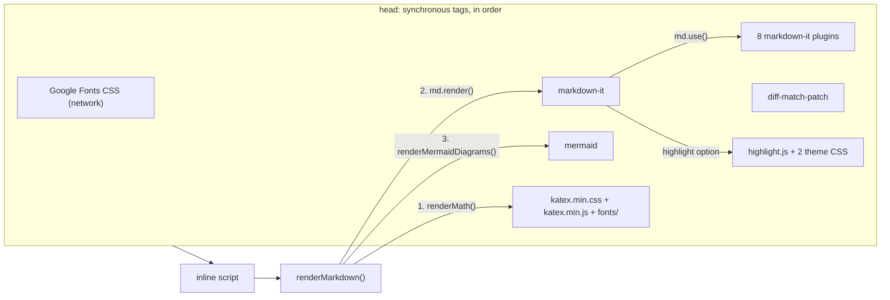

# Dependencies

`markdown-viewer.html` has no build step and no package manager. Every library it uses is a
pre-built browser file copied into [`vendor/`](../vendor) and loaded with a plain relative
`<script>` or `<link>` tag. The only thing fetched from the network at startup is the web fonts
from Google Fonts.

This page records exactly what is vendored, how each file was identified, how the viewer loads
and uses it, what breaks if it is missing, and how to upgrade it. Licence texts are in
[`../THIRD_PARTY_NOTICES.md`](../THIRD_PARTY_NOTICES.md).

Related: [architecture.md](architecture.md) · [rendering.md](rendering.md) ·
[features.md](features.md) · [roadmap.md](roadmap.md) · [legacy-viewer.md](legacy-viewer.md)

---

## 1. Inventory of `vendor/`

All versions below were established by **byte comparison**: the SHA-256 of each vendored file was
compared with the same file fetched from the published npm package on cdn.jsdelivr.net (or, for
diff-match-patch, from the upstream GitHub repository). "Identical" means the hashes match exactly.

| File | Library | Version | Licence | Size (bytes) | How the version was established |
|---|---|---|---|---:|---|
| `markdown-it.min.js` | [markdown-it](https://github.com/markdown-it/markdown-it) | 14.1.0 | MIT | 123,618 | Banner `markdown-it 14.1.0`; identical to `markdown-it@14.1.0/dist/markdown-it.min.js` |
| `markdown-it-anchor.umd.js` | [markdown-it-anchor](https://github.com/valeriangalliat/markdown-it-anchor) | 9.1.0 or 9.2.0 (see note A) | Unlicense | 6,687 | No banner. Identical to `dist/markdownItAnchor.umd.js` of **both** 9.1.0 and 9.2.0; differs from 8.6.7, 9.0.0, 9.0.1, 9.0.2, 9.2.1 and 10.0.0 |
| `markdown-it-task-lists.min.js` | [markdown-it-task-lists](https://github.com/revin/markdown-it-task-lists) | 2.1.1 (see note B) | ISC | 2,702 | Banner says `2.1.0`, but the file is identical to `markdown-it-task-lists@2.1.1/dist/markdown-it-task-lists.min.js` and differs from the 2.1.0 file |
| `markdown-it-footnote.min.js` | [markdown-it-footnote](https://github.com/markdown-it/markdown-it-footnote) | 4.0.0 | MIT | 5,624 | Banner; identical to npm 4.0.0 dist |
| `markdown-it-mark.min.js` | [markdown-it-mark](https://github.com/markdown-it/markdown-it-mark) | 4.0.0 | MIT | 1,621 | Banner; identical to npm 4.0.0 dist |
| `markdown-it-sub.min.js` | [markdown-it-sub](https://github.com/markdown-it/markdown-it-sub) | 2.0.0 | MIT | 967 | Banner; identical to npm 2.0.0 dist |
| `markdown-it-sup.min.js` | [markdown-it-sup](https://github.com/markdown-it/markdown-it-sup) | 2.0.0 | MIT | 965 | Banner; identical to npm 2.0.0 dist |
| `markdown-it-deflist.min.js` | [markdown-it-deflist](https://github.com/markdown-it/markdown-it-deflist) | 3.0.0 | MIT | 2,249 | Banner; identical to npm 3.0.0 dist |
| `markdown-it-abbr.min.js` | [markdown-it-abbr](https://github.com/markdown-it/markdown-it-abbr) | 2.0.0 | MIT | 2,419 | Banner; identical to npm 2.0.0 dist |
| `diff-match-patch.js` | [diff-match-patch](https://github.com/google/diff-match-patch) (Google, JavaScript port, uncompressed) | No release version; upstream `master`, last commit to the file `62f2e689` (2019-07-25) (see note C) | Apache-2.0 | 78,511 | Header `Copyright 2018 The diff-match-patch Authors`; identical to `javascript/diff_match_patch_uncompressed.js` on `master`. **Not** the npm package `diff-match-patch@1.0.5` (a different repackaging; hash differs) |
| `highlight.min.js` | [highlight.js](https://github.com/highlightjs/highlight.js) | 11.10.0 (git `366a8bd012`) | BSD-3-Clause | 124,980 | Banner; identical to `@highlightjs/cdn-assets@11.10.0/highlight.min.js` (the standard "common" build, 36 languages, listed below) |
| `github.min.css` | highlight.js theme "GitHub" | 11.10.0 | BSD-3-Clause | 1,309 | Identical to `@highlightjs/cdn-assets@11.10.0/styles/github.min.css` |
| `github-dark.min.css` | highlight.js theme "GitHub Dark" | 11.10.0 | BSD-3-Clause | 1,315 | Identical to `@highlightjs/cdn-assets@11.10.0/styles/github-dark.min.css` |
| `mermaid.min.js` | [Mermaid](https://github.com/mermaid-js/mermaid) | 11.4.1 | MIT (bundles third-party code, see §1.2) | 2,571,900 | Internal string `dx="11.4.1"` returned by mermaid's `getVersion`; identical to `mermaid@11.4.1/dist/mermaid.min.js` |
| `katex.min.js` | [KaTeX](https://github.com/KaTeX/KaTeX) | 0.16.11 | MIT | 275,414 | Internal `version:"0.16.11"`; identical to `katex@0.16.11/dist/katex.min.js` |
| `katex.min.css` | KaTeX stylesheet | 0.16.11 | MIT | 23,335 | Identical to `katex@0.16.11/dist/katex.min.css` |
| `purify.min.js` | [DOMPurify](https://github.com/cure53/DOMPurify) | 3.4.16 | MPL-2.0 OR Apache-2.0 | 28,885 | Banner `@license DOMPurify 3.4.16`; identical (SHA-256 `2c90a9b4…`) to `package/dist/purify.min.js` in the npm registry tarball `dompurify-3.4.16.tgz` |
| `fonts/KaTeX_*.woff2` (20 files) | KaTeX math fonts | 0.16.11 | MIT | 259,792 total | All 20 files identical to `katex@0.16.11/dist/fonts/<name>.woff2` |

Total size of `vendor/` (all 36 files): 3,483,408 bytes (about 3.3 MiB). Mermaid alone is about
74% of it.

The 20 KaTeX font files are: `AMS-Regular`, `Caligraphic-Bold`, `Caligraphic-Regular`,
`Fraktur-Bold`, `Fraktur-Regular`, `Main-Bold`, `Main-BoldItalic`, `Main-Italic`, `Main-Regular`,
`Math-BoldItalic`, `Math-Italic`, `SansSerif-Bold`, `SansSerif-Italic`, `SansSerif-Regular`,
`Script-Regular`, `Size1-Regular`, `Size2-Regular`, `Size3-Regular`, `Size4-Regular`,
`Typewriter-Regular` (each prefixed `KaTeX_`, each `.woff2`).

**Note A — markdown-it-anchor.** The published UMD file did not change between 9.1.0 and 9.2.0,
so the bytes cannot tell the two apart. Treat the version as "9.1.0 or 9.2.0"; either way the API
the viewer uses (`markdownItAnchor.permalink.ariaHidden`) is present.

**Note B — markdown-it-task-lists.** Upstream did not update the banner when it released 2.1.1,
so the 2.1.1 dist file still says `2.1.0`. The file here is the 2.1.1 one. 2.1.1 (2018-03-06) is
also the newest release on npm.

**Note C — diff-match-patch.** The Google repository has no tagged releases and is archived. The
vendored file equals the current `master` copy; the most recent commit that touched that file is
`62f2e689f498f9c92dbc588c58750addec9b1654` ("Fix JSDoc for optional params", 2019-07-25).

### 1.1 What the highlight.js build contains

`hljs.listLanguages()` on the vendored file returns 36 languages: bash, c, cpp, csharp, css, diff,
go, graphql, ini, java, javascript, json, kotlin, less, lua, makefile, markdown, objectivec, perl,
php, php-template, plaintext, python, python-repl, r, ruby, rust, scss, shell, sql, swift,
typescript, vbnet, wasm, xml, yaml. Their aliases (for example `js`, `ts`, `sh`, `html`, `yml`)
also resolve. A fenced block whose language is not in this list is shown unhighlighted (see §2).

### 1.2 Code bundled inside `mermaid.min.js`

`mermaid.min.js` is an esbuild bundle. It contains Mermaid itself plus copies of its runtime
dependencies. Version strings found inside it can belong to those bundled libraries, not to
Mermaid: for example it contains its **own copy of KaTeX 0.16.11** (`version:"0.16.11"`) that is
separate from `vendor/katex.min.js`, and its trailing licence block names **DOMPurify 3.2.1** and
**js-yaml 4.1.0**.

Mermaid 11.4.1 declares these runtime dependencies in its `package.json` (licences as declared on
npm or, for khroma, on its GitHub repository). The exact versions that ended up in the bundle are
**not determined** except where noted.

| Dependency | Declared range | Licence | Version found in bundle |
|---|---|---|---|
| @braintree/sanitize-url | ^7.0.1 | MIT | not determined |
| @iconify/utils | ^2.1.32 | MIT | not determined |
| @mermaid-js/parser | ^0.3.0 | MIT | not determined |
| cytoscape | ^3.29.2 | MIT | not determined |
| cytoscape-cose-bilkent | ^4.1.0 | MIT | not determined |
| cytoscape-fcose | ^2.2.0 | MIT | not determined |
| d3 | ^7.9.0 | ISC | not determined |
| d3-sankey | ^0.12.3 | BSD-3-Clause | not determined |
| dagre-d3-es | 7.0.11 | MIT | 7.0.11 (implied by the exact pin in `package.json`; no version string for it appears in the bundle) |
| dayjs | ^1.11.10 | MIT | not determined |
| dompurify | ^3.2.1 | MPL-2.0 OR Apache-2.0 | 3.2.1 (licence banner) |
| katex | ^0.16.9 | MIT | 0.16.11 (`version:` string) |
| khroma | ^2.1.0 | MIT | not determined |
| lodash-es | ^4.17.21 | MIT | not determined |
| marked | ^13.0.2 | MIT | not determined |
| roughjs | ^4.6.6 | MIT | not determined |
| stylis | ^4.3.1 | MIT | not determined |
| ts-dedent | ^2.2.0 | MIT | not determined |
| uuid | ^9.0.1 | MIT | not determined |

(`@types/d3` is also listed as a dependency but contains only type declarations.) Other code is
bundled too and is not enumerated here: for example the individual `d3-*` packages, the parser's
own dependency `langium`, and `js-yaml` (named in the licence trailer, although it is not among
mermaid@11.4.1's declared runtime dependencies on npm).

---

## 2. How `markdown-viewer.html` loads each dependency

All tags are in `<head>`, in this order, as of the initial import. None uses `async` or `defer`,
so every script is downloaded, parsed and executed before the page body and before the viewer's
single inline `<script>` runs. Because each library only defines a global and does not touch the
others at load time, the relative order of the vendor tags does not matter; what matters is that
all of them come before the inline script (inferred; each UMD file was checked to create only its
own global when executed on its own).

| # | Tag | Global it defines | Used by (function / code) | Feature | If it fails to load |
|---|---|---|---|---|---|
| 1 | `<link>` Google Fonts CSS | — | CSS custom properties `--font-reading`, `--font-ui`, `--font-mono` | Typography | Fallback fonts from the same property (Charter/Georgia, system UI, Fira Code/Consolas) |
| 2 | `<script src="vendor/markdown-it.min.js">` | `markdownit` | `const md = window.markdownit({ html: true, linkify: true, typographer: true, highlight })` at the top of the inline script; `md.render` in `renderMarkdown` | All Markdown rendering | Not guarded. `window.markdownit(...)` throws, the inline script stops at that statement, and nothing renders (inferred from script order) |
| 3 | `markdown-it-anchor.umd.js` | `markdownItAnchor` | `md.use(window.markdownItAnchor, { permalink: markdownItAnchor.permalink.ariaHidden({ placement: 'after', symbol: '#', class: 'header-anchor' }), slugify })` | Heading ids, `#` permalinks, link targets for the outline | Guarded by `if (window.markdownItAnchor)`. Headings get no slug ids or `#` link; `buildToc` then assigns fallback ids `heading-<n>` |
| 4 | `markdown-it-task-lists.min.js` | `markdownitTaskLists` | `if (window.markdownitTaskLists) md.use(window.markdownitTaskLists, { enabled: true, label: true })` | Checkbox task lists (`li.task-list-item` with an enabled checkbox inside a `<label>`) | Guarded; task items render as plain list items with literal `[ ]` / `[x]` text and the `.task-list-item` CSS goes unused |
| 5 | `markdown-it-footnote.min.js` | `markdownitFootnote` | `md.use(window.markdownitFootnote)` | `[^1]` footnotes | Guarded; footnote syntax shows as literal text |
| 6 | `markdown-it-mark.min.js` | `markdownitMark` | `md.use(window.markdownitMark)` | `==highlight==` | Guarded; literal text |
| 7 | `markdown-it-sub.min.js` | `markdownitSub` | `md.use(window.markdownitSub)` | `H~2~O` | Guarded; literal text |
| 8 | `markdown-it-sup.min.js` | `markdownitSup` | `md.use(window.markdownitSup)` | `x^2^` | Guarded; literal text |
| 9 | `markdown-it-deflist.min.js` | `markdownitDeflist` | `md.use(window.markdownitDeflist)` | Definition lists | Guarded; terms and `:` lines render as paragraphs |
| 10 | `markdown-it-abbr.min.js` | `markdownitAbbr` | `md.use(window.markdownitAbbr)` | `*[HTML]: ...` abbreviations | Guarded; definitions show as text, no `<abbr>` |
| 11 | `diff-match-patch.js` | `diff_match_patch`, `DIFF_DELETE`, `DIFF_INSERT`, `DIFF_EQUAL` | **Nothing, since 2026-10-10.** It served `mdvResolveAnchor`, a fuzzy comment resolver that was never called and has been removed; comments are placed by marker id and block number (see [commenting.md](commenting.md#resolving-an-anchor)) | None | None. The `<script>` tag can be removed, together with this file and its notice |
| 12 | `<link id="hljs-light" href="vendor/github.min.css">` | — | `setTheme` sets `disabled = (theme === 'dark')` | Code colours, light theme | Code is uncoloured in light theme |
| 13 | `<link id="hljs-dark" href="vendor/github-dark.min.css" disabled>` | — | `setTheme` sets `disabled = (theme !== 'dark')` | Code colours, dark theme | Code is uncoloured in dark theme |
| 14 | `highlight.min.js` | `hljs` | The `highlight(str, lang)` option passed to `markdownit`: `hljs.getLanguage(lang)` then `hljs.highlight(str, { language: lang })` | Syntax highlighting | Guarded by `typeof hljs !== 'undefined'`; code is HTML-escaped and shown plain. No auto-detection is used, so an unknown or missing language is also shown plain |
| 15 | `mermaid.min.js` | `mermaid` (set by the bundle's last line, `globalThis.mermaid = ...`) | `renderMermaidDiagrams`: `mermaid.initialize({ startOnLoad: false, theme, securityLevel: 'loose' })`, which `mdvPinMermaidSecurity` (`js/render.js`) turns into `'strict'` on every call, then `mermaid.render(id + '-svg', code)`; `setTheme` calls it again 100 ms after a theme change, but it only selects `.mermaid:not(.rendered)`, so diagrams already drawn are not re-rendered (see §5). The fence override (`md.renderer.rules.fence`) emits `<pre class="mermaid">` for ` ```mermaid ` blocks. `openDiagramOverlay` and `setupMermaidClickToSection` work on the rendered SVG | Diagrams, expand overlay, click-a-node-to-jump | Guarded by `typeof mermaid === 'undefined'` (returns early). Diagram source stays visible as escaped text inside `pre.mermaid` |
| 16 | `<link href="vendor/katex.min.css">` | — | Styles the HTML that KaTeX emits; loads `fonts/*.woff2` via relative `url(fonts/...)` | Math layout | Math renders incorrectly laid out (inferred: KaTeX output depends on this CSS) |
| 17 | `katex.min.js` | `katex` | `mdvTypeset` in `js/math.js`: `katex.renderToString(tex, { displayMode, throwOnError: false })`, called by the math rules while markdown-it renders | Math | Guarded; the TeX is shown as `code.mdv-math-source`, delimiters included, and the missing-library notice names Math |
| 18 | `purify.min.js` | `DOMPurify` | `mdvPurifier = DOMPurify(window)` and `mdvSanitize` in `js/render.js`, over the dashboard plus `md.render` output | Sanitizing everything rendered from a document (see [rendering.md](rendering.md#security-posture)) | Guarded; markdown-it switches to `html: false`, so raw HTML is shown as text, and the missing-library notice says so |



### 2.1 What KaTeX's CSS references but is not vendored

`katex.min.css` lists three sources per font face: `.woff2`, `.woff`, `.ttf`. Only the `.woff2`
files are vendored. Browsers that support WOFF2 (all current major browsers) use the first source
and never request the others. A browser without WOFF2 support would fail to load the math fonts
(inferred from the CSS `src` lists).

### 2.2 Load cost

Because no tag is deferred, the full 2.5 MB Mermaid bundle is parsed on every page load, even
for documents without diagrams. This is a startup cost, not a correctness issue; lazy-loading
Mermaid only when a ` ```mermaid ` block exists is a possible future optimisation (see
[roadmap.md](roadmap.md)).

---

## 3. The external network dependency: Google Fonts

The `<head>` contains, as of the initial import:

```html
<link rel="preconnect" href="https://fonts.googleapis.com">
<link rel="preconnect" href="https://fonts.gstatic.com" crossorigin>
<link href="https://fonts.googleapis.com/css2?family=Inter:wght@400;500;600;700&family=Literata:ital,opsz,wght@0,7..72,400;0,7..72,500;0,7..72,600;0,7..72,700;1,7..72,400;1,7..72,500&family=JetBrains+Mono:wght@400;500&display=swap" rel="stylesheet">
```

| Family | Used as | Requested styles | Fallback stack (from CSS) |
|---|---|---|---|
| Literata | `--font-reading` (document body text) | Roman weights 400, 500, 600, 700; italic 400, 500; optical size axis 7–72 | `'Charter', 'Georgia', serif` |
| Inter | `--font-ui` (toolbar, panels and other UI chrome) | 400, 500, 600, 700 | `-apple-system, BlinkMacSystemFont, 'Segoe UI', sans-serif` |
| JetBrains Mono | `--font-mono` (code) | 400, 500 | `'Fira Code', 'Consolas', monospace` |

`display=swap` means text is shown immediately in the fallback font and swapped when the web font
arrives. Offline, the fallbacks are used and the viewer otherwise works normally.

**Privacy implication.** Opening the viewer makes the browser request the CSS from
`fonts.googleapis.com` and font files from `fonts.gstatic.com`. Those requests reveal the user's IP
address, user agent and the time of use to Google. They do not send the document's content. The
HTML comment above the tag describes this as "the one external dependency (fonts only, no JS)".

**How to vendor the fonts later.** All three families are published under the SIL Open Font
Licence 1.1 (inferred; confirm on each family's Google Fonts page before vendoring). To remove the
network request:

1. Download the WOFF2 files for exactly the weights and styles above (Literata is a variable font,
   so one roman and one italic variable file may cover all requested weights).
2. Put them in, for example, `vendor/fonts/` next to the KaTeX fonts, using distinct file names.
3. Replace the three `<link>` tags with local `@font-face` rules (in the page `<style>` or a new
   `vendor/fonts.css`) that keep the family names `Inter`, `Literata`, `JetBrains Mono`, so the CSS
   custom properties need no change.
4. Add each family's OFL text and copyright line to `../THIRD_PARTY_NOTICES.md`.
5. Re-test reading text, italics, code blocks, the UI chrome, and the size steps in both themes.

### 3.1 Other network activity (not dependencies)

- **Document content.** Remote images or other resources referenced by the Markdown being viewed
  are fetched by the browser as usual (inferred from standard browser behaviour; the viewer does
  not proxy or block them).
- **`?file=` loading.** When served over `http(s)`, `loadFromUrl` calls `fetch(p)` with the
  `file` parameter as given, then with it prefixed by the `mdv-basepath` localStorage value. A
  relative path is a request to the same server that serves the viewer. A full URL in `?file=` is
  passed to `fetch` unchanged, so it would be requested from wherever it points, subject to CORS
  (inferred from `fetch` semantics; not tested).
- **Read-aloud.** Uses the browser's `speechSynthesis`. Some browser-provided voices may be
  network-backed (unverified; depends on the browser and voice), see [read-aloud.md](read-aloud.md).

---

## 4. Upgrading a vendored library safely

General procedure for any file:

1. Download the exact file from the published npm package (cdn.jsdelivr.net/npm/`<pkg>@<version>`/...
   or unpkg.com) and replace the file in `vendor/` under the **same name** (or update the tag).
2. Record the new version, size and SHA-256 in §1 of this page.
3. Update the licence entry in [`../THIRD_PARTY_NOTICES.md`](../THIRD_PARTY_NOTICES.md) if the
   copyright line or licence changed.
4. Open [`../samples/kitchen-sink.md`](../samples/kitchen-sink.md) and
   [`../samples/commented.md`](../samples/commented.md) in both themes and check the items below.
5. Check the browser console for errors and for warnings logged by `renderMarkdown`'s
   post-processing `try/catch` blocks (`console.warn('<step>:', e)`).

Newest versions on npm were checked on 2026-10-04; they are listed only to show the gap and have
**not** been tested with the viewer.

| Library | Vendored | Newest on npm (2026-10-04) | What to check after upgrading |
|---|---|---|---|
| markdown-it | 14.1.0 | 15.0.2 | Major version: confirm the browser dist still exists and still defines the global `markdownit`; options `html`, `linkify`, `typographer`; the `highlight` callback contract (see §5, the output is currently wrapped in `<pre><code>`); `md.renderer.rules.fence` override for Mermaid; `md.utils.escapeHtml`; every plugin still loads (`md.use`). Re-test headings, tables, lists, links, raw HTML, code blocks, Mermaid blocks, comments anchoring |
| markdown-it-anchor | 9.1.0/9.2.0 | 10.0.0 | Major version: global name `markdownItAnchor`, the `permalink.ariaHidden` API and its options, `slugify` option. Re-test outline links, heading `#` links, `#hash` navigation, scroll spy |
| markdown-it-task-lists | 2.1.1 | 2.1.1 | No newer release. If ever replaced, keep the global name `markdownitTaskLists` that the guard checks and the `enabled` / `label` options. Re-test `- [ ]` / `- [x]` items |
| markdown-it-footnote / mark / sub / sup / abbr | 4.0.0 / 4.0.0 / 2.0.0 / 2.0.0 / 2.0.0 | same | Nothing newer. Global names must match the `if (window.markdownitX)` guards exactly |
| markdown-it-deflist | 3.0.0 | 4.0.0 | Major version: global name `markdownitDeflist`; definition list markup and CSS |
| highlight.js + themes | 11.10.0 | 11.12.0 | Use `@highlightjs/cdn-assets` (same "common" build) or build a custom bundle if more languages are wanted; upgrade `highlight.min.js` and both theme CSS files **together**; keep the `<link>` ids `hljs-light` / `hljs-dark` that `setTheme` toggles. Re-test code blocks in both themes and the Copy button |
| mermaid | 11.4.1 | 12.1.0 | Major version: global `mermaid`, `initialize({ startOnLoad: false, theme, securityLevel })` with the level pinned to `'strict'` by `mdvPinMermaidSecurity` (re-run `security.spec.mjs`, whose Mermaid tests check the pin, `click` directives and `%%{init}%%` directives), the promise result `{ svg }` of `mermaid.render(id, code)`; SVG structure used by `setupMermaidClickToSection` (selectors `.node`, `.nodeLabel`, `g[id]`) and `openDiagramOverlay`; behaviour on theme switch (§5). Re-test every diagram type in the samples, error display for invalid diagrams, expand overlay, node click-to-section, dark theme |
| KaTeX (js + css + fonts) | 0.16.11 | 0.19.0 | Upgrade `katex.min.js`, `katex.min.css` **and the whole `fonts/` set** from the same version, since the CSS names the font files. Re-test inline and display math, invalid math (with `throwOnError: false` KaTeX renders the offending source instead of throwing), both themes |
| diff-match-patch | `master` (2019) | upstream archived | No upstream changes expected. Only `match_main` with `Match_Threshold` and `Match_Distance` is used |
| DOMPurify | 3.4.16 | not checked (vendored 2026-10-10) | Global `DOMPurify` and `isSupported`; the hooks `beforeSanitizeElements` (must still run before the `SAFE_FOR_XML` checks) and `uponSanitizeAttribute` (with `forceKeepAttr`); `FORBID_ATTR`, `FORCE_BODY` and `RETURN_DOM_FRAGMENT`. Re-run `security.spec.mjs` (hostile, press-the-buttons, comments-with-markup) and `render-correctness.spec.mjs` |

---

## 5. Known integration issues found while documenting

These are recorded here for the next maintainer; they are not fixed.

1. **Theme switch does not re-theme existing diagrams.** `setTheme` schedules
   `renderMermaidDiagrams` 100 ms later, but that function selects only
   `.mermaid:not(.rendered)` and marks each diagram `rendered` after drawing it. Diagrams already
   on the page therefore keep the Mermaid theme (`default` or `dark`) they were first drawn with
   until the document is rendered again (read from the code; not tested in a browser).
2. **Nested `<code>` in code blocks.** The `highlight` option returns
   `<div class="code-header">…</div><code class="hljs …">…</code>`. markdown-it wraps any highlight
   output that does not start with `<pre` in `<pre><code class="language-…">…</code></pre>`, so the
   final markup is `<pre><code><div class="code-header">…</div><code class="hljs">…</code></code></pre>`
   (verified by running the vendored markdown-it in Node). Browsers tolerate it, but it is invalid
   nesting.
3. ~~**Math pre-processing runs on the raw source.**~~ Fixed: math is a markdown-it rule
   (`js/math.js`) with Pandoc's dollar rules, so it never applies inside code, and two prices on
   one line stay text (see [rendering.md](rendering.md#math-katex)).
4. **Two copies of KaTeX are loaded.** `mermaid.min.js` bundles its own KaTeX 0.16.11 in addition
   to `vendor/katex.min.js`. Harmless, but part of the bundle weight.

---

## 6. The legacy viewer's dependencies

[`legacy/md_viewer.html`](../legacy/md_viewer.html) (see [legacy-viewer.md](legacy-viewer.md))
does **not** use `vendor/`. It loads everything from public CDNs, so it needs a network connection.

| Library | Exact URL | Version | Tag attributes |
|---|---|---|---|
| highlight.js theme | `https://cdnjs.cloudflare.com/ajax/libs/highlight.js/11.9.0/styles/github.min.css` | 11.9.0 | `<link rel="stylesheet">` |
| DOMPurify | `https://cdnjs.cloudflare.com/ajax/libs/dompurify/3.1.7/purify.min.js` | 3.1.7 | `<script defer>` |
| marked | `https://cdnjs.cloudflare.com/ajax/libs/marked/12.0.2/marked.min.js` | 12.0.2 | `<script defer>` |
| highlight.js | `https://cdnjs.cloudflare.com/ajax/libs/highlight.js/11.9.0/highlight.min.js` | 11.9.0 | `<script defer>` |
| Mermaid | `https://cdn.jsdelivr.net/npm/mermaid@10/dist/mermaid.min.js` | **floating `10.x`**: resolves to whatever the newest 10.x release is at fetch time | `<script defer>` |

Notes, from reading the file:

- None of the tags carries an `integrity` (Subresource Integrity) attribute, so the browser does
  not verify the downloaded bytes.
- The app code runs in a `window.addEventListener('load', ...)` handler and calls `marked.parse`,
  `DOMPurify.sanitize`, `hljs.highlight` and `mermaid.render` without `typeof` guards, so if a CDN
  is unreachable the viewer fails rather than degrading (inferred from the absence of guards).
- Unlike the main viewer, the legacy viewer sanitises rendered HTML with DOMPurify. The main
  viewer runs markdown-it with `html: true` and has no sanitiser, so raw HTML in a document is
  rendered as-is (see [rendering.md](rendering.md)).
