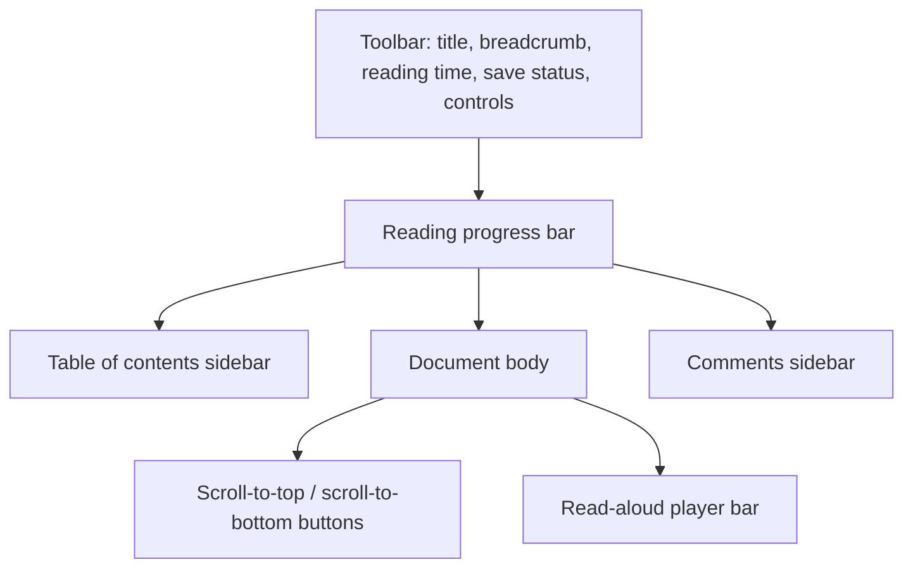
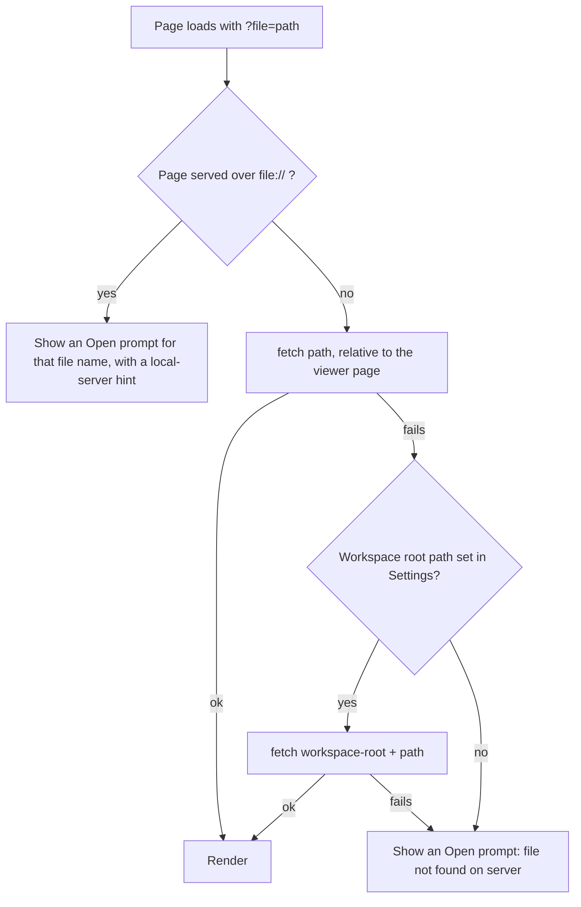

# Features

This is the user-facing reference for `markdown-viewer.html`: every control, panel and overlay, what each one does, and the function that implements it. It describes the code as of the initial import. Behaviour I inferred rather than read is marked *(inferred)*. Behaviour I could not confirm is marked *(unverified)*.

Related documents:

- [rendering.md](rendering.md): how markdown becomes HTML (markdown-it, plugins, KaTeX, Mermaid, highlight.js).
- [read-aloud.md](read-aloud.md): the text-to-speech player in detail.
- [commenting.md](commenting.md): threaded comments stored inside the markdown file.
- [architecture.md](architecture.md): how the single file is organised.
- [visualization-catalog.md](visualization-catalog.md): which diagram and visual types render.
- [authoring-guide.md](authoring-guide.md): how to write markdown that uses these features.
- [roadmap.md](roadmap.md): planned work, including fixes for the limitations listed at the end of this page.

> [!WARNING]
> Open only files you trust. The viewer renders raw HTML that is embedded in markdown (`markdown-it` is created with `html: true`), and Mermaid runs with `securityLevel: 'loose'`. A hostile file can run script inside the viewer page *(inferred)*.

---

## Screen layout



Before a document is loaded, the body shows a welcome screen with a drop zone, a **Browse files** button and a hint that you can paste markdown. Several toolbar buttons stay hidden until a document has rendered: fold-all, links panel, read aloud and comments.

### Toolbar controls, left to right

| Control | Tooltip | What it does | Implementing function |
|---|---|---|---|
| Title | — | Shows the file name. | `renderMarkdown` |
| Breadcrumb | — | Shows the file path if the title contains `/`. When you scroll, it shows the current heading. Hidden at 900 px wide or less. | `renderMarkdown`, `setupScrollSpy` |
| Reading meta | — | Word count and estimated minutes at 230 words per minute. Hidden at 900 px wide or less. | `renderMarkdown` |
| Save status | — | Comment save state, for example "Saving…", "Saved ✓" or a call to set a save location. | `mdvSetStatus` |
| `A−` / size label / `A+` | Smaller text / Larger text | Five reading sizes. | `changeFontSize`, `applyFontSize` |
| Width icon | Toggle page width | Switches between a narrow reading column and full width. | `toggleWidth` |
| Contents icon | Table of contents (Ctrl+B) | Shows or hides the table of contents. | `toggleToc` |
| Chevron icon | Fold/Unfold sections | Collapses or expands every section. Shown after a document loads. | `toggleAllSections` |
| Focus icon | Focus mode | Dims everything except the block under the pointer. | `toggleFocus` |
| **Search** | Search (Ctrl+K) | Opens the search overlay. | `openSearch` |
| Link icon | All links | Opens the links panel. Shown after a document loads. | `toggleLinksPanel` |
| **Listen** | Read aloud | Opens the read-aloud player. Shown after a document loads. | `ttsToggle` |
| Speech-bubble icon with a badge | Comments (Ctrl+Shift+C) | Opens the comments sidebar. The badge counts open (unresolved) threads. Shown after a document loads. | `mdvToggleSidebar`, `mdvRenderSidebar` |
| File-plus icon | Open .md / set save location (Chromium) | Opens a file with write access. If a file is already loaded without a save location, asks where to save instead. | `mdvOpenOrSetSaveLocation` |
| Folder icon | Set workspace folder | Asks once for a folder. Files from that folder can then be saved without further prompts. | `mdvPickWorkspace` |
| Sun icon | Theme | Dropdown with Light, Sepia and Dark. | `toggleDropdown`, `setTheme` |
| Gear icon | Settings | Opens the settings panel (workspace root path). | `toggleSettings` |
| **Open** | Open file | Opens a read-only file picker. | `handleFileInput`, `readFile` |

---

## Opening documents

There are seven ways to get a document into the viewer. They differ in one important way: whether the viewer gets a **writable file handle**. Comments can be saved back to the file only when it has one (see [commenting.md](commenting.md)).

| Method | How | Writable? | Implementing function |
|---|---|---|---|
| **Open** button or `Ctrl/Cmd+O` | Hidden `<input type="file">` that accepts `text/*`, `.md`, `.markdown` and `.mdx` | No. If a workspace folder is set and holds a file with the same name, the viewer links to that file. | `handleFileInput`, `readFile`, `mdvTryWorkspaceMatch` |
| Drag and drop | Drop a file anywhere on the page. Only `.md`, `.markdown`, `.mdx`, `.txt` and `.text` are accepted. | No, apart from the same workspace-folder match | `document.body` `drop` listener, `readFile` |
| Paste | Paste more than 10 characters of text anywhere (except while search is open) | No | `document` `paste` listener |
| `?file=` URL parameter | `markdown-viewer.html?file=path/to/doc.md` | No | `loadFromUrl` |
| `#demo` URL hash | `markdown-viewer.html#demo` with no `?file=` loads a built-in demo document | No | `loadFromUrl`, `loadDemo` |
| Writable open (file-plus icon) | File System Access picker for `.md`, `.markdown` and `.txt` | Yes (Chromium only) | `mdvPickFile`, `mdvOpenWithHandle` |
| Automatic reopen | When the page loads, it reopens the last file opened with write access. The `load` listener checks for read permission, then `mdvOpenWithHandle` asks for read-write permission if it is not already granted. Without a user gesture that request is expected to fail silently, so in practice the reopen happens only while read-write access is still granted *(inferred)* | Yes | `load` listener using `mdvGetHandle('current')`, `mdvOpenWithHandle` |

After a file is opened with the Open button or by drag and drop, the viewer rewrites the address bar to `?file=<name>` and sets the tab title to `<name> - Markdown Viewer` (`updateUrl`). A paste uses the fixed name `pasted`. Only the file name is used, so reloading that address loads the file only if a server can supply it under that name.

### How `?file=` is resolved



Implemented by `loadFromUrl`.

- **The `file://` limitation.** Browsers do not let a page opened from disk `fetch` other files on disk. When the viewer is opened as a `file://` URL, `?file=` cannot load anything. The viewer instead shows a drop zone titled "Open: *name*", a **Browse to *name*** button, and a suggestion to serve the folder with `python3 -m http.server 8080 --bind 127.0.0.1`.
- **Workspace Root Path** (Settings) is a **URL prefix** that is tried second. Despite the placeholder `/path/to/your/workspace/`, it is not a filesystem path. It is joined to the `?file=` value and fetched from the same server, so it helps only if the server exposes that path *(inferred from `loadFromUrl`)*. `saveBasePath` adds a trailing `/` if it is missing. The setting is stored in `localStorage` under `mdv-basepath`.
- When a file loads through `?file=` or the writable open, the tab title is not updated: `loadFromUrl` and `mdvOpenWithHandle` do not call `updateUrl`.

### Linking a file to a save location

These two buttons only matter for comments:

- **File-plus icon** (`mdvOpenOrSetSaveLocation`). With no document loaded, it opens a writable file. With a document that has no writable handle (opened with Open, by drag and drop, by paste or through `?file=`), it opens a **Save As** dialog so future saves go to the file you choose, then saves straight away.
- **Folder icon** (`mdvPickWorkspace`). You pick a folder once with read-write permission. The handle is stored in IndexedDB (`mdv-viewer` database, `handles` store, key `workspace`). Later, when you open a file whose name matches a file at the top level of that folder, the viewer links to it with no prompt (`mdvTryWorkspaceMatch` uses `getFileHandle(filename)`, so subfolders are not searched).

---

## What happens when a document renders

`renderMarkdown` runs the same pipeline for every opening method:

1. Strip YAML frontmatter (`parseFrontmatter`) and build the [frontmatter dashboard](#frontmatter-dashboard).
2. Collect `<!-- narrate: ... -->` comments for read-aloud (`extractNarrations`).
3. Replace math between dollar signs with KaTeX output (`renderMath`).
4. Render with markdown-it and its plugins.
5. Post-process. Each step is wrapped so one failure does not block the rest. In order: callouts, section toggles, table of contents, section minimap, search index, read-aloud sections, Mermaid diagrams, scroll spy, image lightbox, link enhancement, abbreviation tooltips, diagram click-to-jump.
6. Reset the fold-all state and scroll to the top.

The commenting layer wraps `renderMarkdown`. It reads the `MDV-COMMENTS` block first, then attaches the right-click menu and the comments sidebar 50 ms after rendering. See [rendering.md](rendering.md) for the markdown details.

---

## Reading aids

### Table of contents

- **Built by** `buildToc`. It lists every H1–H6 in the document. H1 and H2 entries share one indent; H3–H6 are indented progressively further (CSS on `.toc-link[data-level]`). A heading without an `id` gets one (`heading-<n>`).
- **Click an entry** to scroll smoothly to that heading. On narrow screens the overlay also closes.
- **Toggle** with the toolbar button or `Ctrl/Cmd+B` (`toggleToc`). Wider than 900 px, the sidebar hides and the content takes the full width. At 900 px or less, the sidebar is off-canvas and the toggle slides it in as an overlay.
- **No headings:** the sidebar is hidden and the content uses the full width. `buildToc` never removes that state, so a document with headings opened afterwards also starts with the sidebar hidden. Because `tocVisible` is still `true`, the first toggle keeps it hidden and the second shows it (wider than 900 px).
- **Not remembered** between page loads.

### Scroll spy and breadcrumb

`setupScrollSpy` uses an `IntersectionObserver` that watches a band near the top of the viewport (root margin `-80px 0px -70% 0px`). When a heading enters that band:

- its table-of-contents entry is highlighted and scrolled into view;
- the toolbar breadcrumb changes to that heading's text.

### Section minimap

`buildSectionMinimap` adds a row of buttons, one per H2, but **only when the document has three or more H2 headings**.

- It sits directly after the frontmatter dashboard if there is one. Otherwise it sits after the first H1, or at the top.
- Clicking a segment scrolls to that H2.
- The segment for the H2 currently in view is highlighted, using the same observer band as the scroll spy.

### Collapsing and expanding sections

- **Per section** (`addSectionToggles`, `toggleSection`). Every H1–H4 gets a chevron button at its start. The content after the heading, up to the next heading of the same or a higher level, is wrapped in a collapsible container. A heading with no content after it keeps a hidden, inactive chevron.
- **All sections** (`toggleAllSections`). The toolbar chevron or `Ctrl/Cmd+Shift+F` collapses or expands every section at once. Each new render starts with everything expanded.
- H5 and H6 cannot be collapsed separately. Their content folds with the nearest H1–H4 above them.

### Focus mode

`toggleFocus` toggles the `focus-mode` class on `<body>`. Its CSS:

- dims every block in the document to 30% opacity;
- returns the block under the mouse pointer to full opacity, along with the block being read aloud (`.tts-active`);
- leaves top-level headings at full opacity. Headings nested inside a section container are dimmed like other blocks *(inferred from the CSS selectors)*.

Toggle with the toolbar button or `Ctrl/Cmd+.`. Focus mode is not remembered.

### Page width

`toggleWidth` switches the reading column between its default maximum width (`--content-max-width: 72ch`) and 100% of the content area. Toggle with the toolbar button or `Ctrl/Cmd+\`. The width is not remembered.

### Font size

`changeFontSize` steps through five sizes. Each size also sets a line height (`applyFontSize` sets `--reading-size` and `--reading-lh`):

| Label | Size | Line height |
|---|---|---|
| XS | 0.92rem | 1.7 |
| S | 1rem | 1.75 |
| **M** (default) | 1.075rem | 1.78 |
| L | 1.15rem | 1.82 |
| XL | 1.25rem | 1.85 |

The choice is stored in `localStorage` under `mdv-fontsize`.

### Theme

`setTheme` sets `data-theme` on `<html>` to `light`, `sepia` or `dark`, and stores the choice in `localStorage` under `mdv-theme`. The default is `light`. The operating system's light or dark preference is not consulted *(inferred: no `prefers-color-scheme` rule exists)*.

- Code highlighting uses the highlight.js `github` stylesheet for Light and Sepia, and `github-dark` for Dark.
- Mermaid diagrams use Mermaid's `dark` theme when the viewer is Dark, and `default` otherwise. The theme is chosen when a diagram renders, so diagrams already on screen keep their old colours until the document is opened again (see [limitations](#current-limitations)).

### Reading progress and scroll buttons

- A thin bar under the toolbar fills as you scroll (`scroll` listener).
- Two floating buttons scroll to the top and the bottom. The up button is hidden in the first 200 px of the page. The down button is hidden within 200 px of the bottom.

### Search

Open with the **Search** button or `Ctrl/Cmd+K` (`openSearch`). `Ctrl/Cmd+K` while the search box has focus does nothing *(inferred: the global shortcut handler ignores key presses in inputs)*.

| Aspect | Behaviour | Function |
|---|---|---|
| What is indexed | Every heading, plus every `p`, `li`, `td` and `blockquote` with more than 15 characters of text (the first 200 characters of each) | `buildSearchIndex` |
| Matching | Case-insensitive substring match. Starts at 2 characters. At most 20 results. | `handleSearch` |
| Results | Heading hits show `#` marks for their level. Content hits show the nearest preceding heading and a snippet. Matches are highlighted. | `handleSearch`, `highlightMatch` |
| Keyboard | `↑` / `↓` move the selection. `Enter` jumps to the selected result, but only after an arrow key has selected one. `Esc` closes. | `handleSearchKeys` |
| Jump target | A heading hit scrolls to that heading. A content hit scrolls to its nearest preceding heading. Only when no heading precedes it does the viewer scroll to the block itself and briefly highlight it. | `goSearch` |
| Close | `Esc`, or a click on the dimmed backdrop | `closeSearch` |

### Links

`enhanceLinks` processes every link in the document except heading permalinks.

**Type detection** (`detectLinkType`). The rules are checked in this order:

| Type | Rule | Suffix icon (CSS) |
|---|---|---|
| Section | `href` starts with `#` | none |
| Email | starts with `mailto:` | envelope |
| File | ends in `.md`, `.txt`, `.pdf`, `.doc`, `.csv`, `.json`, `.yaml` or `.yml` | arrow |
| GitHub | contains `github.com` or `gitlab.com` | star |
| npm | contains `npmjs.com` or `npm.im` | circle |
| Docs | contains `docs.`, `documentation`, `readme`, `wiki`, `.dev` or `.io/docs` | diagonal arrow |
| External | anything else | diagonal arrow |

**Behaviour:**

- **New tab.** Links whose `href` starts with `http` (and are not Section or File links) open in a new tab with `rel="noopener noreferrer"`.
- **Hover tooltip** (`showLinkTooltip`, `hideLinkTooltip`). Shows the type, a shortened URL (host and path; longer than 55 characters, it is cut to 52 characters plus `...`), `Jump to: …` for section links, the address for email links, and a **Copy** button that copies the full `href` (`copyLinkUrl`). The tooltip stays open while the pointer is over it.
- **Link cards.** A paragraph that contains nothing but one link, other than a `#section` link, is replaced by a card showing the link text, host and path, and a type badge.
- **Links panel** (`toggleLinksPanel`, `buildLinksPanel`). The link toolbar button opens a panel listing every link, grouped in this order: External, GitHub, Docs, npm, File, Section, Email. Each group header shows how many links of that type the document contains. Within a group, links with the same `href` are listed only once. Clicking a Section entry scrolls to the target and closes the panel.
- **Links to other `.md` files** are ordinary browser navigation. The viewer does not open the linked markdown in itself *(inferred: no click handler for File links)*.

### Abbreviation tooltips

- **Markdown syntax** (works). The vendored `markdown-it-abbr` plugin turns `*[HTML]: Hyper Text Markup Language` definitions into `<abbr title="…">` elements, and the browser shows its native tooltip on hover.
- **Frontmatter `abbreviations:`** (currently has no effect). `applyAbbreviationTooltips` is meant to wrap every occurrence of a key from a frontmatter `abbreviations` map in a dotted-underline `<abbr class="abbr-tooltip">`, skipping code, `pre`, and callout titles. But `parseFrontmatter` never produces a map for that key: indented `KEY: value` lines are dropped, and `- KEY: value` items become a list. `applyAbbreviationTooltips` returns early for lists and strings. I confirmed this by running `parseFrontmatter` on its own in Node.

### Image lightbox

`setupImageLightbox` makes every image in the document clickable. A click shows the image enlarged (up to 92% of the viewport) on a dimmed overlay. Click anywhere or press `Esc` to close it (`closeLightbox`).

### Diagrams: expand, zoom and fit

Fenced code blocks tagged `mermaid` are rendered by `renderMermaidDiagrams`. If a diagram fails to render, the error message appears in its place as `Mermaid error: …`.

Once a diagram has rendered:

- an **expand** button appears in its top-right corner while the pointer is over the diagram, and clicking anywhere on the diagram also opens the overlay (`openDiagramOverlay`);
- the overlay shows a copy of the SVG, titled by type: Sequence Diagram, Flowchart (`graph TD|TB|LR|RL|BT` only), Class Diagram, Gantt Chart, Pie Chart, ER Diagram, State Diagram, or "Diagram".

| Overlay control | Effect | Function |
|---|---|---|
| `−` / `+` | Zoom out / in by 25%, between 25% and 400% | `diagramZoom` |
| Mouse wheel over the diagram | Zoom in (scroll up) / out (scroll down) by the same steps | `diagramBody` `wheel` listener |
| **Fit** | Switch between fit-to-screen and 100% | `diagramFitToggle` |
| **× Close** or `Esc` | Close the overlay | `closeDiagramOverlay` |

Every time the overlay opens, it starts in fit mode.

### Clicking a diagram node to jump to a section

`setupMermaidClickToSection` is meant to make Mermaid nodes clickable. It matches a node's text against heading slugs, and against single heading words longer than 3 characters. A match scrolls to that heading and highlights it for 2 seconds.

> [!NOTE]
> As of the initial import this does not take effect *(inferred)*. `renderMarkdown` calls it right after starting the asynchronous `renderMermaidDiagrams` without waiting for it, so when it runs, no diagram SVG exists yet and nothing is wired. The setup is not repeated after rendering finishes.

### Code blocks

For fenced code blocks, the markdown-it `highlight` option (set where `md` is created) adds a header with the language name (`text` if none is given) and a **Copy** button (`copyCode`). highlight.js colours the code only when it recognises the language. Otherwise the code is shown escaped and uncoloured. Indented code blocks do not get the header.

The button shows "Copied!" for 1.5 seconds. As of the initial import, the copied text starts with the header text (language name and the word "Copy"). See [limitations](#current-limitations).

### Callout blocks

`transformCalloutBlocks` turns a blockquote into a coloured callout when its first paragraph starts with `[!TYPE]`. The type is not case-sensitive. The marker is removed and a title line is inserted.

```markdown
> [!TIP]
> Press `?` to see the keyboard shortcuts.
```

| Marker | Title | Accent colour |
|---|---|---|
| `[!NOTE]` | Note | blue |
| `[!TIP]` | Tip | green |
| `[!IMPORTANT]` | Important | violet (`#8B5CF6`) |
| `[!WARNING]` | Warning | amber |
| `[!CAUTION]` | Caution | red |
| `[!TLDR]` | TL;DR | cyan |
| `[!DECISION]` | Decision | deeper violet (`#7C3AED`) |
| `[!COST]` | Cost | orange |

Each title also has a fixed icon from `CALLOUT_TYPES`. An unknown type leaves the blockquote unchanged. Text after the marker on the same line stays in the body; there is no custom-title syntax.

### Frontmatter dashboard

A YAML block at the very top of the file, between `---` lines, is removed from the rendered body. `parseFrontmatter` handles a small subset of YAML: top-level `key: value`, lists of plain strings, and lists of small `key: value` maps. Flow syntax such as `[a, b]` is kept as a literal string, and nested maps are not supported.

`renderFrontmatterDashboard` renders a panel above the document **only if at least one of `status`, `metrics` or `repos` is present** (`metrics` and `repos` count only as non-empty lists). `date` is shown only alongside them, and `abbreviations` is read by `applyAbbreviationTooltips`. All other keys are parsed and ignored.

```yaml
---
status: In Progress
date: 2026-01-15
metrics:
  - label: Pages
    value: "42"
repos:
  - name: viewer
    github: https://github.com/example/viewer
---
```

| Field | Shape | How it renders |
|---|---|---|
| `status` | string | A pill that shows the original text. Its colour depends on the text: anything containing `ship` is green (shipped), `progress` is amber (in progress), `block` is red (blocked), and everything else is grey (draft). |
| `date` | string | Plain text next to the status pill. Shown only when the dashboard itself is shown. |
| `metrics` | list of `{label, value}` | A row of cards, each with a large value and a small label. |
| `repos` | list of `{name, github}` | A badge per entry. With `github` set, the badge is a link that opens in a new tab and shows a star before the name. Without it, the badge is plain text. `name` defaults to `repo`. |
| `abbreviations` | — | Parsed but currently has no effect. See [Abbreviation tooltips](#abbreviation-tooltips). |

The section minimap, if present, goes directly below the dashboard.

### Other rendered elements

The viewer also renders task lists, footnotes, definition lists, `==highlight==`, `~sub~`, `^sup^`, KaTeX math and HTML `<details>` blocks. These are covered in [rendering.md](rendering.md). Task-list checkboxes can be ticked, but the change is not written back to the file *(inferred: no handler exists)*.

### Printing

The print stylesheet (`@media print`) hides the toolbar, table of contents, scroll buttons, progress bar, search and shortcuts overlays, read-aloud player, settings panel and lightbox, and sets the body text to 11pt.

### Narrow screens

- At 900 px or less, the table of contents becomes an off-canvas overlay, toolbar button labels are hidden, and the breadcrumb and reading meta are hidden.
- At 600 px or less, padding and heading sizes shrink.
- When the comments sidebar is open on a screen 1100 px wide or less, it overlays the content instead of pushing it aside.

---

## Read aloud

The **Listen** button or `Ctrl/Cmd+Shift+R` opens a player bar at the bottom of the page (`ttsToggle`). It reads the document section by section using the browser's Web Speech API (`speechSynthesis`).

| Control | Function |
|---|---|
| Previous / next section | `ttsPrev`, `ttsNext` |
| Play / pause | `ttsPlayPause` |
| Progress bar with the "n/total: heading" label. Click it to jump to that section. | `ttsSeekClick`, `updateTtsUI` |
| Speed button, cycles 0.75×, 1×, 1.25×, 1.5×, 1.75×, 2× (not remembered) | `ttsCycleSpeed` |
| × closes the player and stops speech | `ttsStop` |

The section being read is highlighted and scrolled into view. A `<!-- narrate: … -->` comment placed before a diagram or table supplies spoken text for it. Diagrams without one are skipped. Full details are in [read-aloud.md](read-aloud.md).

---

## Commenting

- **Add a comment:** right-click any paragraph, list item, heading, quote, code block, table cell, or definition-list term or description and choose **💬 Add comment** (`mdvAttachContextMenu`, `mdvShowContextMenu`). Or select 3 or more characters of text and click the floating **💬 Comment** button (`mdvHandleSelection`).
- **Keep the browser's own menu:** `Shift`+right-click.
- **Save from the popup:** `Ctrl/Cmd+Enter`. `Esc` cancels (`mdvShowAddPopup`).
- **Where comments appear:** threads show as chips on the commented block and as cards in the comments sidebar (`mdvRenderChips`, `mdvRenderSidebar`).
- **Sidebar actions:** an open thread has a reply box and **Reply**, **Resolve** and **Delete** buttons. A resolved thread shows only **Reopen** (`mdvRenderThreadCard`, `mdvPostReply`, `mdvResolveThread`, `mdvDeleteThread`). Delete asks for confirmation.
- **Saving:** changes auto-save 1.5 seconds later through the writable file handle (`mdvScheduleSave`, `mdvSaveFile`). `Ctrl/Cmd+S` saves immediately and, if needed, asks for a save location.
- **Author name:** taken from `localStorage` key `mdv-author-name`, default `You`. There is no settings control for it.

Comments are stored inside the markdown file as `<!-- MDV-ANCHOR id="…" -->` markers and a trailing `<!-- MDV-COMMENTS:v1 … MDV-COMMENTS:end -->` block. Full details are in [commenting.md](commenting.md).

---

## Settings and what the viewer remembers

The gear button opens a small panel with one setting, **Workspace Root Path** (`toggleSettings`, `saveBasePath`). Its meaning is explained under [How `?file=` is resolved](#how-file-is-resolved). The panel closes with its **Save** or **Close** button. `Esc` does not close it.

Everything the viewer stores stays in the browser:

| Storage | Key | Holds | Written by |
|---|---|---|---|
| `localStorage` | `mdv-theme` | `light`, `sepia` or `dark` | `setTheme` |
| `localStorage` | `mdv-fontsize` | font step, -2 to 2 | `changeFontSize` |
| `localStorage` | `mdv-basepath` | workspace root URL prefix | `saveBasePath` |
| `localStorage` | `mdv-author-name` | comment author name (read only; set it yourself) | — |
| IndexedDB `mdv-viewer`, store `handles` | `current` | handle of the last writable file | `mdvPutHandle` |
| IndexedDB `mdv-viewer`, store `handles` | `workspace` | handle of the workspace folder | `mdvPutHandle` |

Not remembered: table-of-contents visibility, page width, focus mode, read-aloud speed, and which sections are collapsed.

---

## Keyboard shortcuts

On macOS, `Cmd` works wherever `Ctrl` is listed: every handler accepts `ctrlKey || metaKey`. The global shortcuts (`keydown` listener after the scroll handler) are ignored while the focus is in an `input` or `textarea`, except `Esc`.

| Keys | Action | Where it works | Handler |
|---|---|---|---|
| `Ctrl/Cmd+K` | Open or close search | anywhere except text fields | global `keydown` listener → `openSearch` / `closeSearch` |
| `Ctrl/Cmd+B` | Toggle table of contents | anywhere except text fields | → `toggleToc` |
| `Ctrl/Cmd+\` | Toggle page width | anywhere except text fields | → `toggleWidth` |
| `Ctrl/Cmd+.` | Toggle focus mode | anywhere except text fields | → `toggleFocus` |
| `Ctrl/Cmd+Shift+F` | Fold or unfold all sections | anywhere except text fields | → `toggleAllSections` |
| `Ctrl/Cmd+Shift+R` | Open or close the read-aloud player | anywhere except text fields | → `ttsToggle` |
| `Ctrl/Cmd+O` | Open a file (read-only picker) | anywhere except text fields | → clicks the hidden file input |
| `?` | Show or hide the shortcuts overlay | anywhere except text fields | global `keydown` listener |
| `Esc` | Close search, the shortcuts overlay and the image lightbox | anywhere; in text fields it closes only search and shortcuts | global `keydown` listener |
| `Esc` | Close the diagram overlay | while it is open | separate `keydown` listener |
| `↑` / `↓` | Move the selection in search results | search box | `handleSearchKeys` |
| `Enter` | Jump to the selected search result | search box, after `↑`/`↓` | `handleSearchKeys` → `goSearch` |
| `Ctrl/Cmd+Shift+C` | Open or close the comments sidebar | everywhere, including text fields | comments `keydown` listener → `mdvToggleSidebar` |
| `Ctrl/Cmd+S` | Save comments into the file, asking for a location if needed | when a document is loaded; otherwise the browser default | comments `keydown` listener → `mdvSaveFile({allowPrompt: true})` |
| `Ctrl/Cmd+Enter` | Save a new comment / send a reply | comment popup / reply box | `mdvShowAddPopup`, `mdvRenderSidebar` |
| `Esc` | Cancel the new-comment popup | comment popup | `mdvShowAddPopup` |
| `Ctrl/Cmd+V` | Render the clipboard as a new document (text longer than 10 characters) | anywhere while search is closed (see [limitations](#current-limitations)) | `paste` listener |
| Mouse wheel | Zoom the diagram | diagram overlay | `wheel` listener on `diagramBody` |
| `Shift`+right-click | Native browser context menu instead of the comment menu | document body | `mdvAttachContextMenu` |

The `?` overlay lists only the first eight rows of this table and the first `Esc` row. Its "Toggle width" row is written as `\\` in the HTML, so it shows two backslashes; the key is a single `\`.

---

## Browser support

All reading features use standard web APIs. Saving to disk is the one area that needs a Chromium-based browser.

| Capability | Web API used | Chromium (Chrome, Edge, Opera, Arc) | Firefox | Safari |
|---|---|---|---|---|
| Rendering, table of contents, search, themes, diagrams, math, lightbox | DOM, `IntersectionObserver` | Yes | Yes *(not tested)* | Yes *(not tested)* |
| Open by button, drag and drop, or paste | `FileReader`, drag-and-drop events, `paste` | Yes | Yes *(not tested)* | Yes *(not tested)* |
| `?file=` auto-load | `fetch` | Only over `http(s)`, not `file://` | Same | Same |
| Writable open, save in place, automatic reopen | File System Access API: `showOpenFilePicker`, `showSaveFilePicker`, `FileSystemHandle.queryPermission`/`requestPermission`, `createWritable` | Yes | No | No |
| Workspace folder | `showDirectoryPicker`, handles kept in IndexedDB | Yes | No (toast: "This browser does not support workspace folders") | No |
| Adding comments | `crypto.subtle.digest` (anchor hash) | Yes in a secure context | Yes *(not tested)* | Yes *(not tested)* |
| Saving comments | as above | In place | Downloads a copy of the file on every save (`mdvDownloadFallback`) | Same as Firefox |
| Read aloud | Web Speech API `speechSynthesis` | Yes, with a 12-second pause/resume keep-alive for a Chrome cut-off bug (`ttsStartKeepAlive`) | Yes *(not tested)* | Yes *(not tested)* |
| Copy buttons | `navigator.clipboard.writeText` | Yes in a secure context | *(not tested)* | *(not tested)* |

Notes:

- **Why Chromium.** In-place save needs the File System Access API, which is implemented by Chromium-based browsers and not by Firefox or Safari. Brave is Chromium-based, but may ship with this API turned off *(unverified)*.
- **Secure contexts.** `crypto.subtle`, `navigator.clipboard` and the File System Access API require a secure context. `https://` and `http://localhost` qualify, but a plain-`http` LAN address does not. Whether `file://` counts as secure differs between browsers *(unverified)*.
- **Android.** `speechSynthesis.pause()` behaves like cancel there, so pausing cancels speech and keeps only the section index; pressing play again restarts the current section from its beginning (`isAndroid` checks in `ttsPause` and `ttsStartKeepAlive`; `ttsPlay` calls `speakSection`).
- **Fonts.** Inter, Literata and JetBrains Mono load from Google Fonts. This is the page's only network request. Offline, the browser falls back to other fonts *(inferred)*. See [dependencies.md](dependencies.md).

---

## Current limitations

These are behaviours of the code as of the initial import. Planned fixes belong in [roadmap.md](roadmap.md).

- **Copy button copies extra text.** markdown-it wraps the `highlight` output in its own `<pre><code>`, so `copyCode` picks up the outer `<code>`, and its text starts with the language label and "Copy". I confirmed this by rendering a fence with the vendored markdown-it and the same wrapper in Node.
- **Diagram click-to-section never attaches.** See [above](#clicking-a-diagram-node-to-jump-to-a-section).
- **Frontmatter abbreviations do nothing.** See [Abbreviation tooltips](#abbreviation-tooltips).
- **Changing theme does not recolour diagrams already on screen.** `setTheme` calls `renderMermaidDiagrams` again, but that only renders `.mermaid` elements not yet marked `.rendered`, and the original diagram source has already been replaced by the SVG.
- **Paste opens pasted text as a new document.** Pasting more than 10 characters anywhere on the page outside a text field (and outside search) replaces the open document with the pasted text and unlinks the opened file, so a later comment save cannot write the pasted text over it. Pastes into text fields (comment boxes, settings) stay in the field. Until the initial import, a paste into a text field also replaced the document and kept the file linked; both were fixed and verified in Chrome.
- **Collapsing an H1 can stop working.** When the minimap is inserted directly after the first H1 (three or more H2s, no dashboard), it sits between that H1 and its section container. `toggleSection` reads `heading.nextElementSibling` and returns without doing anything *(inferred)*. Fold-all is not affected.
- **Math and dollar signs.** `renderMath` runs on the raw source before markdown-it, so two dollar signs on one line (including inside code) are treated as math *(inferred)*. Details are in [rendering.md](rendering.md).
- **Diagram overlay titles are approximate.** Diagrams declared with `flowchart` are not titled "Flowchart", because the check only recognises `graph`. The checks run in a fixed order and `/pie/i` matches any source containing the letters "pie", so, for example, an ER or state diagram with a node named "Recipe" is titled "Pie Chart" (`openDiagramOverlay`).
- **File-plus button outside Chromium.** With no document loaded, `mdvPickFile` shows a toast that mentions a "Download with comments" button that does not exist, then calls `document.getElementById('mdFile').click()`. The file input's id is `fileInput`, so this throws and no picker opens *(inferred)*.
- **An empty `status:` or `date:` in frontmatter blanks the page.** `parseFrontmatter` turns a top-level key with no value into an empty list. `renderFrontmatterDashboard` then calls `status.toLowerCase()` (or `escapeHtml(date)`, when the dashboard is shown) on that list and throws a `TypeError`. The dashboard is built before `#mdBody.innerHTML` is assigned and outside the per-pass `try/catch` blocks, so `renderMarkdown` aborts and the document is not shown. I confirmed this by running `parseFrontmatter` and `renderFrontmatterDashboard` on their own in Node: `status: Draft` renders, while `status:` with no value throws `status.toLowerCase is not a function`.
- **`#demo` loads without the commenting layer.** `loadFromUrl` calls `loadDemo` synchronously while the script is still running, before the commenting wrapper around `renderMarkdown` is installed near the end of the script. The comments button therefore stays hidden and right-click does not offer **Add comment** for the demo *(inferred)*.
