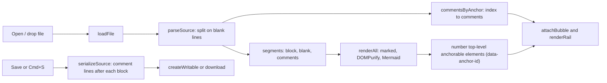

# The legacy viewer

[`legacy/md_viewer.html`](../legacy/md_viewer.html) is an earlier single-file viewer, about 1,040
lines. It is superseded by [`markdown-viewer.html`](../markdown-viewer.html), is not maintained, and
is kept because a few of its ideas are worth porting.

This page describes what it does, compares it feature by feature with the main viewer, explains why
the two comment formats do not mix, and lists what to port. Everything here was read from both
files as of the initial import. Function names refer to `legacy/md_viewer.html` unless they start
with `mdv` or the text says "main viewer". Statements marked *(inferred)* come from reading the code
rather than running it; *(unverified)* marks a claim that depends on library behaviour not checked
here.

See also: [lessons-learned.md](lessons-learned.md) · [commenting.md](commenting.md) ·
[dependencies.md](dependencies.md) · [roadmap.md](roadmap.md) ·
[legacy/README.md](../legacy/README.md)

## What it is

A two-column page: the rendered document on the left, a comment rail on the right (stacked below
the document under 980 px). It is built for one workflow: read a markdown file, right-click blocks
to comment, save the comments into the file, and hand the file (or a plain-text export of the
comments) to an AI assistant, whose replies come back as comments in the same file.

All code runs inside one `window.addEventListener('load', ...)` callback. The libraries come from
public CDNs, not from `vendor/`:

| Library | Source | Version in the tag |
|---|---|---|
| DOMPurify | cdnjs | 3.1.7 |
| marked | cdnjs | 12.0.2 |
| highlight.js (script and `github.min.css`) | cdnjs | 11.9.0 |
| Mermaid | jsdelivr | `mermaid@10` (floats within major version 10) |

## How it works



### Parsing and anchoring

`parseSource` splits the file into lines and walks them:

- blank lines become `blank` segments;
- consecutive lines that start with `<!-- MDV-COMMENT` become one `comments` segment, and the JSON
  in each is parsed by `extractComments` with the regular expression `COMMENT_RE`; malformed JSON is
  skipped;
- any other run of lines up to a blank line or a comment line becomes a `block` segment with the
  next `anchorIndex`.

Comments are filed under the index of the most recent block. Comments that appear before the first
block go under index `-1`; they are kept on save (written back at the top of the file) but never
shown.

`renderAll` renders the markdown without the comment lines, then numbers the *top-level* children of
the rendered output whose tag is in `ANCHOR_TAGS` (`H1`-`H6`, `P`, `LI`, `BLOCKQUOTE`, `PRE`,
`TABLE`), setting `data-anchor-id`. A comment filed under index *n* is displayed on the *n*th such
element.

This only lines up when every source segment produces exactly one numbered element. It does not
hold for common documents *(inferred)*:

- a list renders as a top-level `UL` or `OL`, which is not in `ANCHOR_TAGS` (`LI` is listed but is
  never top-level), so lists cannot be commented and every comment after a list is shifted;
- a horizontal rule, a raw HTML block or a Mermaid diagram (replaced by a plain `div`) consumes a
  segment index but gets no `data-anchor-id`;
- a fenced code block with blank lines inside is split into several segments but renders as one
  `PRE`;
- a paragraph followed directly by a list or table with no blank line is one segment but two
  elements.

Because a new comment is filed under the clicked element's index and written back after the source
segment with that index, a shift places the comment after the wrong block in the saved file.

### Comments

| Action | How | Function |
|---|---|---|
| Add | Right-click a numbered element, **Comment on this**; or long-press 480 ms on touch | `contextmenu` and `touchstart` listeners on `#out`, `openComposer` |
| View | Right-click, **View N comments**; click the count bubble; click a rail card | `toggleInlineThread`, `renderThread`, `renderRail` |
| Reply | **Reply** under a top-level comment (replies to replies are not offered) | `openComposer({ parentId })` |
| Resolve / reopen | **Resolve** / **Reopen** under a top-level comment | `toggleResolved` |
| Hide resolved | **hide resolved** checkbox, on by default | `filterVisible` |
| Delete | Not available | |

The composer (`openComposer`) has a markdown body, an **Image URL** field appended as `` on
submit, and an **Author** select with `me` and `ai`. The chosen author is remembered in
`localStorage` under `mdv.author`. `Cmd/Ctrl+Enter` posts and `Esc` cancels. Comment bodies are
rendered as markdown through `marked` and `DOMPurify.sanitize` (`renderComment`), so links and images
show. The bubble on a commented element turns half purple when the thread has an `ai` comment.

### Saving

- **Open file** uses `showOpenFilePicker` when available, which yields a writable handle; otherwise
  it clicks a hidden `<input type="file">` (`openFile`).
- Dropping a file on the dashed tip box (`#drop`, not the whole page) or using the input loads it
  with `fileHandle = null`.
- **Save** and `Cmd/Ctrl+S` call `saveFile`: with a handle it writes in place via `createWritable`;
  without one it downloads a copy, on every browser.
- **Save as…** uses `showSaveFilePicker` and then saves in place (`saveAs`).
- A status pill shows unsaved, saving and saved states. A `beforeunload` handler warns when there
  are unsaved comments.

### Copy AI export

`copyAiExport` builds a plain-text summary and writes it to the clipboard:

```text
# Comments on notes.md

## anchor 3
> First 200 characters of the commented block

- me (2026-01-01T10:00:00.000Z):
  Is this number right?

  - reply by ai (2026-01-01T10:05:00.000Z):
    Yes, see the table below.
```

It covers every anchored thread, including resolved ones (marked `[resolved]`), skips comments filed
before the first block, and prints `(no comments)` when there are none. Each top-level comment gets its
own `## anchor N` heading, so a block with two top-level comments appears twice. The quoted snippet
is the element's `textContent`, which includes the comment-count bubble appended inside the element,
so the count digit ends up at the end of short snippets *(inferred)*. A port should take the text
before decorations are added.

### Sanitization

Document HTML from `marked.parse` goes through `DOMPurify.sanitize(rawHtml, { ADD_TAGS: ['style'] })`
before it reaches the page, and so do comment bodies. Mermaid output is rendered afterwards and
inserted unsanitized, with `securityLevel: 'loose'`.

## Feature comparison

"Main" is `markdown-viewer.html`. A dash means the feature does not exist.

| Area | Legacy viewer | Main viewer |
|---|---|---|
| Markdown engine | marked 12 with `gfm: true` | markdown-it with `html`, `linkify`, `typographer`, plus anchor, task-list, footnote, mark, sub, sup, deflist and abbr plugins |
| Library loading | Four CDN scripts and one CDN stylesheet; needs a network | All libraries in `vendor/`; Google Fonts is the only network request |
| HTML sanitization | DOMPurify on document and comment HTML | None: `html: true` output is assigned with `innerHTML` |
| Syntax highlighting | Configured through marked's `highlight` option, which marked removed in v8.0.0 (marked's own options documentation). Nothing else calls highlight.js, so with marked 12 code blocks are not highlighted | highlight.js inside the markdown-it `highlight` callback, with a language label and Copy button |
| Mermaid | Fenced `mermaid` blocks; theme `base`; font size read from the slider when the document is rendered (moving the slider does not redraw diagrams); failures leave the code block | Fenced `mermaid` blocks; `default` or `dark` theme; error message on failure; expand overlay with zoom (`openDiagramOverlay`); click-to-section (`setupMermaidClickToSection`) |
| Math | - | KaTeX for `$...$` and `$$...$$` (`renderMath`) |
| Frontmatter | - (shown as document text) | Stripped; status, date, metrics and repos dashboard (`renderFrontmatterDashboard`) |
| Callouts | - | `transformCalloutBlocks` |
| Navigation | - | Table of contents with scroll spy, section folding, minimap, search (`buildToc`, `addSectionToggles`, `buildSectionMinimap`, `openSearch`) |
| Reading controls | Font-size slider, 12 to 22 px | Five font steps, light / sepia / dark themes, width toggle, focus mode |
| Read aloud | - | Yes, see [read-aloud.md](read-aloud.md) |
| Links | Plain | Type icons, standalone link cards, hover tooltip, links panel (`enhanceLinks`) |
| Opening files | Open (picker or input), drop on the tip box | Open (picker), file input, drop anywhere, paste, `?file=` when served, `#demo` |
| File types | Picker: `.md`, `.markdown`, `.mmd` (the fallback input also accepts `text/markdown` and `text/plain`); drop: any file, no check | `.md`, `.markdown`, `.mdx`, `.txt`; drop also accepts `.text` |
| Comment targets | Top-level headings, paragraphs, blockquotes, code blocks and tables | Nearest `P`, `LI`, `H1`-`H6`, `BLOCKQUOTE`, `PRE`, `TD`, `TH`, `DT`, `DD` (`mdvFindBlock`) |
| Comment on a text selection | - | Floating popover (`mdvHandleSelection`) |
| Touch | Long-press opens the menu | - |
| Anchoring | Segment position (see above) | `MDV-ANCHOR` id marker before the top-level block, found again through block numbers set at render time (`mdvAnnotateBlocks`, `mdvBuildAnchorMap`); the item inside a list or table by its text hash (`mdvChipHost`) |
| Orphans | Comments before the first block kept but hidden | Shown in the sidebar with an orphan style |
| Comment body | Markdown, sanitized; image URL field | Plain text, HTML-escaped (`mdvRenderCommentBody`) |
| Author | `me` / `ai` picked per comment in the composer | Name from `localStorage` key `mdv-author-name` (default `You`), kind always `human`; a comment with `author.kind: "agent"` written into the file gets an "(AI)" label from CSS |
| Threads | One reply level; reply and resolve on top-level comments | Replies to the thread root; resolve, reopen, delete (`mdvPostReply`, `mdvResolveThread`, `mdvDeleteThread`) |
| Filter resolved | Checkbox | - (resolved threads are styled) |
| Saving | Manual Save / `Cmd+S`, Save as; download when no handle | Saved at once after every change through one writer (`mdvWriteDocument`), which never overwrites a file changed on disk; `Cmd+S`; prompts for a location on Chromium; downloads on `Cmd+S` only without the File System Access API |
| Save target memory | - | Last file and workspace folder restored from IndexedDB |
| Unsaved warning | `beforeunload` prompt | `beforeunload` prompt while comment changes are not in a file, and a notice that keeps them when another document is opened |
| AI hand-off | **Copy AI export** to clipboard | - |
| Keyboard | `Cmd/Ctrl+S`, `Cmd/Ctrl+Enter`, `Esc` | Adds `Cmd/Ctrl+Shift+C` (sidebar), search, read-aloud and other shortcuts |

## Two incompatible comment formats

Both viewers use the `MDV-` prefix, but the formats are different.

| | Legacy | Main |
|---|---|---|
| Where | One line per comment, directly after the commented block | An id marker before the block, plus one payload block at the end of the file |
| Marker | `<!-- MDV-COMMENT {json} -->` | `<!-- MDV-ANCHOR id="c_..." -->` and `<!-- MDV-COMMENTS:v1 ... MDV-COMMENTS:end -->` |
| Fields | `v`, `id` (`cmt-...`), `author` (string), `ts`, `parent`, `body`, `resolved`, `resolvedTs` | `id` (`cm_...`), `parent_id`, `anchor` object, `author` `{ name, kind }`, `body_md`, `created_at`, `updated_at`, `status` |
| Escaping | None: a body containing `-->` ends the HTML comment and corrupts the file | `--` and `<` escaped inside the JSON (`mdvSerialize`) |

What happens when a file written by one is opened in the other *(inferred from the parsers)*:

- **Legacy file in the main viewer.** The `MDV-COMMENT` lines are ordinary HTML comments, so they
  are invisible and ignored. They stay in the source and are written back unchanged on save, because
  `mdvSerialize` replaces only the `MDV-COMMENTS:v1` block. No comments are shown, but none are lost.
- **Main-viewer file in the legacy viewer.** This one is destructive. The line
  `<!-- MDV-COMMENTS:v1` starts with `<!-- MDV-COMMENT`, so `parseSource` treats it as a comment
  line, finds no JSON on it, and treats the following JSON line and `MDV-COMMENTS:end -->` as a
  normal block. The JSON is displayed as document text, and on save `serializeSource` drops the
  opening line, leaving the payload as visible text in the file for every renderer.
  `MDV-ANCHOR` markers are kept as part of the blocks they precede.

Do not open main-viewer files in the legacy viewer. A one-way converter from legacy lines to the v1
payload would be straightforward, since every legacy field has a counterpart.

## CDN plus DOMPurify versus vendored and unsanitized

The two viewers made opposite trade-offs.

- **Availability.** The legacy viewer needs four scripts from two CDNs at load time. Mermaid is
  pinned only to its major version, so behaviour can change between visits. The main viewer
  vendored everything after CDN failures broke it (see
  [lessons-learned.md](lessons-learned.md#1-vendor-every-library)).
- **Safety.** The legacy viewer sanitizes all rendered HTML. The main viewer enables raw HTML in
  markdown-it and inserts the result with `innerHTML`, so a document containing, for example, an
  `` with an `onerror` attribute runs that script in the viewer's page *(inferred)*. Since the
  main viewer also holds write handles to the reader's files, sanitizing is the most important idea
  to port.
- **Both** render Mermaid with `securityLevel: 'loose'`.

## Ideas worth porting, in priority order

1. **Sanitize rendered HTML.** Vendor DOMPurify and run the markdown-it output through it before
   `innerHTML`. Two things to check first: that the configuration keeps the HTML comment nodes
   `mdvBuildAnchorMap` relies on *(unverified)*, and that KaTeX and highlight.js markup survive.
   Mermaid SVG is inserted later by `renderMermaidDiagrams` and would need its own decision.
2. **Copy AI export.** A button that copies all threads as plain text grouped by block, with the
   quoted block, author, time, status and replies. The main viewer has richer data to export: the
   selection quote, resolution status and author kind.
3. **Explicit author kind.** The main viewer's data model already has `author.kind`, and its CSS
   already labels `agent` comments, but the UI always writes `human`. A composer control for
   human / agent, remembered like the legacy `mdv.author` key, closes the loop for pasting an AI's
   reply.
4. **Unsaved-changes warning.** A `beforeunload` check on `mdvDirty`, which the main viewer already
   maintains but never reads.
5. **Markdown comment bodies.** Render `body_md` as sanitized markdown instead of escaped text,
   possibly with the legacy image-URL helper. Depends on item 1.
6. **Hide resolved threads.** A sidebar filter like the legacy checkbox.
7. **Long-press to comment** on touch devices.
8. **Save as.** An explicit way to save a commented copy elsewhere.
9. **Legacy comment import.** Convert `MDV-COMMENT` lines into the v1 payload, so files commented
   with the old viewer show their comments.

Ideas not worth porting: segment-position anchoring (see
[lessons-learned.md](lessons-learned.md#12-anchor-annotations-by-explicit-id)), CDN loading, and
unescaped JSON in HTML comments.
