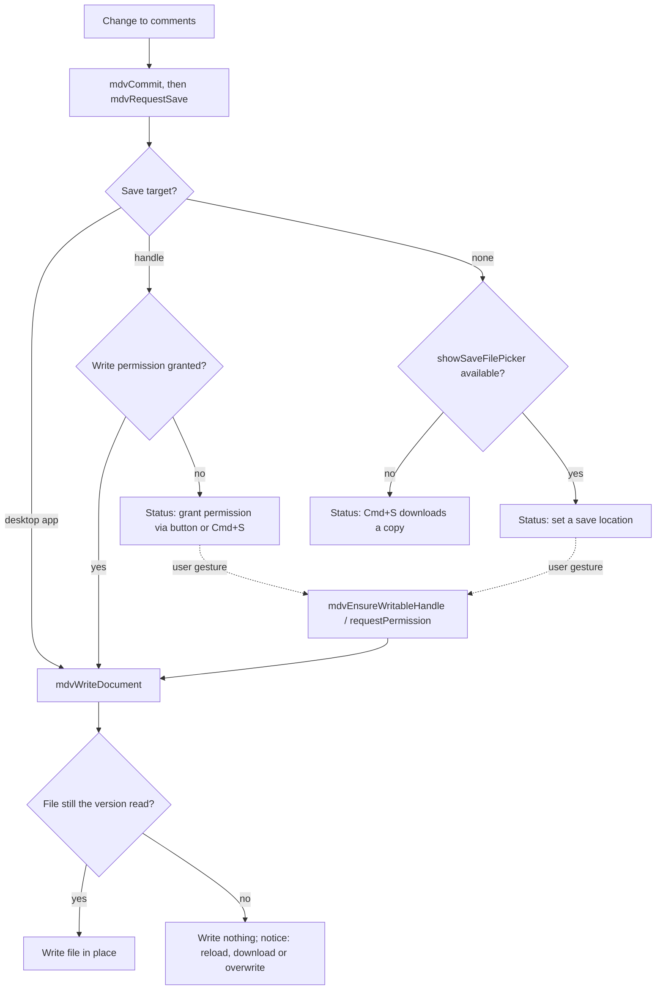

# Lessons learned

What building a single-file, local-first markdown viewer has taught so far. Each lesson follows
the same shape: what the reader saw, why it happened, what changed, and the rule worth keeping.

Function names refer to [`markdown-viewer.html`](../markdown-viewer.html) as of the initial
import. Where a lesson describes the earlier state of the code, that state no longer exists in this
repository; it is described from the change history the code was imported with. Statements marked
*(inferred)* come from reasoning about the code rather than from running it.

Related reading: [architecture.md](architecture.md) · [rendering.md](rendering.md) ·
[dependencies.md](dependencies.md) · [commenting.md](commenting.md) ·
[legacy-viewer.md](legacy-viewer.md) · [roadmap.md](roadmap.md)

## Summary

| # | Lesson | Rule to keep |
|---|---|---|
| 1 | One failed CDN script killed the whole viewer | Vendor every library; load by relative path |
| 2 | An undefined global took rendering down with it | Every optional library is guarded with `typeof` |
| 3 | One broken post-processing step blanked the page | Each enhancement pass runs in its own `try/catch` |
| 4 | `?file=` silently did nothing when opened from disk | `file://` pages cannot fetch; detect it and say so |
| 5 | YAML frontmatter rendered as a heading and body text | Strip frontmatter before markdown; treat it as data |
| 6 | Link icons broke sentences and polluted link text | Decorate with CSS generated content, not DOM nodes |
| 7 | The file picker misbehaved and failures were silent | Broad `accept`, reset the input, surface every error |
| 8 | "Expand diagram" showed the button's own icon | Scope selectors past the UI chrome you inject |
| 9 | Clicking the selection popover did nothing | Global handlers must ignore events from your own UI |
| 10 | Comments were saved to the Downloads folder | Never silently download when a real save is possible |
| 11 | A save dialog appeared for every file | Ask for a folder once and persist the handle |
| 12 | Comments drifted to the wrong paragraph | Anchor with explicit ids in the source, not positions |
| 13 | Annotation payloads can break out of their container | Escape `--` and `<` inside HTML-comment payloads |

Lessons 1 to 8 come from making a rendering-only viewer reliable. Lessons 9 to 13 come from adding
in-file commenting, which turned a read-only page into one that writes to the user's disk.

---

## 1. Vendor every library

**What the reader saw.** The viewer opened to an error, or rendered nothing, with
`hljs is not defined` in the console.

**Root cause.** Syntax highlighting was loaded as sixteen separate CDN scripts: the highlight.js
core plus fifteen individual language files. If any one of them failed to load, the global `hljs`
was missing and the markdown-it `highlight` callback threw while rendering the first code block.
The original fix attributed the unreliability to opening the page over `file://`. Scripts from
`https://` URLs do normally load into a `file://` page, so the more general cause is that a page
with many network dependencies fails whenever the network is slow, offline or filtered *(the exact
network cause was never isolated)*.

**Fix.** First, the sixteen scripts became one bundled highlight.js build. Then every script,
stylesheet and font was copied into `vendor/` and loaded by relative path: markdown-it and its
eight plugins, highlight.js with its light and dark themes, Mermaid, KaTeX with its CSS and fonts,
and later diff-match-patch. Apart from the font stylesheet described below, the page head contains
only relative `<script src="vendor/...">` and
`<link href="vendor/...">` tags. See [dependencies.md](dependencies.md) for the list.

**Rule.** The viewer must open fully with no network. A library is vendored or it is not used.
Prefer one bundle per library over many small files, because every extra request is another way
to fail.

The one remaining network dependency is the Google Fonts stylesheet (Inter, Literata, JetBrains
Mono) linked from the page head. It is cosmetic: the CSS font stacks fall back to system fonts.
It does mean that opening the viewer makes a request to a third party, which any privacy claim
has to mention.

## 2. Guard every optional library

**What the reader saw.** The same crash as lesson 1: one missing library meant no document at all.

**Root cause.** Code called `hljs.getLanguage`, `katex.renderToString` and `mermaid.render`
assuming the globals existed.

**Fix.** Every use is guarded:

- the markdown-it `highlight` callback checks `typeof hljs !== 'undefined'` and falls back to
  escaped plain text;
- `renderMath` returns its input unchanged when `katex` is undefined;
- `renderMermaidDiagrams` returns early when `mermaid` is undefined;
- each markdown-it plugin is registered only if its global exists (`if (window.markdownItAnchor)`
  and so on);
- the fuzzy-matching helper is created only when `diff_match_patch` is defined (`_mdvDmp`).

**Rule.** The core path (read the file, parse markdown, show HTML) depends on markdown-it only.
Everything else is an enhancement that can be missing without taking the document down.

## 3. Isolate each post-processing step

**What the reader saw.** A document that contained one unusual construct rendered as a blank page.

**Root cause.** After markdown-it produced HTML, a dozen DOM passes ran one after another (section
toggles, table of contents, search index, read-aloud sections, diagrams, scroll spy, image
lightbox, link enhancement). An exception in any of them stopped every pass after it.

**Fix.** `renderMarkdown` wraps each pass in its own `try { ... } catch (e) { console.warn(...) }`:
`transformCalloutBlocks`, `addSectionToggles`, `buildToc`, `buildSectionMinimap`,
`buildSearchIndex`, `buildTtsSections`, `renderMermaidDiagrams`, `setupScrollSpy`,
`setupImageLightbox`, `enhanceLinks`, `applyAbbreviationTooltips` and
`setupMermaidClickToSection`. `readFile` wraps the whole render and shows an `alert` on failure
rather than failing silently.

**Rule.** A failing enhancement may cost its own feature, never the document. New passes go into
the same pattern. A warning in the console is the minimum; a visible notice is better for anything
the reader would miss.

Note that `renderMermaidDiagrams` is `async`, so the `try/catch` around its call does not catch a
rejected promise. It catches per-diagram errors itself and replaces the diagram with a
"Mermaid error" message.

## 4. A page opened from disk cannot fetch files

**What the reader saw.** Opening `markdown-viewer.html?file=notes.md` from the file system showed
the empty welcome screen with no explanation.

**Root cause.** Browsers do not let a `file://` page `fetch()` other local files. The
`?file=` parameter can only work when the viewer is served over HTTP.

**Fix.** `loadFromUrl` checks `window.location.protocol === 'file:'`. Over HTTP it tries the path
as given and then the path prefixed with the base path saved in settings (`mdv-basepath` in
`localStorage`, set by `saveBasePath`). When it cannot load the file, it replaces the welcome
screen with a prompt that names the requested file, offers **Browse** and drag-and-drop, and, on
`file://`, shows how to serve the folder with a local static server bound to `127.0.0.1`.

**Rule.** Every way of opening a document has to work from disk with no server: the file button,
drag-and-drop and paste. URL loading is a convenience for served setups, and when it cannot work
the page explains why and offers the alternative.

## 5. Strip frontmatter before rendering, then use it

**What the reader saw.** Documents beginning with a YAML block (`---`, key-value lines, `---`)
showed the YAML as the first lines of the document.

**Root cause.** CommonMark has no frontmatter. The opening `---` renders as a horizontal rule, and
the closing `---` turns the line directly above it into a setext level-two heading, so the last
YAML line became a large heading *(standard CommonMark behaviour; the original report only says
the YAML "was showing as body text")*.

**Fix.** `parseFrontmatter` matches a leading `---` ... `---` block, removes it from the source and
parses it with a small built-in parser. The parsed data later became a feature:
`renderFrontmatterDashboard` turns `status`, `date`, `metrics` and `repos` into a badge strip
above the document, and `applyAbbreviationTooltips` reads an `abbreviations` key from it. That
second consumer does nothing in practice: it accepts only a plain object, but the built-in parser
turns a key with no inline value into an array and ignores indented `key: value` lines that are not
list items, so `abbreviations` is always an array or a string *(inferred from `parseFrontmatter`)*. See
[features.md](features.md) and [authoring-guide.md](authoring-guide.md).

**Rule.** Metadata is data, not prose. Remove it before the markdown parser sees it. The built-in
parser handles top-level scalars, lists of scalars and lists of one-level maps; it is not a YAML
implementation, so do not promise more than that. A frontmatter block whose closing `---` is the
last line of the file with no newline after it is not matched *(inferred from the regular
expression in `parseFrontmatter`)*.

## 6. Decorate links with CSS, not with DOM nodes

**What the reader saw.** Links were followed by a small type icon (GitHub, docs, file, email,
external). The icons broke the flow of sentences: a link's icon ran straight into the next word
(something like "project ★branch: main"), and the icon character showed up in other features that
read link text.

**Root cause.** `enhanceLinks` appended a `` inside every `<a>`. That
changed the link's `textContent`, so every consumer of the text (the links panel, search, read
aloud, copy and paste) saw the icon character too. The links panel even had to strip symbols with
a regular expression to compensate.

**Fix.** `enhanceLinks` now only sets `a.dataset.linkType` from `detectLinkType(href)`. The icon is
drawn by CSS rules of the form `.md-body a[data-link-type="github"]::after { content: ... }`, with a
thin space before the symbol. Generated content is not part of the DOM text, so nothing else sees
it, and the regular-expression workaround was removed.

**Rule.** Purely visual decoration goes in CSS generated content or attributes. Never add nodes
inside elements whose text other features read. This viewer has many such readers: the table of
contents, search, read aloud, the links panel and comment anchoring.

## 7. Make the file picker forgiving and loud

**What the reader saw.** On some systems, markdown files could not be chosen in the file dialog.
Choosing the same file a second time did nothing. A file that failed to read failed silently.

**Root cause.** Three separate defects:

- the `accept` attribute was too narrow; the original change notes give macOS compatibility as the
  reason for broadening it, without describing the symptom *(not reproduced here)*;
- an `<input type="file">` fires `change` only when its value changes, so picking the same file
  again was ignored;
- `FileReader` errors were not handled.

**Fix.** The input now uses `accept="text/*,.md,.markdown,.mdx"`. `handleFileInput` clears
`e.target.value` after each pick, with a fallback that resets the input's `type` for browsers that
refuse the assignment. `readFile` sets `reader.onerror` and shows an `alert` naming the file.
Drag-and-drop (on `document.body`) checks the extension against
`md|markdown|mdx|txt|text`.

**Rule.** Accept generously and validate after reading. Reset file inputs after use. Every failure
to read or render produces a visible message.

## 8. Scope selectors past the UI you inject

**What the reader saw.** Clicking a diagram to expand it showed a large copy of the expand
button's icon instead of the diagram.

**Root cause.** The expand button contains an inline SVG and is prepended to the diagram wrapper.
`openDiagramOverlay` looked up `wrapper.querySelector('svg')`, which found the button's SVG first.

**Fix.** The lookup is `wrapper.querySelector('.mermaid svg') || wrapper.querySelector('pre svg')`,
which only matches the rendered diagram.

**Rule.** As soon as you add controls inside a content container, every generic selector on that
container is suspect. Select by the content's own class, or keep controls outside the element that
holds the content.

## 9. Global handlers must ignore your own UI

**What the reader saw.** After selecting text, a "Comment" popover appeared, but clicking it did
nothing.

**Root cause.** A document-level `mouseup` listener re-evaluated the selection on every mouse
release. It removed every existing popover before deciding whether to show a new one. The
`mouseup` from clicking the popover reached that listener before the popover's `click` fired, so
the element being clicked was removed and its handler never ran. A second problem made it worse:
the listener was attached on every render, so the number of listeners grew with each document
opened.

**Fix.** The `mouseup` listener is attached once at script start, guarded by
`window.__mdvMouseupWired`. It returns early when the event target is inside
`.mdv-sel-popover`, `.mdv-add-popup`, `.mdv-ctx-menu` or `.mdv-sidebar`. In `mdvHandleSelection`
the popover's `mousedown` calls `preventDefault` and `stopPropagation`, so the selection is not
collapsed and the context menu's document-level `mousedown` closer does not fire. The popover
captures the target block and the selected text when it is created, so a selection that collapses
later does not matter.

**Rule.** Any listener on `document` must first ask "did this event start inside one of my own
controls?" Register document-level listeners once, never per render.

## 10. Never silently download when a real save is possible

**What the reader saw.** After commenting on a file opened by drag-and-drop, paste or `?file=`,
the comments did not appear in the file. A copy with the comments was in the Downloads folder.

**Root cause.** Writing in place needs a `FileSystemFileHandle`, which only the File System Access
pickers provide. A dragged or pasted file has no handle. The save code treated "no handle" as "this
browser cannot save" and downloaded a copy, a fallback meant only for browsers without the API.
Separately, a handle left over from a previous session was not cleared when a new file was dropped,
so a save could go to the wrong file.

Two browser constraints shape the fix. Chromium shows `showSaveFilePicker` only during a user
gesture, so a timer-driven auto-save cannot ask for a location. And permission on a stored handle
may need to be requested again, which also requires a gesture.

**Fix.**

- `mdvEnsureWritableHandle` asks for a location with `showSaveFilePicker` and stores the handle in
  IndexedDB. It is called inside click handlers: the add-comment **Save** button
  (`mdvShowAddPopup`), `Cmd/Ctrl+S` (`mdvSaveFile({ allowPrompt: true })`), and the open/save-location
  toolbar button (`mdvOpenOrSetSaveLocation`).
- `mdvSaveFile` falls back to `mdvDownloadFallback` only when `showSaveFilePicker` does not exist.
  On Chromium with no handle, it leaves the change unsaved and shows a status asking the reader to
  set a location.
- `readFile` clears `mdvFileHandle` on every drag-drop or file-input load.

The flow as of 2026-10-10 (every change is saved at once; a download happens only on an explicit
`Cmd/Ctrl+S`, see [commenting.md](commenting.md#save-flow)):

**Rule.** A fallback that changes where the user's data goes must never trigger silently. Get the
capability (a handle, a permission) inside the gesture that needs it, and when it is missing, tell
the reader what single action fixes it.

## 11. Ask for the folder once

**What the reader saw.** With lesson 10 fixed, every newly dropped file still produced a save
dialog on its first comment.

**Root cause.** A file handle covers one file. Dropped files never carry a handle.

**Fix.** `mdvPickWorkspace` asks once for a directory with
`showDirectoryPicker({ mode: 'readwrite' })` and stores the handle in IndexedDB (database
`mdv-viewer`, key `workspace`). On page load the handle is restored before the last file, and when
a file is dropped `readFile` calls `mdvTryWorkspaceMatch(file.name)`, which looks up a file of that
name in the folder with `getFileHandle`. A match becomes the save target with no dialog. Browsers
without `showDirectoryPicker` get an explanatory toast. Chromium can keep the folder permission
across visits when the reader chooses to allow it on every visit.

**Rule.** Ask for the widest scope the reader is comfortable granting, once, and persist it. Then
be careful with what the grant lets you do silently:

- `mdvTryWorkspaceMatch` matched by file name only, in the top level of the folder. A dropped `File`
  carries no path, so a file of the same name dropped from a *different* folder was linked to the
  workspace copy, and the next save wrote there. **Fixed 2026-10-10:** it links only when the contents
  are identical, and a test drops a same-named different file to prove the workspace file stays
  untouched. A name is not an identity; compare what you are about to overwrite.
- Files in subfolders of the workspace are never matched, because only direct children are looked
  up.

## 12. Anchor annotations by explicit id

**What the reader saw.** In the older viewer (see [legacy-viewer.md](legacy-viewer.md)), comments
could appear on, or be saved after, a different block from the one the reader clicked *(inferred
from its code, not from a report)*.

**Root cause.** The older viewer anchored by position. It split the source on blank lines and
counted segments, and separately counted top-level rendered elements of a few tag types. The two
counts disagree whenever the document has a list, a horizontal rule, a diagram, raw HTML, or a
fenced code block containing blank lines.

**Fix.** This viewer writes an explicit marker, `<!-- MDV-ANCHOR id="..." -->`, on its own line
before the commented block (`mdvAddComment`). After rendering, the marker survives as a DOM comment
node, and `mdvBuildAnchorMap` maps each id to the next element sibling. A thread whose marker cannot
be found is shown in the sidebar as an orphan instead of being dropped (`mdvRenderSidebar`).

**Rule.** Anchor to something written into the source, not to a count. Keep fallbacks for when the
marker is lost, and never drop an annotation silently.

Two gaps remained in the code at import, both **fixed on 2026-10-10** (see
[commenting.md](commenting.md#anchors-creation-and-resolution)): the marker position now comes from
markdown-it's own source map through block numbers written at render time, and the anchor id travels
with its element as an attribute, so section wrappers cannot separate them. As they were:

- `mdvAddComment` found where to insert the marker with `rawMarkdown.indexOf(blockText)`, using the
  *rendered* text of the block. Any block with inline formatting, links or soft line breaks has
  rendered text that does not appear in the source, so no marker is written and the thread is an
  orphan from the start. This includes every heading, because the rendered heading also contains
  the hidden (opacity 0) `#` permalink that markdown-it-anchor adds, and any block that already has
  a comment, because `mdvRenderChips` appends its count chip inside the block *(inferred)*. When the
  text does appear, the first occurrence wins, which may be a different block.
- `mdvComputeAnchor` stores a block kind, sibling index, text hash and quote with prefix and suffix
  for the structural and fuzzy fallbacks, and `mdvResolveAnchor` implements them with
  diff-match-patch. Nothing calls `mdvResolveAnchor`: the sidebar and chips use only the exact-id
  map. The fallbacks are written but not wired in.

## 13. Escape payloads that live inside HTML comments

**What could go wrong.** Annotations are stored in the markdown file as HTML comments so that other
renderers hide them. An HTML comment ends at the first `-->`. A comment body that contains `-->`,
or in some parsers `--`, ends the container early and spills the rest of the JSON into the
document as visible text.

**How it is handled.** `mdvSerialize` writes all comments as a single JSON payload in a trailing
`<!-- MDV-COMMENTS:v1 ... MDV-COMMENTS:end -->` block, and inside the JSON replaces every `--` with
`-\u002d` and every `<` with `\u003c`. Both are valid JSON escapes, so `JSON.parse` alone would
restore the original text. `mdvParseFile` also reversed them textually before parsing (until
2026-10-10, when that replacement was removed and an unreadable block became read-only instead of
being dropped), which was redundant and harmful: a comment whose body contains the literal text `\u002d` or `\u003c`
(a backslash followed by `u002d` or `u003c`) is stored with a doubled backslash, the textual replacement leaves a lone backslash, and the whole
payload then fails to parse *(inferred; see [commenting.md](commenting.md))*. Escape for the host,
and let the format's own parser undo it. The older viewer wrote
`JSON.stringify` output into `<!-- ... -->` without escaping (`serializeComment` in
`legacy/md_viewer.html`), so a comment containing `-->` breaks the file.

**Rule.** Anything embedded in a host format must be escaped for that host's terminator. Keep a
version number in the marker (`v1`) so the format can change.

---

## Open lessons: hazards visible in the current code

These are not historical fixes. They are problems in the same classes as the lessons above, found
by reading the code at import time. They are recorded here so they are not relearned the hard way.
Plans for them belong in [roadmap.md](roadmap.md).

| Hazard | Where | What happens | Class |
|---|---|---|---|
| The paste handler replaces the document | `document.addEventListener('paste', ...)` | Pasting more than ten characters while the search overlay is closed and focus is not in a text field renders the pasted text as a new document with no confirmation. The handler now ignores pastes into `input`, `textarea`, `select` and editable elements and clears `mdvFileHandle`, so the pasted text can no longer be saved over the opened file. Since 2026-10-10, comment changes not yet saved to the previous document are kept in a notice with a download button. | 9, 10 |
| ~~Workspace match by name~~ | `mdvTryWorkspaceMatch` | **Fixed 2026-10-10:** linked only when the contents match. | 10, 11 |
| Math runs before markdown | `renderMath` is called on the raw source in `renderMarkdown` | `$...$` inside fenced or inline code is turned into KaTeX too, so shell snippets such as `echo $HOME $PATH` are altered *(inferred)*. | 5 |
| Theme switch does not redraw diagrams | `setTheme` → `renderMermaidDiagrams` | Only `.mermaid:not(.rendered)` elements are rendered, and the Mermaid source text has already been replaced by SVG, so existing diagrams keep their old theme *(inferred)*. | 2 |
| Diagram title guessed from SVG text | `openDiagramOverlay` | The diagram type is detected from `mermaidEl.textContent`, which after rendering is the SVG's label text, not the source *(inferred)*. | 8 |
| ~~Anchor fallbacks not wired~~ | `mdvResolveAnchor` | **Fixed 2026-10-10:** the dead resolver was removed; anchors use block numbers set at render time. See lesson 12. | 12 |
| Raw HTML is not sanitized | `markdownit({ html: true })` with output assigned via `innerHTML` | HTML in an opened document is inserted as-is, so event-handler attributes such as `onerror` run. The older viewer passed output through DOMPurify. | 1 |
| ~~Open fallback targets a missing element~~ | `mdvPickFile` | **Fixed 2026-10-10:** it opens `#fileInput`. | 7 |
| Frontmatter abbreviations never apply | `applyAbbreviationTooltips` | See lesson 5. | 5 |
| ~~No unsaved-changes warning~~ | `beforeunload` | **Fixed 2026-10-10:** leaving with comment changes that are not in a file asks first, and opening another document keeps them in a notice. | 10 |

## Lessons from the read-aloud engine

The read-aloud feature carries its own browser workarounds, for example `ttsStartKeepAlive`, which
calls `speechSynthesis.pause()` and `resume()` every 12 seconds while speaking because Chrome stops
long utterances at about 15 seconds, and skips this on Android, where `pause()` acts as cancel.
These are documented with the feature in [read-aloud.md](read-aloud.md).
