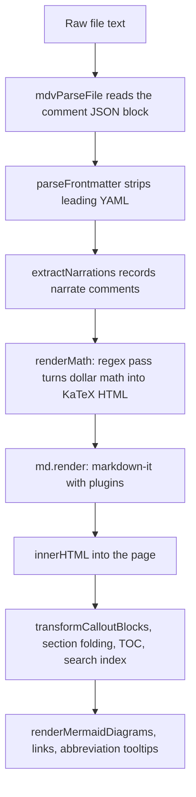

# Markdown knowledge for maintainers

This page collects what a maintainer of a markdown viewer needs to know about markdown itself: which specifications exist, which extension syntaxes are in circulation, how HTML and HTML comments behave inside markdown, the parsing pitfalls that catch authors and implementers, and what renders where. Every point is related to how `markdown-viewer.html` behaves today.

Related: [rendering.md](rendering.md) (the render pipeline in detail) · [authoring-guide.md](authoring-guide.md) · [visualization-catalog.md](visualization-catalog.md) · [commenting.md](commenting.md) · [read-aloud.md](read-aloud.md) · [features.md](features.md) · [lessons-learned.md](lessons-learned.md) · [roadmap.md](roadmap.md) · [../README.md](../README.md)

## How the statements on this page were checked

There are three kinds of statement here, and each is labelled.

| Label | Meaning |
|---|---|
| **verified** | Checked by running the viewer's own markdown-it setup, its `renderMath` function and its `parseFrontmatter` function, copied unchanged out of `markdown-viewer.html`, under Node.js 22 against the libraries in `vendor/`. The output quoted is the HTML string that `renderMarkdown` assigns to `innerHTML`. |
| **read** | Read from the code but not executed, usually because it needs a browser DOM (`transformCalloutBlocks`, `renderMermaidDiagrams`, `findNarrationFor`, the comment functions). |
| **(inferred)** / **(unverified)** | A conclusion drawn from the code, or a statement that was not checked. |

Statements about **other tools** (GitHub, GitLab, VS Code, Obsidian, Typora, Pandoc, MkDocs, Docusaurus) come from general knowledge of those tools and were not tested for this page. Treat them as unverified and check the tool's current documentation before relying on one.

Status words used for this viewer: **Supported**, **Partial** (works with caveats that are listed), **Not supported** (the syntax is shown as plain text or as a code block).

> [!NOTE]
> This page avoids literal dollar signs. Wherever one is needed it is written as the HTML entity `&#36;`, and code that contains dollar signs is written with HTML `<code>` or `<pre>` tags. The reason is the math pre-pass described in [Dollar signs: currency or math](#dollar-signs-currency-or-math): in this viewer, two dollar signs on one line become math even inside code.

---

## Contents

1. [Viewer markdown configuration](#viewer-markdown-configuration)
2. [The specification landscape](#the-specification-landscape)
3. [Extension syntaxes across ecosystems](#extension-syntaxes-across-ecosystems)
4. [Math](#math)
5. [Diagrams as code](#diagrams-as-code)
6. [HTML inside markdown](#html-inside-markdown)
7. [HTML comments as invisible metadata](#html-comments-as-invisible-metadata)
8. [Classic parsing pitfalls](#classic-parsing-pitfalls)
9. [Portability: what renders where](#portability-what-renders-where)
10. [Accessibility](#accessibility)
11. [Printing](#printing)
12. [A portable authoring subset](#a-portable-authoring-subset)

---

## Viewer markdown configuration

Read from the `markdown-it setup` section of the inline script.

| Setting | Value | Effect |
|---|---|---|
| Parser | markdown-it 14.1.0 (`vendor/markdown-it.min.js`) | CommonMark parser with GFM tables and strikethrough built in |
| `html` | `true` | Raw HTML in the source is rendered, then sanitized with DOMPurify before it reaches the page (see [rendering.md](rendering.md#security-posture)) |
| `linkify` | `true` | Bare URLs, `www.` hosts, e-mail addresses and bare domain-like words become links (see [Autolinks](#autolinks-and-linkify)) |
| `typographer` | `true` | Smart quotes and text replacements such as `--` to an en dash and `(c)` to a copyright sign |
| `breaks` | not set, so `false` | A single newline inside a paragraph is a soft break, not `<br>` |
| `highlight` | custom function | highlight.js for known languages, a header with the language label and a Copy button |
| Plugins | anchor, task-lists, footnote, mark, sub, sup, deflist, abbr | Each is applied only if its global exists: `markdownItAnchor`, `markdownitTaskLists`, `markdownitFootnote`, `markdownitMark`, `markdownitSub`, `markdownitSup`, `markdownitDeflist`, `markdownitAbbr` |

Note the capitalisation: markdown-it-anchor's UMD build registers `markdownItAnchor` (capital I), while every other plugin in `vendor/` registers a name beginning `markdownit` (lower-case i). A `window.<name>` guard with the wrong spelling silently skips the plugin, and nothing reports it. Check the UMD header of the file (`...markdownitTaskLists=n()`) when adding or upgrading a plugin.

Around markdown-it, `renderMarkdown` runs custom steps in this order. The full description is in [rendering.md](rendering.md).



Two facts about this order explain most of the pitfalls on this page:

- `renderMath` runs on the **raw text**, before markdown-it knows where code spans, code blocks or HTML comments are.
- Callouts are recognised **after** rendering, by looking at the HTML of each `<blockquote>`, not by a markdown-it rule.

---

## The specification landscape

### Original Markdown

John Gruber's 2004 description and the `Markdown.pl` script defined the syntax by example. It left many cases open (how far a list item must be indented, whether `_` works inside words, how HTML blocks end), and early implementations answered them differently. Most "it renders differently in X" problems trace back to that.

### CommonMark

CommonMark is a precise specification of the core syntax with a large example suite. It defines a two-phase parse: first the **block structure** (paragraphs, headings, lists, block quotes, code blocks, HTML blocks, link reference definitions), then the **inline content** of each block (emphasis, code spans, links, images, autolinks, raw inline HTML, entities, hard breaks). Precedence rules matter: code spans and raw HTML bind tighter than emphasis, and block structure is fixed before any inline is parsed.

CommonMark deliberately excludes tables, task lists, strikethrough, footnotes, math, front matter and callouts. Everything in those areas is an extension.

### GitHub Flavored Markdown (GFM)

GFM is a formal superset of CommonMark published by GitHub. The specification adds exactly five things:

| GFM addition | Example | This viewer |
|---|---|---|
| Tables | `\| a \| b \|` with a `\|---\|---\|` delimiter row | **Supported** (markdown-it core). Verified. |
| Task list items | `- [ ] todo` / `- [x] done` | **Supported** via markdown-it-task-lists, rendered as `<input type="checkbox">` inside a `<label>`. Verified. The checkboxes are enabled, and no code in the viewer writes a click back to the file (read; a search for `checkbox` finds only one CSS rule, `.md-body .task-list-item input[type="checkbox"]`). |
| Strikethrough | `~~gone~~` | **Supported**, rendered as `<s>`. Verified. GFM also accepts a **single** tilde, `~gone~`; in this viewer a single tilde is **subscript** (markdown-it-sub). |
| Extended autolinks | `www.example.com`, `https://example.com`, `me@example.com` without angle brackets | **Supported** via `linkify`, which goes further than GFM (see [Autolinks](#autolinks-and-linkify)). Verified. |
| Disallowed raw HTML (tag filter) | `<script>`, `<style>`, `<iframe>`, `<textarea>` and a few others are neutralised | **Not supported.** markdown-it has no tag filter and `html: true` passes everything through. Verified with ``, which reaches `innerHTML` unchanged. |

Features people associate with GitHub but that are **not** in the GFM specification: alerts (`> [!NOTE]`), Mermaid and other diagram fences, math, footnotes, emoji shortcodes, heading anchors, the front matter table. These are GitHub product features layered on top of GFM, and other "GFM" renderers often lack them.

### Where markdown-it sits

markdown-it is a CommonMark parser written in JavaScript with a plugin system. Its core includes the two GFM additions that need parser support: tables (a block rule) and strikethrough (an inline rule). Task lists, footnotes and so on come from plugins. `linkify` uses the separate linkify-it library, which is fuzzier than GFM's extended autolinks. The `typographer` option is not part of any specification. markdown-it does not implement GFM's tag filter, and it does not sanitize HTML; that is left to the application. This viewer does not add a sanitizer.

One small deviation from CommonMark was observed (verified): `&notanentity;` renders as `¬anentity;`. CommonMark says a string that is not a valid named entity stays literal. markdown-it 14 appears to decode the legacy entity `&not` that has no semicolon (inferred from the output; plain markdown-it without plugins and without typographer does the same).

---

## Extension syntaxes across ecosystems

| Syntax | Example | Origin | This viewer | How, or why not |
|---|---|---|---|---|
| GitHub alerts | `> [!NOTE]` then `> text` | GitHub | **Supported**, plus three extra types | `transformCalloutBlocks` and `CALLOUT_TYPES` (read). Details below. |
| Obsidian callouts | `> [!tip]+ Custom title` | Obsidian | **Partial** | Same code. Type names are upper-cased, so `[!tip]` works. The fold marker `+`/`-` and the custom title stay in the body text; the title is always the fixed label. Obsidian types not in `CALLOUT_TYPES` (`info`, `abstract`, `summary`, `todo`, `success`, `question`, `failure`, `danger`, `bug`, `example`, `quote` and others) stay plain blockquotes with the marker visible. |
| MkDocs (Python-Markdown) admonitions | `!!! note "Title"` then a 4-space indented body | MkDocs, Material for MkDocs | **Not supported** | Verified: renders as one paragraph, `!!! note “Title” Indented body` (the quotes are curled by the typographer). |
| Directive containers | `:::tip` … `:::` | Docusaurus, VitePress, remark-directive, Pandoc fenced divs | **Not supported** | Verified: renders as a paragraph containing the colons. No markdown-it-container plugin is loaded. |
| Pandoc attributes | `# Heading {#id .class}` | Pandoc, kramdown, markdown-it-attrs | **Not supported** | Verified: the braces become part of the heading text and of its slug (`heading-custom-cls`). |
| Pandoc citations | `[@doe2020]` | Pandoc | **Not supported** | Verified: literal text. |
| Footnotes | `Text[^1]` and `[^1]: Note.` | PHP Markdown Extra, Pandoc, GitHub | **Supported** | markdown-it-footnote 4.0.0. Verified, including repeated references to one note (`[1]`, `[1:1]`, one back-link per reference). |
| Inline footnotes | `Text^[inline note]` | Pandoc, Obsidian | **Supported** | Same plugin. Verified. GitHub does not support this form. |
| Definition lists | `Term` then `: Definition` | PHP Markdown Extra, Pandoc | **Supported** | markdown-it-deflist. Verified, with and without a blank line before the `:` line. |
| Abbreviations | `*[HTML]: Hyper Text Markup Language` | PHP Markdown Extra | **Supported** | markdown-it-abbr wraps every whole-word `HTML` in the document in `<abbr title="...">`, including occurrences before the definition. Verified. |
| Front matter abbreviation map | `abbreviations:` with indented `KEY: value` lines | this viewer's own convention | **Not working** | `parseFrontmatter` turns a key with an empty value into a list and ignores indented `key: value` lines unless they follow a `- ` item. Verified: `meta.abbreviations` comes out as `[]`. `applyAbbreviationTooltips` returns early for arrays and for strings, so no input reaches it. |
| Highlight | `==text==` | Pandoc (`mark`), Obsidian, Typora | **Supported** | markdown-it-mark, `<mark>`. Verified. |
| Subscript, superscript | `H~2~O`, `x^2^` | Pandoc | **Supported** | markdown-it-sub and markdown-it-sup. Verified. The content cannot contain an unescaped space: `x^a b^` stays literal. |
| Strikethrough | `~~text~~` | GFM | **Supported** | markdown-it core, `<s>`. |
| Math | dollar-delimited TeX | Pandoc, GitHub, Obsidian, Typora, VS Code | **Partial** | `renderMath` regex pre-pass and KaTeX 0.16.11. See [Math](#math). |
| Math with `\(...\)` and `\[...\]` | `\(x^2\)` | LaTeX, MathJax defaults, Pandoc option | **Not supported** | Verified: markdown-it treats `\(` as an escaped parenthesis, so the output is `(x^2)` with the backslashes gone. |
| Math fences | ` ```math ` | GitHub, GitLab | **Not supported** | Verified: a normal code block labelled `math`. |
| Wiki-links | `[[Other Page]]`, `[[Page\|alias]]` | Obsidian, MediaWiki, GitHub and GitLab wikis | **Not supported** | Verified: literal text. |
| Embeds | `![[image.png]]` | Obsidian | **Not supported** | Verified: literal text. |
| Obsidian comments | `%% hidden %%` | Obsidian | **Not supported** | Verified: literal text, visible. |
| Emoji shortcodes | `:rocket:` | GitHub, GitLab, Slack, markdown-it-emoji | **Not supported** | Verified: literal text. No emoji plugin is loaded. Unicode emoji characters typed directly work. |
| YAML front matter | `---` … `---` at the very top | Jekyll, Hugo, Obsidian, most static site generators | **Partial** | `parseFrontmatter` (verified). A small line-based parser, not a YAML library. Keys `status`, `date`, `metrics`, `repos` feed the dashboard (`renderFrontmatterDashboard`); other keys are parsed and not shown. Edge cases in [Front matter](#front-matter-edge-cases). |
| TOML front matter | `+++` … `+++` | Hugo, Zola | **Not supported** | Verified: rendered as a paragraph at the top. |
| JSON front matter | `{ ... }` at the top | Hugo | **Not supported** | Not tested (inferred from `parseFrontmatter`, which only matches `---`). |
| TOC markers | `[[_TOC_]]`, `[TOC]`, `[toc]` | GitLab, Typora, Python-Markdown | **Not supported** as markers | The viewer always builds its own TOC from headings (`buildToc`, read). A marker in the text stays visible: `[TOC]` as written, `[[_TOC_]]` as `[[<em>TOC</em>]]` because the underscores become emphasis (verified). |
| Task lists | `- [x] done` | GFM | **Supported** | See the GFM table above. |
| Collapsible sections | `<details><summary>` | HTML | **Supported** | Raw HTML. Markdown inside works only with blank lines around it (verified; see [HTML blocks](#html-blocks)). |

### Callouts in this viewer

Read from `transformCalloutBlocks` and `CALLOUT_TYPES`.

- The function looks at every `<blockquote>` in the rendered page, takes its first `<p>` and tests the HTML with `/^\[!(\w+)\]\s*/`. The type is upper-cased and looked up in `CALLOUT_TYPES`.
- Known types: `NOTE`, `TIP`, `IMPORTANT`, `WARNING`, `CAUTION` (GitHub's five), plus `TLDR`, `DECISION` and `COST`, which are specific to this viewer. On GitHub the last three render as an ordinary blockquote with `[!TLDR]` visible.
- The marker is removed from the first paragraph and a title row (`icon + label`) is inserted. The title text comes from `CALLOUT_TYPES`; anything written after the marker on the same line stays as body text.
- Because the test runs on the first `<p>` found anywhere inside the blockquote, a marker inside a nested element can still trigger a callout (inferred).
- GitHub requires the marker to be alone on the first line. This viewer does not: `> [!NOTE] Text on the same line` also becomes a callout here (inferred from the regex), but not on GitHub. Keep the marker alone on its line for portability.

---

## Math

### Delimiter conventions in the wild

| Convention | Inline | Display | Used by |
|---|---|---|---|
| TeX dollars | <code>&#36;x&#36;</code> | <code>&#36;&#36;x&#36;&#36;</code> | Pandoc (default), GitHub, GitLab, Obsidian, Typora, VS Code preview, Jupyter |
| LaTeX brackets | `\(x\)` | `\[x\]` | LaTeX, MathJax defaults, Pandoc with an option |
| GitHub backtick form | <code>&#36;`x`&#36;</code> | ` ```math ` fence | GitHub, GitLab |

The hard problem is the dollar sign, which is also a currency symbol. Pandoc's rule (from its manual) is a good reference heuristic: the opening dollar must have a non-space character immediately to its right, the closing dollar must have a non-space character immediately to its left, and the closing dollar must not be followed by a digit. Under that rule "&#36;20,000 and &#36;30,000" is not math. GitHub uses a similar heuristic (unverified in detail).

### What this viewer does

Read from `renderMath`, verified by running it.

1. If KaTeX is not loaded, the source is returned unchanged.
2. Display pass: a regex for "two dollars, then one or more characters that are not a dollar (newlines allowed), then two dollars" is replaced with `katex.renderToString(..., { displayMode: true, throwOnError: false })`.
3. Inline pass: a regex for "dollar, then one or more characters that are neither a dollar nor a newline, then dollar" is replaced with inline KaTeX output.
4. The resulting text, now containing KaTeX HTML, is handed to markdown-it. Because `html: true`, the KaTeX tags pass through as inline HTML.

Consequences, each verified:

| Input | What happens |
|---|---|
| A single dollar on a line, for example "Costs &#36;5 total" | Untouched. |
| Two amounts on one line, "Price &#36;5 and &#36;10 today" | "5 and" becomes math (rendered as `5and`, with "and" as italic math letters and the space dropped), followed by "10 today". |
| Two amounts on different lines | Untouched; the inline regex does not cross newlines. |
| A code span or fenced code block with two dollars on a line, for example a shell line that uses two environment variables | **Corrupted.** The KaTeX HTML is inserted into the code, and markdown-it then escapes it, so the reader sees raw `<span class="katex">` markup inside the code block. |
| A Mermaid block with two dollars on a line | **Corrupted** in the same way; the diagram source Mermaid receives contains KaTeX markup. |
| A `<!-- narrate: ... -->` comment with two dollars | The KaTeX HTML is written inside the comment. The read-aloud text taken from that comment node (`findNarrationFor`) would then contain markup (inferred). |
| A backslash-escaped dollar pair | **Broken.** The regex ignores backslashes, KaTeX receives a string ending in a backslash and returns an error `<span>`; the backslash in front of that span then escapes its `<`, and the reader sees the error markup as text. Backslash escaping does not protect a dollar in this viewer. |
| `&#36;` written as an HTML entity | Safe. `renderMath` never sees a dollar; markdown-it decodes the entity to a dollar sign afterwards. |
| A blank line inside a display block | **Broken.** KaTeX renders the math, but its output still contains the blank line, so markdown-it splits it into two paragraphs and the HTML ends up mismatched. |
| Display math in the middle of a paragraph | Rendered as display math (KaTeX's `katex-display` span inside the `<p>`). |
| A vertical bar in math inside a table cell, <code>&#36;\|x\|&#36;</code> | **Broken.** The KaTeX output (including its annotation) contains the raw bar, and the GFM table parser splits the cell there. Use `\vert` or `\lvert ... \rvert` instead of a bar. |
| Underscores and asterisks inside math | Mostly safe: KaTeX consumes them before markdown-it runs, so `x_1 and y_1` does not turn into emphasis. The exception is KaTeX's hidden TeX annotation: <code>&#36;a*b*c&#36;</code> leaves `a<em>b</em>c` in the `<annotation>` element. The visible output is correct. |
| `\(x\)` and `\[x\]` | Not math. Shown as `(x)` and `[x]`. |

Safe authoring rules for this viewer:

- Write a literal dollar sign as `&#36;` in prose.
- In inline code that must show two dollar signs on one line, use HTML instead of backticks: `<code>echo &#36;HOME &#36;PATH</code>` renders as code with real dollar signs (verified).
- In a code block that must show dollar signs, keep at most one dollar per line, or use a raw `<pre><code>` block with `&#36;` entities. The raw block loses syntax highlighting and the Copy button; the browser decodes the entities when the HTML is inserted (inferred from how `innerHTML` parses entities).
- Never put a blank line inside a display math block.

The root fix is to make math a markdown-it rule (an inline rule and a block rule, as plugins such as markdown-it-texmath or `@vscode/markdown-it-katex` do) so that code spans, fences and HTML comments are never scanned. See [roadmap.md](roadmap.md).

---

## Diagrams as code

The common convention is a fenced code block whose **info string** (the text after the opening fence) names the diagram language. Viewers that know the language replace the code with a drawing; viewers that do not show the code, which keeps the file readable everywhere.

CommonMark only says the info string's first word is "typically" the language. markdown-it puts the whole info string in `token.info` without trimming it (a fence written as ` ``` Mermaid  x` gives `" Mermaid  x"`, verified), and its default fence renderer passes only the first word to the `highlight` function as `lang`.

| Info string | Language | Renders in | This viewer |
|---|---|---|---|
| `mermaid` | Mermaid (flowchart, sequence, class, state, ER, Gantt, pie, git graph, mind map, timeline and more) | GitHub, GitLab, Obsidian, Typora, Docusaurus with a plugin, VS Code with an extension | **Supported**, Mermaid 11.4.1 |
| `math` | TeX display math | GitHub, GitLab | Not supported (code block) |
| `plantuml`, `puml` | PlantUML | GitLab (if the instance enables it), many IDE plugins | Not supported |
| `dot`, `graphviz` | Graphviz | Some static site generators and IDE plugins | Not supported |
| `d2` | D2 | D2 tooling, some plugins | Not supported |
| `vega`, `vega-lite` | Vega charts | Some notebook and doc tools | Not supported |
| `geojson`, `topojson` | Maps | GitHub | Not supported |
| `stl` | 3D models | GitHub | Not supported |
| `abc` | Music notation | Some Obsidian plugins | Not supported |
| `wavedrom` | Timing diagrams | Some plugins | Not supported |

The catalogue of what this viewer can draw, with examples, is in [visualization-catalog.md](visualization-catalog.md).

### Mermaid fences in this viewer

Read from the fence override and `renderMermaidDiagrams`; the fence detection was verified.

- The fence override tests `token.info.trim() === 'mermaid'`. The match is exact and case-sensitive. ` ```Mermaid ` and ` ```mermaid title="Flow" ` are **not** diagrams here; they fall through to the normal code block (verified). Other renderers differ on whether extra words are allowed.
- A matching fence becomes `<div class="mermaid-wrapper"><pre class="mermaid" id="mermaid-N">` with the escaped source. `renderMermaidDiagrams` later calls `mermaid.render` for each element not yet marked `rendered`.
- `mermaid.initialize` is called with `securityLevel: 'loose'`, but `js/render.js` pins the level to `'strict'` on every call, and a `%%{init}%%` directive cannot change it: `click` callbacks are ignored, `javascript:` links are refused, and HTML in labels is sanitized by Mermaid (verified by `tests/e2e/security.spec.mjs`).
- The theme is `dark` or `default` depending on the viewer theme at the moment of rendering. `setTheme` schedules `renderMermaidDiagrams`, but that function only selects `.mermaid:not(.rendered)`, and a drawn diagram has the `rendered` class and its source replaced by SVG. Diagrams already drawn therefore keep their old theme until the document is rendered again (read; not run in a browser).
- A syntax error replaces the diagram with a red `Mermaid error: ...` message instead of breaking the page.
- Tildes work as fence characters too (` ~~~mermaid `), because the check uses the token's info string, not the fence characters (verified).
- Two dollar signs on one line inside the diagram source are corrupted by the math pass; see [What this viewer does](#what-this-viewer-does).

### Fenced code in general

- Backtick and tilde fences both work (verified). A fence closes only on a line with the same character, at least as many characters as the opening, and nothing but spaces after it.
- To show a fence inside a fence, make the outer fence longer: four backticks around a block that contains three (verified).
- Highlighting uses highlight.js 11.10.0 with its 36 bundled languages. `hljs.getLanguage(lang)` decides; an unknown or missing language is shown escaped and unhighlighted. The header label is the language as written (for example `foo`), or `text` when the fence has no language (verified). There is no auto-detection.
- Words after the language (for example a line-highlight spec `js {1,3}`) are ignored (verified).
- The custom `highlight` function returns a `<div class="code-header">` and an inner `<code>`. Because the returned string does not start with `<pre`, markdown-it wraps it in its own `<pre><code class="language-x">`, which produces a `<div>` and a second `<code>` inside the outer `<code>` (verified). Browsers tolerate this, but it is not valid HTML nesting.

---

## HTML inside markdown

### HTML blocks

CommonMark recognises seven kinds of HTML block by the start of a line (up to three spaces of indentation). The ones that matter in practice:

| Kind | Starts with | Ends at |
|---|---|---|
| 1 | `<script`, `<pre`, `<style`, `<textarea` | the line containing the matching closing tag |
| 2 | `<!--` | the line containing `-->` |
| 3, 4, 5 | `<?`, `<!DOCTYPE`, `<![CDATA[` | the matching terminator |
| 6 | an opening or closing tag of a known block-level element (`div`, `details`, `summary`, `table`, `p`, `section`, headings and others) | the first blank line |
| 7 | any other complete tag alone on its line | the first blank line; cannot interrupt a paragraph |

The consequence everyone trips over: **inside an HTML block, markdown is not parsed until the block ends**, and kind 6 and 7 blocks end only at a blank line. Verified:

```markdown
<div>
**not bold**
</div>

<div>

**bold**

</div>
```

The first `<div>` shows `**not bold**` literally; the second renders `<strong>bold</strong>`. The same rule is why `<details>` needs a blank line after `</summary>` and before `</details>` for the content to be markdown (verified).

Other rules:

- An HTML line indented four or more spaces is an indented code block, not HTML (verified).
- Raw HTML inside a fenced code block is text (verified).
- Inline HTML (`<kbd>`, `<span>`, `<b>`, `<br>`, `<sub>`) inside a paragraph is passed through, and markdown between the tags is still parsed: `<span>*em*</span>` gives `<span><em>em</em></span>` (verified).

### Safety

markdown-it's `validateLink` blocks `javascript:` and similar URLs in markdown links and images: `[x](javascript:alert(1))` renders as plain text (verified). That protection does not apply to raw HTML. With `html: true` and no sanitizer, `` reaches the page unchanged (verified), and the browser runs the handler when the image fails to load (inferred). `<script>` elements inserted through `innerHTML` do not run, but event-handler attributes do. Open only files you trust; [features.md](features.md) carries the same warning.

---

## HTML comments as invisible metadata

### Why the pattern works

An HTML comment is valid in every CommonMark renderer, and a renderer that passes HTML through puts it in the page as a comment node, which the reader never sees. Renderers that strip HTML (GitHub's sanitizer, for example) drop it. Either way the reader of the rendered document does not see it, while the text remains in the file for tools that look for it. This viewer relies on that for three features:

| Marker | Purpose | Where it is read |
|---|---|---|
| `<!-- narrate: text -->` | Spoken description of the next Mermaid diagram or table for read-aloud (`buildTtsSections` calls `findNarrationFor` only for `.mermaid-wrapper` elements and tables) | `findNarrationFor` walks back through the element's previous siblings, stopping at the first element, looking for a comment node whose text starts with `narrate:`; it also tries the siblings before an enclosing `.section-content` wrapper (read). `extractNarrations` also scans the raw text but does not change it. See [read-aloud.md](read-aloud.md). |
| `<!-- MDV-ANCHOR id="..." -->` | Marks the block a comment thread is attached to | `mdvBuildAnchorMap` walks DOM comment nodes and maps the id to the next element sibling (read). See [commenting.md](commenting.md). |
| A trailing comment that begins with `MDV-COMMENTS:v1` and ends with `MDV-COMMENTS:end` | The JSON payload of all threads | `mdvParseFile` and `mdvSerialize` work on the raw text with `MDV_RE_BLOCK` (read). |

### The rules that make or break it

All verified unless marked.

- **A comment that starts a line is an HTML block of kind 2 and ends at the line containing `-->`.** It may span several lines, including blank lines.
- **Anything after `-->` on the same line is swallowed raw.** `<!-- note --> **after**` renders as the raw line, so `**after**` appears with its asterisks. Put metadata comments on their own line.
- **A kind-2 block can interrupt a paragraph.** A comment line between two lines of text ends the paragraph: the result is two `<p>` elements with the comment between them.
- **A comment line at column 0 ends lists, tables and blockquotes.** This matters for the comment feature, because `mdvAddComment` inserts a marker line at the start of the source line where the commented block's text was found:

| Source | Result |
|---|---|
| `- a`, then an anchor line, then `- b`, `- c` | Two separate `<ul>` lists, with the comment between them |
| `1. one`, then an anchor line, then `2. two` | Two `<ol>` lists; the second has `start="2"` |
| An anchor line before an indented nested item | The nested item becomes a new top-level list |
| A table row, then an anchor line, then another row | The table ends; the following row renders as a paragraph `\| e \| f \|` |
| `> [!NOTE]`, then an anchor line, then `> second line` | Two blockquotes; the callout keeps only its marker and the body becomes an ordinary blockquote |

  The marker is safe before paragraphs, headings and fenced blocks. This confirms by execution what [commenting.md](commenting.md) lists as inferred.
- **Indented four or more spaces, a comment is code.** It shows as text.
- **Inside a code span or fence, a comment is text**, not a comment node, so `findNarrationFor` and `mdvBuildAnchorMap` do not see it. The raw-text regexes do see it, though: `MDV_RE_BLOCK` and `MDV_RE_ANCHOR` are applied to the whole file without knowing about code. A document that shows a complete comments block or a complete anchor marker inside a code example will have that example parsed as real data, and removed or rewritten when comments are saved (inferred from `mdvParseFile`, `mdvSerialize` and the anchor cleanup in `mdvDeleteThread`). Documents about the format should break the markers up, as this page does.
- **The text `-->` ends a comment early.** HTML also discourages `--` inside a comment. `mdvSerialize` protects the JSON by writing `--` as `-\u002d` and `<` as `\u003c`, and `mdvParseFile` reverses that. Narration text has no such protection: a narration containing `-->` ends early and the rest is shown as text (inferred).
- **Section folding may move content away from its comment (inferred, not run in a browser).** `addSectionToggles` moves each heading's following *elements* into a `.section-content` wrapper using `nextElementSibling`, which skips comment nodes, so comment nodes after a heading are left outside the wrapper. If that holds, `findNarrationFor` does not find a narration for a diagram or table under a heading, and `mdvBuildAnchorMap` maps an anchor to whatever element follows the comment at its new position rather than the commented block. This needs a browser check.
- **The math pass runs inside comments.** Two dollar signs in a narration or in a comment body change the comment node's text (verified for narration). The JSON block is parsed from the raw text before `renderMath` runs, so comment data itself is not affected (read).

Other ecosystems' invisible-metadata conventions: Obsidian `%% ... %%` comments (shown as text here), link reference definitions used as comments (`[//]: # (note)`, invisible in every CommonMark renderer including this one, because an unused reference definition produces no output), and front matter keys.

---

## Classic parsing pitfalls

Each entry gives a concrete input, the CommonMark or GFM rule, and what this viewer produces. All outputs are verified.

### Intraword underscores and asterisks

| Input | Output | Rule |
|---|---|---|
| `snake_case_name` | `snake_case_name` | `_` cannot open or close emphasis inside a word |
| `foo*bar*baz` | `foo<em>bar</em>baz` | `*` can |
| `__init__` | `<strong>init</strong>` | at word boundaries, double underscores are strong emphasis |
| `5 * 3 * 2` | `5 * 3 * 2` | a `*` surrounded by spaces is not a delimiter |
| `**bold**text` | `<strong>bold</strong>text` | `**` may close before a letter |

Put identifiers in code spans. Escape with a backslash (`\*`) when a literal asterisk is needed in prose (verified).

### Underscores inside math

In renderers where math is an inline rule, the math is protected. In renderers where it is not (or where math is handled by client-side MathJax after markdown), <code>&#36;a_1 + b_1&#36;</code> style input can lose its underscores to emphasis. In this viewer the pre-pass protects visible math, with the annotation exception in [What this viewer does](#what-this-viewer-does). Portable advice: put spaces around operators and avoid two underscore-subscripts on one line when the file must render in tools without math support.

### Dollar signs: currency or math

See [Math](#math). In this viewer any two dollar signs on one line are math, wherever they are, and backslash escapes do not help; `&#36;` does.

### List indentation and lazy continuation

- A list item's content starts at the column after the marker and its following spaces. Continuation lines and nested lists must be indented to that column: two spaces for `- `, three for `1. `, four for `10. `.
- `- a`, ` - b`, `  - c` (0, 1 and 2 spaces) give three **sibling** items, not a nested list, because two spaces is less than the content column of ` - b` (verified).
- In `1. item`, blank line, then a line indented four spaces: the line is a second paragraph of the item, not code, because four spaces is past the content column of three (verified).
- **Lazy continuation:** a paragraph continuation line does not need the `>` or the indentation. `> quote line` followed by `lazy continuation` produces one blockquote with both lines (verified). The same applies inside list items. To end a blockquote or list, leave a blank line.
- An ordered list may start at any number; only the first number matters (`start="2"` above).

### Hard line breaks

| Input | Result |
|---|---|
| Line ending in two or more spaces | `<br>` (verified) |
| Line ending in a backslash | `<br>` (verified) |
| Plain newline | soft break: a space in the output, because `breaks` is false (verified) |
| `<br>` tag | `<br>` (verified) |

Trailing spaces are invisible and are often removed by editors, so the backslash form is more robust. GitHub renders a plain newline as a line break in issues and comments but not in files; this viewer follows the file behaviour.

### Setext headings

A line of `=` or `-` under a paragraph turns it into a heading. `Title` over `===` gives `<h1>`, and `para` over `---` gives `<h2>` (verified), which surprises people who wanted a horizontal rule. Put a blank line before `---` when a rule is meant, or use `***` or `___`.

### Pipes inside tables

- An escaped pipe `\|` inside a cell is a literal pipe (verified).
- A pipe inside a code span still splits the cell: `` `c|d` `` splits into `` `c `` and `` d` ``, and a cell beyond the header's column count is dropped (verified). This matches the GFM specification, which splits on every unescaped pipe before inline parsing. Escape it: `` `c\|d` ``.
- Math with a bar in a table breaks the table in this viewer; use `\vert`.
- Every table needs a header row and a delimiter row. Alignment colons go in the delimiter row: `:---`, `:---:`, `---:`.

### Nested fences

A fence is closed by a fence of the same character that is at least as long. To show markdown that contains a fenced block, open with four backticks (or tildes) and close with four (verified). An indented code block (four spaces) cannot contain a fence-looking line that would close anything, which is another option.

### Link reference definitions

- `[link][ref]` with `[ref]: https://example.com "Title"` anywhere in the document resolves (verified). Labels are case-insensitive and whitespace-normalised.
- Collapsed `[ref link][]` and shortcut `[ref link]` forms resolve too (verified for both).
- A definition cannot interrupt a paragraph, so it needs a blank line before it.
- A definition that is never used produces no output, which is why `[//]: # (comment)` works as an invisible comment.

### Autolinks and linkify

| Input | Result | Note |
|---|---|---|
| `<https://example.com>` | link | CommonMark autolink |
| `<https://e.com/a b>` | not an autolink; linkify then links only `https://e.com/a` and the angle brackets stay visible | spaces are not allowed in an autolink |
| `https://example.com` | link | GFM extended autolink, via linkify |
| `www.foo.com` | link to `http://www.foo.com` | GFM extended autolink |
| `me@example.com` | `mailto:` link | GFM extended autolink |
| `README.md`, `config.py`, `main.rs`, `setup.sh`, `example.com` | **links** to `http://README.md` and so on | linkify-it's fuzzy domain matching; `.md`, `.py`, `.rs`, `.sh` are country-code top-level domains. GFM would not link these. |
| A URL inside a code span | not a link | code is never linkified |

All verified. In technical documents, put file names in code spans, or the viewer turns them into broken external links. Setting `md.linkify.set({ fuzzyLink: false })` stops this, but it also stops `www.` hosts from being linked, which GFM does link (verified with plain markdown-it and `linkify: true`; see [roadmap.md](roadmap.md)).

### HTML entities

| Input | Output |
|---|---|
| `&copy;`, `&#169;` | © |
| `&amp;` | `&amp;` in HTML, shown as & |
| `&nbsp;` | a non-breaking space |
| `&notanentity;` | `¬anentity;` (see [Where markdown-it sits](#where-markdown-it-sits)) |
| `` `&amp;` `` in a code span | shown literally as `&amp;`; entities are not decoded in code |
| `&#36;` | a dollar sign that the math pass does not see |

All verified.

### Typographer surprises

Because `typographer` is on (all verified):

| Input | Output |
|---|---|
| `"quotes"` and `it's` | curly quotes and apostrophe |
| `10--20` and `a -- b` | en dash |
| `---` between words | em dash |
| `...` | ellipsis |
| `(c)`, `(r)`, `(tm)`, `+-` | ©, ®, ™, ± |
| `--verbose` after a space | unchanged |
| `A -> B` | unchanged (arrows are not replaced) |

Code spans and code blocks are not affected. Copying prose that contains a command line can therefore give curly quotes or an en dash; put commands in code.

### Front matter edge cases

`parseFrontmatter` matches `^---\s*\n` … `\n---\s*\n` (all verified):

- It must be the very first line. A file that starts with a byte-order mark is not recognised when the text contains the mark; the opening `---` then becomes an em dash and the block a setext heading. `FileReader.readAsText` normally removes a UTF-8 byte-order mark, so this affects mainly pasted or fetched text (inferred).
- The closing `---` must be followed by a newline. A file that is only front matter with no trailing newline renders as a rule and a heading.
- Windows line endings work.
- Only simple shapes are understood: `key: value`, `key:` followed by `- item` lines, and `- key: value` items with further indented `key: value` lines. Nested mappings, multi-line strings, flow collections and comments are not parsed as YAML.

### Heading slugs

The viewer's slug function lower-cases the text and replaces every run of characters outside `[A-Za-z0-9_]` with `-` (verified):

| Heading | This viewer | GitHub (unverified) |
|---|---|---|
| `Hello World!` | `hello-world` | `hello-world` |
| `A & B` | `a-b` | `a--b` |
| `The viewer's view` | `the-viewer-s-view` (the typographer curls the apostrophe before the slug is made) | `the-viewers-view` |
| `Café crème` | `caf-cr-me` | `café-crème` |
| `日本語` | empty id, permalink `href="#"` | `日本語` |
| Duplicate heading | `-1`, `-2` suffix | `-1`, `-2` suffix |

`buildToc` gives headings with an empty id a fallback id `heading-N`, but the permalink rendered by markdown-it-anchor still points to `#` (read). Links written for GitHub to headings with punctuation or non-ASCII letters do not resolve here. Headings that use only ASCII letters, digits, spaces and hyphens get the same slug in both.

---

## Portability: what renders where

General knowledge of the other tools, **not tested**; every cell outside the last column is unverified. For this viewer's column, see the sections above. [rendering.md](rendering.md) has a more detailed comparison for GitHub, VS Code and Obsidian.

| Feature | GitHub | GitLab | VS Code preview (built-in) | Obsidian | Typora | This viewer |
|---|---|---|---|---|---|---|
| CommonMark core | yes | yes | yes | mostly | mostly | yes |
| Tables, strikethrough | yes | yes | yes | yes | yes | yes |
| Task lists | yes | yes | yes (unverified for older versions) | yes, clickable | yes | yes, clickable, not saved |
| Footnotes `[^1]` | yes | yes | no (extension) | yes | yes | yes |
| Inline footnotes `^[...]` | no | no | no | yes | no | yes |
| Alerts `> [!NOTE]` | yes, 5 types | recent versions (unverified) | recent versions (unverified) | yes, as callouts | recent versions (unverified) | yes, 8 types |
| Obsidian callout titles and folding | no | no | no | yes | no | partial |
| Admonitions `!!!` or `:::` | no | no | no | no | no | no |
| Mermaid fences | yes | yes | no (extension) | yes | yes | yes |
| Dollar math | yes | yes | yes | yes | yes (option for inline) | yes, with the caveats above |
| `\(...\)` math | no | no | no | no | no | no |
| ` ```math ` fences | yes | yes | unverified | no | unverified | no |
| Definition lists | no | unverified | no | no | no | yes |
| `==mark==` | no | no | no | yes | yes (option) | yes |
| `~sub~`, `^sup^` | `~x~` is strikethrough | no | no | no | yes (option) | yes |
| Abbreviations `*[X]:` | no | no | no | no | no | yes |
| Wiki-links `[[...]]` | wikis only | wikis only | no | yes | no | no |
| Emoji shortcodes | yes | yes | no | no | yes | no |
| YAML front matter | shown as a table | shown (unverified how) | hidden | Properties panel | hidden or shown as metadata | parsed; dashboard for some keys |
| Raw HTML | sanitized subset | sanitized subset | rendered, scripts blocked | partial | rendered | rendered, unsanitized |
| HTML comments | hidden | hidden | hidden | hidden | hidden | hidden; some are read as metadata |
| Typographer | no | no | off by default | no | yes (smart punctuation option) | yes |
| Single newline | break in comments, space in files | space (unverified) | space | break by default | break (unverified) | space |

The practical message: the portable core is CommonMark plus GFM tables, task lists, strikethrough, fenced code, footnotes, Mermaid and dollar math. Everything else is ecosystem-specific.

---

## Accessibility

What the viewer produces (verified unless marked):

- **Headings** get `tabindex="-1"` and a permalink `#` with `aria-hidden="true"` from markdown-it-anchor, so screen readers do not announce the `#`. The TOC, minimap, folding and read-aloud sections are all built from headings, so a document with a real heading hierarchy (one `#`, then `##`, without skipped levels) works better in every one of them.
- **Section toggles** are `<button>` elements with `aria-label="Toggle section"` (read from `addSectionToggles`). They do not set `aria-expanded`; a search for `aria-expanded` in the file finds nothing, while the same search for `@media print` finds the print block, so the search itself works.
- **Images** carry the markdown alt text: `` gives `alt=""`, which marks the image as decorative. Write alt text for every meaningful image. The lightbox image (`#lightboxImg`) always has an empty `alt` (read).
- **Math**: KaTeX emits MathML (`<span class="katex-mathml">`) for assistive technology and marks the visual HTML `aria-hidden="true"`.
- **Mermaid diagrams** have no text alternative added by the viewer (read from `renderMermaidDiagrams`). Mermaid's own `accTitle` and `accDescr` directives add an SVG title and description (a Mermaid feature; not verified in this viewer). A `<!-- narrate: ... -->` comment gives read-aloud a description, but it is not exposed to screen readers.
- **Callouts** distinguish types by colour and also by a text label (`Note`, `Warning` and so on), so colour is not the only signal. The label starts with an emoji or symbol, which screen readers may read aloud (inferred).
- **Task list checkboxes** are focusable and clickable, and each sits in a `<label>`. Changing one changes only the page.
- **Tables** always have a header row in GFM, which becomes `<thead>`/`<th>`.
- **Theme and motion**: the CSS contains no `prefers-color-scheme` or `prefers-reduced-motion` query (searched, zero matches; same positive control as above). The theme comes from the stored `mdv-theme` value and defaults to light. Smooth scrolling is used by minimap clicks (`scrollIntoView({ behavior: 'smooth' })`, read).
- **Language**: the page declares `lang="en"` regardless of the document's language (read).

Author-side checklist: meaningful link text instead of "here"; alt text on images; a heading hierarchy without gaps; a description next to every diagram that carries information; tables only for tabular data.

---

## Printing

The viewer has one `@media print` block (read):

- Hidden: toolbar, TOC sidebar, floating buttons, progress bar, overlays, read-aloud player, settings toast, lightbox.
- The content loses its left margin and padding, body text is set to 11pt, and code blocks get a light border.

Not handled (read from the CSS; not printed):

- **Collapsed sections stay collapsed.** `.section-content.collapsed { display: none; }` has no print override, so folded content is missing from the printout. Expand all before printing.
- The comments sidebar, comment chips, the section minimap, code-block headers with Copy buttons and diagram expand buttons are not hidden.
- There are no `break-inside` or `page-break` rules (searched, zero matches), so tables, code blocks and diagrams can split across pages.
- The dark theme's colours are not reset. Browsers usually omit background colours when printing, so light text from the dark theme may print on white paper (inferred). Switch to the light theme before printing.
- `<details>` elements print in their current open or closed state (inferred from standard browser behaviour).
- Links print as their text only; there is no rule that appends the URL (read).

---

## A portable authoring subset

For a file that should look right here, on GitHub and in most editors:

- Use ATX headings (`#`), one `#` heading, no skipped levels, and ASCII-only heading text when other documents link to the headings.
- Use fenced code with a language tag; put file names, commands and identifiers in code spans.
- Avoid dollar signs outside math; write `&#36;` when one is needed.
- Use `~~strike~~`, never a single tilde; use `<sub>` and `<sup>` rather than `~x~` and `^x^` when GitHub matters.
- Use only the five GitHub alert types, with the marker alone on its first line.
- Write diagrams as ` ```mermaid ` fences with exactly that info string.
- Leave blank lines around HTML blocks whose content is markdown, and put HTML comments on their own lines, outside lists and tables.
- Separate a paragraph from a following `---` with a blank line.
- Use `\` for hard line breaks rather than trailing spaces.

[authoring-guide.md](authoring-guide.md) covers the viewer-specific features (dashboard, callouts, narration) in more depth, and the sample [../samples/kitchen-sink.md](../samples/kitchen-sink.md) exercises most of the syntax on this page.
