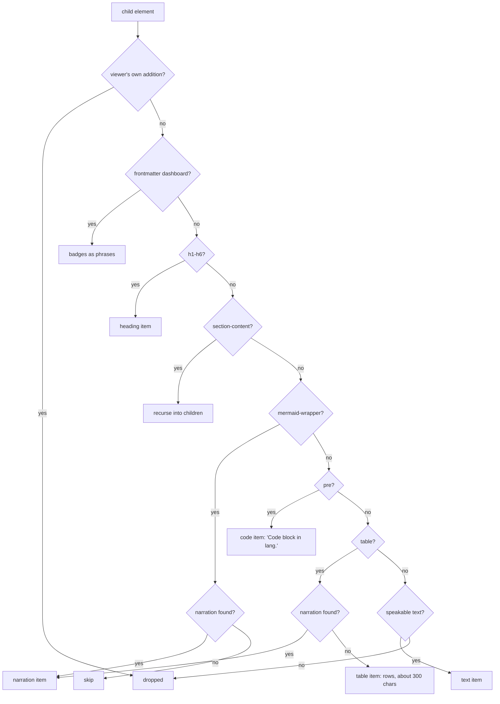
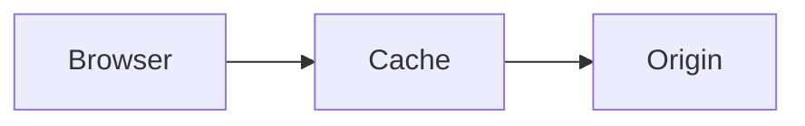
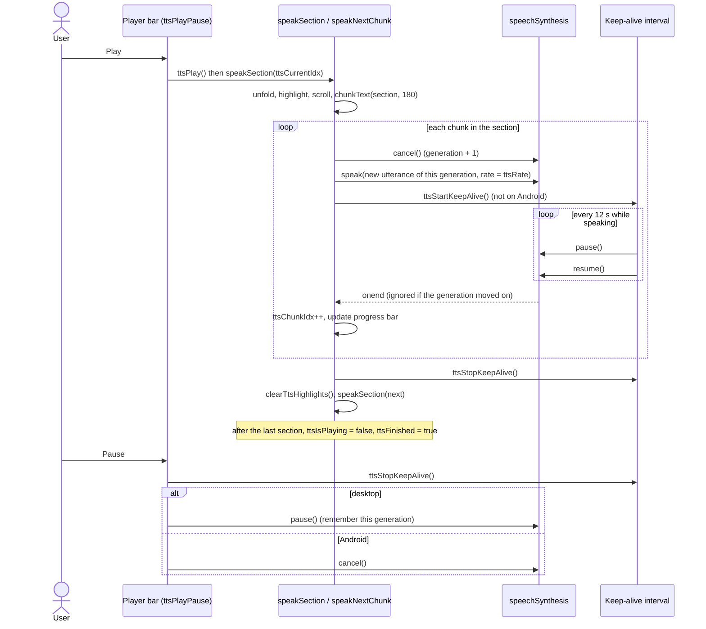

# Read aloud (text-to-speech)

The viewer can read the rendered document aloud, one section at a time, using the browser's built-in Web Speech API (`window.speechSynthesis`). The viewer itself sends nothing to a server and bundles no voices: whatever voices the browser and operating system provide are what you hear. Note that some browser voices are network voices (for example Chrome's "Google" voices), in which case the browser itself may send the text to its speech service; that is browser behaviour, not something this code controls.

The engine lives in `js/read-aloud.js`, under the banner comment `TTS (Text-to-Speech) Engine`. It borrows three helpers from `js/navigation.js`: `mdvExcludedFromText` (what is not the author's words), `mdvHeadingText` (a heading's own words) and `mdvUnfold` (unfold the sections around an element). `extractNarrations` in `js/core.js` still runs on every render, but read-aloud no longer uses its result (see [Narration comments](#narration-comments)). Most functions use the `tts` prefix; a few have none (`buildTtsSections`, `findNarrationFor`, `speakSection`, `chunkText`, `speakNextChunk`, `updateTtsUI`, `clearTtsHighlights`), and the text helpers use `mdv`.

This page covers the feature end to end: how the text is collected, how it is split and queued, the Chrome workaround, highlighting, every control, keyboard access, and the known limitations. It describes the code as of the reading-aids change of 2026-10-10. Behaviour marked **(tested)** is covered by `tests/e2e/reading-aids.spec.mjs`, which runs in Chrome against a stand-in `speechSynthesis` that behaves like Chrome's where it matters (a cancel reports `interrupted` a moment later, and does not clear the paused flag). No audio is produced in the tests; real voices were not listened to. Anything reasoned from the code without running it is marked "(inferred)".

## At a glance

| Concern | Function(s) | Notes |
|---|---|---|
| Collect spoken text into sections | `buildTtsSections`, `ttsBuildSections` (inner `extractText`), `ttsEnsureSections` | Built when the player opens, or right after a render while the player is in use |
| The words of one block | `mdvSpeakableText`, `ttsSpecialBlock`, `ttsTableText`, `ttsDashboardText` | Without the viewer's controls; diagrams, tables and code the same wherever they sit; tables by row; images by alt text |
| Keep the place after a re-render | `ttsReconcile` | The same section (same heading, same words) still there: carry on. Otherwise: stop |
| Attach a narration to a diagram or table | `findNarrationFor` | The comment node right before the block |
| Open / close the player | `ttsToggle`, `ttsStop` | Toolbar "Listen" button, or Ctrl/Cmd+Shift+R |
| Start, pause, resume | `ttsPlayPause`, `ttsPlay`, `ttsPause` | Android pauses by cancelling |
| Speak one section | `speakSection` | Unfolds, highlights, scrolls, chunks the text |
| Split text into utterances | `chunkText` | Target of 180 characters per chunk |
| Drive the utterance queue | `speakNextChunk`, `ttsCancel`, `ttsHalt` | One utterance at a time; a generation number makes late events from cancelled utterances harmless |
| Chrome 15-second workaround | `ttsStartKeepAlive`, `ttsStopKeepAlive` | `pause()` + `resume()` every 12 s |
| Navigation | `ttsGoTo`, `ttsNext`, `ttsPrev`, `ttsSeekClick`, `ttsSliderKeys` | Section granularity |
| Speed | `ttsCycleSpeed` | 0.75x to 2x, wraps around, remembered |
| Player UI | `updateTtsUI`, `updateTtsPlayIcon`, `updateTtsSpeedLabel`, `ttsSetStatus`, `ttsSetToggleExpanded`, `clearTtsHighlights` | Label, progress, slider values, button names |
| Names, roles and keys for the controls | `wireTtsPlayer` (runs once at load) | See [Keyboard and screen readers](#keyboard-and-screen-readers) |

## State

The engine keeps its state in script-level variables declared under the banner:

| Variable | Meaning |
|---|---|
| `ttsSections` | Array of `{ heading, items, elements }` built by `ttsBuildSections` |
| `ttsStale` | The sections are out of date (a render happened while the player was not in use) |
| `ttsRebuildQueued` | A rebuild is waiting for the current render to finish (the player is in use) |
| `ttsCurrentIdx` | Index of the section being (or about to be) spoken |
| `ttsIsPlaying` | Whether the engine considers itself playing; gates `speakNextChunk` |
| `ttsRate`, `ttsRates`, `ttsRateIdx` | Current speech rate, the cycle of allowed rates, and the position in that cycle |
| `ttsUtterance` | The most recently created `SpeechSynthesisUtterance` |
| `ttsChunks`, `ttsChunkIdx`, `ttsChunksFor` | The current section's text split into chunks, the next chunk to speak, and which section the chunks belong to |
| `ttsGen` | Generation number, bumped by every cancel; utterance events from an older generation are ignored |
| `ttsPausedGen` | The generation paused mid-utterance on desktop: the only one `resume()` may continue |
| `ttsFinished` | The last section has been read; Play starts again from the top |
| `ttsErrors` | Consecutive utterance errors |
| `ttsReturnFocus` | Where the keyboard focus goes back to when the player closes |
| `ttsKeepAliveTimer` | Interval id of the Chrome keep-alive |
| `ttsSupported` | `speechSynthesis` and `SpeechSynthesisUtterance` both exist |
| `isAndroid` | `/android/i.test(navigator.userAgent)`; changes pause and keep-alive behaviour |

The speed is remembered in `localStorage` under `mdv-tts-rate` (a blocked or unknown value means 1x). The position is not: it resets to the first section on every page load and when the player closes.

## Opening the player

- The toolbar button `#ttsToggleBtn` (label "Listen", tooltip "Read aloud") is hidden until a document has been rendered; `renderMarkdown` makes it visible. It carries `aria-controls="ttsPlayer"` and an `aria-expanded` that follows the player.
- The keyboard shortcut is Ctrl+Shift+R (Cmd+Shift+R on macOS); Caps Lock does not matter (see [features.md](features.md#keyboard-shortcuts)). It is ignored while typing in a text field. The same chord is the browser's hard-reload shortcut; the page calls `preventDefault()`, and whether that wins over the browser in every browser is unverified.
- `ttsToggle` builds the sections if they are stale, shows the fixed bottom bar `#ttsPlayer`, sets the CSS variable `--tts-height` to `64px` (the `.layout` container pads its bottom by it), and **moves the keyboard focus to Play**, so pressing Space starts reading **(tested)**. Toggling again calls `ttsStop`.

Opening the player does not start speech; it only refreshes the label, progress and slider through `updateTtsUI`.

## How sections are built

### When it runs

`renderMarkdown` calls `buildTtsSections` on every render (a document loaded, pasted, or re-rendered after a comment is added or a thread deleted). What happens depends on whether the player is in use:

- **The player is open, reading or paused:** the sections are rebuilt as soon as the render has finished (`ttsBuildSections`, queued as a microtask, so no speech event can come in between), and `ttsReconcile` keeps the listener's place (below). `renderMarkdown` calls `buildTtsSections` before its later passes; the link pass then replaces each paragraph that holds only a link with a link card. Built at that point, the section held the paragraph that was about to leave the page, so its highlight went nowhere, and its words differed from the ones the player had built from the finished page **(tested)**.
- **Otherwise:** the list is emptied and marked stale, and it is built when the player opens (`ttsEnsureSections`, also called by Play and the navigation functions). Most renders are never read aloud, and on a 3,000-section document building the sections takes about 30 ms, so this keeps that work off the render.

Either way the sections are built from the finished page: section folding has run, and Mermaid may already have drawn its diagrams as SVG. A diagram is identified by its `div.mermaid-wrapper` (which the fence renderer emits at parse time) wherever it sits, and is never walked into, so its SVG (a `<style>` element and the node labels) is never read; narration comments stay next to their blocks when sections fold.

### Collecting items: `extractText`

`ttsBuildSections` defines an inner recursive function `extractText(container)` and calls it on `#mdBody`. It walks `container.children` (elements only) and classifies each one:

| Element | Item type | Spoken text |
|---|---|---|
| The viewer's own additions: the section minimap, comment chips, buttons, a link card's icon, address line and badge (`mdvExcludedFromText`) | (dropped) | Nothing. Before, the minimap's segment labels were read, run together, as part of the first section |
| `div.fm-dashboard` (frontmatter) | `text` | Each badge as its own phrase, without the status dot: "In progress. 2026-10-04. 4 Open questions." **(tested)** (`ttsDashboardText`) |
| `h1`-`h6` | `heading` | `mdvHeadingText`: the heading's own words, without the fold chevron, the permalink `#` or comment chips. A `#` the author wrote is kept ("C# tips") **(tested)** |
| `div.section-content` | (recurse) | Its children are processed in order, so nested sections are flattened in document order |
| `div.mermaid-wrapper` with a narration | `narration` | The narration text |
| `div.mermaid-wrapper` without a narration | `skip` | Nothing; diagrams are silent unless narrated |
| `pre` | `code` | "Code block in python." (the language label), or "Code block." for a fence without a language. The code itself is never read |
| A link card (a paragraph that held only a link) | `text` | Its title, the link text: not the type icon, the address line or the badge **(tested)** |
| `table` with a narration | `narration` | The narration text |
| `table` without a narration | `table` | Row by row, cells separated by commas, each row a sentence, up to about 300 characters, then "And 6 more rows." (`ttsTableText`) **(tested)** |
| Anything else with text | `text` | `mdvSpeakableText` (below) |
| Anything else without text | (dropped) | e.g. `hr`, an image with no alt text |

`mdvSpeakableText(el)` gives the words a listener should hear for a block:

- the text, with source line breaks treated as spaces;
- nothing from the viewer's additions or from `aria-hidden` copies: KaTeX's HTML copy of a formula and the TeX source annotation are left out, so **each formula is read once**, from its MathML (for example "E=mc2"), where `textContent` used to repeat it three times ("E=mc2E=mc^2E=mc2") **(tested)**;
- a phrase break after each paragraph, list item, row, definition, quote and other block, and a comma between table cells;
- images by their alt text: "Image: Chart of sales." **(tested)**. An inline SVG with `role="img"` and an `aria-label` is read the same way. An image without alt text says nothing;
- a diagram, table or code block *inside* the block (in a list item, a quote, a callout or `<details>`) is read as it would be at the top level (`ttsSpecialBlock`): a diagram by its narration or not at all, a table by its narration or by rows, code as "Code block in json." **(tested)**. Before, a diagram nested this way was read as its SVG: the stylesheet Mermaid puts inside every diagram (3,425 characters in one case) and the node labels;
- never an element's `<style>`, `<script>` or `<template>`: they are recognised by `localName`, which is lower case for SVG as for HTML. The SVG `<style>` slipped past an upper-case `STYLE` before **(tested)**.



### Grouping into sections

`ttsBuildSections` then folds the flat item list into sections:

- It starts with an implicit section `{ heading: 'Introduction' }` for content before the first heading. That section is kept only if it collected at least one item.
- Every heading, at any level from `h1` to `h6`, closes the current section and opens a new one. The heading text plus a trailing `.` becomes the first spoken item, and the heading element becomes the first highlighted element.
- `skip` items add nothing, neither text nor element.
- Every other item appends its text to `items` and its element to `elements`.

The result is one entry per heading, plus the optional introduction. Sub-headings are not merged into their parent: an `h3` under an `h2` is its own section.

### After a re-render: `ttsReconcile`

When the sections are rebuilt while the player is in use, `ttsReconcile` looks for the section the listener was in: the same heading **and the same words** (first at the same index, then anywhere):

- **Found** (the same document re-rendered, for example after a comment was added, or after an edit elsewhere in the document): the index moves to it. If reading or paused, the new elements are highlighted and reading carries on through the rest of the section's chunks, then on through the new list **(tested)**.
- **Not found** (another document, or the section's own words changed): reading stops (if it was reading or paused) and the position resets to the first section **(tested)**. Matching by heading alone kept reading the closed document whenever the new one shared the heading: every document with text before its first heading has an "Introduction", and two documents can share an "Installation" **(tested)**. Another document whose section is word for word the same is still treated as the same section.

Before, a re-render rebuilt the list but left speech and the index alone, so reading carried on at the old index in whatever the new list was.

## Narration comments

An author can give a diagram or table a spoken description with an HTML comment placed immediately before it:

````markdown
<!-- narrate: The request goes from the browser to the cache, and only on a miss to the origin server. -->

````

Renderers that pass HTML comments through or strip them (GitHub, for example) show nothing, so the source stays portable; a renderer that escapes raw HTML would show the comment as text. The [authoring guide](authoring-guide.md) asks writers to add narration only when it is explicitly wanted, because it adds text to the source.

### Syntax

- Start: `<!--`, optional whitespace, `narrate:` (case-insensitive).
- Body: everything up to the next `-->`, which may span several lines. Leading and trailing whitespace is trimmed.
- Placement: right before a mermaid fence or a table, **anywhere in the document**: under headings, and inside list items, quotes, callouts and `<details>` **(tested)**. Only `div.mermaid-wrapper` and `table` elements consult narrations. A comment in front of a paragraph, list, image or code block has no effect (an image is read by its alt text instead).

### How the narration is found: `findNarrationFor`

Because the markdown-it instance is created with `html: true`, a narration comment passes through as an HTML block and becomes a DOM comment node (`nodeType === 8`). `findNarrationFor(element)` walks `element.previousSibling` backwards over text and comment nodes until it reaches an element. The first comment whose trimmed text starts with `narrate:` wins; its text after the first 8 characters, trimmed, is returned. Other comments in between (for example a comment thread's `MDV-ANCHOR` marker) are stepped over.

This works because section folding keeps comments with their blocks. `addSectionToggles` used to move only *elements* into each `section-content` wrapper and left the comment nodes behind, after the wrapper, so a narration under any `h1`-`h4` heading was never found: in `samples/kitchen-sink.md` all four diagrams and the table lost theirs (roadmap issue 12). It now moves every node, and leaves only the comments and whitespace that come after a section's last element, which belong to whatever follows. The kitchen-sink narration under "Sync flow" is now read **(tested)**. The same change fixed comment threads inside sections and a slow re-render of large documents (see [roadmap.md](roadmap.md)).

`extractNarrations` (in `js/core.js`) still collects every narration from the source into `window._narrations` on each render. Read-aloud used it only as an "is there any narration at all" gate, which also counted narrations shown inside code blocks; it no longer reads it. The DOM is the source of truth.

## Chunking

`speakSection` joins the section's items with newlines and passes the result to `chunkText(text, 180)`. The newline makes every item (heading, paragraph, list, table row) start a new sentence for chunking.

`chunkText(text, maxLen)`:

1. Splits the text into "sentences" with `/[^.!?\n]+[.!?\n]*/g`: a run of characters that are not `.`, `!`, `?` or newline, followed by any run of those terminators. If nothing matches, the whole text is one sentence.
2. Greedily packs sentences into chunks: a sentence is appended to the current chunk unless that would make the chunk longer than `maxLen` (180) *and* the chunk already has content, in which case the chunk is pushed (trimmed) and a new one starts with that sentence.
3. Pushes the last non-empty chunk. If no chunk was produced it returns `['']`.

Consequences:

- Chunks are at most 180 characters only when every sentence is. A single sentence longer than 180 characters becomes one chunk of whatever length it has; it is never cut mid-sentence.
- Abbreviations and decimals ("e.g.", "3.14") also count as boundaries. Because sentences are packed together this usually only moves a chunk boundary, but a boundary there can produce an audible pause (inferred).
- Leading terminator characters at the very start of the text (for example a leading `...`) are not captured by the pattern and are dropped.

## The speech queue

The engine never hands the browser more than one utterance at a time. It chains utterances itself, and it numbers them:

- `ttsCancel()` is the only way speech is cancelled: it bumps `ttsGen`, stops the keep-alive and calls `speechSynthesis.cancel()`. Every utterance remembers the generation it was spoken in, and its `onend` and `onerror` do nothing once the generation has moved on.
- `speakSection(idx)`:
  - if `idx` is past the last section, sets `ttsIsPlaying = false` and `ttsFinished = true`, fills the progress bar and stops. Pressing Play again starts from the first section;
  - otherwise sets `ttsCurrentIdx`, clears old highlights, adds `tts-active` to every element of the section, unfolds every folded section around each of those elements (`mdvUnfold`) and smooth-scrolls the first one to the centre of the viewport, builds `ttsChunks` with `chunkText`, resets `ttsChunkIdx` to 0, calls `updateTtsUI` and then `speakNextChunk`.
- `speakNextChunk`:
  - returns immediately if `ttsIsPlaying` is false (navigation while paused or stopped only moves the cursor);
  - if all chunks are spoken, stops the keep-alive, clears highlights and calls `speakSection(ttsCurrentIdx + 1)`;
  - otherwise calls `ttsCancel()`, clears a paused flag the browser kept after the cancel (`resume()`; a paused browser holds every new utterance in its queue), creates a `SpeechSynthesisUtterance` for the current chunk with `rate = ttsRate`, wires the handlers below, calls `speechSynthesis.speak()` and starts the keep-alive.
- `onend` (current generation only): resets the error count, increments `ttsChunkIdx`, updates the progress bar, and calls `speakNextChunk`.
- `onerror` (current generation only):
  - `canceled` or `interrupted`: something else on the page cancelled speech. Reading stops (`ttsHalt`), so the button does not show Pause while nothing plays;
  - `not-allowed` (the browser refused, for example before any user gesture), or a third error in a row: reading stops and the label says so ("The browser blocked speech. Press Play to try again.", or "Speech failed. Press Play to try again.") **(tested)**. Before, every chunk of the document was skipped in a few milliseconds;
  - anything else: the chunk is skipped.

Why the generation number: the specification reports a `cancel()` of a speaking utterance as an `interrupted` error, and the browser delivers it after the code that cancelled has already started the next utterance. The old `onerror` treated that as a failed chunk and advanced, so Next, Previous, a seek or a speed change skipped the first chunk of the section it had just started. With the generation check, Next while speaking reads the next section from its first chunk **(tested)**.



## The Chrome keep-alive workaround

The code comment above the chunking state reads: "Chrome workaround: speechSynthesis stops after ~15s with Google voices." This is a long-standing Chrome behaviour in which a long utterance spoken with one of Google's network voices silently stops after roughly 15 seconds, with no `end` or `error` event, so the chain would stall.

The code uses two defences together:

1. **Short utterances.** `chunkText` keeps most utterances at or below 180 characters, roughly 30 words, which at 1x is on the order of 10-12 seconds of speech: under the 15-second limit, but not by much, and slower rates (0.75x) can approach it (inferred from typical speaking rates; not measured).
2. **Periodic pause/resume.** `ttsStartKeepAlive` starts a `setInterval` with a 12,000 ms period. Each tick calls `speechSynthesis.pause()` followed immediately by `speechSynthesis.resume()`. If `speechSynthesis.speaking` is false the interval clears itself. `ttsStartKeepAlive` always clears any previous interval first, so at most one runs.

The keep-alive is skipped entirely on Android (`isAndroid`), because, per the code comment, "Android treats pause() as cancel". It is stopped by every cancel (`ttsCancel`), by `ttsPause`, when a section finishes, and on `beforeunload`. It is started by `speakNextChunk` and, since this change, also when Play resumes a paused utterance (before, the rest of that chunk played without it).

## Highlighting and scrolling

- When a section starts, `speakSection` adds the class `tts-active` to every element in `section.elements`: the heading and each block that contributed text. Silent diagrams (the `skip` type) are not highlighted.
- `.md-body .tts-active` gets `background: var(--bg-tts-highlight)` with a 4px radius and a background transition. The token is a translucent green, redefined for dark mode.
- Every folded section around the section's elements is unfolded first, so the highlight and the words being read can be seen (`mdvUnfold`) **(tested)**. Before, only the heading's surroundings were unfolded: after Fold all, the heading reappeared but its own section stayed folded. A closed `<details>` is not opened (its content is read anyway; see [Limitations](#limitations-and-browser-quirks)).
- The first element (normally the heading) is scrolled into view with `scrollIntoView({ behavior: 'smooth', block: 'center' })`.
- Highlighting is per section, not per chunk or per word; there is no `onboundary` handler.
- `clearTtsHighlights` removes `tts-active` from every element in the document. It runs between sections, on navigation, and on stop.
- **Focus mode** (Ctrl/Cmd+.) dims blocks to 30% opacity, but the CSS exempts `.tts-active`. Inside a section wrapper, the rule `.section-content > *:not(.tts-active)` also dims nested headings' `section-content` wrappers, and because opacity compounds, the highlighted blocks inside a nested section (for example the paragraphs of an `h2` under an `h1`) still appear at 30%; only the outermost heading level's content stays fully opaque (inferred from the CSS; not checked in a browser).

## Controls

All controls live in the fixed bar `#ttsPlayer`. Every button names its action with `data-action` (for example `data-action="tts-next"`), which `js/actions.js` runs; there are no inline `onclick` attributes. Their names, roles and the slider's keys are added by `wireTtsPlayer` when the script loads.

| Control | Element | Function | Behaviour |
|---|---|---|---|
| Previous section | first `.tts-btn` (`#ttsPrevBtn`) | `ttsPrev` | `ttsGoTo(ttsCurrentIdx - 1)`, or section 0 if already at the start (so it restarts the first section) |
| Play / Pause | `#ttsPlayBtn` | `ttsPlayPause` | Toggles between `ttsPause` and `ttsPlay`. The icon swaps via `updateTtsPlayIcon`, which also sets the button's name to "Play" or "Pause" |
| Next section | third `.tts-btn` (`#ttsNextBtn`) | `ttsNext` | `ttsGoTo(ttsCurrentIdx + 1)`. On the last section it does nothing and reading continues; the button is marked `aria-disabled="true"` there. Before, it cancelled speech and left the button showing Pause while nothing played |
| Section label | `#ttsSectionLabel` | `updateTtsUI`, `ttsSetStatus` | `"<n>/<total>: <heading>"`, `Ready` when there are no sections, or a message (speech blocked, speech not supported) |
| Progress bar / seek | `#ttsProgressBar` | `ttsSeekClick`, `ttsSliderKeys` | A slider over sections; see below |
| Speed | `#ttsSpeedBtn` | `ttsCycleSpeed` | Cycles 0.75x, 1x, 1.25x, 1.5x, 1.75x, 2x and wraps back to 0.75x. Remembered |
| Close | `.tts-close` (x) | `ttsStop` | Stops everything, hides the bar, and gives the focus back |
| Keyboard | - | `ttsToggle` | Ctrl/Cmd+Shift+R opens the bar (focus on Play), or closes it (not while typing in a text field) |

### Keyboard and screen readers

- The bar is a `region` named "Read aloud". The buttons are named "Previous section", "Play" or "Pause", "Next section", "Speed 1.25x" and "Close the player".
- The progress bar is a `slider` in the Tab order (`tabindex="0"`), named "Section", with `aria-valuemin` 1, `aria-valuemax` the number of sections, `aria-valuenow` the current section and `aria-valuetext` "Section 3 of 12: Background".
- Slider keys: Right or Up, the next section; Left or Down, the previous one; Page Up and Page Down, a tenth of the document; Home and End, the first and last section. Like Previous and Next, they keep reading if it was reading, and otherwise move the cursor.
- Opening the player moves the focus to Play. Closing it while the focus is inside returns the focus to where it was before the player opened, or to the Listen button **(tested)**.
- Tab order inside the bar: Previous, Play, Next, slider, Speed, Close. Every control works with Enter or Space, and the slider with the keys above **(tested)**.

There is still no Media Session integration (hardware media keys are not handled).

### Play, pause and resume

- **Desktop:** `ttsPause` calls `speechSynthesis.pause()` and remembers the generation. The next `ttsPlay` resumes mid-chunk only if nothing moved since (`ttsPausedGen === ttsGen`, and the browser is still paused and speaking), and restarts the keep-alive.
- **Anything else is a fresh start:** `ttsPlay` cancels and then continues at the current chunk of the current section, or starts the section. `speakNextChunk` clears the paused flag the browser can keep after a cancel before it speaks, on every path that speaks. Before, Pause, then Next (or Previous), then Play stayed silent: the new section was never queued, and Play only resumed an empty queue **(tested)**. Pause, then a click on the progress bar, showed Pause while nothing played, and the first press of the button only paused again **(tested)**.
- **Android:** `ttsPause` cancels instead. The next `ttsPlay` speaks the interrupted chunk again (before, it restarted the whole section).
- **After the end:** Play starts from the first section.

### Next and previous while stopped

`ttsGoTo` (behind Next, Previous and the slider keys) does not change `ttsIsPlaying`. When nothing is playing, `speakSection` still unfolds, highlights, scrolls and updates the label and slider, but `speakNextChunk` returns at once. They then act as a cursor: pressing Play starts from the selected section.

### Speed

`ttsCycleSpeed` advances `ttsRateIdx`, sets `ttsRate`, saves it to `localStorage` (`mdv-tts-rate`), and updates the button text (for example `1.25x`) and its name ("Speed 1.25x"). If playing, it calls `speakNextChunk`, so the current chunk restarts at the new rate. The rate applies to each new utterance through `utterance.rate`; how a given voice honours rates above 1 is up to the browser (unverified).

### Progress bar and seeking

- The bar is section-weighted: every section gets an equal share of the width regardless of its length.
- At section start `updateTtsUI` sets the fill to `ttsCurrentIdx / total`. After each chunk, `onend` sets it to `(ttsCurrentIdx + ttsChunkIdx / chunkCount) / total` (a one-chunk section counts as complete).
- A click (`ttsSeekClick`) converts the pointer position into a section index with `Math.floor(pct * total)`, where `pct` comes from `clientX` and the bar's bounding box, and starts reading that section. A click always starts playback, also while paused **(tested)**, and always lands on the start of a section.
- The keyboard keys are listed under [Keyboard and screen readers](#keyboard-and-screen-readers).

### Stop and unload

`ttsStop` cancels, sets `ttsIsPlaying = false`, resets the position to the first section, clears highlights, hides the bar, sets `--tts-height` back to `0px`, sets the Listen button's `aria-expanded` to false, resets the icon and gives the focus back. The rate is kept. A `beforeunload` listener stops the keep-alive and cancels speech so that speech does not continue after the tab navigates away.

### A browser without speech

`ttsSupported` is false when `speechSynthesis` or `SpeechSynthesisUtterance` is missing. The Listen button is still shown (`renderMarkdown` shows it); the player then opens with "Read aloud needs speech support, which this browser does not have." and disabled controls, and nothing throws **(tested)**. Before, Play threw a `ReferenceError`.

## Voice and language

There is no voice picker. The code never calls `speechSynthesis.getVoices()` and never sets `utterance.voice`, `utterance.lang`, `utterance.pitch` or `utterance.volume`. Per the Web Speech API specification, an utterance with no `lang` uses the document's language, which is `en` from `<html lang="en">`, and the browser picks its default voice for that language (behaviour of the API, not of this code). Documents in other languages are therefore read with an English default voice unless the browser decides otherwise (inferred).

## Limitations and browser quirks

| Area | What happens | Where |
|---|---|---|
| Real audio | The tests use a stand-in `speechSynthesis`. The engine's ordering and state are tested; how each browser's real speech engine sounds and times its events was not checked | `tests/e2e/reading-aids.spec.mjs` |
| Android pause | Pause cancels; Play speaks the interrupted chunk again from its start | `ttsPause`, `ttsPlay` |
| Math | Read once, as the MathML characters ("E=mc2"), not as spoken mathematics ("E equals m c squared") | `mdvSpeakableText` |
| Tables | Without narration, at most about 300 characters of rows are read, then the number of rows left out | `ttsTableText` |
| Code | Code blocks are announced by language only ("Code block in python."), also inside lists and `<details>`; the content is never read | `ttsSpecialBlock` |
| Closed `<details>` | Their content is read even when they are closed | `mdvSpeakableText` |
| Long sentences | A sentence over 180 characters becomes one long utterance and relies on the keep-alive alone | `chunkText` |
| Keyboard chord | Ctrl/Cmd+Shift+R is also the browser hard-reload shortcut; the page prevents the default, but which wins in every browser is unverified | `app.js` key handler |
| Focus mode in nested sections | The section being read stays fully opaque only at the outermost heading level; content of nested sections remains dimmed because its wrapper is dimmed (inferred from CSS) | focus-mode CSS rules |
| Granularity | Highlight, progress and navigation are per section; there is no word or sentence tracking | `speakSection`, `updateTtsUI` |
| Position | The position is not saved between sessions (the speed is) | script state |

Fixed by the reading-aids change (2026-10-10), each covered by a test: narration under headings (issue 12), and inside lists, quotes, callouts and `<details>`; a diagram in those containers read as its stylesheet; a link card read as its icon, address and badge; another document that shares a section name (or the "Introduction") read on in the closed one; Pause, then a seek, showing Pause while silent; the section being read left folded after Fold all; speech the browser refuses racing through the document; a chunk skipped after Next, Previous, a seek or a speed change; silence after Pause then Next then Play; reading continuing at a stale index after a re-render; the minimap's labels and the dashboard read run together; a heading's `#` deleted; formulas read three times; tables read as one run of text; images and inline SVG labels ignored; the keep-alive not restarted after a resume; a missing `speechSynthesis` throwing; Next on the last section falling silent; the speed not remembered; no keyboard access to the progress bar.

## Related documents

- [Authoring guide](authoring-guide.md): when to add `narrate:` comments.
- [Features](features.md): the rest of the reading tools (focus mode, section folding, minimap, keyboard shortcuts).
- [Rendering](rendering.md): the render pipeline that `buildTtsSections` runs inside.
- [Architecture](architecture.md): where the scripts sit and what they own.
- [Roadmap](roadmap.md): planned work.
- [Project README](../README.md)
