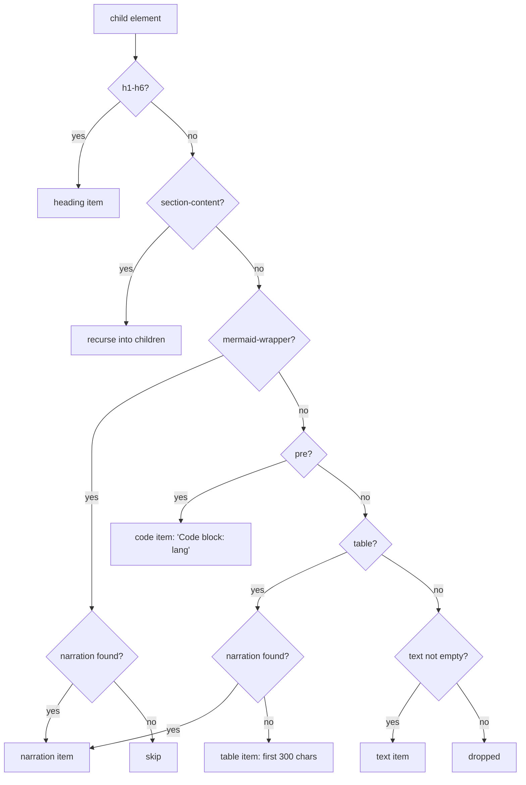
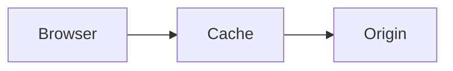
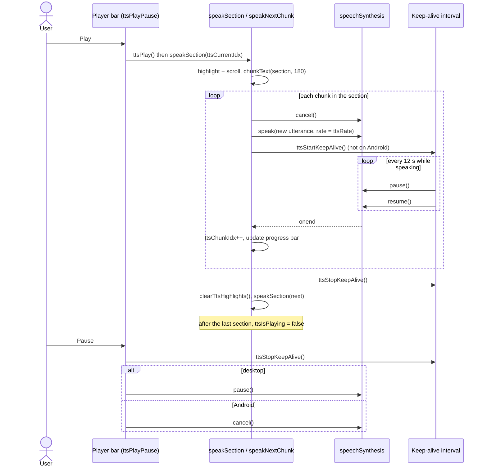

# Read aloud (text-to-speech)

The viewer can read the rendered document aloud, one section at a time, using the browser's built-in Web Speech API (`window.speechSynthesis`). The viewer itself sends nothing to a server and bundles no voices: whatever voices the browser and operating system provide are what you hear. Note that some browser voices are network voices (for example Chrome's "Google" voices), in which case the browser itself may send the text to its speech service; that is browser behaviour, not something this code controls.

All of the code lives in one block of the inline `<script>` in `markdown-viewer.html`, under the banner comment `TTS (Text-to-Speech) Engine`, plus `extractNarrations` (and the unused global `narrationMap`) near the top of the script. These functions do not use the `mdv` prefix of the commenting code: most use `tts`, and a few have no prefix at all (`buildTtsSections`, `findNarrationFor`, `speakSection`, `chunkText`, `speakNextChunk`, `updateTtsUI`, `clearTtsHighlights`).

This page covers the feature end to end: how the text is collected, how it is split and queued, the Chrome workaround, highlighting, every control, and the known limitations. Statements are based on reading the code as of the initial import; anything inferred rather than read is marked "(inferred)".

## At a glance

| Concern | Function(s) | Notes |
|---|---|---|
| Find narration comments in the source | `extractNarrations` | Runs on every render; the result is used only as an on/off gate |
| Collect spoken text into sections | `buildTtsSections` (inner `extractText`) | Runs on every render |
| Attach a narration to a diagram or table | `findNarrationFor` | Looks for a preceding DOM comment node |
| Open / close the player | `ttsToggle`, `ttsStop` | Toolbar "Listen" button, or Ctrl/Cmd+Shift+R |
| Start, pause, resume | `ttsPlayPause`, `ttsPlay`, `ttsPause` | Android pauses by cancelling |
| Speak one section | `speakSection` | Highlights, scrolls, chunks the text |
| Split text into utterances | `chunkText` | Target of 180 characters per chunk |
| Drive the utterance queue | `speakNextChunk` | One utterance at a time, chained through `onend` |
| Chrome 15-second workaround | `ttsStartKeepAlive`, `ttsStopKeepAlive` | `pause()` + `resume()` every 12 s |
| Navigation | `ttsNext`, `ttsPrev`, `ttsSeekClick` | Section granularity only |
| Speed | `ttsCycleSpeed` | 0.75x to 2x, wraps around |
| Player UI | `updateTtsUI`, `updateTtsPlayIcon`, `clearTtsHighlights` | Label, progress bar, play/pause icon |

## State

The engine keeps its state in module-level variables declared just under the banner:

| Variable | Meaning |
|---|---|
| `ttsSections` | Array of `{ heading, items, elements }` built by `buildTtsSections` |
| `ttsCurrentIdx` | Index of the section being (or about to be) spoken |
| `ttsIsPlaying` | Whether the engine considers itself playing; gates `speakNextChunk` |
| `ttsRate`, `ttsRates`, `ttsRateIdx` | Current speech rate, the cycle of allowed rates, and the position in that cycle |
| `ttsUtterance` | The most recently created `SpeechSynthesisUtterance` |
| `ttsChunks`, `ttsChunkIdx` | The current section's text split into chunks, and the next chunk to speak |
| `ttsKeepAliveTimer` | Interval id of the Chrome keep-alive |
| `isAndroid` | `/android/i.test(navigator.userAgent)`; changes pause and keep-alive behaviour |

None of this state is persisted. Speed resets to 1x and position resets to the first section on every page load.

## Opening the player

- The toolbar button `#ttsToggleBtn` (label "Listen", tooltip "Read aloud") is hidden until a document has been rendered; `renderMarkdown` makes it visible.
- The keyboard shortcut is Ctrl+Shift+R (Cmd+Shift+R on macOS). The global `keydown` handler checks `mod && e.shiftKey && e.key === 'R'`, where `mod` is `e.ctrlKey || e.metaKey`, calls `preventDefault()` and then `ttsToggle`. Like the other global shortcuts, it is ignored while focus is in an `input` or `textarea`. The shortcut is listed in the shortcuts overlay (`?`) as "Read aloud". The same chord is the browser's hard-reload shortcut; whether the page's `preventDefault()` wins over the browser is browser-dependent (unverified).
- `ttsToggle` shows the fixed bottom bar `#ttsPlayer` and sets the CSS variable `--tts-height` to `64px`. The `.layout` container uses `padding-bottom: var(--tts-height)` so the bar does not cover the end of the document. Toggling again calls `ttsStop`.

Opening the player does not start speech; it only refreshes the label and progress bar through `updateTtsUI`.

## How sections are built

### When it runs

`renderMarkdown` calls `extractNarrations` on the source (after front matter is stripped) and stores the result on `window._narrations`. After the HTML is inserted it runs a series of post-processors, each in its own `try`/`catch`. The order matters for read-aloud:

1. `transformCalloutBlocks`
2. `addSectionToggles` (wraps content under each `h1`-`h4` in a `div.section-content`)
3. `buildToc`
4. `buildSectionMinimap`
5. `buildSearchIndex`
6. `buildTtsSections`
7. `renderMermaidDiagrams` (asynchronous)

So `buildTtsSections` sees the section wrappers, callouts and minimap, but sees mermaid diagrams before they are turned into SVG. It does not need the SVG: diagrams are identified by their `div.mermaid-wrapper`, which the custom fence renderer emits at parse time.

Because `renderMarkdown` runs again whenever a document is loaded, pasted, or a comment is added or a thread deleted (the comment code re-renders to parse new `MDV-ANCHOR` markers), `ttsSections` is rebuilt on each of those events.

### Collecting items: `extractText`

`buildTtsSections` defines an inner recursive function `extractText(container)` and calls it on `#mdBody`. It walks `container.children` (elements only) and classifies each one:

| Element | Item type | Spoken text |
|---|---|---|
| `h1`-`h6` | `heading` | `textContent` with every `#` removed, trimmed (this strips the `#` permalink symbol added by markdown-it-anchor) |
| `div.section-content` | (recurse) | Its children are processed in order, so nested sections are flattened in document order |
| `div.mermaid-wrapper` with a narration | `narration` | The narration text |
| `div.mermaid-wrapper` without a narration | `skip` | Nothing; diagrams are silent unless narrated |
| `pre` | `code` | `"Code block: "` followed by the text of `.code-header span`, i.e. the language label (`text` when the fence has no language). Indented code blocks have no `.code-header` (only fenced blocks go through the `highlight` callback that adds it), so they are announced as just "Code block:". The code itself is never read |
| `table` with a narration | `narration` | The narration text |
| `table` without a narration | `table` | The table's `textContent`, trimmed and cut to the first 300 characters |
| Anything else with non-empty text | `text` | `textContent`, trimmed |
| Anything else with empty text | (dropped) | e.g. `hr`, a paragraph containing only an image |

Notes on the generic `text` branch, all following from `textContent`:

- Lists, blockquotes, callouts, definition lists, footnote sections and HTML blocks are read as their plain text.
- An image inside other text contributes nothing; `alt` text is not part of `textContent`. An image alone in its paragraph gets a visible caption (its title, or its alt text) from `mdvCaptionImages`, and that caption is read.
- Every other element sitting directly in `#mdBody` or a `section-content` is read too, including the front-matter dashboard (`.fm-dashboard`) (inferred; see [Limitations](#limitations-and-browser-quirks)). The section minimap is not read: its labels are drawn by CSS, so its `textContent` is empty.



### Grouping into sections

`buildTtsSections` then folds the flat item list into sections:

- It starts with an implicit section `{ heading: 'Introduction' }` for content before the first heading. That section is kept only if it collected at least one item.
- Every heading, at any level from `h1` to `h6`, closes the current section and opens a new one. The heading text plus a trailing `.` becomes the first spoken item (the period gives the voice a sentence break), and the heading element becomes the first highlighted element.
- `skip` items add nothing, neither text nor element.
- Every other item appends its text to `items` and its element to `elements`.

The result is one entry per heading, plus the optional introduction. Sub-headings are not merged into their parent: an `h3` under an `h2` is its own section.

## Narration comments

An author can give a diagram or table a spoken description with an HTML comment placed immediately before it:

````markdown
<!-- narrate: The request goes from the browser to the cache, and only on a miss to the origin server. -->

````

Renderers that pass HTML comments through or strip them (GitHub, for example) show nothing, so the source stays portable; a renderer that escapes raw HTML would show the comment as text. The [authoring guide](authoring-guide.md) asks writers to add narration only when it is explicitly wanted, because it adds text to the source.

### Syntax

- Start: `<!--`, optional whitespace, `narrate:` (case-insensitive).
- Body: everything up to the next `-->`, which may span several lines. Leading and trailing whitespace is trimmed.
- Placement: before a mermaid fence or a table. Only `div.mermaid-wrapper` and `table` elements consult narrations. A comment in front of a paragraph, list, image or code block has no effect, even though the banner comment above `extractNarrations` mentions images.

### `extractNarrations`

`extractNarrations(src)` runs the regular expression `/<!--\s*narrate:\s*([\s\S]*?)-->/gi` over the raw markdown and returns `{ cleaned: src, narrations: [{ text, endPos, fullMatch }] }`. `renderMarkdown` stores `narrations` on `window._narrations`.

In practice that array is used only as a gate: `findNarrationFor` returns `null` immediately when it is empty. The positions are never matched to elements, `cleaned` is the unmodified source, and the module-level `narrationMap` is reset to `{}` but never read. The actual narration text comes from the DOM.

### `findNarrationFor`

Because the markdown-it instance is created with `html: true`, a narration comment passes through as an HTML block and becomes a DOM comment node (`nodeType === 8`) when the HTML is inserted. `findNarrationFor(element)`:

1. Walks `element.previousSibling` backwards, skipping text and comment nodes, until it reaches an element. The first comment whose trimmed text starts with `narrate:` wins; its text after the first 8 characters, trimmed, is returned. Other comments in between (for example `MDV-ANCHOR` markers) are skipped over.
2. If nothing was found and the element's parent is a `div.section-content`, it repeats the same walk starting from the parent's previous sibling.
3. Otherwise it returns `null`.

There is an important interaction with section folding. `addSectionToggles` moves only *elements* into each `section-content` wrapper (it iterates with `nextElementSibling`), and inserts the wrapper directly after the heading. Comment nodes are left behind in the original parent, after the wrapper. As a result, for a diagram or table inside any `h1`-`h4` section, the backward walk meets the previous element (or, for the first child, the heading itself) before it meets the comment, and no narration is found. **Verified in Chrome with `samples/kitchen-sink.md`.** Its `narrate:` comment ends up as a direct child of `.md-body` with no following element. `findNarrationFor` returns `null` for all four diagrams and the table, which all sit inside `.section-content`, and no narration text reaches `ttsSections`. Narration therefore works only for diagrams and tables that come before the first `h1`-`h4` heading. This is recorded in the [limitations](#limitations-and-browser-quirks) below.

## Chunking

`speakSection` joins the section's items with single spaces and passes the result to `chunkText(text, 180)`.

`chunkText(text, maxLen)`:

1. Splits the text into "sentences" with `/[^.!?\n]+[.!?\n]*/g`: a run of characters that are not `.`, `!`, `?` or newline, followed by any run of those terminators. If nothing matches, the whole text is one sentence.
2. Greedily packs sentences into chunks: a sentence is appended to the current chunk unless that would make the chunk longer than `maxLen` (180) *and* the chunk already has content, in which case the chunk is pushed (trimmed) and a new one starts with that sentence.
3. Pushes the last non-empty chunk. If no chunk was produced it returns `['']`.

Consequences:

- Chunks are at most 180 characters only when every sentence is. A single sentence longer than 180 characters becomes one chunk of whatever length it has; it is never cut mid-sentence.
- Newlines count as sentence ends, so table rows and list items (which carry newlines in their `textContent`) give natural boundaries.
- Abbreviations and decimals ("e.g.", "3.14") also count as boundaries. Because sentences are packed together this usually only moves a chunk boundary, but a boundary there can produce an audible pause (inferred).
- Leading terminator characters at the very start of the text (for example a leading `...`) are not captured by the pattern and are dropped.

## The speech queue

The engine never hands the browser more than one utterance at a time. It chains utterances itself:

- `ttsPlay` sets `ttsIsPlaying = true` and calls `speakSection(ttsCurrentIdx)`, unless `speechSynthesis.paused` is true, in which case it calls `speechSynthesis.resume()` and returns.
- `speakSection(idx)`:
  - if `idx` is past the last section, sets `ttsIsPlaying = false`, updates the icon and stops. `ttsCurrentIdx` is left on the last section, so pressing Play again replays the last section rather than starting from the top;
  - otherwise sets `ttsCurrentIdx`, clears old highlights, adds `tts-active` to every element of the section, smooth-scrolls the first element to the centre of the viewport, builds `ttsChunks` with `chunkText`, resets `ttsChunkIdx` to 0, calls `updateTtsUI` and then `speakNextChunk`.
- `speakNextChunk`:
  - returns immediately if `ttsIsPlaying` is false;
  - if all chunks are spoken, stops the keep-alive, clears highlights and calls `speakSection(ttsCurrentIdx + 1)`;
  - otherwise calls `speechSynthesis.cancel()` to drop anything pending, creates a `SpeechSynthesisUtterance` for the current chunk with `rate = ttsRate`, wires the handlers below, calls `speechSynthesis.speak()` and starts the keep-alive.
- `onend`: increments `ttsChunkIdx`, updates the progress bar, and calls `speakNextChunk`.
- `onerror`: if `e.error` is anything other than `'canceled'`, it skips the chunk (increments `ttsChunkIdx`) and calls `speakNextChunk`. A `'canceled'` error is ignored, which ends the chain.



## The Chrome keep-alive workaround

The code comment above the chunking state reads: "Chrome workaround: speechSynthesis stops after ~15s with Google voices." This is a long-standing Chrome behaviour in which a long utterance spoken with one of Google's network voices silently stops after roughly 15 seconds, with no `end` or `error` event, so the chain would stall.

The code uses two defences together:

1. **Short utterances.** `chunkText` keeps most utterances at or below 180 characters, roughly 30 words, which at 1x is on the order of 10-12 seconds of speech: under the 15-second limit, but not by much, and slower rates (0.75x) can approach it (inferred from typical speaking rates; not measured).
2. **Periodic pause/resume.** `ttsStartKeepAlive` starts a `setInterval` with a 12,000 ms period (the comment says it "Must be under 15s"). Each tick calls `speechSynthesis.pause()` followed immediately by `speechSynthesis.resume()`. If `speechSynthesis.speaking` is false the interval clears itself. `ttsStartKeepAlive` always clears any previous interval first, so at most one runs.

The keep-alive is skipped entirely on Android (`isAndroid`), because, per the code comment, "Android treats pause() as cancel". It is stopped by `ttsPause`, `ttsStop`, `ttsNext`, `ttsPrev`, `ttsCycleSpeed`, when a section finishes, and on `beforeunload`.

It is started only from `speakNextChunk`. Resuming after a desktop pause (`ttsPlay` taking the `resume()` path) does not restart it, so the remainder of that chunk plays without the keep-alive (inferred). With short chunks this rarely matters.

## Highlighting and scrolling

- When a section starts, `speakSection` adds the class `tts-active` to every element in `section.elements`: the heading and each block that contributed text. Silent diagrams (the `skip` type) are not highlighted.
- `.md-body .tts-active` gets `background: var(--bg-tts-highlight)` with a 4px radius and a background transition. The token is a translucent green, redefined for dark mode.
- The first element (normally the heading) is scrolled into view with `scrollIntoView({ behavior: 'smooth', block: 'center' })`.
- Highlighting is per section, not per chunk or per word; there is no `onboundary` handler.
- `clearTtsHighlights` removes `tts-active` from every element in the document. It runs between sections, on navigation, and on stop.
- **Focus mode** (Ctrl/Cmd+.) dims blocks to 30% opacity, but the CSS exempts `.tts-active`. Headings and `section-content` wrappers are exempt only when they are direct children of `.md-body`. Inside a wrapper, the rule `.section-content > *:not(.tts-active)` also dims nested headings' `section-content` wrappers, and because opacity compounds, the highlighted blocks inside a nested section (for example the paragraphs of an `h2` under an `h1`) still appear at 30%; only the outermost heading level's content stays fully opaque (inferred from the CSS; not checked in a browser).

## Controls

All controls live in the fixed bar `#ttsPlayer`. Every button is wired with an inline `onclick`.

| Control | Element | Function | Behaviour |
|---|---|---|---|
| Previous section | first `.tts-btn` | `ttsPrev` | Stops the keep-alive, cancels speech, clears highlights, then `speakSection(ttsCurrentIdx - 1)`, or section 0 if already at the start (so it restarts the first section) |
| Play / Pause | `#ttsPlayBtn` | `ttsPlayPause` | Does nothing if there are no sections. Otherwise toggles between `ttsPause` and `ttsPlay`. The icon swaps between `#ttsPlayIcon` and `#ttsPauseIcon` via `updateTtsPlayIcon` |
| Next section | third `.tts-btn` | `ttsNext` | Stops the keep-alive, cancels speech, clears highlights, then `speakSection(ttsCurrentIdx + 1)` if there is a next section. On the last section it does not advance: speech is cancelled, but `ttsIsPlaying` stays true, so the button keeps showing Pause while nothing plays (assuming the browser reports `'canceled'`; see the cancel-versus-interrupt row in [Limitations](#limitations-and-browser-quirks)) |
| Section label | `#ttsSectionLabel` | `updateTtsUI` | Shows `"<n>/<total>: <heading>"`, or `Ready` when there are no sections |
| Progress bar / seek | `#ttsProgressBar` | `ttsSeekClick` | See below |
| Speed | `#ttsSpeedBtn` | `ttsCycleSpeed` | Cycles 0.75x, 1x, 1.25x, 1.5x, 1.75x, 2x and wraps back to 0.75x. Starts at 1x |
| Close | `.tts-close` (x) | `ttsStop` | Stops everything and hides the bar |
| Keyboard | - | `ttsToggle` | Ctrl/Cmd+Shift+R opens the bar, or closes it via `ttsStop` (not while typing in an `input` or `textarea`) |

There are no keyboard shortcuts for play, pause, next, previous or speed, and no Media Session integration (hardware media keys are not handled).

### Play, pause and resume

- **Desktop:** `ttsPause` calls `speechSynthesis.pause()`. The next `ttsPlay` sees `speechSynthesis.paused` and calls `resume()`, so speech continues mid-chunk.
- **Android:** `ttsPause` calls `speechSynthesis.cancel()` instead. On the next `ttsPlay`, `paused` is false, so `speakSection(ttsCurrentIdx)` restarts the *current section from its first chunk*. The code comment says "just track position", but only the section index is kept.

### Next and previous while stopped

`ttsNext` and `ttsPrev` do not change `ttsIsPlaying`. When nothing is playing, `speakSection` still highlights, scrolls and updates the label, but `speakNextChunk` returns at once. They then act as a cursor: pressing Play starts from the selected section.

### Speed

`ttsCycleSpeed` advances `ttsRateIdx`, sets `ttsRate`, and updates the button text to the rate followed by `x` (for example `1.25x`). If playing, it cancels the current utterance and calls `speakNextChunk` so the current chunk restarts at the new rate. The rate applies to each new utterance through `utterance.rate`; how a given voice honours rates above 1 is up to the browser (unverified).

### Progress bar and seeking

- The bar is section-weighted: every section gets an equal share of the width regardless of its length.
- At section start `updateTtsUI` sets the fill to `ttsCurrentIdx / total`. After each chunk, `onend` sets it to `(ttsCurrentIdx + ttsChunkIdx / chunkCount) / total` (a one-chunk section counts as complete).
- `ttsSeekClick` converts the click position (`e.offsetX / bar.clientWidth`) into a section index with `Math.floor(pct * total)`, cancels speech, clears highlights, sets `ttsIsPlaying = true` and calls `speakSection` for that index. Seeking always starts playback and always lands on the start of a section.

### Stop and unload

`ttsStop` stops the keep-alive, cancels speech, sets `ttsIsPlaying = false`, resets `ttsCurrentIdx` to 0, clears highlights, hides the bar, sets `--tts-height` back to `0px` and resets the icon. The rate is not reset. A `beforeunload` listener stops the keep-alive and cancels speech so that speech does not continue after the tab navigates away.

## Voice and language

There is no voice picker. The code never calls `speechSynthesis.getVoices()` and never sets `utterance.voice`, `utterance.lang`, `utterance.pitch` or `utterance.volume`. Per the Web Speech API specification, an utterance with no `lang` uses the document's language, which is `en` from `<html lang="en">`, and the browser picks its default voice for that language (behaviour of the API, not of this code). Documents in other languages are therefore read with an English default voice unless the browser decides otherwise (inferred).

## Limitations and browser quirks

| Area | What happens | Where |
|---|---|---|
| No feature detection | `speechSynthesis` is used directly. In an environment without it, Play throws a `ReferenceError`, while the Listen button is still shown (inferred) | `ttsPlay`, `ttsStop` |
| Narration inside sections | Narration comments before a diagram or table under any `h1`-`h4` heading are never found, because `addSectionToggles` leaves comment nodes outside the wrapper (verified in Chrome with `samples/kitchen-sink.md`) | `findNarrationFor`, `addSectionToggles` |
| Cancel versus interrupt | The spec reports a `cancel()` of a speaking utterance as `'interrupted'`, not `'canceled'`. `onerror` treats `'interrupted'` as a failure and advances the chunk index, which can race with the new chain started by Next, Previous, Seek or Speed and skip a chunk (inferred; browser-dependent) | `speakNextChunk` `onerror`, `ttsNext`, `ttsPrev`, `ttsSeekClick`, `ttsCycleSpeed` |
| Navigation while paused (desktop) | Next / Previous / Seek cancel speech but do not call `resume()`. If the browser keeps its paused flag after `cancel()`, newly queued speech stays silent, and the next Play only calls `resume()` on an empty queue (unverified) | `ttsNext`, `ttsPrev`, `ttsSeekClick`, `ttsPlay` |
| Android pause | Pause cancels; Play restarts the current section from the beginning | `ttsPause`, `ttsPlay` |
| Re-render while playing | Loading another document, adding a comment or deleting a thread re-runs `renderMarkdown` and rebuilds `ttsSections`, but nothing stops speech or resets `ttsCurrentIdx`. The rest of the old section's chunks are still spoken, then playback continues at the old index in the new section list (inferred) | `renderMarkdown`, `buildTtsSections` |
| Extra blocks read | The front-matter dashboard is a direct child of `#mdBody`, so its text is read as part of the first section (inferred). The section minimap used to be read the same way, its labels run together; since its labels are drawn by CSS it is silent | `extractText`, `renderFrontmatterDashboard` |
| Math | KaTeX output carries both MathML (including the TeX source annotation) and HTML glyphs, so `textContent` repeats a formula in several forms (inferred) | `extractText`, `renderMath` |
| `#` in headings | Every `#` is removed from heading text, so "C# basics" is read as "C basics" | `extractText` |
| Tables | Without narration, only the first 300 characters of the table text are read, with no column or row cues | `extractText` |
| Code | Code blocks are announced by language only ("Code block: python"); content is never read | `extractText` |
| Images | Never announced; `alt` text is ignored | `extractText` |
| Long sentences | A sentence over 180 characters becomes one long utterance and relies on the keep-alive alone | `chunkText` |
| Keep-alive gap after resume | Resuming from a desktop pause does not restart the keep-alive | `ttsPlay`, `ttsStartKeepAlive` |
| Keyboard chord | Ctrl/Cmd+Shift+R is also the browser hard-reload shortcut (unverified which wins) | global `keydown` handler |
| Focus mode in nested sections | The section being read stays fully opaque only at the outermost heading level; content of nested sections remains dimmed because its wrapper is dimmed (inferred from CSS) | focus-mode CSS rules |
| Granularity | Highlight, progress and navigation are per section; there is no word or sentence tracking | `speakSection`, `updateTtsUI` |
| No persistence | Speed and position are not saved between sessions | module state |

## Related documents

- [Authoring guide](authoring-guide.md): when to add `narrate:` comments.
- [Features](features.md): the rest of the reading tools (focus mode, section folding, minimap).
- [Rendering](rendering.md): the render pipeline that `buildTtsSections` runs inside.
- [Architecture](architecture.md): where the inline script sits in the single-file app.
- [Roadmap](roadmap.md): planned work.
- [Project README](../README.md)
