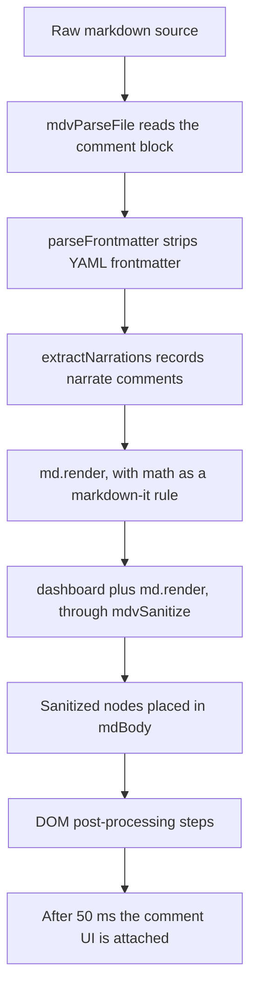

# Rendering pipeline and markdown dialect

This document describes exactly what happens between "a markdown file is opened" and "the page is on screen": which markdown dialect is accepted, which custom transforms run and in what order, what the security posture is, and how each feature degrades in other markdown tools.

Everything here was read from `markdown-viewer.html` as of the initial import. Function names are given so each statement can be checked against the code. Where a statement is inferred rather than read, it says "(inferred)"; where it could not be confirmed, it says "(unverified)". Some behaviour was also checked offline by running the viewer's own parsing functions under Node.js with the vendored libraries (no browser); those checks are marked "(checked offline)".

Related documents: [architecture.md](architecture.md) for the overall structure, [features.md](features.md) for the reading features built on top of the rendered page, [dependencies.md](dependencies.md) for the vendored libraries, [authoring-guide.md](authoring-guide.md) for writing markdown that renders well, and [roadmap.md](roadmap.md) for planned work.

---

## Pipeline overview

Every way of loading a document ends in a call to `renderMarkdown(source, title)`. The callers are `readFile` (file picker and drag and drop), the document-level `paste` listener, `loadFromUrl` (the `?file=` query parameter), `loadDemo` (the `#demo` hash), and the commenting code (`mdvOpenWithHandle`, `mdvAddComment` when a new comment thread is added, and `mdvDeleteThread`; replies and resolve/reopen only redraw the sidebar). Each call re-renders the whole document from the raw source; there is no incremental rendering.

`renderMarkdown` is wrapped once at start-up by the commenting module (the immediately invoked function under the "Hook into renderMarkdown" banner). The effective order is:



| Step | Function | Works on | What it does |
|---|---|---|---|
| 1 | `mdvParseFile` | source text | Reads the `MDV-COMMENTS` block that ends the file (from the last opening token, `mdvLocateBlock`) into the comment list. It does **not** remove anything from the source; the block and the `MDV-ANCHOR` markers are rendered as HTML comments, and the comment code's markdown-it rule adds `data-mdv-block` and `data-mdv-anchor` attributes to top-level blocks. See [commenting.md](commenting.md). |
| 2 | `parseFrontmatter` | source text | Splits off a leading YAML block and parses it with a small hand-written parser. |
| 3 | `extractNarrations` | source text | Records every narration comment. The source is not changed. |
| 4 | `renderFrontmatterDashboard` + `md.render` | source text | Builds the dashboard HTML and renders the markdown with markdown-it. Math is a markdown-it rule now (`js/math.js`), so KaTeX runs during the parse, not in a pre-pass. |
| 5 | `mdvSanitize`, `mdvWireCodeBlocks` | HTML string → DOM nodes | Runs DOMPurify over `dashboardHtml + md.render(...)` and places the result in `#mdBody`, then wires the Copy button of each code block markdown-it rendered (see [Code highlighting](#code-highlighting)). Steps 1–5 are wrapped so that a failure shows an error block with the document's text rather than a blank page. Then the title, breadcrumb, word count and reading time (230 words per minute) are set. |
| 6 | post-processors | DOM | Run in order, each in its own `try`/`catch` so one failure does not stop the rest: `transformCalloutBlocks`, `addSectionToggles`, `buildToc`, `buildSectionMinimap`, `buildSearchIndex`, `buildTtsSections`, `renderMermaidDiagrams`, `setupScrollSpy`, `setupImageLightbox`, `enhanceLinks`, `applyAbbreviationTooltips`, `setupMermaidClickToSection`. |
| 7 | `mdvAttachContextMenu`, `mdvRenderSidebar` | DOM | Scheduled with `setTimeout(..., 50)` by the commenting wrapper. |

One consequence of this order matters for authors:

- `renderMermaidDiagrams` is `async` and is not awaited. The steps after it (including `setupMermaidClickToSection`) run before any diagram has finished rendering. See [Mermaid diagrams](#mermaid-diagrams).

(Math no longer runs as a pre-pass, so it no longer touches code; see [Math (KaTeX)](#math-katex).)

---

## The markdown-it configuration

The parser is created once, at load time, as `const md = window.markdownit({...})`. The vendored build is markdown-it 14.1.0.

| Option | Value | Effect |
|---|---|---|
| `html` | `true` | Raw HTML in the source is passed through unchanged. This includes HTML comments, which is how narration and comment markers survive into the DOM. |
| `linkify` | `true` | Bare URLs (`https://example.com`), `www.` hosts, bare domain names such as `example.com`, and bare e-mail addresses become links. Links without a scheme get an `http://` prefix; e-mail addresses get `mailto:` (checked offline). |
| `typographer` | `true` | `"quotes"` become curly quotes, `--` becomes an en dash, `---` an em dash, `...` an ellipsis, and `(c)`, `(r)`, `(tm)` become symbols. |
| `breaks` | not set (default `false`) | A single newline inside a paragraph is a space, not a line break. Use a blank line, two trailing spaces, or a backslash at the end of the line for a hard break. |
| `xhtmlOut`, `langPrefix`, `quotes` | defaults | `langPrefix` stays `language-`. |
| `highlight` | custom function | See [Code highlighting](#code-highlighting). |

Built-in markdown-it syntax that is always on: CommonMark blocks and inlines, GFM-style tables (with `:---`, `:---:`, `---:` alignment), `~~strikethrough~~`, and `<https://...>` autolinks.

markdown-it's own link validation still applies to markdown link and image syntax: `javascript:`, `vbscript:` and `file:` URLs are refused, and `data:` URLs are refused except `data:image/gif`, `data:image/png`, `data:image/jpeg` and `data:image/webp`. An image written as `` is therefore left as literal text (checked offline). Raw HTML is not subject to this validation.

### Plugins

Each plugin is registered only if its global exists (`if (window.markdownitMark) md.use(...)`), so a missing vendor file silently disables that syntax rather than breaking the page.

| Plugin (version) | Options | Syntax | Example source | Output |
|---|---|---|---|---|
| markdown-it-anchor 9.1.0 or 9.2.0 (no version banner; identified by byte comparison, see [dependencies.md](dependencies.md)) | `permalink: markdownItAnchor.permalink.ariaHidden({ placement: 'after', symbol: '#', class: 'header-anchor' })`, custom `slugify` | every heading | `## Sync flow` | `<h2 id="sync-flow" tabindex="-1">Sync flow <a class="header-anchor" href="#sync-flow" aria-hidden="true">#</a></h2>` |
| markdown-it-task-lists 2.1.1 (the file's banner says 2.1.0; see [dependencies.md](dependencies.md)) | `{ enabled: true, label: true }` | `- [ ]` and `- [x]` list items | `- [x] Persist the queue` | a checkbox inside a `<label>`; `enabled: true` means the checkbox is clickable |
| markdown-it-footnote 4.0.0 | none | `[^id]` references, `[^id]: text` definitions, inline `^[text]` | `Counters first[^ordering].` | numbered `<sup class="footnote-ref">` links and a `<section class="footnotes">` at the end, with back-links |
| markdown-it-mark 4.0.0 | none | `==text==` | `==important==` | `<mark>important</mark>` |
| markdown-it-sub 2.0.0 | none | `~text~` (no unescaped spaces inside) | `H~2~O` | `H<sub>2</sub>O` |
| markdown-it-sup 2.0.0 | none | `^text^` (no unescaped spaces inside) | `2^10^` | `2<sup>10</sup>` |
| markdown-it-deflist 3.0.0 | none | a term line followed by `: definition` (or `~ definition`) | `Tombstone`<br>`: A deletion marker.` | `<dl><dt>Tombstone</dt><dd>A deletion marker.</dd></dl>` |
| markdown-it-abbr 2.0.0 | none | a definition line `*[ABBR]: Full text` anywhere in the document | `*[CRDT]: Conflict-free Replicated Data Type` | every whole-word `CRDT` in the text becomes `<abbr title="...">CRDT</abbr>`; the definition line itself is not shown |

Notes:

- Task list checkboxes are clickable because of `enabled: true`, but no code listens to them. Ticking one changes only the on-screen checkbox; the source is not edited and the state is lost on the next render (inferred: there are no references to `task-list-item-checkbox` in the script).
- Footnote targets are `#fn1`, `#fn2`, and back-links are `#fnref1`, `#fnref2`, so [link enhancement](#link-enhancement) classifies them as section links.
- `~~a~~` is strikethrough (built in) and `~a~` is subscript (plugin). Other tools disagree on single tildes; see the [portability table](#portability).

---

## Custom transforms

### Frontmatter

**Function:** `parseFrontmatter(src)`, then `renderFrontmatterDashboard(meta)`.

**Detection.** The regex `^---\s*\n([\s\S]*?)\n---\s*\n` must match at the very first character of the file. Consequences (checked offline):

- A byte-order mark or a blank line before the opening `---` means no frontmatter is detected.
- The closing `---` must be followed by a newline. A file that ends immediately after the closing `---` is not detected, and markdown then renders the block as a horizontal rule followed by a setext heading.

When it matches, the YAML block is removed from the source before anything else sees it, and the parsed object is stored on `window._frontmatter`.

**Parser.** This is not a YAML library. Line by line:

| Line shape | Result |
|---|---|
| `key: value` at column 0 | `meta.key = "value"` (a leading quote character and a trailing quote character, `"` or `'`, are each removed) |
| `key:` with nothing after it, at column 0 | `meta.key = []` and following indented lines feed this list |
| indented `- text` | a string pushed onto the current list |
| indented `- key: value` | starts a new object `{ key: value }` in the current list |
| indented `key: value` (no dash) | adds a field to the object started by the previous `- key: value` line; ignored if there is no such object |
| anything else | ignored |

Nested maps, inline lists such as `[a, b]`, multi-line strings and anchors are not supported. CRLF line endings work: the carriage return is not matched by `.` in the line regexes, so values and quotes are handled as with LF (checked offline).

**Dashboard.** `renderFrontmatterDashboard` returns nothing unless at least one of `status`, `metrics` or `repos` is present. A `status:` or `date:` key with no value is parsed as an empty list, which the dashboard code does not expect: it calls string methods on it and throws, and because the dashboard is built before the document HTML is assigned, nothing renders (checked offline).

| Field | Shape | Rendering |
|---|---|---|
| `status` | string | A badge. The value is lower-cased and stripped to `a-z` and `-`. If it contains `ship` the badge is `shipped` (green), else `progress` gives `in-progress` (yellow), else `block` gives `blocked` (red), otherwise `draft` (grey). The original text is shown. |
| `date` | string | Shown as plain text next to the badge. Only shown if the dashboard renders at all. |
| `metrics` | list of `- label:` / `value:` objects | A row of stat cards, value above label. |
| `repos` | list of `- name:` / `github:` objects | A badge per entry; with `github` it is a link (opens in a new tab) prefixed with a star glyph, without it a plain badge. Any other field, such as `branch`, is parsed and ignored. |
| `title` | string | Parsed, never displayed. The toolbar title is always the last path segment of the name passed to `renderMarkdown`. |
| `abbreviations` | intended as a map | See [Abbreviations](#abbreviations). It does not work as written. |

### Narration comments

**Function:** `extractNarrations(src)`.

The regex `<!--\s*narrate:\s*([\s\S]*?)-->` (case-insensitive) collects every narration comment into `window._narrations`. Nothing reads that list any more: the narration text that is spoken is read from the DOM comment node right before the diagram or table, by `findNarrationFor`. Section folding keeps that comment next to its block, under headings too. Narration is consumed only for mermaid diagrams and tables. Details are in [read-aloud.md](read-aloud.md).

### Math (KaTeX)

**Functions:** `mdvMathPlugin`, `mdvMathInline`, `mdvMathBlock`, `mdvTypeset` in `js/math.js`; library KaTeX 0.16.11.

Math is a markdown-it rule, not a pre-pass. An inline rule (before `escape`) and a block rule (before `fence`) recognise the math spans; KaTeX typesets them while markdown-it renders. Because markdown-it tokenizes code spans and code blocks before inline rules run, **math is never detected inside code** — the long-standing dollar-sign bug (roadmap issue 8) is fixed at its root.

The dialect follows Pandoc's `tex_math_dollars` rules:

| Form | Rule |
|---|---|
| Inline <code>&#36;...&#36;</code> | The character after the opening <code>&#36;</code> must not be a space, the character before the closing <code>&#36;</code> must not be a space, and the closing <code>&#36;</code> must not be followed by a digit. A `\$` is a literal dollar and never opens or closes; a backtick or an HTML comment opening (`<!--`) inside the span cancels it (the code span or comment wins). So <code>&#36; a + b &#36;</code>, with spaces inside the dollars, is text, as in Pandoc; before math moved into markdown-it it was typeset. Write <code>&#36;a + b&#36;</code>. |
| Inline display <code>&#36;&#36;...&#36;&#36;</code> | Two dollars, content, two dollars, within a line. |
| Block display <code>&#36;&#36;</code> … <code>&#36;&#36;</code> | A line starting with <code>&#36;&#36;</code> up to the first line ending with <code>&#36;&#36;</code> (<code>&#36;&#36; x &#36;&#36;</code> on one line counts). It may not contain a blank line. Rendered as a paragraph holding a `katex-display` span, so spacing, comments and read-aloud treat it as a paragraph. |

Both paths use `throwOnError: false`, and `trust` keeps its default `false`, so `\href`, `\url` and `\includegraphics` stay disabled. When KaTeX is not loaded, or a formula throws, the TeX is shown as a `code.mdv-math-source` element (the source, readable, with the error in its `title`) rather than disappearing.

What this means for the cases that used to break (all now covered by `tests/fixtures/math-dollars.md` and the `render-correctness.spec.mjs` test):

- Two prices on one line — <code>costs &#36;5 and &#36;10</code> — stay text: the space after the first <code>&#36;</code> stops it being math, and the digit after the second rules out the other pairing.
- Dollars inside inline code or a fenced block (<code>echo &#36;HOME &#36;PATH</code>) stay code: code is tokenized first.
- A narration or comment marker that mentions dollars is left alone: on its own line it is an HTML block, never inline text, and inside a paragraph it cancels any formula that would run into it (<code>&#36;x &lt;!-- narrate: y&#36; --&gt;</code> stays text and a comment).
- A literal dollar in prose can still be written `&#36;`, but it is no longer required to avoid accidental math.

### markdown-it render

`md.render(processed)` runs with the configuration from [The markdown-it configuration](#the-markdown-it-configuration) plus one renderer override:

**Mermaid fence override.** `md.renderer.rules.fence` is replaced. A fence whose info string, trimmed, is exactly `mermaid` (case-sensitive; backtick or tilde fences both work) becomes:

```html
<div class="mermaid-wrapper"><pre class="mermaid" id="mermaid-N">escaped diagram source</pre></div>
```

where `N` is the token index. ` ```Mermaid ` or ` ```mermaid title ` are not matched and render as ordinary code blocks (checked offline). Every other fence goes to the default renderer, which calls the `highlight` hook.

### Mermaid diagrams

**Function:** `renderMermaidDiagrams()`; library mermaid 11.4.1.

**Initialisation.** The function returns at once if the `mermaid` global is missing or if there is no unrendered diagram. Otherwise, on every call, before rendering, it calls:

```js
mermaid.initialize({ startOnLoad: false, theme: t, securityLevel: 'loose' });
```

where `t` is `'dark'` when the viewer theme is `dark` and `'default'` otherwise (so the `light` and `sepia` themes both use mermaid's default theme). `startOnLoad: false` means mermaid never scans the page by itself; the viewer drives every render. The `securityLevel` it asks for has no effect: `mdvPinMermaidSecurity` in `js/render.js` wraps `mermaid.initialize` at load so every call runs at `'strict'`, and a `%%{init}%%` directive in a diagram cannot change it either (see [Security posture](#security-posture)).

**Lifecycle.**

1. Select every `.mermaid` element that does not yet have the class `rendered`. If there are none, stop.
2. For each one, in document order, read the diagram source from `el.textContent` and `await mermaid.render(id + '-svg', code)`.
3. On success: replace the element's content with the returned SVG, add the class `rendered`, and (once per wrapper) prepend an expand button and make the whole wrapper clickable. Both open the diagram overlay (`openDiagramOverlay`): a cloned SVG with zoom from 25% to 400% in 25% steps (`diagramZoom`), mouse-wheel zoom, a fit toggle (`diagramFitToggle`) and Escape to close.
4. On failure: replace the element's content with a red `<pre>` reading `Mermaid error: <message>`. The class `rendered` is not added.

The overlay title comes from a regex test on the diagram source, checked in this order: `sequenceDiagram` gives "Sequence Diagram", `graph TD|TB|LR|RL|BT` gives "Flowchart", then `classDiagram`, `gantt`, `pie`, `erDiagram`, `stateDiagram`; otherwise "Diagram". Diagrams that start with the newer `flowchart` keyword are titled "Diagram". Every test is a case-insensitive substring test, so a diagram not caught by an earlier test (for example a `flowchart`, `erDiagram` or `stateDiagram`) whose text contains the letters `pie` (as in the word "copied") is titled "Pie Chart" (inferred from the regex order).

**Re-render on theme change.** `setTheme` schedules `renderMermaidDiagrams` 100 ms later when a document is loaded. Because step 1 skips elements that already have `rendered`, diagrams that rendered successfully are **not** redrawn: after switching between light and dark, existing diagrams keep the old theme until the document is rendered again (inferred from the selector; not observed in a browser). Diagrams that failed are retried, but their text content is now the error message, so the retry fails with a new error about that text (inferred).

**Timing.** `renderMarkdown` calls `renderMermaidDiagrams()` without awaiting it. The next post-processors run while the first diagram is still rendering. `setupMermaidClickToSection`, which looks for `.mermaid-wrapper svg .node` elements, therefore runs before any diagram SVG is in the page and binds nothing on the initial render (inferred from the control flow; not observed in a browser). The intended behaviour is: a node whose text, slugified, equals a heading's slug, or equals a single word longer than three letters from a heading, scrolls to that heading on click.

### Code highlighting

**Function:** the `highlight(str, lang)` option of `md`; library highlight.js 11.10.0 with its stylesheets `github.min.css` and `github-dark.min.css` (switched by `setTheme`).

1. The label is the fence language, or `text` when there is none.
2. If `lang` is set and `hljs.getLanguage(lang)` knows it (aliases such as `js`, `py`, `sh`, `html` work), the code is highlighted with `hljs.highlight(str, { language: lang })`.
3. Otherwise, or if highlighting throws, the code is HTML-escaped and shown without colouring. There is no automatic language detection (`highlightAuto` is never called).
4. The hook returns a header (`<div class="code-header">` with the label and a Copy button) followed by `<code class="hljs language-...">`. The button is not wired here: after sanitizing, `mdvWireCodeBlocks` gives it `data-action="copy-code"` and marks it as the viewer's own control, but only in a code block that carries this render's key (a markdown-it core rule, `mdv_code_key`, sets it on every fence token). A Copy button a document draws itself, in its own HTML or in a diagram label, does nothing.

Because the returned string does not start with `<pre`, markdown-it wraps it in its own `<pre><code class="language-...">`. The final markup is a `<code>` element nested inside another `<code>`, with the header `<div>` inside the outer one (checked offline). `copyCode` copies `btn.closest('pre').querySelector('code').textContent`, which is the **outer** element, so the copied text starts with the language label and the word "Copy" before the code (verified in Chrome: a `js` block holding `const genuine = true;` copies `jsCopyconst genuine = true;`).

Languages in the vendored highlight.js build (from `hljs.listLanguages()`, checked offline): `bash`, `c`, `cpp`, `csharp`, `css`, `diff`, `go`, `graphql`, `ini`, `java`, `javascript`, `json`, `kotlin`, `less`, `lua`, `makefile`, `markdown`, `objectivec`, `perl`, `php`, `php-template`, `plaintext`, `python`, `python-repl`, `r`, `ruby`, `rust`, `scss`, `shell`, `sql`, `swift`, `typescript`, `vbnet`, `wasm`, `xml`, `yaml`. `toml` works as an alias of `ini`. Notably absent: `dockerfile`, `powershell`, `hcl` (checked offline with `hljs.getLanguage`).

### Link enhancement

**Functions:** `detectLinkType`, `enhanceLinks`, `showLinkTooltip`, `buildLinksPanel`.

Every `<a>` inside the document except heading permalinks (`a.header-anchor`) is classified by its `href`. The first matching rule wins:

| Order | Type | Rule on `href` | Inline decoration (CSS `::after`) | Icon in tooltip, card and panel |
|---|---|---|---|---|
| 1 | `anchor` | starts with `#` | no icon; accent colour, dotted underline | section sign |
| 2 | `email` | starts with `mailto:` | envelope; warning colour | envelope |
| 3 | `file` | ends with `.md`, `.txt`, `.pdf`, `.doc`, `.csv`, `.json`, `.yaml` or `.yml` (case-insensitive) | right arrow | page |
| 4 | `github` | contains `github.com` or `gitlab.com` | outline star | filled star |
| 5 | `npm` | contains `npmjs.com` or `npm.im` | circle | square |
| 6 | `docs` | contains `docs.`, `documentation`, `readme`, `wiki`, `.dev` or `.io/docs` | north-east arrow | book |
| 7 | `external` | anything else | north-east arrow | north-east arrow |

Consequences of the rules: a file link with a fragment such as `notes.md#setup` is not a `file` link; `.dev` matches any URL containing that text; a documentation site that matches none of the patterns is `external`; GitLab links are labelled "GitHub".

What `enhanceLinks` does with each link:

- Sets `data-link-type`, which drives the CSS icon.
- For links whose `href` starts with `http` and whose type is not `anchor` or `file`: sets `target="_blank"` and `rel="noopener noreferrer"`.
- Attaches a hover tooltip (`showLinkTooltip`) with the type icon and label, a shortened URL (for `http` links the host and path, cut to 52 characters plus `...` when longer than 55; for anchors `Jump to: ` followed by the fragment with hyphens turned into spaces; the address for e-mail; the raw `href` otherwise) and a Copy button.
- Collects the link for the links panel (`buildLinksPanel`), grouped in the order external, GitHub, docs, npm, file, section, email, and de-duplicated by `href`.

**Standalone link cards.** Any `<p>` whose only non-whitespace child is a single `<a>` of any type except `anchor` is replaced by a card (`a.link-chip`) with the type icon, the link text (or the URL), the host and path, and the type label. This also happens to a linked image alone in a paragraph, and the image is lost because the card shows only text (inferred). The card does not get the hover tooltip.

Links in the frontmatter dashboard are inside the document body, so they are classified too.

### Abbreviations

There are two mechanisms:

| Mechanism | Source syntax | Status |
|---|---|---|
| markdown-it-abbr plugin | a line `*[ABBR]: Full text` anywhere in the document | Works. Whole-word occurrences in text become `<abbr title="...">`. |
| `applyAbbreviationTooltips(meta)` | an `abbreviations` map in the frontmatter | Does not work as written. `parseFrontmatter` turns `abbreviations:` into an empty list and ignores the indented `KEY: value` lines (there is no list object to attach them to), and `applyAbbreviationTooltips` returns early for any list. Writing the entries as `- KEY: value` also yields a list. (Checked offline.) |

If the frontmatter path did receive a map, it would walk text nodes outside `code`, `pre`, `script`, `style` and callout titles and wrap each whole-word match, longest key first, in `<abbr class="abbr-tooltip" title="...">`. Use the plugin syntax.

### Heading ids and anchors

**Plugin:** markdown-it-anchor, with this slug function:

```js
slugify: s => s.toLowerCase().replace(/[^\w]+/g, '-').replace(/^-|-$/g, '')
```

- Every heading level gets an id (the plugin default level is 1) and `tabindex="-1"`, plus a `#` permalink after the text with `aria-hidden="true"` and class `header-anchor`.
- `\w` is ASCII-only, so accented letters are dropped (`Café` gives `caf`) and a heading with no ASCII letters or digits gets an empty id; a second such heading gets `-1` (checked offline).
- Duplicate slugs get `-1`, `-2` and so on (`uniqueSlugStartIndex` is 1).
- `buildToc` later gives any heading with an empty id the id `heading-N`, where `N` is its position among all headings.
- The TOC, search index, scroll-spy breadcrumb and read-aloud sections use the heading's own words (`mdvHeadingText` in `js/navigation.js`), which leave out the permalink, the fold chevron and comment chips, so a heading such as "C# tips" is listed as "C# tips". The minimap (`buildSectionMinimap`) still removes every `#` character, so it shows "C tips".

Other heading-driven transforms, all keyed on the rendered headings: `addSectionToggles` (fold toggles on H1 to H4), `buildToc` (all levels), `buildSectionMinimap` (only when there are three or more H2 headings), `setupScrollSpy`, `buildSearchIndex` and `buildTtsSections`. They are described in [features.md](features.md).

### Callouts

**Function:** `transformCalloutBlocks()`; types in `CALLOUT_TYPES`.

For every `<blockquote>` in the document (including nested ones and ones inside lists), the first `<p>` found inside it is tested with `^\[!(\w+)\]\s*`. If the captured word, upper-cased, is a known type, the marker is removed, the blockquote gets the classes `callout callout-<type>`, and a `div.callout-title` with an icon and label is inserted as its first child.

Accepted forms (checked offline):

| Source | Result |
|---|---|
| `> [!NOTE]` on its own line, text on the next lines | callout; the marker and the line break after it are removed |
| `> [!note]` | same; matching is case-insensitive |
| `> [!NOTE] Some text` | callout; "Some text" becomes the first line of the body, not a custom title |
| `> [!UNKNOWN]` | unchanged blockquote with the marker visible |

| Marker | Label | Icon | Colour |
|---|---|---|---|
| `[!NOTE]` | Note | information sign | blue |
| `[!TIP]` | Tip | light bulb | green |
| `[!IMPORTANT]` | Important | exclamation mark | violet (`#8B5CF6`) |
| `[!WARNING]` | Warning | warning sign | amber |
| `[!CAUTION]` | Caution | red circle | red |
| `[!TLDR]` | TL;DR | pushpin | cyan |
| `[!DECISION]` | Decision | classical building | deeper violet (`#7C3AED`) |
| `[!COST]` | Cost | money bag | orange |

There is no custom title syntax and no aliases. There is no fold syntax either: `> [!NOTE]- Title` is still turned into a Note callout (the regex stops at `]`), but the `-` and the title stay as the first line of the body (inferred from the regex; the markdown-it output was checked offline).

### Images

Images render as normal `` elements. `setupImageLightbox` makes each one clickable to open it full-size in an overlay. Image paths are resolved by the browser relative to the page URL of the viewer, not relative to the markdown file (inferred: no code rewrites `src`), so relative images only work when the file and its images are served from the right place. Remote images are fetched as soon as the document renders.

---

## Security posture

**Summary: a document is treated as untrusted input. markdown-it still passes raw HTML through (`html: true`), but everything rendered from a document is sanitized with DOMPurify before it reaches the page, Mermaid runs at `securityLevel: 'strict'`, and a Content Security Policy refuses inline script and `javascript:` URLs even if sanitization were bypassed. This closes roadmap issue 7.** Opening an untrusted file is no longer equivalent to running its author's web page; the remaining exposure is the privacy one (a remote image reveals that the file was opened).

| Question | Answer | Where |
|---|---|---|
| Is raw HTML allowed? | Yes, then sanitized. `html: true`, and the output passes through `mdvSanitize` (DOMPurify 3.4.16) before insertion. Without DOMPurify the viewer falls back to `html: false` (raw HTML shown as text). | `md`, `mdvSanitize` in `js/render.js` |
| Is output sanitized? | Yes. DOMPurify removes `<script>`, every `on*` attribute, `javascript:`/`vbscript:` URLs, `<iframe>`/`<object>`/`<embed>`, `<form>`, `<base>`, `<meta>`, `<link>` and `<style>`, and the `data-action` and `data-arg` attributes that name the viewer's actions. It keeps KaTeX MathML and style attributes, inline SVG (minus scripts and handlers), classes, ids, other `data-*` and `aria-*`. A hook strips any `id`/`name` that would collide with one of the viewer's own element ids, including the containers that hold document content (`mdBody`, `diagramZoomContainer`, `mdvThreadList`). | `MDV_SANITIZE_CONFIG`, `mdvSanitize`, `mdvChromeIds` |
| HTML comments | Kept at the top level of the document, where comment anchors and narration are. DOMPurify's `SAFE_FOR_XML` checks stay on (its documentation says to turn them off only for content with no SVG or MathML). On their own they delete a comment that holds `<` plus a letter, digit or `/`, and a whole paragraph, list item or table cell whose text holds one next to an inline comment (`if a<b <!-- note -->`). So a hook runs first: it removes comments nested inside elements (they are invisible, and nothing reads them) and adds a space after each such `<` in a top-level comment. | `beforeSanitizeElements` hook in `js/render.js` |
| Content Security Policy? | Yes: `<meta http-equiv="Content-Security-Policy" content="script-src 'self' file:; object-src 'none'; base-uri 'none'; form-action 'none'">`. No inline script, no `on*=` handler, no `javascript:` URL and no plugin can run. It is the second line of defence, not the boundary: `file:` is in `script-src` because a page opened from disk has an opaque origin that `'self'` does not match, so any script file on the local disk would be allowed if markup could load one; and there is no `default-src`, so styles, fonts, images and `fetch` are not restricted (documents load remote images, and the viewer loads Google Fonts and fetches `?file=` documents). | page `<head>` |
| Mermaid `securityLevel` | `'strict'`, pinned at load so no caller can lower it, and a `%%{init}%%` directive cannot either. At `'strict'` Mermaid ignores `click` directives and refuses `javascript:` links; HTML in labels is still rendered, sanitized by Mermaid's own DOMPurify, which keeps `style` and `data-*` attributes. A directive's `themeCSS` is scoped under the diagram's own id, and an `@import` in it is never fetched (`tests/fixtures/mermaid-directives.md`). Mermaid's SVG reaches the page without `mdvSanitize`: it relies on Mermaid's sanitizing, the action rule below and the CSP. | `mdvPinMermaidSecurity` in `js/render.js` |
| KaTeX `trust` | default (`false`); `\href` and similar are disabled | `js/math.js` |
| The viewer's own controls | No inline handler: every control names an action with `data-action`, run by one delegated listener per event type, which is also what lets the CSP forbid inline script. Markup built from document data sits in `[data-mdv-document]` containers (`#mdBody`, the diagram overlay's `#diagramZoomContainer`, the comment sidebar's `#mdvThreadList`). An action there runs only on an element the viewer marked as its own with `mdvMarkOwnControl`, which keeps the mark in a `WeakSet` no markup can reach. Today that is the Copy button of each code block markdown-it rendered from a fence, proven by a key made for each render. | `js/actions.js`, `mdvWireCodeBlocks` |
| Markdown link URLs | markdown-it refuses `javascript:`, `vbscript:`, `file:` and non-image `data:` URLs in link and image syntax; DOMPurify refuses them again | markdown-it `validateLink`, DOMPurify |
| Comment sidebar | Comment fields are escaped with `mdvEscape`, which leaves quotes alone, and placed inside attributes, so a crafted `MDV-COMMENTS` block can still add attributes to a card (quote-safe escaping is stream C's). What lands cannot act: an `on*` handler is refused by the CSP, and a `data-action` does nothing because `#mdvThreadList` is a document container. A `style` attribute that lands is not stopped, so the card can be restyled or moved over the page below the sidebar's layer (read from the code; not tested). | `mdvRenderThreadCard`, `mdvRenderCommentBody` (stream C) |
| Frontmatter values | escaped with `escapeHtml`; a URL field (`repos[].github`) is quote-escaped (`mdvEscapeAttr`) and is a link only when, parsed the way the browser parses it, it is an `http(s)` URL or a relative path (`java<TAB>script:` is not) | `renderFrontmatterDashboard`, `mdvIsWebOrRelativeLink` |
| Style attributes | Kept (KaTeX needs them), so a document can position an element anywhere and above anything else in the document. `#mdBody` isolates its stacking (`isolation: isolate`), so a document's `z-index` stays inside it and the viewer's fixed controls (toolbar, outline, sidebars, read-aloud player, scroll buttons) stay on top and clickable. | `#mdBody` in `markdown-viewer.html` |

**What a document cannot do**, and how it was checked (`tests/e2e/security.spec.mjs`):

- **Run JavaScript.** `<script>` elements, every `on*` handler attribute, `javascript:`/`vbscript:` URLs (in markdown links, raw `<a>`, SVG links and Mermaid `click` directives), `<svg onload>`, `<iframe srcdoc>` — all are removed by DOMPurify. Over `tests/fixtures/hostile.md` the test asserts that no payload ran (none of ~15 set its flag), that the rendered DOM has no forbidden element and no handler attribute, and, as a second line of defence, that inline script reaching the page another way is refused by the CSP (`script-src-attr` violation, nothing runs).
- **Restyle or cover the viewer.** `<style>`, `<base>` and `<meta>` are removed, so a document cannot hide the toolbar or change the base URL, and a Mermaid directive's CSS stays inside its diagram (`mermaid-directives.md`). An element a document positions over the whole window (`cover.md`) stays below the viewer's controls: `document.elementFromPoint` at the toolbar's Open and Theme buttons, the outline, the scroll button and the comment sidebar's close button returns the control. An `id` or `name` that matches one of the viewer's own element ids is stripped, so a document's `<div id="ttsSectionLabel">` cannot capture the read-aloud player's updates (`hostile.md` also tries `mdBody`, `diagramZoomContainer` and `mdvThreadList`).
- **Press the viewer's buttons.** `press-the-buttons.md` names viewer actions through every route document data takes: its own HTML, a fake Copy button next to hidden text, a guessed code-block key, a Mermaid label (shown again in the diagram overlay) and two comment fields that break out of an attribute in the sidebar. The test clicks each one, then checks that no file picker opened, the theme, focus mode and clipboard are unchanged, and no element that names an action sits outside a document container. The viewer's own Copy and folder buttons, clicked last, still work: the positive control.

What the sanitizer keeps is tested too: `comments-with-markup.md` has a narration that mentions `latency<200ms`, which is kept and read aloud, and a paragraph, a list item and a table cell with `a<b` next to an inline comment, which keep their text.

Still true, and unchanged by this work:

- **Contact other servers.** A remote image loads as soon as the document renders, which tells that server the file was opened and from which IP address. This is a privacy property of remote images, not script; it is noted in the README. Vendoring the fonts (a roadmap item) would remove the viewer's own only third-party request.
- **Draw over its own content.** Inside `#mdBody` a positioned element can cover anything else the document shows, a code block included: a reader who trusts what is on screen can be shown different text from the code block's own, and the viewer's Copy button copies the code block's own text.
- **With a granted file handle.** If the user has granted and still holds read/write permission on a file or workspace folder, the viewer can write to it — but only the viewer's own code now runs, and no document data can press the viewer's buttons, so a document cannot reach those handles.

One related non-security note: the page loads its fonts from Google Fonts (`fonts.googleapis.com`), so opening the viewer makes a network request even for a local file. Without network access the page falls back to system fonts (inferred).

---

## Portability

How each feature of this dialect behaves in other common tools. The other tools were **not tested** for this document; the columns reflect commonly documented behaviour and every cell outside the first column should be read as unverified.

| Feature | This viewer | GitHub | VS Code built-in preview | Obsidian |
|---|---|---|---|---|
| CommonMark, tables, `~~strike~~`, autolinks | yes | yes | yes | yes |
| Bare URL linkify | yes | yes | yes | yes |
| Typographer (curly quotes, dashes) | yes | no | off by default | no |
| Raw HTML | rendered, then sanitized with DOMPurify (scripts, handlers, `javascript:` URLs, frames, forms and `<style>` removed; inline `<svg>` and `style` attributes kept) | sanitized subset (`details`, `kbd`, `sub`, `sup`, `img` and similar); scripts, styles, event attributes and inline `<svg>` removed | rendered, scripts blocked | partially rendered, sanitized |
| YAML frontmatter | stripped; dashboard if `status`, `metrics` or `repos` | shown as a table at the top of the file | hidden | shown as a Properties panel |
| Callouts `NOTE`, `TIP`, `IMPORTANT`, `WARNING`, `CAUTION` | styled | styled (the marker must be alone on the first line) | depends on version | styled |
| Callouts `TLDR`, `DECISION`, `COST` | styled | plain blockquote with the marker visible | plain blockquote | styled (`tldr` is a built-in alias; unknown types get the default callout style) |
| Mermaid fences | rendered, with expand and zoom | rendered | extension needed | rendered |
| Dollar-sign math | rendered by a markdown-it rule, Pandoc's dollar rules, never inside code (see [Math (KaTeX)](#math-katex)) | rendered (MathJax), not inside code | rendered (KaTeX) | rendered (MathJax) |
| ` ```math ` fences | plain code block | rendered | not rendered (unverified) | not rendered (unverified) |
| Code highlighting | 36 bundled languages, no auto-detect | yes | yes | yes |
| Task lists | clickable, not saved | rendered; editable in issues, not in files | rendered (unverified for older versions) | clickable and saved |
| Footnotes, including inline `^[...]` | yes | yes, but inline footnotes are not supported | extension needed | yes |
| `==mark==` | `<mark>` | literal text | literal text | highlighted |
| `~sub~` | subscript | **strikethrough** (GitHub accepts single tildes) | literal text or strikethrough (unverified) | literal text |
| `^sup^` | superscript | literal text | literal text | literal text |
| Definition lists | `<dl>` | plain paragraphs, colon visible | plain paragraphs | plain paragraphs |
| `*[ABBR]: ...` abbreviations | `<abbr>` tooltips | the definition line is shown as text | the definition line is shown as text | the definition line is shown as text |
| Frontmatter `abbreviations` map | not applied (see [Abbreviations](#abbreviations)) | part of the frontmatter table | hidden | a property |
| Heading anchors | ASCII-only slugs | slugs keep Unicode letters and do not collapse repeated hyphens | similar to GitHub | links by heading text |
| `<!-- narrate: ... -->` | read-aloud text for diagrams and tables | hidden | hidden | hidden |
| `MDV-ANCHOR` and `MDV-COMMENTS` comments | comment threads | hidden | hidden | hidden |
| `data:image/png` images | shown | probably not shown (unverified) | shown | shown (unverified) |
| Link type icons, link cards, links panel | yes | no | no | no |
| Heading folding, TOC, minimap | yes | outline menu only | outline view | folding and outline |

Practical rules that follow from the table:

- Prefer `<sub>` over `~sub~` if the file will also be read on GitHub.
- Dollar signs outside math are safe in this viewer now (prices, shell variables in code). `&#36;` is still the most portable way to write a literal dollar across all tools.
- Heading links that use only ASCII letters, digits, spaces and hyphens resolve the same way here and on GitHub.

---

## Rendering limitations in one place

Each item is described in the section linked from it.

| Limitation | Section |
|---|---|
| ~~Dollar-sign math is detected inside code~~ Fixed: math is a markdown-it rule and never matches inside code | [Math (KaTeX)](#math-katex) |
| Frontmatter must start at the first byte and the closing `---` needs a trailing newline | [Frontmatter](#frontmatter) |
| Frontmatter `abbreviations` map never reaches the tooltip code; `title` and `repos[].branch` are not displayed | [Frontmatter](#frontmatter), [Abbreviations](#abbreviations) |
| ~~An empty `status:`/`date:` throws and the document does not render~~ Fixed: fields are coerced to text and render failures are caught | [Frontmatter](#frontmatter) |
| Mermaid diagrams are not redrawn on theme change; failed diagrams are retried with their error text | [Mermaid diagrams](#mermaid-diagrams) |
| Mermaid click-to-section runs before diagrams exist (inferred) | [Mermaid diagrams](#mermaid-diagrams) |
| Overlay title misses `flowchart` and matches `pie` as a substring | [Mermaid diagrams](#mermaid-diagrams) |
| Copy button copies the language label and the word "Copy" as well (verified in Chrome) | [Code highlighting](#code-highlighting) |
| `data:image/svg+xml` images are refused by markdown-it | [The markdown-it configuration](#the-markdown-it-configuration) |
| Heading slugs drop non-ASCII letters; `#` characters vanish from the minimap's labels | [Heading ids and anchors](#heading-ids-and-anchors) |
| A linked image alone in a paragraph becomes a text-only card (inferred) | [Link enhancement](#link-enhancement) |
| ~~Section folding moves elements but leaves HTML comments behind, so narration and comment anchors lose their target under headings~~ Fixed (stream R): folding moves comments with their blocks | [read-aloud.md](read-aloud.md), [commenting.md](commenting.md) |
| ~~No output sanitization~~ Fixed: DOMPurify + CSP + Mermaid strict | [Security posture](#security-posture) |
