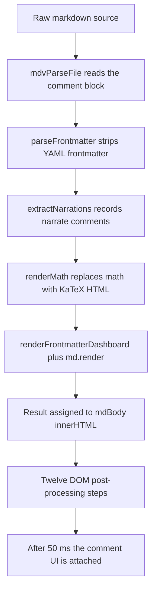

# Rendering pipeline and markdown dialect

This document describes exactly what happens between "a markdown file is opened" and "the page is on screen": which markdown dialect is accepted, which custom transforms run and in what order, what the security posture is, and how each feature degrades in other markdown tools.

Everything here was read from `markdown-viewer.html` as of the initial import. Function names are given so each statement can be checked against the code. Where a statement is inferred rather than read, it says "(inferred)"; where it could not be confirmed, it says "(unverified)". Some behaviour was also checked offline by running the viewer's own parsing functions under Node.js with the vendored libraries (no browser); those checks are marked "(checked offline)".

Related documents: [architecture.md](architecture.md) for the overall structure, [features.md](features.md) for the reading features built on top of the rendered page, [dependencies.md](dependencies.md) for the vendored libraries, [authoring-guide.md](authoring-guide.md) for writing markdown that renders well, and [roadmap.md](roadmap.md) for planned work.

---

## Pipeline overview

Every way of loading a document ends in a call to `renderMarkdown(source, title)`. The callers are `readFile` (file picker and drag and drop), the document-level `paste` listener, `loadFromUrl` (the `?file=` query parameter), `loadDemo` (the `#demo` hash), and the commenting code (`mdvOpenWithHandle`, `mdvAddComment` when a new comment thread is added, and `mdvDeleteThread`; replies and resolve/reopen only redraw the sidebar). Each call re-renders the whole document from the raw source; there is no incremental rendering.

`renderMarkdown` is wrapped once at start-up by the commenting module (the immediately invoked function under the "Hook into renderMarkdown" banner). The effective order is:



| Step | Function | Works on | What it does |
|---|---|---|---|
| 1 | `mdvParseFile` | source text | Reads the `MDV-COMMENTS` block (the first match of `MDV_RE_BLOCK`; the viewer writes it at the end of the file) into the comment list. It does **not** remove anything from the source; the block and the `MDV-ANCHOR` markers are rendered as HTML comments. See [commenting.md](commenting.md). |
| 2 | `parseFrontmatter` | source text | Splits off a leading YAML block and parses it with a small hand-written parser. |
| 3 | `extractNarrations` | source text | Records every narration comment. The source is not changed. |
| 4 | `renderMath` | source text | Regex pre-pass that replaces dollar-delimited math with KaTeX HTML **before** markdown parsing. |
| 5 | `renderFrontmatterDashboard` + `md.render` | source text | Builds the dashboard HTML and renders the markdown with markdown-it. |
| 6 | (inline in `renderMarkdown`) | DOM | `body.innerHTML = dashboardHtml + md.render(processed)`; shows the page, sets the title and breadcrumb, computes the word count and reading time (230 words per minute). |
| 7 | 12 post-processors | DOM | Run in this order, each in its own `try`/`catch` so one failure does not stop the rest: `transformCalloutBlocks`, `addSectionToggles`, `buildToc`, `buildSectionMinimap`, `buildSearchIndex`, `buildTtsSections`, `renderMermaidDiagrams`, `setupScrollSpy`, `setupImageLightbox`, `enhanceLinks`, `applyAbbreviationTooltips`, `setupMermaidClickToSection`. |
| 8 | `mdvAttachContextMenu`, `mdvRenderSidebar` | DOM | Scheduled with `setTimeout(..., 50)` by the commenting wrapper. |

Two consequences of this order matter for authors:

- Math is processed on the raw text, before markdown knows where code spans and code blocks are. See [Math (KaTeX)](#math-katex).
- `renderMermaidDiagrams` is `async` and is not awaited. The steps after it (including `setupMermaidClickToSection`) run before any diagram has finished rendering. See [Mermaid diagrams](#mermaid-diagrams).

---

## The markdown-it configuration

The parser is created once, at load time, as `const md = window.markdownit({...})`. The vendored build is markdown-it 14.1.0.

| Option | Value | Effect |
|---|---|---|
| `html` | `true` | Raw HTML in the source is passed through unchanged. This includes HTML comments, which is how narration and comment markers survive into the DOM. |
| `linkify` | `true` | Bare URLs (`https://example.com`), `www.` hosts, bare domain names such as `example.com`, and bare e-mail addresses become links. Links without a scheme get an `http://` prefix; e-mail addresses get `mailto:` (checked offline). |
| `typographer` | `true` | `"quotes"` become curly quotes, `--` becomes an en dash, `---` an em dash, `...` an ellipsis, and `(c)`, `(r)`, `(tm)` become symbols. |
| `breaks` | not set (default `false`) | A single newline inside a paragraph is a space, not a line break. Use a blank line, two trailing spaces, or a backslash at the end of the line for a hard break. |
| `xhtmlOut`, `langPrefix`, `quotes` | defaults | `langPrefix` stays `language-`. |
| `highlight` | custom function | See [Code highlighting](#code-highlighting). |

Built-in markdown-it syntax that is always on: CommonMark blocks and inlines, GFM-style tables (with `:---`, `:---:`, `---:` alignment), `~~strikethrough~~`, and `<https://...>` autolinks.

markdown-it's own link validation still applies to markdown link and image syntax: `javascript:`, `vbscript:` and `file:` URLs are refused, and `data:` URLs are refused except `data:image/gif`, `data:image/png`, `data:image/jpeg` and `data:image/webp`. An image written as `` is therefore left as literal text (checked offline). Raw HTML is not subject to this validation.

### Plugins

Each plugin is registered only if its global exists (`if (window.markdownitMark) md.use(...)`), so a missing vendor file silently disables that syntax rather than breaking the page.

| Plugin (version) | Options | Syntax | Example source | Output |
|---|---|---|---|---|
| markdown-it-anchor 9.1.0 or 9.2.0 (no version banner; identified by byte comparison, see [dependencies.md](dependencies.md)) | `permalink: markdownItAnchor.permalink.ariaHidden({ placement: 'after', symbol: '#', class: 'header-anchor' })`, custom `slugify` | every heading | `## Sync flow` | `<h2 id="sync-flow" tabindex="-1">Sync flow <a class="header-anchor" href="#sync-flow" aria-hidden="true">#</a></h2>` |
| markdown-it-task-lists 2.1.1 (the file's banner says 2.1.0; see [dependencies.md](dependencies.md)) | `{ enabled: true, label: true }` | `- [ ]` and `- [x]` list items | `- [x] Persist the queue` | a checkbox inside a `<label>`; `enabled: true` means the checkbox is clickable |
| markdown-it-footnote 4.0.0 | none | `[^id]` references, `[^id]: text` definitions, inline `^[text]` | `Counters first[^ordering].` | numbered `<sup class="footnote-ref">` links and a `<section class="footnotes">` at the end, with back-links |
| markdown-it-mark 4.0.0 | none | `==text==` | `==important==` | `<mark>important</mark>` |
| markdown-it-sub 2.0.0 | none | `~text~` (no unescaped spaces inside) | `H~2~O` | `H<sub>2</sub>O` |
| markdown-it-sup 2.0.0 | none | `^text^` (no unescaped spaces inside) | `2^10^` | `2<sup>10</sup>` |
| markdown-it-deflist 3.0.0 | none | a term line followed by `: definition` (or `~ definition`) | `Tombstone`<br>`: A deletion marker.` | `<dl><dt>Tombstone</dt><dd>A deletion marker.</dd></dl>` |
| markdown-it-abbr 2.0.0 | none | a definition line `*[ABBR]: Full text` anywhere in the document | `*[CRDT]: Conflict-free Replicated Data Type` | every whole-word `CRDT` in the text becomes `<abbr title="...">CRDT</abbr>`; the definition line itself is not shown |

Notes:

- Task list checkboxes are clickable because of `enabled: true`, but no code listens to them. Ticking one changes only the on-screen checkbox; the source is not edited and the state is lost on the next render (inferred: there are no references to `task-list-item-checkbox` in the script).
- Footnote targets are `#fn1`, `#fn2`, and back-links are `#fnref1`, `#fnref2`, so [link enhancement](#link-enhancement) classifies them as section links.
- `~~a~~` is strikethrough (built in) and `~a~` is subscript (plugin). Other tools disagree on single tildes; see the [portability table](#portability).

---

## Custom transforms

### Frontmatter

**Function:** `parseFrontmatter(src)`, then `renderFrontmatterDashboard(meta)`.

**Detection.** The regex `^---\s*\n([\s\S]*?)\n---\s*\n` must match at the very first character of the file. Consequences (checked offline):

- A byte-order mark or a blank line before the opening `---` means no frontmatter is detected.
- The closing `---` must be followed by a newline. A file that ends immediately after the closing `---` is not detected, and markdown then renders the block as a horizontal rule followed by a setext heading.

When it matches, the YAML block is removed from the source before anything else sees it, and the parsed object is stored on `window._frontmatter`.

**Parser.** This is not a YAML library. Line by line:

| Line shape | Result |
|---|---|
| `key: value` at column 0 | `meta.key = "value"` (a leading quote character and a trailing quote character, `"` or `'`, are each removed) |
| `key:` with nothing after it, at column 0 | `meta.key = []` and following indented lines feed this list |
| indented `- text` | a string pushed onto the current list |
| indented `- key: value` | starts a new object `{ key: value }` in the current list |
| indented `key: value` (no dash) | adds a field to the object started by the previous `- key: value` line; ignored if there is no such object |
| anything else | ignored |

Nested maps, inline lists such as `[a, b]`, multi-line strings and anchors are not supported. CRLF line endings work: the carriage return is not matched by `.` in the line regexes, so values and quotes are handled as with LF (checked offline).

**Dashboard.** `renderFrontmatterDashboard` returns nothing unless at least one of `status`, `metrics` or `repos` is present. A `status:` or `date:` key with no value is parsed as an empty list, which the dashboard code does not expect: it calls string methods on it and throws, and because the dashboard is built before the document HTML is assigned, nothing renders (checked offline).

| Field | Shape | Rendering |
|---|---|---|
| `status` | string | A badge. The value is lower-cased and stripped to `a-z` and `-`. If it contains `ship` the badge is `shipped` (green), else `progress` gives `in-progress` (yellow), else `block` gives `blocked` (red), otherwise `draft` (grey). The original text is shown. |
| `date` | string | Shown as plain text next to the badge. Only shown if the dashboard renders at all. |
| `metrics` | list of `- label:` / `value:` objects | A row of stat cards, value above label. |
| `repos` | list of `- name:` / `github:` objects | A badge per entry; with `github` it is a link (opens in a new tab) prefixed with a star glyph, without it a plain badge. Any other field, such as `branch`, is parsed and ignored. |
| `title` | string | Parsed, never displayed. The toolbar title is always the last path segment of the name passed to `renderMarkdown`. |
| `abbreviations` | intended as a map | See [Abbreviations](#abbreviations). It does not work as written. |

### Narration comments

**Function:** `extractNarrations(src)`.

The regex `<!--\s*narrate:\s*([\s\S]*?)-->` (case-insensitive) collects every narration comment into `window._narrations`. The list is only used as a "there is at least one" check: the narration text that is actually spoken is read later from the DOM comment node by `findNarrationFor`. Narration is consumed only for mermaid diagrams and tables, and the current section-folding step stops it from being found under headings. Details are in [read-aloud.md](read-aloud.md).

### Math (KaTeX)

**Function:** `renderMath(src)`; library KaTeX 0.16.11.

`renderMath` runs two regex replacements over the **whole raw source** before markdown-it sees it:

| Order | Delimiter | Mode | Can span lines | Content may contain a dollar sign |
|---|---|---|---|---|
| 1 | <code>&#36;&#36; ... &#36;&#36;</code> | display (`displayMode: true`) | yes | no |
| 2 | <code>&#36; ... &#36;</code> | inline (`displayMode: false`) | no | no |

The two regexes, in order (shown with HTML entities so that this page survives the same pre-pass):

<pre><code>/\&#36;\&#36;([^&#36;]+?)\&#36;\&#36;/gs    display
/\&#36;([^&#36;\n]+?)\&#36;/g           inline</code></pre>

Both calls use `throwOnError: false`, so invalid TeX is rendered by KaTeX as red error text rather than throwing. The `catch` fallbacks (a `<pre>` for display, a `<code>` for inline) are only reached if KaTeX throws anyway. No other KaTeX options are set; in particular `trust` keeps its default `false`, so commands such as `\href` and `\includegraphics` stay disabled.

The KaTeX HTML is then fed to markdown-it as raw inline HTML (it works because `html: true`). A display block written on its own lines becomes a paragraph containing a `katex-display` span.

Not supported: `\( ... \)` and `\[ ... \]` delimiters, and fenced ` ```math ` blocks (rendered as an ordinary code block labelled `math`).

**How dollar signs conflict with markdown: they are not handled.** Because the pre-pass ignores markdown structure (checked offline):

- Two dollar signs on one line form inline math anywhere, including inside inline code and fenced code blocks. In code, the inserted KaTeX markup is then escaped by the code renderer and appears on screen as a long run of literal `<span class=...>` text. A shell line with two variables, such as `echo` followed by two dollar-prefixed variable names, is enough.
- Prose such as "between 5 and 10 dollars" written with two dollar signs on one line is typeset as math.
- A backslash before the dollar sign does not help. The pre-pass still matches, and the result is worse: KaTeX reports an error and the error markup is shown as literal text.
- Any two occurrences of <code>&#36;&#36;</code> with no other dollar sign between them enclose one display block, even when they are far apart and the text between them spans code blocks and paragraphs.
- The pre-pass also runs inside HTML comments, so a narration comment containing math is spoken as KaTeX markup (inferred).
- markdown-it's inline rules still apply to the TeX copy that KaTeX stores in the hidden MathML `<annotation>`. For example `e^{-x^2}` gains a `<sup>` there and `\,` loses its backslash. The visible rendering is unaffected; screen readers and anything that reads the annotation see the altered text (checked offline, including a jsdom parse).

Safe ways to write a literal dollar sign in prose: the HTML entity `&#36;` (or `&dollar;`), which the pre-pass cannot see and every markdown renderer decodes. In code that must contain several dollar signs, a raw HTML `<pre><code>` block with `&#36;` entities is the only form that survives this viewer and still renders elsewhere.

### markdown-it render

`md.render(processed)` runs with the configuration from [The markdown-it configuration](#the-markdown-it-configuration) plus one renderer override:

**Mermaid fence override.** `md.renderer.rules.fence` is replaced. A fence whose info string, trimmed, is exactly `mermaid` (case-sensitive; backtick or tilde fences both work) becomes:

```html
<div class="mermaid-wrapper"><pre class="mermaid" id="mermaid-N">escaped diagram source</pre></div>
```

where `N` is the token index. ` ```Mermaid ` or ` ```mermaid title ` are not matched and render as ordinary code blocks (checked offline). Every other fence goes to the default renderer, which calls the `highlight` hook.

### Mermaid diagrams

**Functions:** `renderMermaidDiagrams()` and its helpers in `js/mermaid.js`; library mermaid 11.4.1.

**Initialisation.** When `js/mermaid.js` loads it calls `mermaid.initialize({ startOnLoad: false, securityLevel: 'strict' })`. By default Mermaid draws every `.mermaid` element itself on the window `load` event, in its own theme; the viewer draws them instead. Each render pass then initialises Mermaid with:

- `theme: 'base'` and `themeVariables` read from the current theme's `--diagram-*` custom properties in `css/viewer.css` (node, border, text, line, cluster, note, label background, accent, and an eight-colour series for pie slices, mind-map branches, timelines, journey actors, git branches and charts). Mermaid's colour maths only accepts hex, so each token is resolved to hex first (`mdvColorHex`; a translucent token is resolved over the diagram card). Journey actors go through the `actor0`-`actor5` variables and faces through `faceColor`: Mermaid's config merge appends arrays, so `journey.actorColours` cannot replace its six defaults. The series were chosen per theme with a colour-vision-deficiency check (Machado 2009 deuteranopia and protanopia) so neighbouring slices and a pie's legend stay apart; node borders are at least 3:1 against the card;
- `themeCSS`, Mermaid's own per-SVG stylesheet, for what the variables cannot reach: rounded nodes (8 px for every type), line caps, arrowheads in the line colour, label chips, section colours, title sizes, a stick-figure actor's name below its legs, a dashed Gantt today line. Anything that changes the size of text is set there, because Mermaid measures labels before the SVG reaches the page, with only its own styles applied;
- `fontFamily` Inter, also for the sequence diagram's actor, message and note fonts, so text is measured in the font it is drawn in;
- `flowchart: { curve: 'basis', padding: 18, nodeSpacing: 44, rankSpacing: 56 }`, `sequence: { wrap: true, mirrorActors: false, … }`, and a Gantt width equal to the page column (`gantt.useWidth`), because Mermaid otherwise sizes a Gantt chart to its hidden render container (the whole window) and the result is shrunk to the column with unreadably small text;
- `securityLevel: 'strict'`: labels are sanitised and click directives are ignored;
- `suppressErrorRendering: true`, so a syntax error does not leave Mermaid's own error graphic at the end of `<body>`.

**Lifecycle.**

1. When the pass is requested, every new `.mermaid` element's text is saved in `data-mdv-source`, synchronously, before anything else can draw it.
2. Passes run one after another. A pass first closes an expanded view whose diagram is no longer on the page (another document was opened), then reads the palette, waits for the Inter web font when it is still loading (at most 1.5 s, and only once: after a wait has timed out, later passes draw straight away, and every diagram is drawn again when the font arrives; offline there is nothing to wait for), and draws every diagram whose `data-mdv-palette` differs from the current palette, in document order. A newer request (a theme change, a new document) stops an older pass at its next diagram.
3. Each diagram is drawn with `mermaid.render` under a fresh id (`mdv-mermaid-N`). Mermaid removes any element that already has the id it is given, so reusing the old id would make the diagram on screen disappear while its replacement is drawn.
4. On success the SVG replaces the element's content and gets the class `mdv-diagram`. Its ids are namespaced with its own id (`mdvIsolateSvgIds`, which also rewrites `url(#…)`, `href`, ARIA references and `#id` selectors in its style): Mermaid reuses plain ids such as `arrowhead` in every diagram, and a reference resolves to the first match in the page. Then `mdvFinishDiagram` applies what needs the drawn geometry: an edge label inside a subgraph or composite state gets its container's colour (`--mdv-chip`), a composite state draws one bottom border, class boxes and ER entities are rounded, journey and timeline titles and timeline box text are centred, the Gantt today line goes behind the bars, and each pie label takes whichever text colour reads better on its slice. The element gets `rendered`, and the wrapper gets `data-diagram-type` (the `diagramType` Mermaid returns) and `data-diagram-label` (its readable name, shown on the card). The first time, the wrapper also gets the expand button and its click handler (`mdvMakeDiagramExpandable`). Then nodes are linked to sections (`mdvLinkDiagramNodes`, in `js/enhancements.js`), and an open expanded view of the same diagram is redrawn (`mdvRefreshDiagramOverlay`).
5. On failure the element gets the class `mermaid-error` and shows "This diagram could not be drawn", Mermaid's reason and the source, built with `textContent` only.

**Theme changes.** `setTheme` calls `renderMermaidDiagrams` 100 ms later. Every diagram's palette key now differs, so every diagram, including any that failed, is drawn again from its saved source in the new palette. The SVG on screen stays until its replacement is ready, so nothing jumps.

**Titles.** The expanded view is titled from `data-diagram-type`: Flowchart, Sequence diagram, Class diagram, State diagram, Entity relationship diagram, Gantt chart, Pie chart, User journey, Mind map, Timeline, Git graph, Quadrant chart, XY chart, Requirement diagram, Sankey diagram, Block diagram, Packet diagram, Architecture diagram, Kanban board, C4 diagram; anything else is "Diagram". When the SVG carries its own title (a pie or Gantt `title`, or `accTitle`) it is added: "Pie chart · Estimated effort by area".

**Linking nodes to sections.** `renderMarkdown` still calls `setupMermaidClickToSection` synchronously, before any diagram exists; it links whatever is already drawn. Linking for real happens in step 4, as each diagram is drawn: a node (`g.node`, `g.mindmap-node`) whose label, slugified, equals a heading's slugified text links to that heading. See [features.md](features.md#clicking-a-diagram-node-to-jump-to-a-section).

### Code highlighting

**Function:** the `highlight(str, lang)` option of `md`; library highlight.js 11.10.0 with its stylesheets `github.min.css` and `github-dark.min.css` (switched by `setTheme`).

1. The label is the fence language, or `text` when there is none.
2. If `lang` is set and `hljs.getLanguage(lang)` knows it (aliases such as `js`, `py`, `sh`, `html` work), the code is highlighted with `hljs.highlight(str, { language: lang })`.
3. Otherwise, or if highlighting throws, the code is HTML-escaped and shown without colouring. There is no automatic language detection (`highlightAuto` is never called).
4. The hook returns a header (`<div class="code-header">` with the label and a Copy button) followed by `<code class="hljs language-...">`.

Because the returned string does not start with `<pre`, markdown-it wraps it in its own `<pre><code class="language-...">`. The final markup is a `<code>` element nested inside another `<code>`, with the header `<div>` inside the outer one (checked offline). `copyCode` copies the **inner** `code.hljs` element's text, without the fence's closing newline, so the clipboard holds only the code (`tests/e2e/visuals.spec.mjs`). The stylesheet lays out the same markup as a header bar over a scrolling code area.

The colours come from each theme's `--syntax-*` tokens in `css/viewer.css`, which override the vendored highlight.js stylesheets (those still load and still switch between `github` and `github-dark` with the theme).

Languages in the vendored highlight.js build (from `hljs.listLanguages()`, checked offline): `bash`, `c`, `cpp`, `csharp`, `css`, `diff`, `go`, `graphql`, `ini`, `java`, `javascript`, `json`, `kotlin`, `less`, `lua`, `makefile`, `markdown`, `objectivec`, `perl`, `php`, `php-template`, `plaintext`, `python`, `python-repl`, `r`, `ruby`, `rust`, `scss`, `shell`, `sql`, `swift`, `typescript`, `vbnet`, `wasm`, `xml`, `yaml`. `toml` works as an alias of `ini`. Notably absent: `dockerfile`, `powershell`, `hcl` (checked offline with `hljs.getLanguage`).

### Link enhancement

**Functions:** `detectLinkType`, `enhanceLinks`, `showLinkTooltip`, `buildLinksPanel`.

Every `<a>` inside the document except heading permalinks (`a.header-anchor`) is classified by its `href`. The first matching rule wins:

| Order | Type | Rule on `href` | Inline decoration (CSS `::after`) | Icon in tooltip, card and panel |
|---|---|---|---|---|
| 1 | `anchor` | starts with `#` | no icon; accent colour, dotted underline | section sign |
| 2 | `email` | starts with `mailto:` | envelope; warning colour | envelope |
| 3 | `file` | ends with `.md`, `.txt`, `.pdf`, `.doc`, `.csv`, `.json`, `.yaml` or `.yml` (case-insensitive) | right arrow | page |
| 4 | `github` | contains `github.com` or `gitlab.com` | outline star | filled star |
| 5 | `npm` | contains `npmjs.com` or `npm.im` | circle | square |
| 6 | `docs` | contains `docs.`, `documentation`, `readme`, `wiki`, `.dev` or `.io/docs` | north-east arrow | book |
| 7 | `external` | anything else | north-east arrow | north-east arrow |

Consequences of the rules: a file link with a fragment such as `notes.md#setup` is not a `file` link; `.dev` matches any URL containing that text; a documentation site that matches none of the patterns is `external`; GitLab links are labelled "GitHub".

What `enhanceLinks` does with each link:

- Sets `data-link-type`, which drives the CSS icon.
- For links whose `href` starts with `http` and whose type is not `anchor` or `file`: sets `target="_blank"` and `rel="noopener noreferrer"`.
- Attaches a hover tooltip (`showLinkTooltip`) with the type icon and label, a shortened URL (for `http` links the host and path, cut to 52 characters plus `...` when longer than 55; for anchors `Jump to: ` followed by the fragment with hyphens turned into spaces; the address for e-mail; the raw `href` otherwise) and a Copy button.
- Collects the link for the links panel (`buildLinksPanel`), grouped in the order external, GitHub, docs, npm, file, section, email, and de-duplicated by `href`.

**Standalone link cards.** Any `<p>` whose only non-whitespace child is a single `<a>` of any type except `anchor` is replaced by a card (`a.link-chip`) with the type icon, the link text (or the URL), the host and path, and the type label. This also happens to a linked image alone in a paragraph, and the image is lost because the card shows only text (inferred). The card does not get the hover tooltip.

Links in the frontmatter dashboard are inside the document body, so they are classified too.

### Abbreviations

There are two mechanisms:

| Mechanism | Source syntax | Status |
|---|---|---|
| markdown-it-abbr plugin | a line `*[ABBR]: Full text` anywhere in the document | Works. Whole-word occurrences in text become `<abbr title="...">`. |
| `applyAbbreviationTooltips(meta)` | an `abbreviations` map in the frontmatter, indented `KEY: value` lines or `- KEY: value` items | Works. `parseFrontmatter` still turns the indented form into an empty list, so `mdvFrontmatterAbbreviations` reads those lines from the frontmatter of `rawMarkdown`, after checking that it parses to the same meta being rendered. |

The frontmatter path walks text nodes outside `code`, `pre`, `kbd`, math, diagrams, buttons, callout titles, the dashboard, the minimap and existing `<abbr>` elements (so it never double-wraps a term the plugin already wrapped), and wraps each whole-word match, longest key first, in `<abbr class="abbr-tooltip" title="...">`.

### Heading ids and anchors

**Plugin:** markdown-it-anchor, with this slug function:

```js
slugify: s => s.toLowerCase().replace(/[^\w]+/g, '-').replace(/^-|-$/g, '')
```

- Every heading level gets an id (the plugin default level is 1) and `tabindex="-1"`, plus a `#` permalink after the text with `aria-hidden="true"` and class `header-anchor`.
- `\w` is ASCII-only, so accented letters are dropped (`Café` gives `caf`) and a heading with no ASCII letters or digits gets an empty id; a second such heading gets `-1` (checked offline).
- Duplicate slugs get `-1`, `-2` and so on (`uniqueSlugStartIndex` is 1).
- `buildToc` later gives any heading with an empty id the id `heading-N`, where `N` is its position among all headings.
- The TOC, minimap, search index, scroll-spy breadcrumb and read-aloud sections use the heading text with every `#` character removed (to drop the permalink symbol), so a heading such as "C# tips" is listed as "C tips".

Other heading-driven transforms, all keyed on the rendered headings: `addSectionToggles` (fold toggles on H1 to H4), `buildToc` (all levels), `buildSectionMinimap` (only when there are three or more H2 headings), `setupScrollSpy`, `buildSearchIndex` and `buildTtsSections`. They are described in [features.md](features.md).

### Callouts

**Function:** `transformCalloutBlocks()`; types in `CALLOUT_TYPES`.

For every `<blockquote>` in the document (including nested ones and ones inside lists), the first `<p>` found inside it is tested with `^\[!(\w+)\]\s*`. If the captured word, upper-cased, is a known type, the marker is removed, the blockquote gets the classes `callout callout-<type>`, and a `div.callout-title` with an icon and label is inserted as its first child.

Accepted forms (checked offline):

| Source | Result |
|---|---|
| `> [!NOTE]` on its own line, text on the next lines | callout; the marker and the line break after it are removed |
| `> [!note]` | same; matching is case-insensitive |
| `> [!NOTE] Some text` | callout; "Some text" becomes the first line of the body, not a custom title |
| `> [!UNKNOWN]` | unchanged blockquote with the marker visible |

| Marker | Label | Icon | Colour |
|---|---|---|---|
| `[!NOTE]` | Note | circled "i" | blue |
| `[!TIP]` | Tip | light bulb | green |
| `[!IMPORTANT]` | Important | speech bubble with "!" | violet |
| `[!WARNING]` | Warning | triangle with "!" | ochre (amber in dark) |
| `[!CAUTION]` | Caution | octagon with "!" | red |
| `[!TLDR]` | TL;DR | lightning bolt | teal |
| `[!DECISION]` | Decision | circled check mark | magenta |
| `[!COST]` | Cost | price tag | rust (coral in dark) |

The icons are inline SVG and the colours are the theme's `--callout-*` tokens; see [features.md](features.md#callouts).

There is no custom title syntax and no aliases. There is no fold syntax either: `> [!NOTE]- Title` is still turned into a Note callout (the regex stops at `]`), but the `-` and the title stay as the first line of the body (inferred from the regex; the markdown-it output was checked offline).

### Images

Images render as normal `` elements. `setupImageLightbox` makes each one clickable to open it full-size in an overlay. Image paths are resolved by the browser relative to the page URL of the viewer, not relative to the markdown file (inferred: no code rewrites `src`), so relative images only work when the file and its images are served from the right place. Remote images are fetched as soon as the document renders.

---

## Security posture

**Summary: the viewer is built for files you trust. Opening an untrusted markdown file is equivalent to running a web page written by its author inside the viewer.**

| Question | Answer | Where |
|---|---|---|
| Is raw HTML allowed? | Yes. `html: true`. | `markdownit({ html: true, ... })` |
| Is output sanitized? | No. The rendered HTML is assigned with `body.innerHTML = ...`. The script contains no sanitizer; the only one in `vendor/` is the DOMPurify copy bundled inside `mermaid.min.js`. Mermaid never applies it to the markdown, and its `render` function skips the final sanitize pass over the diagram SVG when `securityLevel` is `'loose'` (read from the minified bundle). | `renderMarkdown` |
| Content Security Policy? | None. There is no CSP `<meta>` in the page. | page `<head>` |
| Mermaid `securityLevel` | `'loose'` | `renderMermaidDiagrams` |
| KaTeX `trust` | default (`false`); `\href` and similar are disabled | `renderMath` |
| Markdown link URLs | markdown-it refuses `javascript:`, `vbscript:`, `file:` and non-image `data:` URLs in link and image syntax | markdown-it `validateLink` |
| Comment sidebar | comment fields are escaped with `mdvEscape`, which escapes `&`, `<` and `>` but not quotes. `author.kind` and `id` are placed inside attribute values, so a crafted `MDV-COMMENTS` block can break out of those attributes | `mdvRenderThreadCard`, `mdvRenderCommentBody`, `mdvEscape` |
| Frontmatter values | escaped with `escapeHtml`, which escapes `&`, `<` and `>` but not quotes; a quote in `repos[].github` can break out of the `href` attribute | `renderFrontmatterDashboard`, `escapeHtml` |

**What an untrusted `.md` file can do when opened**, concretely:

- **Run JavaScript in the viewer's page.** A `<script>` element inserted through `innerHTML` does not execute, but event-handler attributes do, for example an `` with a broken `src` and an `onerror` attribute. markdown-it passes such tags through unchanged (checked offline), and the handler runs: verified in Chrome on 2026-10-04 with ``, after which `window.__mdvHandlerRan` was `'yes'`. A raw `<a href="javascript:...">` also passes through and runs when clicked.
- **Change the whole application.** A `<style>` element applies to the entire page, so a document can hide or restyle the toolbar, sidebars and overlays, or draw fake interface elements.
- **Contact other servers.** Remote images, iframes and similar tags load as soon as the document renders, which tells the remote server that the file was opened and from which IP address. No HTML is needed for this; an ordinary markdown image with a remote URL is enough.
- **With script running (inferred from what the page itself does):**
  - read and change the viewer's `localStorage` settings (`mdv-theme`, `mdv-fontsize`, `mdv-basepath`, `mdv-author-name`);
  - open the IndexedDB database `mdv-viewer`, which stores the File System Access handles for the current file and the workspace folder. If the user has granted read/write permission and it is still granted, page script can use those handles to read and overwrite files in that folder;
  - when the viewer is served over `http://`, fetch any other file the same local server serves and send it elsewhere, since there is no CSP.
- **Through mermaid.** With `securityLevel: 'loose'`, mermaid allows HTML labels and `click` directives that call global functions by name (from mermaid's documented behaviour, unverified against this build), and the bundled `render` function does not run its final DOMPurify pass over the SVG at this level (read from the minified bundle). Given that raw HTML already allows script, this adds little extra exposure.

Practical guidance: open only files you trust, and serve the viewer from a folder that contains nothing sensitive. Sanitizing the output is a candidate item for [roadmap.md](roadmap.md).

One related non-security note: the page loads its fonts from Google Fonts (`fonts.googleapis.com`), so opening the viewer makes a network request even for a local file. Without network access the page falls back to system fonts (inferred).

---

## Portability

How each feature of this dialect behaves in other common tools. The other tools were **not tested** for this document; the columns reflect commonly documented behaviour and every cell outside the first column should be read as unverified.

| Feature | This viewer | GitHub | VS Code built-in preview | Obsidian |
|---|---|---|---|---|
| CommonMark, tables, `~~strike~~`, autolinks | yes | yes | yes | yes |
| Bare URL linkify | yes | yes | yes | yes |
| Typographer (curly quotes, dashes) | yes | no | off by default | no |
| Raw HTML | passed through, unsanitized | sanitized subset (`details`, `kbd`, `sub`, `sup`, `img` and similar); scripts, styles, event attributes and inline `<svg>` removed | rendered, scripts blocked | partially rendered, sanitized |
| YAML frontmatter | stripped; dashboard if `status`, `metrics` or `repos` | shown as a table at the top of the file | hidden | shown as a Properties panel |
| Callouts `NOTE`, `TIP`, `IMPORTANT`, `WARNING`, `CAUTION` | styled | styled (the marker must be alone on the first line) | depends on version | styled |
| Callouts `TLDR`, `DECISION`, `COST` | styled | plain blockquote with the marker visible | plain blockquote | styled (`tldr` is a built-in alias; unknown types get the default callout style) |
| Mermaid fences | rendered, with expand and zoom | rendered | extension needed | rendered |
| Dollar-sign math | rendered by a pre-pass that also hits code (see [Math (KaTeX)](#math-katex)) | rendered (MathJax), not inside code | rendered (KaTeX) | rendered (MathJax) |
| ` ```math ` fences | plain code block | rendered | not rendered (unverified) | not rendered (unverified) |
| Code highlighting | 36 bundled languages, no auto-detect | yes | yes | yes |
| Task lists | clickable, not saved | rendered; editable in issues, not in files | rendered (unverified for older versions) | clickable and saved |
| Footnotes, including inline `^[...]` | yes | yes, but inline footnotes are not supported | extension needed | yes |
| `==mark==` | `<mark>` | literal text | literal text | highlighted |
| `~sub~` | subscript | **strikethrough** (GitHub accepts single tildes) | literal text or strikethrough (unverified) | literal text |
| `^sup^` | superscript | literal text | literal text | literal text |
| Definition lists | `<dl>` | plain paragraphs, colon visible | plain paragraphs | plain paragraphs |
| `*[ABBR]: ...` abbreviations | `<abbr>` tooltips | the definition line is shown as text | the definition line is shown as text | the definition line is shown as text |
| Frontmatter `abbreviations` map | not applied (see [Abbreviations](#abbreviations)) | part of the frontmatter table | hidden | a property |
| Heading anchors | ASCII-only slugs | slugs keep Unicode letters and do not collapse repeated hyphens | similar to GitHub | links by heading text |
| `<!-- narrate: ... -->` | read-aloud text for diagrams and tables | hidden | hidden | hidden |
| `MDV-ANCHOR` and `MDV-COMMENTS` comments | comment threads | hidden | hidden | hidden |
| `data:image/png` images | shown | probably not shown (unverified) | shown | shown (unverified) |
| Link type icons, link cards, links panel | yes | no | no | no |
| Heading folding, TOC, minimap | yes | outline menu only | outline view | folding and outline |

Practical rules that follow from the table:

- Prefer `<sub>` over `~sub~` if the file will also be read on GitHub.
- Avoid dollar signs outside math, or write them as `&#36;`, if the file will be read in this viewer.
- Heading links that use only ASCII letters, digits, spaces and hyphens resolve the same way here and on GitHub.

---

## Rendering limitations in one place

Each item is described in the section linked from it.

| Limitation | Section |
|---|---|
| Dollar-sign math is detected inside code spans, code blocks, comments and prose; escaping does not help | [Math (KaTeX)](#math-katex) |
| Frontmatter must start at the first byte and the closing `---` needs a trailing newline | [Frontmatter](#frontmatter) |
| Frontmatter `title` and `repos[].branch` are not displayed | [Frontmatter](#frontmatter) |
| An empty `status:` or `date:` value throws inside `renderFrontmatterDashboard` and the document does not render | [Frontmatter](#frontmatter) |
| `data:image/svg+xml` images are refused by markdown-it | [The markdown-it configuration](#the-markdown-it-configuration) |
| Heading slugs drop non-ASCII letters; `#` characters vanish from TOC text | [Heading ids and anchors](#heading-ids-and-anchors) |
| A linked image alone in a paragraph, with no alt text and no title, becomes a text-only card. With either, it becomes a captioned figure and stays an image | [Link enhancement](#link-enhancement) |
| Section folding moves elements but leaves HTML comments behind, so narration and comment anchors lose their target under headings (checked offline with jsdom) | [read-aloud.md](read-aloud.md), [commenting.md](commenting.md) |
| No output sanitization | [Security posture](#security-posture) |
