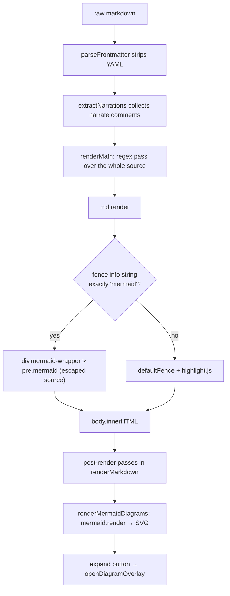
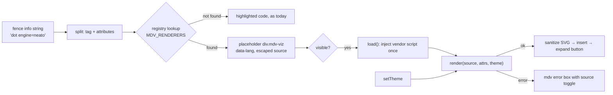

# Visualization catalogue

A researched list of visualizations this viewer could add, either as **fenced-block renderers**
(a code fence whose language tag selects a renderer) or as **reading aids** (features that help a
reader find their way through a long document). It is a planning document. Nothing here is
implemented unless the "Today" column or section says so.

Related: [architecture.md](architecture.md) (section 10 is the step-by-step guide to adding a
renderer) · [rendering.md](rendering.md) · [features.md](features.md) ·
[dependencies.md](dependencies.md) · [roadmap.md](roadmap.md) ·
[authoring-guide.md](authoring-guide.md) · [../THIRD_PARTY_NOTICES.md](../THIRD_PARTY_NOTICES.md)

---

## 1. How to read this catalogue

**Facts about libraries** (latest version, release date, licence, file sizes, module format) were
collected on **2026-10-04** with read-only network lookups. Section 15 lists the exact sources and
commands. They will go stale; re-check before vendoring anything.

**Facts about this viewer** come from reading `markdown-viewer.html` as of the initial import. Each
one names the function that implements it. Anything not read directly from code is marked
*(inferred)*, and anything not checked at all is marked *(unverified)*.

**Sizes** are the byte size of the single distribution file named, as listed by the jsDelivr
package API. They are **not** gzipped, which suits a viewer that loads files from disk. Most are
minified; a few distribution files are not (for example three.js `build/three.module.js` and
`three.core.js`, and `nomnoml.js`), and the sizes are given as published.
Where a library needs more than one file, the files are listed separately.

**Offline** means the library can render with no network once its files are in `vendor/`. "Needs
network" means the rendering itself depends on a remote service or on remote assets such as map
tiles.

**Module format** matters more here than in a normal web app. See section 3.5.

- *classic* — a plain `<script src>` that sets a global. Works when the page is opened from disk.
- *ESM* — an ES module (`import` / `export`). Needs a local static server or a one-off bundling
  step (section 3.5).

**Ratings** use two short scales.

| Value | Meaning |
|---|---|
| High | Common in real documents, or fixes a defect, or brings parity with GitHub |
| Medium | Clearly useful for a sizeable group of readers |
| Low | Niche, or mostly duplicates something already present |

| Effort | Meaning in this codebase |
|---|---|
| S | One classic script, an SVG result, follows the Mermaid pattern with no new concepts |
| M | Needs theming work, a non-SVG output, a bundling step, or a network policy |
| L | Large (multi-megabyte) or ESM-only with workers/WebGL, or needs a sandbox |

---

## 2. What the viewer has today

| Capability | How it works today | Implementing code |
|---|---|---|
| Mermaid diagrams | A ```` ```mermaid ```` fence becomes a placeholder; a post-render pass turns it into SVG. Mermaid **11.4.1** is vendored (2,571,900 bytes). | `md.renderer.rules.fence`, `renderMermaidDiagrams`, `openDiagramOverlay` |
| Math | KaTeX **0.16.11**. A regular-expression pass over the raw markdown, before markdown-it runs, replaces double-dollar (display) and single-dollar (inline) spans with KaTeX HTML. | `renderMath` |
| Code highlighting | highlight.js 11.10.0, 36 languages, light and dark GitHub themes | `md.options.highlight`, `setTheme` |
| Reading time | Word count of the rendered body divided by 230, shown as "N words ~ M min read" | `renderMarkdown` |
| Outline | Table of contents built from every heading, indented by level; scroll spy; section minimap of H2s when there are three or more | `buildToc`, `setupScrollSpy`, `buildSectionMinimap` |
| Diagram zoom | Full-screen overlay that clones a diagram's SVG, with zoom buttons, wheel zoom and fit | `openDiagramOverlay`, `diagramZoom`, `diagramFitToggle` |
| Print | `@media print` hides the toolbar, table of contents, scroll buttons, progress bar, overlays, read-aloud player, settings toast and lightbox | the `@media print` block in `<style>` |

Not present: any other diagram language, data charts, CSV/JSON tables, maps, 3D, chemistry, music,
presentation mode, or PDF export beyond the browser's own print dialog.

---

## 3. Constraints any new renderer meets in this codebase

These are properties of the current code that shape every recommendation below.
[architecture.md section 10](architecture.md#10-how-to-add-a-new-fenced-block-renderer) gives the
mechanical steps; this section explains the constraints behind them.

### 3.1 The current fence pipeline



### 3.2 Matching is exact

`md.renderer.rules.fence` compares `token.info.trim() === 'mermaid'`. A fence such as
```` ```mermaid title="Login" ```` therefore falls through and is shown as highlighted code. A
renderer registry (section 13.1) should match on the first word of the info string and treat the
rest as attributes.

### 3.3 Math runs before markdown and is not fence-aware

`renderMath` runs over the raw source, including the inside of fenced code blocks and code spans.
Any two dollar signs on one line form an inline-math span. This matters for several candidates:

- **CSV/TSV tables**: a row with two currency amounts would be partly turned into math.
- **Shell or Makefile examples** inside other renderers' fences.
- **Vega-Lite**: specs start with a `"$schema"` key. One dollar sign per line is safe; a second on
  the same line is not.

Fixing this (moving math into a markdown-it inline and block rule that never looks inside code) is a
prerequisite for CSV tables and makes every other renderer safer. See section 8.1.

### 3.4 Theme changes do not re-render diagrams

`setTheme` calls `renderMermaidDiagrams` again, but that function only selects
`.mermaid:not(.rendered)`, and each rendered element's source text has already been replaced by its
SVG. Diagrams on screen keep the old theme. Any new renderer should keep its source (for example in
a `Map` keyed by element id) so a theme change can re-render it. The sepia theme is passed to
Mermaid as `default`.

### 3.5 Opening from disk limits which builds can be used

The viewer is opened either from disk (`file://`) or from a local static server. All current
libraries are classic scripts loaded with blocking `<script>` tags in `<head>`.

- Classic scripts load from `file://` in every browser. They can also be injected later (lazy
  loading) by adding a `<script src="vendor/...">` element.
- ES modules loaded from `file://` are refused by Chromium-based browsers because the page origin is
  `null` *(general browser behaviour; not tested in this repository)*. The same applies to
  `fetch()` of a separate `.wasm` file.

So, for each candidate below, the "Module format" row says whether a classic build exists. For an
ESM-only library, the options are: require a local server for that feature, or run a one-off bundler
(for example esbuild) to produce a single classic file, vendor the output, and record how it was
produced in [dependencies.md](dependencies.md).

WebAssembly is not a problem by itself: several libraries below embed their `.wasm` binary inside
the JavaScript file, so no separate fetch is needed.

### 3.6 The overlay only understands SVG

`openDiagramOverlay` clones `wrapper.querySelector('.mermaid svg') || wrapper.querySelector('pre svg')`.
A renderer that draws SVG inside a `pre` can reuse the overlay, but it must add its own expand button
and click handler: today only `renderMermaidDiagrams` creates them. A renderer that draws to
`<canvas>` (Chart.js, ECharts by default, Plotly WebGL traces, maps, three.js) cannot use the overlay
at all, and its canvas would print as a bitmap. Prefer an SVG output mode when the library offers
one. The overlay's title guess (Flowchart, Sequence Diagram, and so on) only looks inside a
`.mermaid` element and tests Mermaid keywords; for any other wrapper the title is "Diagram". It reads
that element's `textContent` at the time the overlay opens, which by then is the rendered SVG rather
than the source *(inferred; the guess may therefore fall back to "Diagram" for Mermaid too)*.

### 3.7 Other subsystems react to wrapper classes

- **Read aloud.** `buildTtsSections` → `extractText` treats `.mermaid-wrapper` as a diagram: it speaks
  a preceding `<!-- narrate: -->` comment (found by `findNarrationFor`) or skips it. Any other wrapper
  falls into the generic branch and its text content is read out — for a failed render, that is the
  raw source. See [read-aloud.md](read-aloud.md).
- **Comments.** Anchoring a comment on a rendered diagram searches the raw markdown for the
  element's text, which an SVG does not reproduce (see [architecture.md](architecture.md), step 8 of
  section 10.3, and [commenting.md](commenting.md)).
- **Search.** `buildSearchIndex` indexes headings and every `p, li, td, blockquote` whose text is
  longer than 15 characters. A table renderer that emits a real `<table>` is searchable without extra
  work (short cells are skipped, as for any table); text inside SVG is not indexed.
- **Focus mode** dims every top-level block that is not a heading (`body.focus-mode` rules).

### 3.8 Security baseline

markdown-it is created with `html: true` and the rendered HTML is assigned to `innerHTML` with no
sanitizer. A document can therefore already include markup with event-handler attributes that run
script *(inferred from standard `innerHTML` behaviour; not exercised here)*. Mermaid is initialised
with `securityLevel: 'loose'`, which allows HTML in labels and click callbacks. Sandboxing a single
renderer does not help while the base document is unsanitized, so section 13.5 treats sanitizing as
part of the shared design rather than a per-renderer task.

---

## 4. Diagrams as code

### 4.1 Mermaid (present)

What it is: text-to-diagram language covering flowcharts, sequence, class, state, ER, Gantt and many
more. GitHub, GitLab and most markdown tools render ```` ```mermaid ````.

| | |
|---|---|
| Fence tags | `mermaid` |
| Vendored | 11.4.1, `vendor/mermaid.min.js`, 2,571,900 bytes, classic |
| Latest | **12.1.0** (2026-10-02); 12.0.0 was 2026-09-10. MIT. Very active. |
| Latest size | `dist/mermaid.min.js` 5,493,176 bytes (classic). `@mermaid-js/tiny` 12.1.0 `dist/mermaid.tiny.js` 2,811,019 bytes |
| Offline | Yes |

**How it is wired.** `md.renderer.rules.fence` emits
`div.mermaid-wrapper > pre.mermaid#mermaid-<tokenIndex>` with the escaped source.
`renderMermaidDiagrams` saves each diagram's source, initialises Mermaid's `base` theme with
variables read from the current theme's `--diagram-*` tokens (`securityLevel: 'strict'`), then
awaits `mermaid.render` for each diagram in turn, inserts the SVG, records the type Mermaid
reports, and adds the expand button. A theme change redraws every diagram from its source. Errors
show the reason and the source. Node labels that match a heading link to it once each diagram is
drawn. [rendering.md](rendering.md#mermaid-diagrams) has the details, and
[`../samples/diagram-gallery.md`](../samples/diagram-gallery.md) draws every type.

**Upgrade notes, 11.4.1 to 12.x** (from the 12.0.0 and 12.1.0 release notes):

- **Breaking browser floor.** Mermaid 12 targets ES2024 and Safari 17.4 or later.
- **Default layout is now ELK** for flowchart, state, class, ER, requirement and use-case diagrams,
  and 12.0.0 also introduces a new default appearance (`redux-color` / `neo`). Existing diagrams
  re-lay out and recolour. To keep the old look, the release notes say to set
  `layout: 'dagre'`, `theme: 'default'` and `look: 'classic'`. The viewer already passes `theme`
  explicitly, so only `layout` and `look` would need adding to the `mermaid.initialize` call in
  `renderMermaidDiagrams` *(inferred from the notes)*.
- **The classic single-file build doubles.** ELK is inlined in `mermaid.min.js`: 2,571,900 bytes in
  11.4.1 against 5,493,176 bytes in 12.1.0. The ESM build loads ELK as a separate chunk only when
  needed, but ESM has the `file://` problem (section 3.5). `@mermaid-js/tiny` (2,811,019 bytes)
  omits ELK and cose-bilkent; mindmaps fall back to dagre there.
- **Removed option:** `defaultRenderer` in the flowchart, class and state config sections. The viewer
  does not set it (no match for `defaultRenderer` in `markdown-viewer.html`).
- 12.1.0 adds a `bitOrder` option for packet diagrams and shows the real parse error inside the error
  diagram.
- Mermaid bundles its own copy of KaTeX and DOMPurify (see [dependencies.md](dependencies.md)).

**Diagram types not yet exercised.** The samples ([../samples/kitchen-sink.md](../samples/kitchen-sink.md),
[../samples/commented.md](../samples/commented.md)) and the built-in demo document use only
`graph TD` / `flowchart LR`, `sequenceDiagram`, `stateDiagram-v2` and `pie`. Mermaid 11.x also
documents class, ER, user journey, Gantt, quadrant, requirement, gitGraph, C4, mindmap, timeline,
sankey, XY chart, block, packet, kanban and architecture diagrams; the type identifiers for these
appear in the vendored bundle. The 12.1.0 source tree adds directories for radar, treemap, venn,
use case, swimlanes, railroad, wardley, ishikawa, cynefin, event modelling, tree view and agentflow
diagrams (their keywords and beta status were not checked). Each type should get a sample before an
upgrade, so a visual regression is visible.

**Security.** Switch `securityLevel` from `'loose'` to `'strict'` for documents from untrusted
sources; `'strict'` disables click callbacks and encodes HTML in labels *(per Mermaid's
documentation; unverified against the vendored build)*.

**Rating.** Upgrade: value Medium, effort M (size budget plus a visual review of every type). Adding
samples for the unexercised types: value High, effort S.

### 4.2 Graphviz / DOT

What it is: the classic graph layout language (`digraph G { a -> b }`), with several layout engines.

| | |
|---|---|
| Fence tags | `dot`, `graphviz` (Kroki's server accepts both), sometimes `gv` |
| Best library | **@viz-js/viz 3.31.0** (2026-09-28), MIT wrapper, very active |
| Size | `dist/viz-global.js` 1,329,882 bytes, classic, WebAssembly embedded in the file. `dist/viz.js` (ESM) 1,188,719 bytes |
| Alternative | **@hpcc-js/wasm-graphviz 1.29.2** (2026-09-29), Apache-2.0, active. `dist/index.js` 814,770 bytes, ESM only, WebAssembly embedded as an encoded string |
| Do not use | `viz.js` 2.1.2 — deprecated on npm ("2.x is no longer supported, 3.x published as @viz-js/viz") |
| Offline | Yes |
| Licence note | Both bundle Graphviz itself as compiled code. The Viz.js banner says the distribution contains Graphviz and Expat in object code form, so both licences must be listed in [../THIRD_PARTY_NOTICES.md](../THIRD_PARTY_NOTICES.md) *(their exact licences were not re-checked here)* |

Engines exposed by Viz.js 3.31.0 (its `engines` export, read by loading `viz-global.js` in Node, which
reported Graphviz 16.1.0): `circo`, `dot`, `fdp`, `neato`, `nop`, `nop1`, `nop2`, `osage`,
`patchwork`, `sfdp`, `twopi`.

**Integration.** Easy. The global build is a classic script; the output is SVG, so the overlay works.
An info-string attribute could select the engine (```` ```dot engine=neato ````), which needs the
first-word matching from section 3.2. Graphviz has no theme concept: for dark mode, pass default
graph, node and edge attributes (transparent background, light strokes) through the Viz.js render
options `graphAttributes`, `nodeAttributes` and `edgeAttributes` (present in the 3.31.0 bundle;
`nodeAttributes` was checked to change the SVG output), or restyle the SVG with CSS variables.

**Security.** DOT can attach `URL`/`href` attributes to nodes, which become links in the SVG, so the
SVG should be sanitized like any other HTML *(inferred)*.

**Rating.** Value High, effort S.

### 4.3 PlantUML

What it is: a long-established UML and diagram language (`@startuml ... @enduml`) with sequence,
class, activity, component, deployment, state, timing, Gantt, mind-map, WBS and C4 (via its
standard library).

| | |
|---|---|
| Fence tags | `plantuml`, `puml` |
| Traditional route | Java jar or a PlantUML server. The source is encoded into a URL (for example with `plantuml-encoder` 1.4.0, last published 2019-08-09) and the server returns SVG. **Needs network or a local Java process.** |
| Pure browser route | **@plantuml/core 1.2026.8** (2026-09-06): the official PlantUML engine compiled to JavaScript with TeaVM. Its README says it needs no server, no Java and no Graphviz binary. MIT for versions 1.2026.6 and later (earlier versions GPL-3.0-or-later), per its README; GitHub reports the main repository's licence as LGPL-3.0, so record the npm package's declared licence. Main repository very active (pushed 2026-10-04). |
| Size | `plantuml.js` 3,947,570 bytes (ES module) + `viz-global.js` 1,445,436 bytes (classic; bundles Viz.js 3.24.0) + optional `themes.js` 326,396 bytes |
| Older pure-JS option | `plantuml/plantuml.js` on GitHub, last pushed 2023-04-03. Superseded by `@plantuml/core`. |
| Offline | Yes for the core. **Standard-library includes** (for example C4, cloud icon sets) are fetched lazily from `PLANTUML_STDLIB_BASE`, which the README's example points at a public URL; self-host the bundles to stay offline, or supply a `PLANTUML_STDLIB_LOADER` callback. `themes.js` (for `!theme`) is fetched on demand from the page's directory unless `globalThis.PLANTUML_THEMES` is registered first; a fetch from a `file://` page may fail (section 3.5), so registering it is the safer route *(inferred)*. |

API per the README: `render(lines, targetId)`, `render(lines, targetId, { dark: true })`, and
`renderToString(lines, onSuccess, onError)`. Rendering is asynchronous.

**Integration.** Medium. The engine entry is an ES module, so it needs a bundling step or a local
server (section 3.5). The dark option maps well onto the viewer's theme. The output is SVG.

**Security.** `!include` and the standard-library loader can reach the network; the loader URL
should point only at vendored files.

**Rating.** Value Medium (large existing body of PlantUML documents), effort M.

### 4.4 D2

What it is: a modern text-to-diagram language from Terrastruct, aimed at software architecture.

| | |
|---|---|
| Fence tags | `d2` |
| Library | **@d2lang/d2 0.1.34** (2026-09-07), MPL-2.0. The JavaScript package moved from `@terrastruct/d2` (last 0.1.33, 2025-08-17). D2 itself is at v0.9.0 (2026-09-07) and very active. |
| Size | `dist/browser/index.js` **11,514,165 bytes**, ESM, with the WebAssembly binary embedded as one string of about 11.3 million characters; it starts a Web Worker |
| Offline | Yes, once vendored |

**Integration.** Hard for its value: ESM only, very large, worker-based. Licence is MPL-2.0 (file-level
copyleft), which is compatible with vendoring but must be recorded. The proprietary TALA layout
engine is not part of the open-source build *(unverified for the WebAssembly build)*.

**Rating.** Value Low to Medium (Mermaid covers most of the same ground), effort L.

### 4.5 nomnoml

What it is: a small UML-style sketching language (`[Customer]->[Order]`).

| | |
|---|---|
| Fence tags | `nomnoml` |
| Library | **nomnoml 1.7.0** (2024-12-14), MIT. Repository pushed 2026-08-19, so maintained but slow-moving. |
| Size | `dist/nomnoml.js` 71,815 bytes, classic (UMD; reads a `graphre` global). Depends on the `graphre` package (0.1.3, 2020-11-05, MIT), a separate script: `dist/graphre.js` 38,690 bytes |
| Offline | Yes |

**Integration.** Easy; produces SVG. **Rating.** Value Low, effort S.

### 4.6 Markmap (mind maps from markdown)

What it is: renders a markdown outline (headings and nested lists) as an interactive, collapsible
mind map.

| | |
|---|---|
| Fence tags | `markmap` |
| Library | **markmap-lib + markmap-view 0.18.12** (2025-06-12), MIT. Repository pushed 2026-09-12. |
| Size | `markmap-lib` `dist/browser/index.iife.js` 677,180 bytes + `markmap-view` `dist/browser/index.js` 50,156 bytes, both classic. `markmap-view` reads a `d3` global (d3 7.9.0, ISC, `dist/d3.min.js` 279,706 bytes); `markmap-lib` reads `window.katex`. |
| Avoid | `markmap-autoloader`: its bundle contains `https://cdn.jsdelivr.net/npm/` and `https://unpkg.com/` and loads its dependencies from them, which breaks offline use |
| Offline | Plain outlines: yes with lib + view + d3 vendored *(inferred)*. Note that `markmap-lib`'s own bundle also contains the same two CDN prefixes and lists `katex@0.16.18` script, CSS and font paths plus `webfontloader` for its KaTeX plugin, so math (and possibly other plugins) would fetch assets from a CDN unless those plugins are disabled or redirected *(not exercised)*. |

**Integration.** Medium: three scripts, SVG output, needs dark-mode colours. Overlaps with
Mermaid's `mindmap`. A more distinctive reading aid is a **headings mind map**: build the map from
the document's own headings (the data `buildToc` already walks), with no new syntax at all.

**Security.** Node content is rendered as HTML *(inferred)*; sanitize it.

**Rating.** Value Medium, effort M.

### 4.7 bytefield-svg

What it is: byte-field and packet-layout diagrams, from a Clojure-like DSL.

| | |
|---|---|
| Fence tags | `bytefield` |
| Library | **bytefield-svg 1.11.0** (2025-03-13), EPL-2.0. GitHub's latest tagged release is v1.8.0 (2023-02-27); npm is newer. |
| Size | `lib.js` 854,966 bytes, compiled ClojureScript wrapped as UMD. The package is aimed at Node (its dependencies are command-line parsers); browser use is *(unverified)* |
| Offline | Yes, if it runs in a browser |

Mermaid's `packet` diagram (with the `bitOrder` option in 12.1.0) covers much of this need.

**Rating.** Value Low, effort M.

### 4.8 WaveDrom

What it is: digital timing diagrams (and register bit-field diagrams) described in WaveJSON, a
JSON5-style format.

| | |
|---|---|
| Fence tags | `wavedrom` |
| Library | **wavedrom 3.7.0** (2026-08-31), MIT. Active on npm (GitHub's last tagged release is v2.1.2 from 2019; releases are not tagged there). |
| Size | `wavedrom.min.js` 55,182 bytes + `skins/default.js` 43,409 bytes, classic |
| Offline | Yes |

**Security — important.** The bundle's convenience path, `WaveDrom.ProcessAll`, finds every element
whose `type` is `wavedrom`, and its helper (exposed as `WaveDrom.eva`) parses each one's `innerHTML`
(or a textarea's `value`) with `eval("(" + text + ")")` (read from the 3.7.0 bundle). Never call it
on document content. Parse the fence body with a JSON5 parser instead and pass the resulting object
to `WaveDrom.RenderWaveForm`. Both globals are set by the bundle; `ProcessAll` calls it as
`RenderWaveForm(index, source, "WaveDrom_Display_", flag)`, writing into the element with id
`WaveDrom_Display_<index>` (argument meanings beyond that were not checked).

**Integration.** Easy once parsing is done safely; SVG output. **Rating.** Value Medium for hardware
and protocol documentation, effort S.

### 4.9 Excalidraw

What it is: hand-drawn-style whiteboard scenes stored as JSON.

| | |
|---|---|
| Fence tags | `excalidraw` (Kroki uses this name) |
| Libraries | `@excalidraw/excalidraw` 0.18.1 (2026-04-20), MIT, a React component. `@excalidraw/utils` 0.1.5 (2026-09-10) provides `exportToSvg`. Very active. |
| Size | `@excalidraw/utils` `dist/prod/index.js` **19,640,104 bytes**, ESM |
| Offline | Yes once vendored |

**Integration.** Hard and very large. Scene JSON is also unpleasant to keep inside a markdown file.
The practical alternative already works: export the scene to SVG or PNG and embed it as an image.

**Rating.** Value Low, effort L.

---

## 5. Data charts

### 5.1 Vega-Lite and Vega

What it is: declarative JSON grammars for statistical charts. Vega-Lite is concise; Vega is the
lower-level grammar it compiles to.

| | |
|---|---|
| Fence tags | `vega-lite`, `vega` (Kroki also accepts `vegalite`) |
| Libraries | **vega 6.4.0** (2026-08-14), **vega-lite 6.4.3** (2026-04-24), **vega-embed 7.3.0** (2026-09-23). All BSD-3-Clause, all active. |
| Size | `vega.min.js` 521,123 + `vega-lite.min.js` 250,845 + `vega-embed.min.js` 60,298 bytes (about 832 KB together), all classic |
| Offline | Yes, provided specs use inline `data.values` |

**Integration.** Medium. Use the SVG renderer so the overlay and print work. vega-embed has a
`theme` option and dark themes *(the theme list was not checked)*; map the viewer's three themes to
it and re-render on theme change.

**Security.** A spec can name `data.url`, which makes the browser fetch it — a privacy leak and an
offline failure. Supply a custom loader that refuses `http:`, `https:` and `file:` URLs. Vega
compiles its expression language to JavaScript functions; for untrusted content or a strict
Content-Security-Policy there is an interpreter package *(not measured)*.

**Rating.** Value High, effort M. Vega-Lite is the best single choice for data charts because one
grammar covers bar, line, area, scatter, heatmap, faceting and layered charts.

### 5.2 Apache ECharts

| | |
|---|---|
| Fence tags | `echarts` *(used by some editor plugins; not re-checked)* |
| Library | **echarts 6.1.0** (2026-05-19), Apache-2.0, very active |
| Size | `dist/echarts.min.js` 1,121,883 bytes; `dist/echarts.simple.min.js` 500,315 bytes; classic |
| Offline | Yes |

Options are JSON when written in a fence, so callback formatters are not available. Canvas is the
default; an SVG renderer exists. A built-in `dark` theme exists. Tooltips are HTML *(inferred: label
text could reach them unescaped)*.

**Rating.** Value Medium, but overlaps Vega-Lite; effort M.

### 5.3 Chart.js

| | |
|---|---|
| Fence tags | `chart`, `chartjs` *(plugin conventions vary; not re-checked)* |
| Library | **chart.js 4.5.1** (2025-10-13), MIT, active repository |
| Size | `dist/chart.umd.min.js` 208,522 bytes, classic |
| Offline | Yes |

Canvas only, so no overlay, a bitmap in print, and colours must be set from the theme. Small and
familiar, but less expressive than Vega-Lite.

**Rating.** Value Low to Medium, effort S to M.

### 5.4 Plotly

| | |
|---|---|
| Fence tags | `plotly` |
| Library | **plotly.js-dist-min 4.1.1** (2026-09-14), MIT, very active |
| Size | `plotly.min.js` **4,815,814 bytes**, classic. Its licence banner shows it bundles MapLibre. |
| Offline | Yes for most charts; map traces need tiles (network) |

Strong for scientific plots (3D surfaces, contour, statistical). A `plotly_dark` template exists
*(not re-checked)*. Large.

**Rating.** Value Medium for scientific readers, effort M; size is the main cost.

---

## 6. Data as tables: CSV, TSV and JSON

What it is: render a fenced block of delimited data, or a JSON array of objects, as a real HTML table
with sortable columns. This is a reading aid more than a chart: a reader can sort by a column
instead of scanning.

| | |
|---|---|
| Fence tags | `csv`, `tsv`. For JSON, keep ```` ```json ```` as code and opt in with an attribute (for example ```` ```json table ````) so existing code samples do not change. |
| Library | None needed for simple data. For full RFC 4180 quoting, **papaparse 5.7.0** (2026-08-24), MIT, active. `papaparse.min.js` 18,874 bytes, classic. |
| Offline | Yes |

**Proposed behaviour.** First row as header (an attribute could turn that off); click a header to
sort, numeric when every cell parses as a number, otherwise locale-aware text; sticky header for long
tables; a row count; a "source" toggle that shows the original text. For JSON: an array of flat
objects becomes a table, anything else becomes a collapsible tree.

**Integration.** Easy, and it benefits from existing code: `buildSearchIndex` already indexes `td`
cells, and `extractText` in `buildTtsSections` already treats `TABLE` elements specially (a narration
comment, or the first 300 characters) — but only when the table is a direct child of the body or of
a `.section-content`; a table inside a wrapper `div` falls into the generic branch. **Blocked by section 3.3**: currency columns would be
corrupted by `renderMath` until math becomes fence-aware.

**Security.** Cell text must be inserted with `textContent`, never `innerHTML`.

**Rating.** Value High, effort S.

---

## 7. Maps and 3D

### 7.1 GeoJSON and TopoJSON maps

What it is: geographic features (points, lines, polygons) drawn on a map. GitHub renders
```` ```geojson ```` and ```` ```topojson ```` fences natively, so supporting them gives parity.

| | |
|---|---|
| Fence tags | `geojson`, `topojson` |
| Library A | **leaflet 1.9.4** (2023-05-18), BSD-2-Clause. `dist/leaflet.js` 147,552 bytes + `dist/leaflet.css` 14,806 bytes, classic. The repository is active (pushed 2026-10-02) and `2.0.0-alpha.1` was published 2025-08-16, so 1.9.4 is old but current. |
| Library B | **maplibre-gl 6.12.0** (2026-10-03), BSD-3-Clause, very active. Distribution is `.mjs` only (`maplibre-gl.mjs` 597,295 + `maplibre-gl-shared.mjs` 516,951 + worker 19,130 bytes) plus `maplibre-gl.css` 83,305 bytes. WebGL. |
| TopoJSON | **topojson-client 3.1.0** (2019-11-06), ISC. `topojson-client.min.js` 7,169 bytes, classic. Stable; unchanged for years. |
| Offline | Geometry yes. **Basemap tiles need network.** |

**The tile problem.** A map background comes from a tile server. Fetching tiles sends the viewed area
to a third party, fails offline, and is subject to the tile provider's usage policy. A local-first
default is to draw the features **without a basemap** (Leaflet with no tile layer, fitted to the
features' bounds), and offer tiles only as an explicit user setting.

**Integration.** Medium for Leaflet (classic, DOM-based, not SVG-in-`pre`, so the overlay needs its
own full-screen handling); harder for MapLibre (ESM, WebGL). Feature properties shown in popups must
be escaped.

**Rating.** Value Medium, effort M (Leaflet, no basemap).

### 7.2 3D models (STL, glTF)

What it is: an interactive 3D viewer for a model. GitHub renders ASCII ```` ```stl ```` fences.

| | |
|---|---|
| Fence tags | `stl`; glTF has no common fence convention *(unverified)* |
| Library | **three 0.186.1** (r186, 2026-09-24), MIT, very active |
| Size | ESM only: `build/three.module.js` 662,772 bytes, which imports `build/three.core.js` 1,458,113 bytes. Loaders and controls are separate unminified modules: `STLLoader.js` 10,715, `GLTFLoader.js` 117,570, `OrbitControls.js` 40,755 bytes. |
| Offline | Yes, for self-contained models |

**Integration.** Hard: ESM, WebGL canvas (no overlay, poor print), and each viewer holds GPU memory
that must be released when the document re-renders. glTF can reference external buffers and textures
by URI, which must be blocked.

**Rating.** Value Low, effort L.

---

## 8. Science and notation

### 8.1 Math: KaTeX or MathJax, and mhchem

| | KaTeX | MathJax |
|---|---|---|
| Vendored | 0.16.11 (`katex.min.js` 275,414 bytes + CSS + 20 fonts) | no |
| Latest | **0.19.0** (2026-10-01), MIT, very active | **4.1.3** (2026-07-03), Apache-2.0, active |
| Size of latest | `katex.min.js` 272,868 + `katex.min.css` 24,793 bytes | `tex-chtml.js` 997,445 or `tex-svg.js` 1,849,625 bytes; fonts are a separate package, `@mathjax/mathjax-newcm-font` (for example its `chtml.js` is 110,114 bytes, plus font files) |
| Speed | Synchronous, fast | Asynchronous, slower |
| Coverage | Most common LaTeX; no `\require` | Broader LaTeX, extension loading, built-in accessibility (speech and expression explorer) *(per MathJax documentation; not re-checked)* |
| Offline | Yes (fonts vendored today) | Yes only if the font package is vendored and configured *(inferred)* |

**Recommendation: stay on KaTeX.** It is already vendored, fast and small. Two improvements matter
more than switching engines:

1. **Make math fence-aware.** Replace the `renderMath` regular-expression pre-pass with markdown-it
   inline and block rules, so dollar signs inside code, code spans and other fences are left alone.
   This fixes the corruption described in section 3.3. (`markdown-it-texmath` 1.0.0 exists but was
   last published 2022-05-28; a small hand-written rule is an option.)
2. **Add a `math` fence.** GitHub and GitLab render ```` ```math ```` as display math. Today the
   viewer shows it as code *(inferred: the fence override only special-cases `mermaid`)*.

**mhchem** (chemical equations such as `\ce{2H2 + O2 -> 2H2O}`) is a KaTeX extension:
`dist/contrib/mhchem.min.js` is 33,706 bytes in 0.19.0, classic. It must match the KaTeX version, so
vendor the 0.16.11 copy or upgrade both together. KaTeX 0.19.0 lists a breaking change to how
`strict` reports missing character metrics; the viewer calls `katex.renderToString` with only
`displayMode` and `throwOnError: false`, so the effect of that change would be new console warnings at most
*(inferred)*. Release notes between 0.16.11 and 0.18.x were not reviewed here.

**Security.** KaTeX's `trust` option defaults to off, which disables commands such as `\href` and
`\includegraphics`; `renderMath` does not set it *(default behaviour per KaTeX documentation)*.

**Rating.** Fence-aware math plus a `math` fence: value High, effort S to M. mhchem: value Medium,
effort S. MathJax: value Low here, effort M.

### 8.2 Chemistry: SMILES structures

What it is: draws a 2D molecular structure from a SMILES string (for example `CC(=O)Oc1ccccc1C(=O)O`).

| | |
|---|---|
| Fence tags | `smiles` *(used by some editor plugins; not re-checked)* |
| Library | **smiles-drawer 2.4.1** (2026-06-26), MIT, active |
| Size | `dist/smiles-drawer.min.js` 197,128 bytes, classic |
| Offline | Yes |

Has light and dark themes and an SVG drawer *(per its documentation; not re-checked)*. A fence could
hold one SMILES string per line.

**Rating.** Value Low to Medium (niche, but nothing else covers it), effort S.

### 8.3 Music notation: ABC

| | |
|---|---|
| Fence tags | `abc` |
| Library | **abcjs 6.7.1** (2026-09-21), MIT on npm (GitHub reports the licence as unrecognised). Active. |
| Size | `dist/abcjs-basic-min.js` 511,907 bytes, classic |
| Offline | Yes |

Renders sheet music to SVG; optional playback uses Web Audio (and would need a soundfont, which
could imply network *(unverified)*). Render only, no playback, is the simple first step.

**Rating.** Value Low, effort S.

---

## 9. Kroki: a universal server gateway

What it is: an HTTP service that renders many diagram languages. Its README lists BlockDiag
(SeqDiag, ActDiag, NwDiag, PacketDiag, RackDiag), BPMN, Bytefield, C4 (with PlantUML), D2, DBML,
Diagrams.net (experimental), Ditaa, Erd, Excalidraw, GoAT, GraphViz, Mermaid, Nomnoml, Pikchr,
PlantUML, SvgBob, Symbolator, UMLet, Vega, Vega-Lite, WaveDrom and WireViz.

| | |
|---|---|
| Fence tags | The language names above (`plantuml`, `ditaa`, `svgbob`, `pikchr`, `dbml`, and so on) |
| Project | **yuzutech/kroki**, MIT, v0.32.1 (2026-08-12), active |
| Protocol | GET with the source deflate-compressed and base64-encoded into the URL, or POST with the source as the body |
| Offline | **No.** Needs a Kroki server: the public `kroki.io`, or a self-hosted one (Docker image plus companion containers for Mermaid, BPMN, Excalidraw and diagrams.net) |

**Privacy trade-off.** Every diagram's full source is sent to the server. With the public instance
that means a third party receives document content, and the request reveals that the document was
opened. That contradicts a local-first viewer's default.

**If added at all:** off by default; enabled per user with an explicit server URL (a self-hosted
`localhost` instance being the expected case); a visible "rendered by <host>" label on each diagram;
results cached by source hash; returned SVG displayed via `` (an SVG loaded as an image cannot
run script) or sanitized before insertion; local renderers always win when both exist for a tag.

**Rating.** Value Medium (one integration, many languages), effort S technically, but a privacy cost
that keeps it out of the default build.

---

## 10. Reading aids

### 10.1 Reading time

**Today.** `renderMarkdown` counts words in `body.textContent` and divides by 230. It runs before
`renderMermaidDiagrams`, so the count includes the text of code blocks, the escaped Mermaid source
and the frontmatter dashboard *(inferred from the order of calls)*.

**Improvements.** Count prose only (exclude `pre`, diagram wrappers and the dashboard); show a
per-section estimate in the table of contents or minimap; show time remaining based on scroll
position. No library. Value Medium, effort S.

### 10.2 Outline

**Today.** `buildToc` produces a flat list indented by heading level; `setupScrollSpy` highlights the
current section; `buildSectionMinimap` shows H2s when there are three or more.

**Improvements.** Collapsible table-of-contents tree (follow the current section, collapse the rest);
optional heading numbers (1, 1.1, 1.2); a filter box; a "figures" list of every diagram, chart and
table with a jump link; and the headings mind map from section 4.6. No library needed except for the
mind map. Value Medium, effort S to M.

### 10.3 Presentation (slide) mode

**Today.** None.

**Options.** reveal.js 6.0.2 (2026-09-10, MIT): `dist/reveal.js` 118,912 + `dist/reveal.css` 53,963
bytes, classic. It expects its own slide markup and would restyle the content.

A native mode fits better: split the already-rendered DOM at each H2 (or at each horizontal rule),
show one section full-screen at a time with the reader's current theme, arrow keys to move, and
rendered diagrams reused as they are. Splitting on `---` must not confuse the YAML frontmatter
delimiter, which `parseFrontmatter` already strips. New keys must not clash with the existing
shortcuts (see [architecture.md](architecture.md), section 7).

Value Medium, effort M.

### 10.4 Print and PDF export

**Today.** Only the `@media print` rules in section 2. The browser's "Save as PDF" is the PDF route.

**Gaps** *(inferred from the CSS; not test-printed)*:

- `.section-content.collapsed { display: none; }` has no print override, so folded sections are left
  out of the printout.
- Canvas-based renderers print as bitmaps; SVG prints sharply.
- Text and surfaces print in the light palette from any theme; diagrams keep the colours they were
  drawn in, so a diagram drawn in the dark theme prints dark.

**Improvements.** On `beforeprint`, expand all sections and force light colours; restore on
`afterprint`. Add `break-inside: avoid` for diagrams, tables, code blocks and callouts. Optionally
print link URLs after link text and a running header with the document title using `@page`. Paged.js
(0.4.3, last published 2023-07-06) adds page numbers and running heads but is stale; plain CSS is
enough. Value Medium, effort S.

---

## 11. Summary matrix

| Candidate | Fence tags | Library and version | Licence | Main file size (bytes) | Format | Offline | Value | Effort |
|---|---|---|---|---:|---|---|---|---|
| Mermaid upgrade | `mermaid` | mermaid 12.1.0 | MIT | 5,493,176 | classic | yes | Medium | M |
| Graphviz | `dot`, `graphviz` | @viz-js/viz 3.31.0 | MIT (+ Graphviz) | 1,329,882 | classic | yes | High | S |
| PlantUML | `plantuml`, `puml` | @plantuml/core 1.2026.8 | MIT | 3,947,570 + 1,445,436 | ESM + classic | yes (stdlib needs self-hosting) | Medium | M |
| D2 | `d2` | @d2lang/d2 0.1.34 | MPL-2.0 | 11,514,165 | ESM | yes | Low–Medium | L |
| nomnoml | `nomnoml` | nomnoml 1.7.0 | MIT | 71,815 + 38,690 (graphre) | classic | yes | Low | S |
| Markmap | `markmap` | markmap-lib/view 0.18.12 | MIT | 677,180 + 50,156 + 279,706 (d3) | classic | outlines yes; KaTeX plugin loads from CDN | Medium | M |
| bytefield | `bytefield` | bytefield-svg 1.11.0 | EPL-2.0 | 854,966 | UMD, Node-oriented | unverified | Low | M |
| WaveDrom | `wavedrom` | wavedrom 3.7.0 | MIT | 55,182 + 43,409 | classic | yes | Medium | S |
| Excalidraw | `excalidraw` | @excalidraw/utils 0.1.5 | MIT | 19,640,104 | ESM | yes | Low | L |
| Vega-Lite | `vega-lite`, `vega` | vega 6.4.0 + vega-lite 6.4.3 + vega-embed 7.3.0 | BSD-3-Clause | 832,266 total | classic | yes (inline data) | High | M |
| ECharts | `echarts` | echarts 6.1.0 | Apache-2.0 | 1,121,883 | classic | yes | Medium | M |
| Chart.js | `chart`, `chartjs` | chart.js 4.5.1 | MIT | 208,522 | classic | yes | Low–Medium | S–M |
| Plotly | `plotly` | plotly.js-dist-min 4.1.1 | MIT | 4,815,814 | classic | yes (no map tiles) | Medium | M |
| CSV/TSV/JSON tables | `csv`, `tsv`, `json table` | none, or papaparse 5.7.0 | MIT | 0 or 18,874 | classic | yes | High | S |
| GeoJSON/TopoJSON | `geojson`, `topojson` | leaflet 1.9.4 + topojson-client 3.1.0 | BSD-2 / ISC | 147,552 + 7,169 | classic | geometry yes, tiles no | Medium | M |
| 3D (STL/glTF) | `stl` | three 0.186.1 | MIT | 662,772 + 1,458,113 | ESM | yes | Low | L |
| Math fence + fence-aware math | `math` | KaTeX (vendored) | MIT | 0 | — | yes | High | S–M |
| mhchem | inside math | KaTeX contrib | MIT | 33,706 | classic | yes | Medium | S |
| MathJax | — | mathjax 4.1.3 | Apache-2.0 | 997,445 + fonts | classic | with fonts vendored | Low | M |
| SMILES | `smiles` | smiles-drawer 2.4.1 | MIT | 197,128 | classic | yes | Low–Medium | S |
| ABC music | `abc` | abcjs 6.7.1 | MIT | 511,907 | classic | yes | Low | S |
| Kroki | many | Kroki server v0.32.1 | MIT | 0 (server) | HTTP | **no** | Medium | S (+ privacy cost) |
| Reading time | — | none | — | 0 | — | yes | Medium | S |
| Outline improvements | — | none | — | 0 | — | yes | Medium | S–M |
| Presentation mode | — | none (or reveal.js 6.0.2) | MIT | 0 (or 118,912 + 53,963) | classic | yes | Medium | M |
| Print/PDF | — | none | — | 0 | — | yes | Medium | S |

---

## 12. Recommended shortlist

Ordered by value for effort. Items 1 and 2 are foundations; the rest assume them.

1. **Fence-aware math and a `math` fence** (section 8.1). Fixes a real corruption bug, unblocks CSV
   tables, gives GitHub parity. No new dependency. Add mhchem at the same time (33,706 bytes).
2. **Renderer registry, lazy loading and theme re-render** (section 13). Fixes the Mermaid theme gap
   (section 3.4), stops loading 2.5 MB of Mermaid for documents without diagrams *(inferred benefit;
   not measured)*, and makes every later renderer a small, uniform addition.
3. **CSV/TSV sortable tables** (section 6). High reading value, no library required.
4. **Graphviz DOT via `@viz-js/viz` `viz-global.js`** (section 4.2). One classic file, SVG output.
5. **Print/PDF fixes and accurate reading time** (sections 10.1 and 10.4). Small CSS and counting
   changes.
6. **Vega-Lite** (section 5.1), with a loader that blocks network data. Covers data charts so
   ECharts, Chart.js and Plotly are not needed.
7. **Mermaid samples for every diagram type, then the 12.x upgrade** with `layout: 'dagre'` and
   `look: 'classic'` pinned (section 4.1). Decide between the 5.5 MB full build and the 2.8 MB tiny
   build.
8. **Outline improvements and a native presentation mode** (sections 10.2 and 10.3).
9. **Small niche renderers**, each one classic file: WaveDrom (with safe parsing), SMILES, ABC,
   nomnoml.
10. **GeoJSON/TopoJSON with Leaflet and no basemap** (section 7.1).
11. **PlantUML via `@plantuml/core`** (section 4.3), once a bundling step for ESM libraries exists.
12. **Markmap or a headings mind map** (section 4.6).

**Not recommended for now:** D2 (11.5 MB, ESM), Excalidraw (19.6 MB, ESM), three.js 3D (ESM, WebGL),
ECharts / Chart.js / Plotly (duplicate Vega-Lite), bytefield-svg (Node-oriented; Mermaid `packet`
overlaps), MathJax (KaTeX is sufficient), and Kroki (privacy; revisit only as an opt-in for
self-hosted servers).

**Size impact of items 1–10** (new vendored bytes, approximate): mhchem 33,706 + Graphviz 1,329,882 +
Vega stack 832,266 + WaveDrom 98,591 + SMILES 197,128 + abcjs 511,907 + nomnoml 71,815 + graphre 38,690
+ Leaflet 162,358 + topojson-client 7,169 = 3,283,512 bytes ≈ **3.3 MB**, plus about 2.9 MB more if Mermaid moves to
the full 12.x build. With lazy loading none of this is fetched unless a document uses it.

---

## 13. Cross-cutting design

Each part below is a design proposal, named with the project's `mdv` prefix. None of it exists yet.



### 13.1 A renderer registry keyed by language tag

One table, for example `MDV_RENDERERS`, maps a fence tag (and aliases such as `graphviz` → `dot`) to
an entry with:

- `scripts`: vendored files to load, in order (`vendor/viz-global.js`).
- `render(source, attrs, ctx)`: returns a promise of `{ svg }`, `{ node }` or `{ error }`.
- `output`: `svg`, `html`, or `canvas` (decides overlay and print behaviour, section 3.6).
- `themeAware`: whether to re-render on `setTheme`.
- `network`: `false` for every default renderer; the loader enforces it where it can.
- `narrationLabel`: what read-aloud says when there is no narration comment ("Graphviz diagram").

`md.renderer.rules.fence` then needs one branch: split `token.info` into the first word (the tag) and
the rest (attributes), look the tag up, and emit a generic placeholder
(`div.mdv-viz[data-lang] > pre.mdv-viz-src`) with escaped source. Mermaid becomes the first entry.
The source is kept in a `Map` by element id so it survives rendering.

### 13.2 Lazy loading

- Load a library only when the document contains its tag; cache the load promise per library so it
  is injected once.
- Inject classic `<script>` elements (works from `file://`, section 3.5). Moving `mermaid.min.js` out
  of the blocking `<head>` tags is part of this.
- Render visible blocks first (an `IntersectionObserver`) and the rest when idle, so a long document
  with many diagrams becomes readable sooner.
- Anything that needs the rendered output (click-to-section, search over labels) runs after the
  render promise resolves, which removes the timing bug noted for `setupMermaidClickToSection`.

### 13.3 Theming hooks

- One function returns the viewer's current mode (`light`, `sepia`, `dark`) plus the resolved values
  of the colour custom properties (`--bg-card`, `--text-primary`, and so on).
- Each registry entry maps that onto its library: Mermaid `theme`, vega-embed `theme`, ECharts
  `dark`, PlantUML `{ dark: true }`, Graphviz default attributes, Chart.js default colours.
- `setTheme` re-renders every `themeAware` block from its saved source.

### 13.4 Consistent error boxes

One component for every renderer: library name, the error message (escaped), a line number when the
library gives one, and a "show source" toggle that reveals the original fence text. It replaces the
current inline `Mermaid error: ...` block written by `renderMermaidDiagrams`. Read-aloud should say
"diagram could not be rendered" rather than reading the source.

### 13.5 Sandboxing and sanitizing

In order of cost:

1. **Sanitize the document.** Add DOMPurify (**3.4.16**, 2026-09-23, MPL-2.0 or Apache-2.0,
   `dist/purify.min.js` 28,885 bytes, classic) and pass the markdown-it output through it, keeping
   the elements the viewer relies on (`details`, `mark`, footnotes, KaTeX output, HTML comments for
   narration and anchors). Without this step, per-renderer sandboxing protects little (section 3.8).
2. **Sanitize renderer SVG** with the same tool and an SVG profile before inserting it.
3. **Strict library modes**: Mermaid `securityLevel: 'strict'`; no `eval`-based paths (WaveDrom
   `ProcessAll`); KaTeX `trust` left off.
4. **No network from renderers**: custom Vega loader, PlantUML stdlib pointed at vendored files,
   glTF external URIs refused, map tiles and Kroki opt-in only.
5. **Iframe sandbox** for heavy or untrusted renderers: `<iframe sandbox="allow-scripts" srcdoc=...>`
   with the library inside and results returned by `postMessage`. This isolates script fully but
   makes theming, sizing, the overlay and printing harder, and pages opened from `file://` have an
   opaque origin. Reserve it for cases that need it.

### 13.6 Offline vendoring

- Every library goes in `vendor/` with its version, SHA-256, source URL and licence recorded in
  [dependencies.md](dependencies.md) and [../THIRD_PARTY_NOTICES.md](../THIRD_PARTY_NOTICES.md),
  using the same byte-comparison method dependencies.md already uses.
- Prefer classic builds. For an ESM-only library, record the bundler command and its exact version
  next to the output file so the build can be repeated.
- Include every asset the library fetches at run time (fonts, themes, worker files, stdlib bundles)
  and configure the library to load them from `vendor/`.
- Keep a size budget table in dependencies.md. Today `vendor/` is about 3.3 MiB, of which Mermaid
  is about 74%.

### 13.7 Integration checklist for each new renderer

- Read aloud: wrapper recognised by `extractText`, narration comment honoured.
- Comments: decide whether the block can be commented and anchor on the wrapper, not on SVG text.
- Search: index meaningful labels if the output is not plain HTML.
- Overlay: SVG inside the wrapper, or a renderer-specific full-screen mode.
- Print and focus mode: check both.
- Samples: add a block to [../samples/kitchen-sink.md](../samples/kitchen-sink.md) and a section to
  [authoring-guide.md](authoring-guide.md).

---

## 14. Also seen, not researched

These came up while surveying; none was checked in detail: Pikchr, SvgBob, GoAT and Ditaa (ASCII-art
diagrams; available through Kroki), DBML (database schemas), BPMN (`bpmn-js`), diagrams.net files,
TikZ in the browser, and `svg-pan-zoom` (3.6.2, 2024-10-20, BSD-2-Clause, 29,784 bytes) as a
possible replacement for the overlay's own zoom code.

---

## 15. Sources and method

All lookups were read-only and made on 2026-10-04.

| Fact | Source | Command shape |
|---|---|---|
| Latest version, publish date, licence, deprecation | npm registry document for each package | `curl -sf https://registry.npmjs.org/<package>` and read `dist-tags.latest`, `time[<latest>]`, `versions[<latest>].license`, `.deprecated` |
| File sizes | jsDelivr package listing | `curl -sf "https://data.jsdelivr.com/v1/packages/npm/<package>@<version>?structure=flat"` |
| Repository activity, archived flag, latest GitHub release | GitHub REST API | `gh api repos/<owner>/<repo>` (`pushed_at`, `archived`) and `gh api repos/<owner>/<repo>/releases/latest` |
| Mermaid 12 changes | GitHub release notes | `gh api repos/mermaid-js/mermaid/releases/tags/mermaid@12.0.0` (and `@12.1.0`) |
| Mermaid 12.1 diagram directories | GitHub contents API | `gh api 'repos/mermaid-js/mermaid/contents/packages/mermaid/src/diagrams?ref=mermaid@12.1.0'` |
| Module format, embedded WebAssembly, WaveDrom `eval` | The distribution files themselves, downloaded from cdn.jsdelivr.net and inspected for `export` statements, UMD wrappers, large embedded string literals and `eval(` | `curl` then a short script |
| PlantUML browser build and API | `@plantuml/core` README on jsDelivr | `curl -sf https://cdn.jsdelivr.net/npm/@plantuml/core@1.2026.8/README.md` |
| Kroki diagram list and protocol | Kroki README | `gh api repos/yuzutech/kroki/readme` |
| Viewer behaviour | `markdown-viewer.html`, as of the initial import | reading the named functions |

"Maintenance status" in this document is a reading of those dates: "very active" means a publish or
push within the last month, "active" within the last six months, "slow-moving" for longer gaps, and
"stale" for no publish in over two years. GitHub's "latest release" can lag npm when a project does
not tag releases on GitHub (WaveDrom, bytefield-svg); npm was treated as authoritative for versions.
