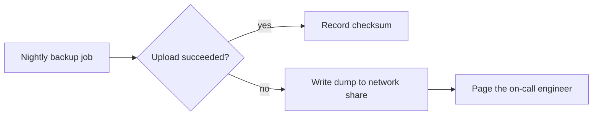

<!-- MDV-ANCHOR id="c_n8esrsfzzv" -->
Status: draft for review by the platform team, last updated on 3 October 2026.

<!-- MDV-ANCHOR id="c_3mj9tpifdc" -->
This proposal moves the nightly database backups from the shared file server to object storage and keeps each copy for 30 days under a lifecycle rule.

## Background

Every night at 02:00 a scheduled job writes a compressed dump of the main database to a network share. The share has no retention policy, so old dumps are deleted by hand whenever the disk fills up. Restores were rehearsed twice in the last year and both took more than an hour, mostly because the operator first had to find the right file.

## Plan

1. Create a dedicated bucket with a lifecycle rule that deletes objects after 30 days.
2. Change the backup job to stream the dump straight into the bucket instead of writing it to the share first.
3. Run both targets in parallel for two weeks and compare checksums every morning.
4. Turn off the share target once fourteen consecutive checksums match.

| Step | Owner | Target date |
|------|-------|-------------|
| Bucket and lifecycle rule | Storage | 10 October |
| Backup job change | Database | 14 October |
| Parallel run | Database | 15 to 28 October |
| Share target removed | Storage | 29 October |

## Rollback

If an upload fails twice in a row, the job writes to the network share again and pages the on-call engineer. The share stays mounted until the end of the parallel run, so this path needs no new infrastructure.

## Open questions

- Should the bucket live in the same region as the database, or in a second region for disaster recovery?
- Who signs off on the restore drill at the end of the parallel run?

<!-- MDV-COMMENTS:v1
{"version":1,"generator":"mdv-viewer","comments":[{"id":"cm_lc2dqkyhya","parent_id":null,"anchor":{"id":"c_n8esrsfzzv","blockKind":"p","blockHash":"1bf4915fdeed8849","sibIdx":1,"quote":null},"author":{"name":"Jordan Lee","kind":"human"},"body_md":"Can we add the date when review closes, so people know how long they have to comment?","created_at":"2026-10-01T09:14:03.512Z","updated_at":"2026-10-02T16:40:27.091Z","status":"resolved"},{"id":"cm_zptly3q5hl","parent_id":null,"anchor":{"id":"c_3mj9tpifdc","blockKind":"p","blockHash":"56b28cabf3ea1920","sibIdx":2,"quote":{"exact":"keeps each copy for 30 days","prefix":"le server to object storage and ","suffix":" under a lifecycle rule."}},"author":{"name":"Sam Ortiz","kind":"human"},"body_md":"Is 30 days enough? Compliance asked for 90 days on anything that holds customer records -\u002d worth confirming before the review.","created_at":"2026-10-02T10:05:48.230Z","updated_at":"2026-10-02T10:05:48.230Z","status":"open"},{"id":"cm_e2nutbi4e8","parent_id":"cm_zptly3q5hl","author":{"name":"Jordan Lee","kind":"human"},"body_md":"Good catch. I will confirm with compliance. Even at 90 days the bucket costs \u003c5% of what the share costs today.","created_at":"2026-10-02T11:22:10.774Z","updated_at":"2026-10-02T11:22:10.774Z","status":"open"}]}
MDV-COMMENTS:end -->
