# Diagram gallery

Every diagram type the viewer draws, in one place. Each is a plain Mermaid fenced block, so this file reads the same on GitHub. In the viewer each diagram takes the colours of the current theme (light, sepia or dark) and is redrawn when the theme changes. Click a diagram, or its expand button, to open it full screen, where you can drag to pan, scroll or pinch to zoom, and press `0` to fit, `1` for actual size and `Esc` to close.

## Flowchart

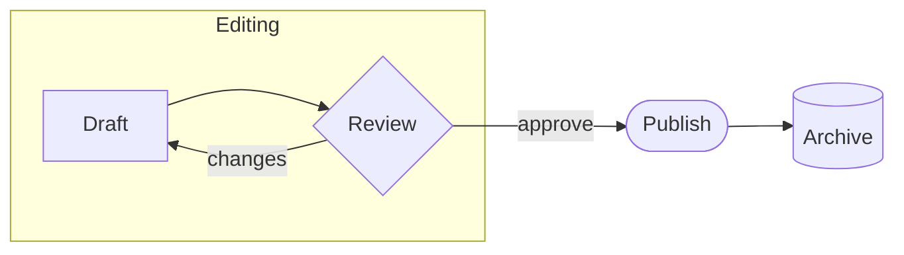

## Sequence diagram

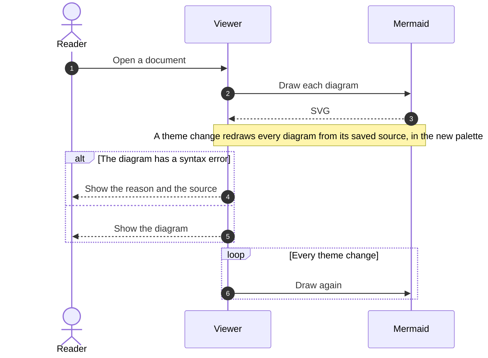

## Class diagram

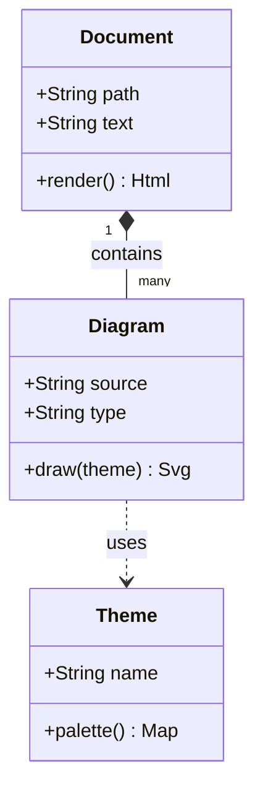

## State diagram

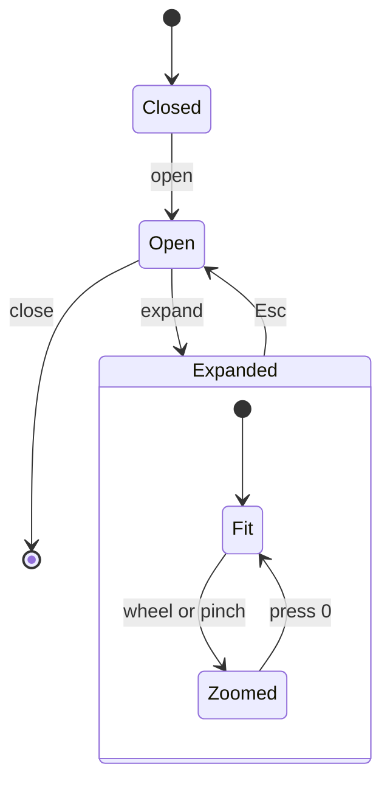

## Entity relationship diagram

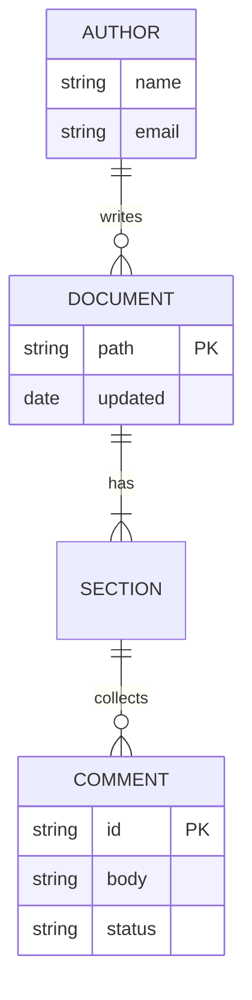

## Gantt chart

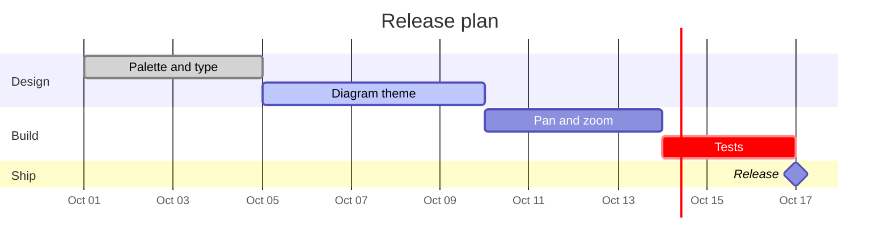

## Pie chart

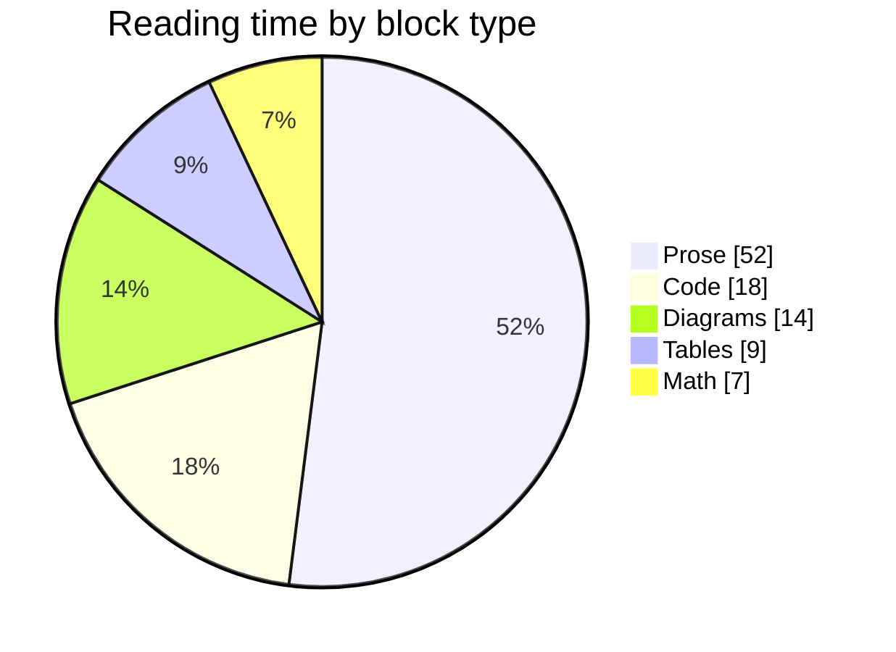

## Mind map

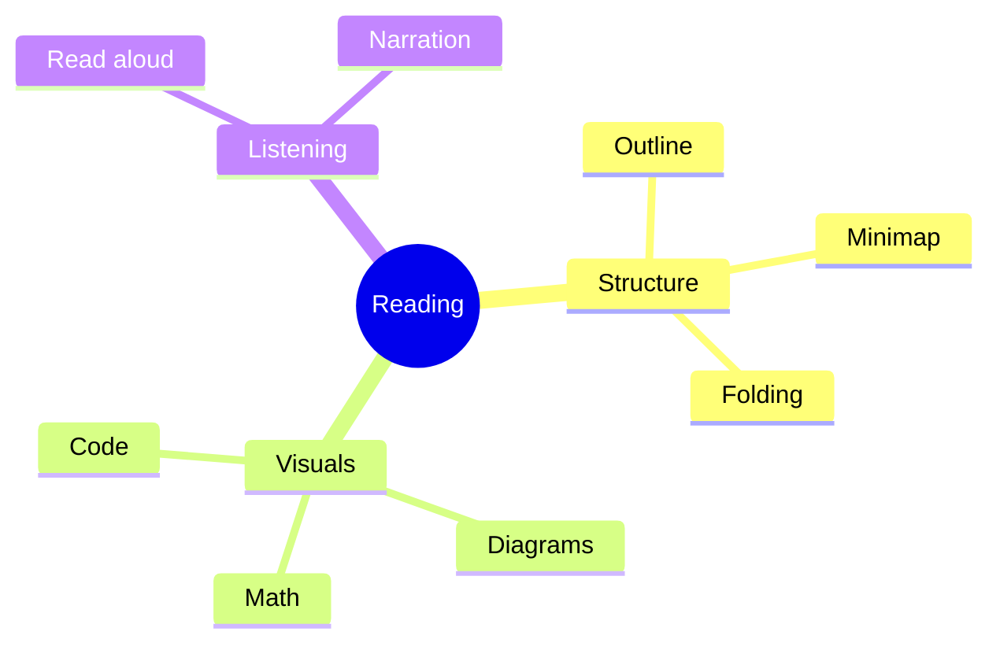

## Timeline

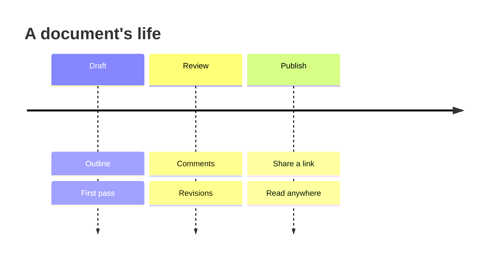

## User journey

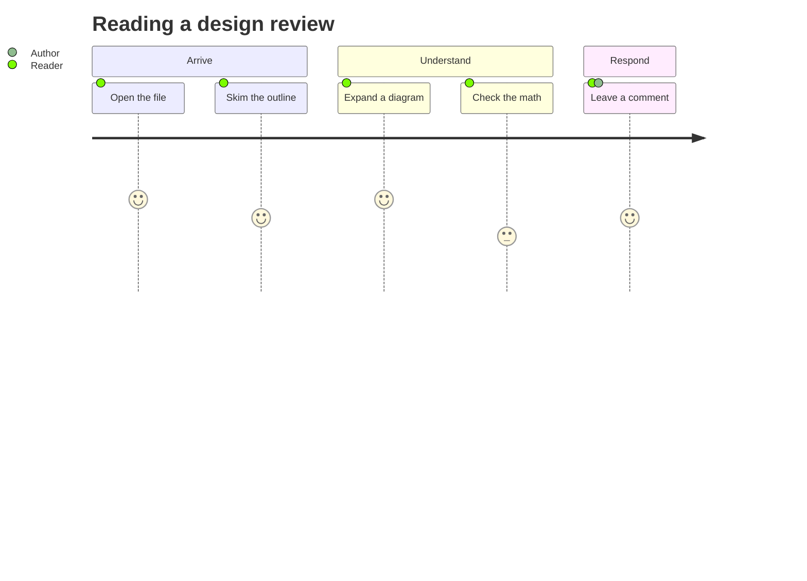

## Git graph

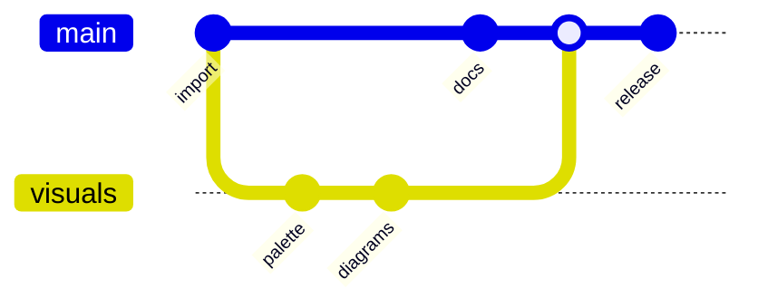

## Quadrant chart

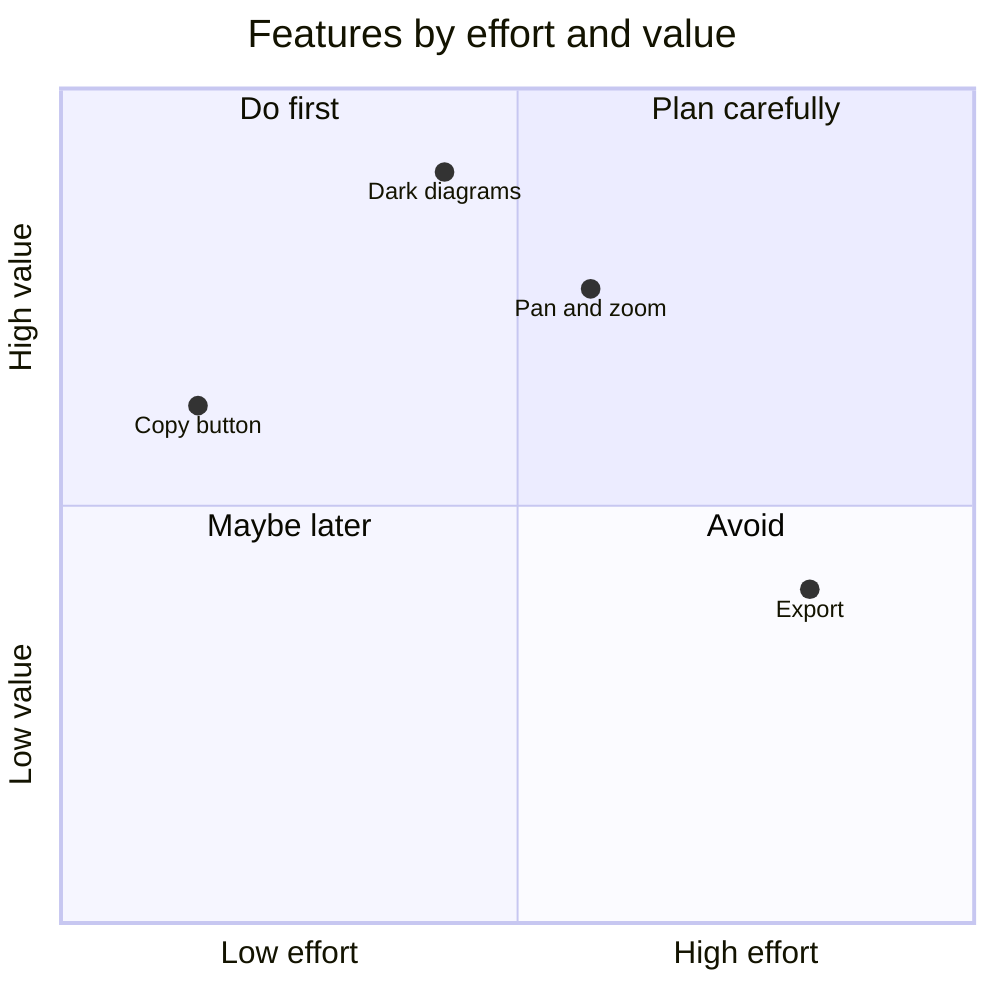

## XY chart

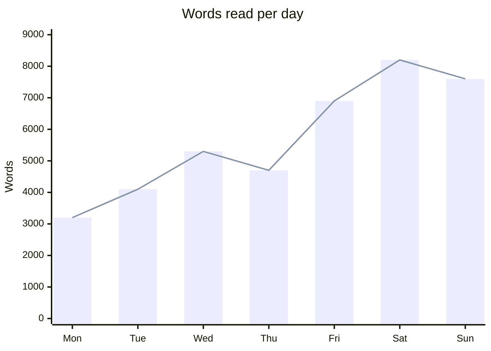

## Linked nodes

A node whose label is exactly the text of a heading in the document links to that heading: click it, or reach it with Tab and press Enter. Each node below jumps to its section of this page.

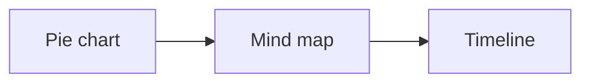
