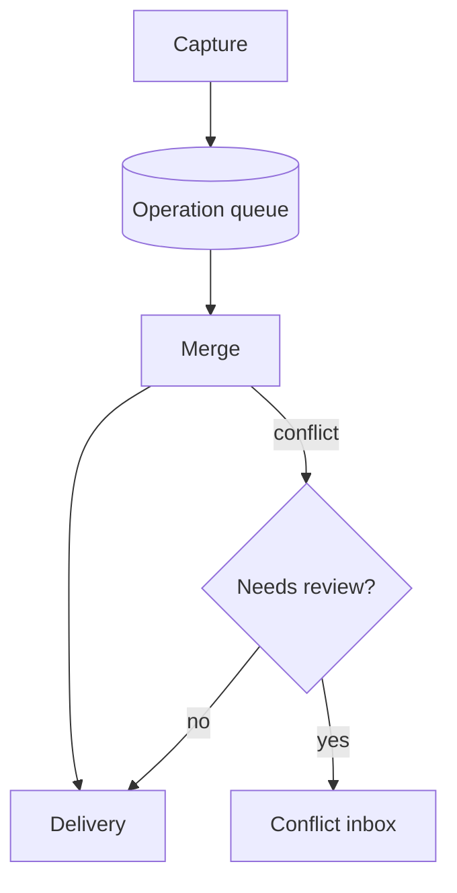
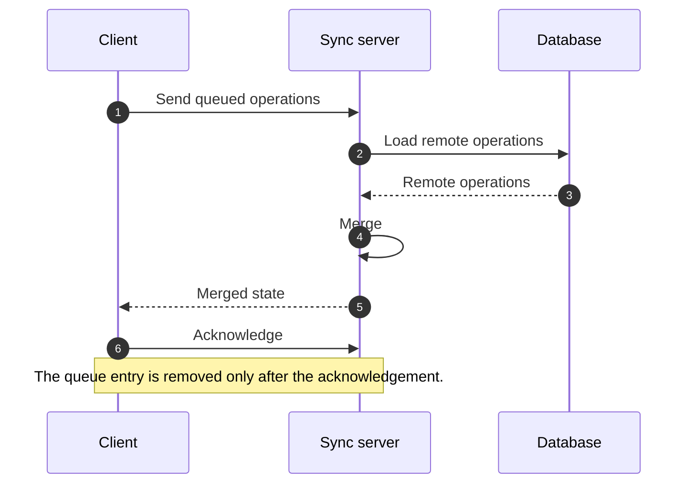
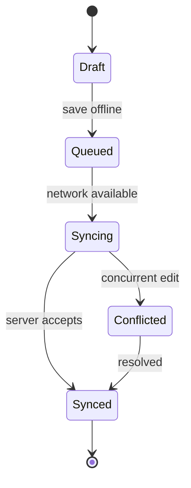
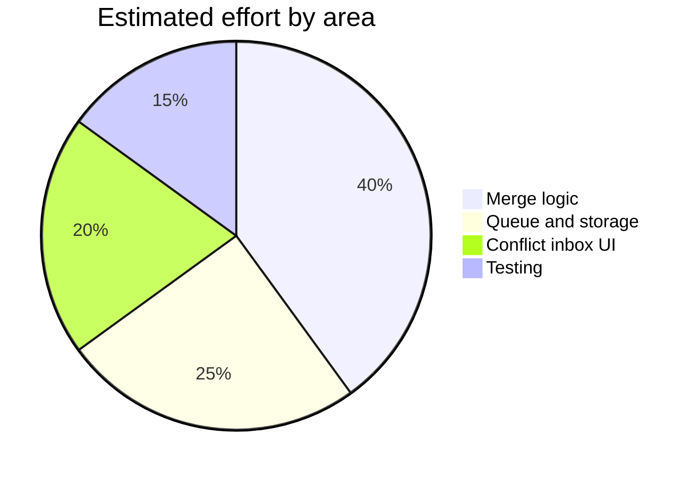

# Offline Sync Design Review

This review describes how a notes app keeps working without a network and reconciles edits once it reconnects. It is also the viewer's kitchen-sink sample: every syntax and transform the viewer supports appears at least once below.

> [!TLDR]
> Edits are written locally first, queued, and merged on reconnect with a CRDT for text and LWW for metadata.

## Text formatting

Plain paragraphs support **bold**, *italic*, ***bold italic***, ~~strikethrough~~, ==highlighted text==, `inline code`, subscript as in H~2~O, and superscript as in 2^10^ entries. The typographer turns "straight quotes" into curly ones, two hyphens -- into an en dash, three dots... into an ellipsis, and (c) into a copyright sign.

A line ending with a single newline
continues the same paragraph, because line breaks are not converted.

Keyboard keys use raw HTML: press <kbd>Ctrl</kbd> + <kbd>K</kbd> to search.

## Callouts

> [!NOTE]
> The sync queue is persisted, so a crash during upload loses nothing.

> [!TIP]
> Keep each queued operation small; large operations retry poorly on weak connections.

> [!IMPORTANT]
> Every operation carries the device id and a monotonic counter.

> [!WARNING]
> Clock skew between devices makes timestamps unreliable as the only ordering key.

> [!CAUTION]
> Clearing local storage before the queue drains discards unsynced edits.

> [!DECISION]
> We merge note bodies with a CRDT and resolve titles and tags with LWW, because metadata conflicts are rare and easy to explain.

> [!COST]
> Storing the operation log adds roughly 15 percent to on-device storage for an average account.

> A plain blockquote without a marker stays a blockquote.

## Architecture

The flowchart below names three stages. Each stage also has its own heading in this document.



### Capture

The editor writes each change to the local store and appends an operation to the queue.

### Merge

On reconnect, the client pulls remote operations and merges them with local ones.

### Delivery

Merged state is written back to the local store and the queue entry is acknowledged.

## Sync flow

<!-- narrate: This sequence diagram shows a client reconnecting. The client sends its queued operations, the server merges them with remote operations, and the client receives the merged result and acknowledges it. -->



## Record lifecycle



## Effort split



## Math

The skew between two devices is $\Delta t = t_{remote} - t_{local}$, and an edit is considered concurrent when $|\Delta t| < \varepsilon$.

Assuming edits arrive as a Poisson process with rate $\lambda$, the probability of at least one concurrent edit in a window of length $t$ is:

$$
P(\text{conflict}) = 1 - e^{-\lambda t}
$$

## Code

TypeScript:

```typescript
interface Operation {
  deviceId: string;
  counter: number;
  path: string;
  value: unknown;
}

export function compare(a: Operation, b: Operation): number {
  return a.counter - b.counter || a.deviceId.localeCompare(b.deviceId);
}
```

Python:

```python
def drain(queue, send):
    """Send queued operations in order; stop at the first failure."""
    for op in list(queue):
        if not send(op):
            break
        queue.remove(op)
```

Shell:

```bash
curl -s https://sync.example.com/health | jq '.status'
```

JSON:

```json
{ "deviceId": "laptop-1", "counter": 42, "path": "notes/7/title", "value": "Groceries" }
```

A diff:

```diff
- retry_delay_ms: 500
+ retry_delay_ms: 2000
```

A fence with an unknown language falls back to escaped plain text:

```nosuchlang
this text is shown as-is, with the label taken from the fence
```

A fence with no language at all:

```
plain block, labelled "text"
```

## Tables

| Field | Type | Merge rule | Notes |
|:------|:----:|:-----------|------:|
| body | text | CRDT | character-level |
| title | string | LWW | per field |
| tags | set | union | add wins |
| deleted | boolean | LWW | tombstone kept 30 days |

## Task lists

- [x] Persist the queue
- [x] Add device counters
- [ ] Build the conflict inbox
- [ ] Load-test reconnect storms

## Footnotes

Counters are compared before device ids[^ordering], and tombstones are retained for a fixed period.^[Thirty days in the current draft.]

[^ordering]: Comparing counters first keeps one device's edits in the order they were made.

## Definition lists

Operation
: A single change to one field of one record.

Tombstone
: A marker that records a deletion so it can be merged like any other change.

## Abbreviations

The abbreviation plugin wraps every CRDT and LWW in this document in an element with a hover title. The definitions sit at the end of the file.

## Links

- Section link: [jump to Math](#math)
- Email: [sync team](mailto:sync-team@example.com)
- File: [project README](../README.md)
- Repository: [sync-engine on GitHub](https://github.com/example-org/sync-engine)
- Package: [markdown-it on npm](https://www.npmjs.com/package/markdown-it)
- Documentation: [sync API docs](https://docs.example.dev/sync)
- External: [example site](https://example.com/)
- Bare URL turned into a link: https://example.org/status
- Angle-bracket autolink: <https://example.net/>

A link that is the only thing in its paragraph becomes a card:

[Sync engine repository](https://github.com/example-org/sync-engine)

## Images


An inline SVG written as raw HTML:

<svg width="120" height="40" viewBox="0 0 120 40" role="img" aria-label="Three queued operations"><rect x="2" y="8" width="32" height="24" rx="4" fill="#4A90D9"/><rect x="44" y="8" width="32" height="24" rx="4" fill="#3CA55C"/><rect x="86" y="8" width="32" height="24" rx="4" fill="#D97706"/></svg>

## Collapsible details

<details>
<summary>Retry policy</summary>

Retries back off exponentially from 2 seconds to 5 minutes, and the queue keeps **every** operation until it is acknowledged.

</details>

## Heading levels

### Level three

#### Level four

##### Level five

###### Level six

---

*End of the kitchen-sink sample.*

*[CRDT]: Conflict-free Replicated Data Type
*[LWW]: Last Writer Wins
