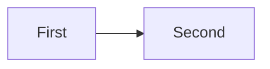

<!-- narrate: Two boxes joined by an arrow; requests with latency<200ms return a List<String>. -->

If a<b then swap them. <!-- TODO: check the order -->

- L1 if a<b then swap them <!-- note -->
- L2 a plain item

| Case | Cell |
|---|---|
| T1 | x<y <!-- cell note --> |

Control: if a<b then swap them, with no comment.
