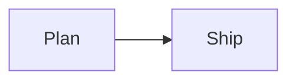

# A document that names the viewer's later elements

The document's own status line

The document's own notices

The document's own button label

Words to search for: release, handoff.

```mermaid
flowchart LR
    Plan --> Ship
```
