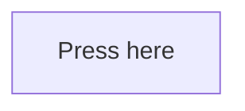
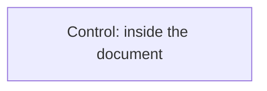

**Session expired.** Reopen this file from the toolbar to keep reading.

## Intro

```mermaid
flowchart LR
  A["<span class='rv-press' data-action='toggle-focus'>Press here</span>"]
```

(last)

# A document that names the print header

```mermaid
flowchart LR
  B["<span class='rv-control' data-action='toggle-focus'>Control: inside the document</span>"]
```
