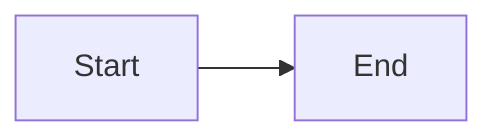

# A hostile document

A regression fixture for the sanitizer. Each item below would set `window.__mdvPwned` if it ran;
in the viewer none may run, and the harmless content around them must still render.

| Kind | Still rendered |
|---|---|
| table | yes |

<svg id="benign-svg" width="40" height="20" viewBox="0 0 40 20" role="img" aria-label="A blue bar"><rect width="40" height="20" rx="4" fill="#4A90D9"/></svg>

## Items the sanitizer removes

<svg id="svg-onload" onload="window.__mdvPwned='svg-onload'" width="10" height="10"><circle cx="5" cy="5" r="4"/></svg>

<a id="link-javascript" href="javascript:window.__mdvPwned='javascript-url'">A link with a script URL</a>

<iframe id="frame-src" src="about:blank"></iframe>
<object id="plugin-object" data="does-not-exist.bin"></object>
<embed id="plugin-embed" src="does-not-exist.bin">
<form id="form-post" action="https://example.invalid/"><button id="form-submit">Submit</button></form>

<!-->-->

## Items that must not reach the viewer's own controls

A document element named like the read-aloud player's label

A document element named like the viewer's document container

A document element named like the diagram overlay's container

A document element named like the comment sidebar's thread list

<button id="doc-action" data-action="pick-workspace">A button that names a viewer action</button>

## Diagram

