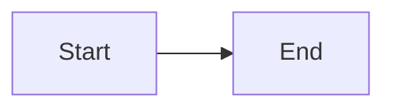

# Mermaid directives that try to restyle the viewer

```mermaid
%%{init: {"securityLevel": "loose", "themeCSS": ".toolbar { display: none !important; } body { background: rgb(255, 0, 0) !important; }"}}%%
flowchart LR
    A[Start] --> B[End]
```

```mermaid
%%{init: {"themeCSS": "@layer x { .toolbar { display: none !important; } }"}}%%
flowchart LR
    C[Start] --> D[End]
```

```mermaid
%%{init: {"themeCSS": "@import url(https://example.invalid/restyle.css);"}}%%
flowchart LR
    E[Start] --> F[End]
```
