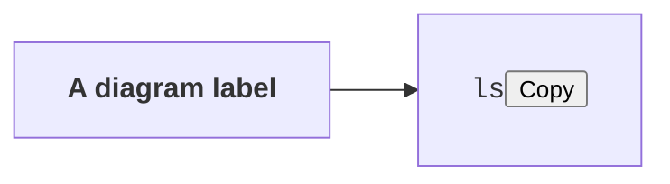

# Press " data-action="pick-workspace" data-mdv-probe="heading

Every element below names one of the viewer's actions in an attribute, through a different route.
None of them may run it. The browser test clicks each one, then checks the viewer's state.

<button id="doc-press" data-action="toggle-focus" data-mdv-probe="raw-html">A raw HTML button</button>

<pre><code>ls -la<span style="display:none"> and something hidden</span></code><button class="copy-btn" data-action="copy-code" data-mdv-probe="raw-copy">Copy</button></pre>

<pre><code data-mdv-code="a-guessed-key"><div class="code-header"><span>sh</span><button class="copy-btn" data-mdv-probe="forged-key">Copy</button></div><code>echo forged</code></code></pre>



[A link " data-action="pick-workspace" data-mdv-probe="link](https://example.invalid/press)

```js
const genuine = true;
```

<!-- MDV-ANCHOR id="c_press0001" -->
A paragraph with two comment threads whose fields try to add attributes to the sidebar.

<!-- MDV-COMMENTS:v1
{"version":1,"generator":"mdv-viewer","comments":[
{"id":"cm_press0001","parent_id":null,"anchor":{"id":"c_press0001","blockKind":"p","blockHash":"0000000000000000","sibIdx":1,"quote":null},"author":{"name":"Probe","kind":"human\" data-action=\"pick-workspace\" data-mdv-probe=\"comment-kind\" data-x=\""},"body_md":"Click this card.","created_at":"2026-10-10T00:00:00.000Z","updated_at":"2026-10-10T00:00:00.000Z","status":"open"},
{"id":"cm_press0002\" data-action=\"open-writable\" data-mdv-probe=\"comment-id\" data-x=\"","parent_id":null,"anchor":{"id":"c_press0001","blockKind":"p","blockHash":"0000000000000000","sibIdx":1,"quote":null},"author":{"name":"Probe","kind":"human"},"body_md":"And this one.","created_at":"2026-10-10T00:00:01.000Z","updated_at":"2026-10-10T00:00:01.000Z","status":"open"}]}
MDV-COMMENTS:end -->
